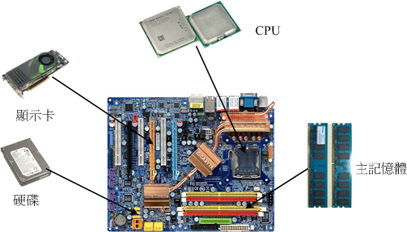
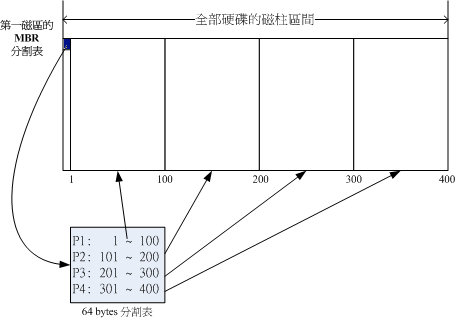
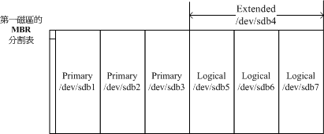
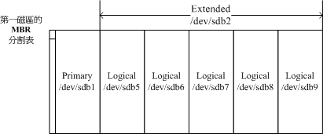
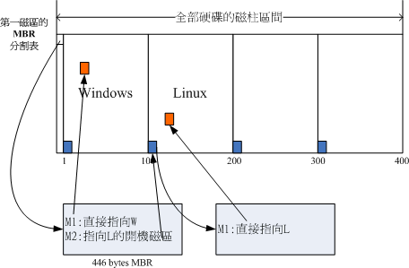
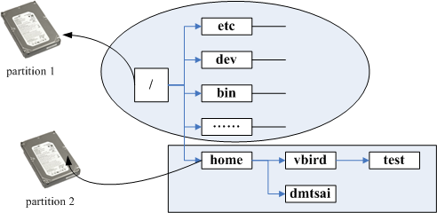

# 主机规划与磁盘分区

> 事實上，要安裝好一部Linux主機並不是那麼簡單的事情，你必須要針對distributions的特性、伺服器軟體的能力、 未來的升級需求、硬體擴充性需求等等來考量，還得要知道磁碟分割、檔案系統、Linux操作較頻繁的目錄等等， 都得要有一定程度的瞭解才行，所以，安裝Linux並不是那麼簡單的工作喔！ 不過，要學習Linux總得要有Linux系統存在吧？所以鳥哥在這裡還是得要提前說明如何安裝一部Linux練習機。 在這一章裡面，鳥哥會介紹一下，在開始安裝Linux之前，您應該要先思考哪些工作？ 好讓您後續的主機維護輕鬆愉快啊！此外，要瞭解這個章節的重要性，您至少需要瞭解到Linux檔案系統的基本概念， 這部份初學者是不可能具備的！所以初學者在這個章節裡面可能會覺得很多部份都是莫名其妙！沒關係！ 在您完成了後面的相關章節之後，**記得要再回來這裡看看如何規劃主機**即可！ ^_^

## 目录

- 2.1 Linux與硬體的搭配
  - [2.1.1 認識電腦的硬體配備](http://linux.vbird.org/linux_basic/0130designlinux.php#hardware_know)
  - [2.1.2 選擇與Linux搭配的主機配備](http://linux.vbird.org/linux_basic/0130designlinux.php#hardware_select)： [硬體支援相關網站](http://linux.vbird.org/linux_basic/0130designlinux.php#hardware_site)
  - [2.1.3 各硬體裝置在Linux中的檔名](http://linux.vbird.org/linux_basic/0130designlinux.php#hardware_no)
  - [2.1.4 使用虛擬機器學習](http://linux.vbird.org/linux_basic/0130designlinux.php#hardware_virtual)
- 2.2 磁碟分割
  - [2.2.1 磁碟連接的方式與裝置檔名的關係](http://linux.vbird.org/linux_basic/0130designlinux.php#partition_name)
  - [2.2.2 MSDOS(MBR) 與 GPT 磁碟分割表(partition table)](http://linux.vbird.org/linux_basic/0130designlinux.php#partition_table)
  - [2.2.3 開機流程中的 BIOS 與 UEFI 開機檢測程式](http://linux.vbird.org/linux_basic/0130designlinux.php#partition_bios_uefi)
  - [2.2.4 Linux安裝模式下，磁碟分割的選擇(極重要)](http://linux.vbird.org/linux_basic/0130designlinux.php#partition_install)
- 2.3 安裝Linux前的規劃
  - [2.3.1 選擇適當的distribution](http://linux.vbird.org/linux_basic/0130designlinux.php#beforeinstall_distro)
  - [2.3.2 主機的服務規劃與硬體的關係](http://linux.vbird.org/linux_basic/0130designlinux.php#beforeinstall_service)
  - [2.3.3 主機硬碟的主要規劃(partition)](http://linux.vbird.org/linux_basic/0130designlinux.php#beforeinstall_partition)
  - [2.3.4 鳥哥的兩個實際案例](http://linux.vbird.org/linux_basic/0130designlinux.php#vbirdcase)
- [2.4 重點回顧](http://linux.vbird.org/linux_basic/0130designlinux.php#hint)
- [2.5 本章習題](http://linux.vbird.org/linux_basic/0130designlinux.php#ex)
- [2.6 參考資料與延伸閱讀](http://linux.vbird.org/linux_basic/0130designlinux.php#reference)
- [針對本文的建議：http://phorum.vbird.org/viewtopic.php?t=23874](http://phorum.vbird.org/viewtopic.php?t=23874)

## 2.1 Linux與硬體的搭配

雖然個人電腦各元件的主要介面是大同小異的，包括前面[第零章計算機概論](http://linux.vbird.org/linux_basic/0105computers.php)講到的種種介面等， 但是由於新的技術來得太快，Linux核心針對新硬體所納入的驅動程式模組比不上硬體更新的速度， 加上硬體廠商針對Linux所推出的驅動程式較慢，因此你在選購新的個人電腦(或伺服器)時， 應該要選擇已經過安裝Linux測試的硬體比較好。

此外，在安裝Linux之前，你最好瞭解一下你的Linux預計是想達成什麼任務，這樣在選購硬體時才會知道那個元件是最重要的。 舉例來說，桌面電腦(Desktop)的使用者，應該會用到X Window系統， 此時，顯示卡的優劣與記憶體的大小可就佔有很重大的影響。如果是想要做成檔案伺服器， 那麼硬碟或者是其他的儲存設備，應該就是您最想要增購的元件囉！所以說，功課還是需要作的啊！

鳥哥在這裡要不厭其煩的再次的強調，Linux對於電腦各元件/裝置的分辨， 與大家慣用的Windows系統完全不一樣！因為，各個元件或裝置在Linux底下都是『一個檔案！』 這個觀念我們在[第一章Linux是什麼](http://linux.vbird.org/linux_basic/0110whatislinux.php)裡面已經提過， 這裡我們再次的強調。因此，你在認識各項裝置之後，學習Linux的裝置檔名之前， 務必要先將Windows對於裝置名稱的概念先拿掉～否則會很難理解喔！

[Top](http://linux.vbird.org/linux_basic/0130designlinux.php#top)

## 2.1.1 認識電腦的硬體配備

『什麼？學Linux還得要玩硬體？』呵呵！沒錯！ 這也是為什麼鳥哥要將[計算機概論](http://linux.vbird.org/linux_basic/0105computers.php)搬上檯面之故！ 我們這裡主要是介紹較為普遍的個人電腦架構來設定Linux伺服器，因為比較便宜啦！ 至於各相關的硬體元件說明已經在[第零章計概](http://linux.vbird.org/linux_basic/0105computers.php)內講過了，這裡不再重複說明。 僅將重要的主機板與元件的相關性圖示如下：

圖2.1.1、個人電腦各元件的相關性

(上述圖示主要取自tom's硬體指南，各元件圖片分屬個別公司所有)

那麼我們應該如何挑選電腦硬體呢？隨便買買就好，還是有特殊的考量？底下有些思考角度可以提供給大家參考看看：

- 遊戲機/工作機的考量

事實上，電腦主機的硬體配備與這部主機未來的功能是很有相關性的！舉例來說，家裡有小孩， 或者自己仍然算是小孩的朋友大概都知道：『要用來打Game的『遊戲機電腦』 所需要的配備一定比辦公室用的『工作機電腦』配備更高檔』，為什麼呢？ 因為現在一般的三維(3D)電腦遊戲所需要的3D光影運算太多了，所以顯示卡與CPU資源都會被耗用的非常多！ 當然就需要比較高級的配備囉，尤其是在顯示卡、CPU(例如Intel的 I5, I7 系列的) 及主機板晶片組方面的功能。

至於辦公室的工作環境中，最常使用到的軟體大多是辦公軟體(Office)，最常使用的網路功能是瀏覽器， 這些軟體所需要的運算並不高，理論上目前的入門級電腦都能夠跑得非常順暢了！ 甚至很多企業都喜歡購買將顯示卡、主機板晶片組整合在一起的整合型晶片的電腦，因為便宜又好用！

- 『效能/價格』比與『效能/消耗的瓦數』比的考量

並不是『貴就比較好』喔！在目前(2015)電費居高不下的情況，如何兼顧省錢與電腦硬體的效能問題，很重要！ 如果你喜歡購買最新最快的電腦零件，這些剛出爐的元件都非常的貴，而且作業系統還不見得能夠完整的支援。 所以，鳥哥都比較喜歡購買主流級的產品而非最高檔的。因為我們最好能夠考慮到效能/價格比。 如果高一級的產品讓你的花費多一倍，但是新增加的效能卻只有10%而已，那這個效能/價格的比值太低，不建議啦！

此外，由於電價越來越高，如何『省電』就很重要啦！因此目前硬體評論界有所謂的『每瓦效能』的單位， 每瓦電力所發揮的效能越高，當然代表越省電啊！這也是購買硬體時的考量之一啦！要知道，如果是做為伺服器用， 一年365天中時時刻刻都開機，則你的電腦多花費50瓦的電力時，每年就得要多花450度電左右(50W*365天*24小時/天/1000W=438度電)，如果以企業來講， 每百部電腦每年多花450度電的話，每年得多花十萬塊以上的電費呢 (以一度電3塊錢來計算) ！所以這也需要考量啊！

- 支援度的考量

並非所有的產品都會支援特定的作業系統，這牽涉到硬體開發商是否有意願提供適當的驅動程式之故。 因此，當我們想要購買或者是升級某些電腦元件時，應該要特別注意該硬體是否有針對您的作業系統提供適當的驅動程式， 否則，買了無法使用，那才是叫人嘔死啊！因此，針對Linux來說，底下的硬體分析就重要啦！

> Tips因為鳥哥會自己編譯驅動程式，所以上次買家用桌上型電腦時，就委託鳥嫂全權處理 (因為錢錢是鳥嫂負責的嘛！嘿嘿！省的麻煩！)！ 反正最多就是自己去找 driver 來編譯，那也沒什麼～您說是吧？ 沒想到來的主機板上面內建的那顆網路卡驅動程式，網卡開發商的官網上面並沒有提供 source code！鳥哥趕緊回去查一下該主機板的說明， 結果...說明書上面明明白白的說，這片主機板僅提供支援 windows 的 drivers 而已...還建議不要拿來裝 Linux 之用... 當下還是默默的去找了一塊 PCI-e 網卡來插了...連 source code 都沒有，是要編譯啥啦！巧婦難為無米之炊啊～～ @_@～～ 這個故事告訴我們，作人不要太鐵齒，硬體該查閱的工作還是要做啦！

[Top](http://linux.vbird.org/linux_basic/0130designlinux.php#top)

## 2.1.2 選擇與Linux搭配的主機配備

由於硬體的加速發展與作業系統核心功能的增強，導致較早期的電腦已經沒有能力再負荷新的作業系統了。 舉例來說，Pentun-III以前的硬體配備可能已經不再適合現在的新的Linux distribution。 而且較早期的硬體配備也可能由於保存的問題或者是電子零件老化的問題， 導致這樣的電腦系統反而非常容易在運作過程中出現不明的當機情況，因此在利用舊零件拼湊Linux使用的電腦系統時， 真的得要特別留意呢！

不過由於Linux運作所需要的硬體配備實在不需要太高檔，因此，如果有近期汰換下來的五年內的電腦， 不必急著丟棄。由於 CPU 為 i3 等級的硬體不算太老舊，在效能方面其實也算的上非常OK了～所以， 鳥哥建議您如果有五年內的電腦被淘汰，可以拿下來測試一下，說不定能夠作為你日常生活的Linux伺服器， 或者是備用伺服器，都是非常好用的功能哩！

但是由於不同的任務的主機所需要的硬體配備並不相同，舉例來說，如果你的Linux主機是要作為企業內部的Mail server或者是Proxy server時，或者是需要使用到圖形介面的運算(X Window內的Open GL等等功能)， 那麼你就必須要選擇高檔一點的電腦配備了，使用過去的電腦零件可能並不適合呢。

底下我們稍微談一下，如果你的Linux主要是作為小型伺服器使用，並不負責學術方面的大量運算， 而且也沒有使用X Window的圖形介面，那你的硬體需求只要像底下這樣就差不多了：

- CPU
  CPU只要不是老舊到會讓你的硬體系統當機的都能夠支援！如同前面談到的，目前(2015)的環境中， Intel i3 系列的CPU不算太舊而且效能也不錯，非常好用了。

  

- RAM
  主記憶體是越大越好！事實上在Linux伺服器中，主記憶體的重要性比CPU還要高的多！因為如果主記憶體不夠大， 就會使用到硬碟的記憶體置換空間(swap)。 而由[計算機概論](http://linux.vbird.org/linux_basic/0105computers.php)的內容我們知道硬碟比記憶體的速度要慢的多， 所以主記憶體太小可能會影響到整體系統的效能的！尤其如果你還想要玩X window的話，那主記憶體的容量就不能少。 對於一般的小型伺服器來說，建議至少也要512MB以上的主記憶體容量較佳。老實說，目前 DDR3 的硬體環境中， 新購系統動不動就是 4~16GB 的記憶體，真的是很夠用了！

  

- Hard Disk
  由於資料量與資料存取頻率的不同，對於硬碟的要求也不相同。 舉例來說，如果是一般小型伺服器，通常重點在於容量，硬碟容量大於20GB就夠用到不行了！ 但如果你的伺服器是作為備份或者是小企業的檔案伺服器，那麼你可能就得要考量較高階的磁碟陣列(RAID)模式了。

  > Tips磁碟陣列(RAID)是利用硬體技術將數個硬碟整合成為一個大硬碟的方法，作業系統只會看到最後被整合起來的大硬碟。 由於磁碟陣列是由多個硬碟組成，所以可以達成速度效能、備份等任務。更多相關的磁碟陣列我們會在[第十四章](http://linux.vbird.org/linux_basic/0420quota.php)中介紹的。

- VGA
  對於不需要X Window的伺服器來說，顯示卡算是最不重要的一個元件了！你只要有顯示卡能夠讓電腦啟動，那就夠了。 但如果需要X window系統時，你的顯示卡最好能夠擁有32MB以上的記憶體容量，否則跑X系統會很累喔！

  

- Network Interface Card
  網路卡是伺服器上面最重要的元件之一了！目前的主機板大多擁有內建10/100/1000Mbps的超高速乙太網路卡。 但要注意的是，不同的網路卡的功能還是有點差異。舉例來說，鳥哥曾經需要具有可以設定 bonding 功能的網路卡， 結果，某些較低階的 gigabit 網卡並沒有辦法提供這個項目的支援！真是傷腦筋！此外，比較好的網卡通常 Linux 驅動程式也做的比較好，用起來會比較順暢。因此，如果你的伺服器是 網路 I/O 行為非常頻繁的網站， 好一點的Intel/boradcom等公司的網卡應該是比較適合的喔。

  

- 光碟、軟碟、鍵盤與滑鼠
  不要舊到你的電腦不支援就好了，因為這些配備都是非必備的喔！舉例來說，鳥哥安裝好Linux系統後， 可能就將該系統的光碟機、滑鼠、軟碟機等通通拔除，只有網路線連接在電腦後面而已，其他的都是透過網路連線來管控的哩！ 因為通常伺服器這東西最需要的就是穩定，而穩定的最理想狀態就是平時沒事不要去動他是最好的。

底下鳥哥針對一般你可能會接觸到的電腦主機的用途與相關硬體配備的基本要求來說明一下好了：

- 一般小型主機且不含X Window系統：
  - 用途：家庭用NAT主機(IP分享器功能)或小型企業之非圖形介面小型主機。
  - CPU：五年內出產的產品即可。
  - RAM：至少512MB，不過還是大於1GB以上比較妥當！
  - 網路卡：一般的乙太網路卡即可應付。
  - 顯示卡：只要能夠被Linux捉到的顯示卡即可，例如NVidia或ATI的主流顯示卡均可。
  - 硬碟：20GB以上即可！
- 桌上型(Desktop)Linux系統/含X Window：
  - 用途：Linux的練習機或辦公室(Office)工作機。(一般我們會用到的環境)
  - CPU：最好等級高一點，例如 Intel I5, I7 以上等級。
  - RAM：一定要大於1GB比較好！否則容易有圖形介面停頓的現象。
  - 網路卡：普通的乙太網路卡就好了！
  - 顯示卡：使用256MB以上記憶體的顯示卡！(入門級的都這個容量以上了)
  - 硬碟：越大越好，最好有60GB。
- 中型以上Linux伺服器：
  - 用途：中小型企業/學校單位的FTP/mail/WWW等網路服務主機。
  - CPU：最好等級高一點，例如 I5, I7 以上的多核心系統。
  - RAM：最好能夠大於1GB以上，大於4GB更好！
  - 網路卡：知名的broadcom或Intel等廠牌，比較穩定效能較佳！
  - 顯示卡：如果有使用到圖形功能，則一張64MB記憶體的顯示卡是需要的！
  - 硬碟：越大越好，如果可能的話，使用磁碟陣列，或者網路硬碟等等的系統架構， 能夠具有更穩定安全的傳輸環境，更佳！
  - 建議企業用電腦不要自行組裝，可購買商用伺服器較佳， 因為商用伺服器已經通過製造商的散熱、穩定度等測試，對於企業來說，會是一個比較好的選擇。

總之，鳥哥在這裡僅是提出一個方向：如果你的Linux主機是小型環境使用的，即時當機也不太會影響到企業環境的運作時， 那麼使用升級後被淘汰下來的零件以組成電腦系統來運作，那是非常好的回收再利用的案例。 但如果你的主機系統是非常重要的，你想要更一部更穩定的Linux伺服器，那考慮系統的整體搭配與運作效能的考量， 購買已組裝測試過的商用伺服器會是一個比較好的選擇喔！

> Tips一般來說，目前(2015)的入門電腦機種，CPU至少都是Intel i3的2GHz系列的等級以上， 主記憶體至少有2GB，顯示卡記憶體也有512MB以上，所以如果您是新購置的電腦， 那麼該電腦用來作為Linux的練習機，而且加裝X Window系統，肯定是可以跑的嚇嚇叫的啦！^_^

此外，Linux開發商在釋出Linux distribution之前，都會針對該版所預設可以支援的硬體做說明， 因此，你除了可以在Linux的Howto文件去查詢硬體的支援度之外，也可以到各個相關的Linux distributions網站去查詢呢！ 底下鳥哥列出幾個常用的硬體與Linux distributions搭配的網站，建議大家想要瞭解你的主機支不支援該版Linux時， 務必到相關的網站去搜尋一下喔！

- Red Hat的硬體支援：https://hardware.redhat.com/?pagename=hcl
- Open SuSE的硬體支援：http://en.opensuse.org/Hardware?LANG=en_UK
- Linux對筆記型電腦的支援：http://www.linux-laptop.net/
- Linux對印表機的支援：http://www.openprinting.org/
- Linux硬體支援的中文HowTo：http://www.linux.org.tw/CLDP/HOWTO/hardware.html#hardware

總之，如果是自己維護的一個小網站，考慮到經濟因素，你可以自行組裝一部主機來架設。 而如果是中、大型企業，那麼主機的錢不要省～因為，省了這些錢，未來主機掛點時， 光是要找出哪個元件出問題，或者是系統過熱的問題，會氣死人ㄟ！ 而且，要注意的就是未來你的Linux主機規劃的『用途』來決定你的Linux主機硬體配備喔！相當的重要呢！

[Top](http://linux.vbird.org/linux_basic/0130designlinux.php#top)

## 2.1.3 各硬體裝置在Linux中的檔名

選擇好你所需要的硬體配備後，接下來得要瞭解一下各硬體在Linux當中所扮演的角色囉。 這裡鳥哥再次的強調一下：『在Linux系統中，每個裝置都被當成一個檔案來對待』 舉例來說，SATA介面的硬碟的檔案名稱即為/dev/sd[a-d]，其中， 括號內的字母為a-d當中的任意一個，亦即有/dev/sda, /dev/sdb, /dev/sdc, 及 /dev/sdd這四個檔案的意思。

> Tips這種中括號 [ ] 型式的表示法在後面的章節當中會使用得很頻繁，請特別留意
>
> 另外先提出來強調一下，在Linux這個系統當中，幾乎所有的硬體裝置檔案都在/dev這個目錄內， 所以你會看到/dev/sda, /dev/sr0等等的檔名喔。

那麼印表機與軟碟呢？分別是/dev/lp0, /dev/fd0囉！好了，其他的周邊設備呢？ 底下列出幾個常見的裝置與其在Linux當中的檔名囉：

| 裝置                | 裝置在Linux內的檔名                                          |
| ------------------- | ------------------------------------------------------------ |
| SCSI/SATA/USB硬碟機 | /dev/sd[a-p]                                                 |
| USB快閃碟           | /dev/sd[a-p] (與SATA相同)                                    |
| VirtI/O界面         | /dev/vd[a-p] (用於虛擬機器內)                                |
| 軟碟機              | /dev/fd[0-1]                                                 |
| 印表機              | /dev/lp[0-2] (25針印表機) /dev/usb/lp[0-15] (USB 介面)       |
| 滑鼠                | /dev/input/mouse[0-15] (通用) /dev/psaux (PS/2界面) /dev/mouse (當前滑鼠) |
| CDROM/DVDROM        | /dev/scd[0-1] (通用) /dev/sr[0-1] (通用，CentOS 較常見) /dev/cdrom (當前 CDROM) |
| 磁帶機              | /dev/ht0 (IDE 界面) /dev/st0 (SATA/SCSI界面) /dev/tape (當前磁帶) |
| IDE硬碟機           | /dev/hd[a-d] (舊式系統才有)                                  |

時至今日，由於 IDE 界面的磁碟機幾乎已經被淘汰，太少見了！因此現在連 IDE 界面的磁碟檔名也都被模擬成 /dev/sd[a-p] 了！此外， 如果你的機器使用的是跟網際網路供應商 (ISP) 申請使用的雲端機器，這時可能會得到的是虛擬機器。為了加速，虛擬機器內的磁碟是使用模擬器產生， 該模擬器產生的磁碟檔名為 /dev/vd[a-p] 系列的檔名喔！要注意！要注意！

> Tips更多Linux核心支援的硬體裝置與檔名，可以參考如下網頁：
> https://www.kernel.org/doc/html/v4.20/admin-guide/devices.html

[Top](http://linux.vbird.org/linux_basic/0130designlinux.php#top)

## 2.1.4 使用虛擬機器學習

由於近年來硬體虛擬化技術的成熟，目前普通的中階個人電腦的 CPU 微指令集中，就已經整合了硬體虛擬化指令集了！ 所以，隨便一台電腦就能夠虛擬化出好幾台邏輯獨立的系統了！很讚！

因為虛擬化系統可以很簡單的製作出相仿的硬體資源，因此我們在學習的時候，比較能夠取得相同的環境來查閱學習的效果！ 所以，在本書的後續所有動作中，我們都是使用虛擬化系統來做說明！畢竟未來你實際接觸到 Linux 系統時，很有可能公司交代給你的就是虛擬機了！ 趁早學也不錯！

由於虛擬化的軟體非常之多，網路上也有一堆朋友的教學在。如果你的系統是 windows 系列的話，鳥哥個人推薦你使用 virtualbox 這個軟體！ 至於如果你原本就用 Linux 系統，例如 Fedora/Ubuntu 等系列的話，那麼建議你使用原本系統內就有的虛擬機器管理員來處理即可。目前 Linux 系統大多使用 KVM 這個虛擬化軟體就是了。底下提供一些網站給您學習學習！鳥哥之後的章節所使用的機器，就是透過 KVM 建置出來的系統喔！ 提供給妳作參考囉。

- [Virtualbox 官網 (https://www.virtualbox.org)](https://www.virtualbox.org/)
- [Virtualbox 官網教學 (https://www.virtualbox.org/manual/ch01.html)](https://www.virtualbox.org/manual/ch01.html)
- [Fedora 教學 http://docs.fedoraproject.org/en-US/Fedora/13/html/Virtualization_Guide/part-Virtualization-Virtualization_Reference_Guide.html](http://docs.fedoraproject.org/en-US/Fedora/13/html/Virtualization_Guide/part-Virtualization-Virtualization_Reference_Guide.html)

## 2.2 磁碟分割

這一章在規劃的重點是為了要安裝Linux，那Linux系統是安裝在電腦元件的那個部分呢？就是磁碟啦！所以我們當然要來認識一下磁碟先。 我們知道一塊磁碟是可以被分割成多個分割槽的(partition)，以舊有的Windows觀點來看，你可能會有一顆磁碟並且將他分割成為C:, D:, E:槽對吧！那個C, D, E就是分割槽(partition)囉。但是Linux的裝置都是以檔案的型態存在，那分割槽的檔名又是什麼？ 如何進行磁碟分割？磁碟分割有哪些限制？目前的 BIOS 與 UEFI 分別是啥？MSDOS 與 GPT 又是啥？ 都是我們這個小節所要探討的內容囉。

[Top](http://linux.vbird.org/linux_basic/0130designlinux.php#top)

## 2.2.1 磁碟連接的方式與裝置檔名的關係

由[第零章](http://linux.vbird.org/linux_basic/0105computers.php#pc_hd)提到的磁碟說明，我們知道個人電腦常見的磁碟介面有兩種， 分別是SATA與SAS介面，目前(2015)的主流是SATA介面。不過更老舊的電腦則有可能是已經不再流行的IDE界面喔！ 以前的IDE界面與SATA界面在Linux的磁碟代號並不相同，不過近年來為了統一處理，大部分Linux distribution已經將IDE界面的磁碟檔名也模擬成跟SATA一樣了！ 所以你大概不用太擔心磁碟裝置檔名的問題了！

時代在改變啊～既然IDE界面都可以消失了，那磁碟檔名還有什麼可談的呢？嘿嘿！有啊！如同上一小節談到的，虛擬化是目前很常見的一項技術， 因此你在使用的機器很可能就是虛擬機器，這些虛擬機器使用的『虛擬磁碟』並不是正規的磁碟界面！這種情況底下，你的磁碟檔名就不一樣了！ 正常的實體機器大概使用的都是 /dev/sd[a-] 的磁碟檔名，至於虛擬機器環境底下，為了加速，可能就會使用 /dev/vd[a-p] 這種裝置檔名喔！ 因此在實際處理你的系統時，可能得要了解為啥會有兩種不同磁碟檔名的原因才好！

例題：假設你的主機為虛擬機器，裡面僅有一顆VirtIO介面的磁碟，請問他在Linux作業系統裡面的裝置檔名為何？答：參考 2.1.3 小節的介紹，虛擬機使用 VirtIO 界面時，磁碟檔名應該是 /dev/vda 才對！

再以SATA介面來說，由於SATA/USB/SAS等磁碟介面都是使用SCSI模組來驅動的， 因此這些介面的磁碟裝置檔名都是/dev/sd[a-p]的格式。 所以SATA/USB介面的磁碟根本就沒有一定的順序，那如何決定他的裝置檔名呢？ 這個時候就得要根據Linux核心偵測到磁碟的順序了！這裡以底下的例子來讓你瞭解囉。

例題：如果你的PC上面有兩個SATA磁碟以及一個USB磁碟，而主機板上面有六個SATA的插槽。這兩個SATA磁碟分別安插在主機板上的SATA1, SATA5插槽上， 請問這三個磁碟在Linux中的裝置檔名為何？答：由於是使用偵測到的順序來決定裝置檔名，並非與實際插槽代號有關，因此裝置的檔名如下：SATA1插槽上的檔名：/dev/sdaSATA5插槽上的檔名：/dev/sdbUSB磁碟(開機完成後才被系統捉到)：/dev/sdc

通過上面的介紹後，你應該知道了在Linux系統下的各種不同介面的磁碟的裝置檔名了。 OK！好像沒問題了呦！才不是呢～問題很大呦！ 因為如果你的磁碟被分割成兩個分割槽，那麼每個分割槽的裝置檔名又是什麼？在瞭解這個問題之前，我們先來複習一下磁碟的組成， 因為現今磁碟的分割與他物理的組成很有關係！

我們在[計算機概論](http://linux.vbird.org/linux_basic/0105computers.php)談過磁碟的組成主要有磁碟盤、機械手臂、磁碟讀取頭與主軸馬達所組成， 而資料的寫入其實是在磁碟盤上面。磁碟盤上面又可細分出磁區(Sector)與磁軌(Track)兩種單位， 其中磁區的物理量設計有兩種大小，分別是 512bytes 與 4Kbytes。假設磁碟只有一個磁碟盤，那麼磁碟盤有點像底下這樣：

圖2.2.1、磁碟盤組成示意圖

那麼是否每個磁區都一樣重要呢？其實整顆磁碟的第一個磁區特別的重要，因為他記錄了整顆磁碟的重要資訊！ 早期磁碟第一個磁區裡面含有的重要資訊我們稱為MBR (Master Boot Record) 格式，但是由於近年來磁碟的容量不斷擴大，造成讀寫上的一些困擾， 甚至有些大於 2TB 以上的磁碟分割已經讓某些作業系統無法存取。因此後來又多了一個新的磁碟分割格式，稱為 GPT (GUID partition table)！ 這兩種分割格式與限制不太相同啦！

那麼分割表又是啥？其實妳剛剛拿到的整顆硬碟就像一根原木，你必須要在這根原木上面切割出你想要的區段， 這個區段才能夠再製作成為你想要的家具！如果沒有進行切割，那麼原木就不能被有效的使用。 同樣的道理，你必須要針對你的硬碟進行分割，這樣硬碟才可以被你使用的！

[Top](http://linux.vbird.org/linux_basic/0130designlinux.php#top)

## 2.2.2 MSDOS(MBR) 與 GPT 磁碟分割表(partition table)

但是硬碟總不能真的拿鋸子來切切割割吧？那硬碟還真的是會壞掉去！那怎辦？在前一小節的圖示中， 我們有看到『開始與結束磁軌』吧？而通常磁碟可能有多個磁碟盤，所有磁碟盤的同一個磁軌我們稱為磁柱 (Cylinder)， 通常那是檔案系統的最小單位，也就是分割槽的最小單位啦！為什麼說『通常』呢？因為近來有 GPT 這個可達到 64bit 紀錄功能的分割表， 現在我們甚至可以使用磁區 (sector) 號碼來作為分割單位哩！厲害了！ 所以說，我們就是利用參考對照磁柱或磁區號碼的方式來處理啦！

也就是說，分割表其實目前有兩種格式喔！我們就依序來談談這兩種分割表格式吧。

- MSDOS (MBR) 分割表格式與限制

早期的 Linux 系統為了相容於 Windows 的磁碟，因此使用的是支援 Windows 的 MBR(Master Boot Record, 主要開機紀錄區) 的方式來處理開機管理程式與分割表！而開機管理程式紀錄區與分割表則通通放在磁碟的第一個磁區， 這個磁區通常是 512bytes 的大小 (舊的磁碟磁區都是 512bytes 喔！)，所以說，第一個磁區 512bytes 會有這兩個資料：

- 主要開機記錄區(Master Boot Record, MBR)：可以安裝開機管理程式的地方，有446 bytes
- 分割表(partition table)：記錄整顆硬碟分割的狀態，有64 bytes

由於分割表所在區塊僅有64 bytes容量，因此最多僅能有四組記錄區，每組記錄區記錄了該區段的啟始與結束的磁柱號碼。 若將硬碟以長條形來看，然後將磁柱以直條圖來看，那麼那64 bytes的記錄區段有點像底下的圖示：

圖2.2.2、磁碟分割表的作用示意圖

假設上面的硬碟裝置檔名為/dev/sda時，那麼這四個分割槽在Linux系統中的裝置檔名如下所示， 重點在於檔名後面會再接一個數字，這個數字與該分割槽所在的位置有關喔！

- P1:/dev/sda1
- P2:/dev/sda2
- P3:/dev/sda3
- P4:/dev/sda4

上圖中我們假設硬碟只有400個磁柱，共分割成為四個分割槽，第四個分割槽所在為第301到400號磁柱的範圍。 當你的作業系統為Windows時，那麼第一到第四個分割槽的代號應該就是C, D, E, F。當你有資料要寫入F槽時， 你的資料會被寫入這顆磁碟的301~400號磁柱之間的意思。

由於分割表就只有64 bytes而已，最多只能容納四筆分割的記錄， 這四個分割的記錄被稱為主要(Primary)或延伸(Extended)分割槽。 根據上面的圖示與說明，我們可以得到幾個重點資訊：

- 其實所謂的『分割』只是針對那個64 bytes的分割表進行設定而已！
- 硬碟預設的分割表僅能寫入四組分割資訊
- 這四組分割資訊我們稱為主要(Primary)或延伸(Extended)分割槽
- 分割槽的最小單位『通常』為磁柱(cylinder)
- 當系統要寫入磁碟時，一定會參考磁碟分割表，才能針對某個分割槽進行資料的處理

咦！你會不會突然想到，為啥要分割啊？基本上你可以這樣思考分割的角度：

1. 資料的安全性：
   因為每個分割槽的資料是分開的！所以，當你需要將某個分割槽的資料重整時，例如你要將電腦中Windows的C槽重新安裝一次系統時， 可以將其他重要資料移動到其他分割槽，例如將郵件、桌面資料移動到D槽去，那麼C槽重灌系統並不會影響到D槽！ 所以善用分割槽，可以讓妳的資料更安全。

   

2. 系統的效能考量：
   由於分割槽將資料集中在某個磁柱的區段，例如上圖當中第一個分割槽位於磁柱號碼1~100號，如此一來當有資料要讀取自該分割槽時， 磁碟只會搜尋前面1~100的磁柱範圍，由於資料集中了，將有助於資料讀取的速度與效能！所以說，分割是很重要的！

既然分割表只有記錄四組資料的空間，那麼是否代表我一顆硬碟最多只能分割出四個分割槽？當然不是啦！有經驗的朋友都知道， 你可以將一顆硬碟分割成十個以上的分割槽的！那又是如何達到的呢？在Windows/Linux系統中， 我們是透過剛剛談到的延伸分割(Extended)的方式來處理的啦！延伸分割的想法是： 既然第一個磁區所在的分割表只能記錄四筆資料， 那我可否利用額外的磁區來記錄更多的分割資訊？實際上圖示有點像底下這樣：

圖2.2.3、磁碟分割表的作用示意圖

> Tips實際上延伸分割並不是只佔一個區塊，而是會分佈在每個分割槽的最前面幾個磁區來記載分割資訊的！只是為了方便讀者記憶， 鳥哥在上圖就將他簡化了！有興趣的讀者可以到底下的連結瞧一瞧實際延伸分割的紀錄方式：
> http://en.wikipedia.org/wiki/Extended_boot_record

在上圖當中，我們知道硬碟的四個分割記錄區僅使用到兩個，P1為主要分割，而P2則為延伸分割。請注意， 延伸分割的目的是使用額外的磁區來記錄分割資訊，延伸分割本身並不能被拿來格式化。 然後我們可以透過延伸分割所指向的那個區塊繼續作分割的記錄。

如上圖右下方那個區塊有繼續分割出五個分割槽， 這五個由延伸分割繼續切出來的分割槽，就被稱為邏輯分割槽(logical partition)。 同時注意一下，由於邏輯分割槽是由延伸分割繼續分割出來的，所以他可以使用的磁柱範圍就是延伸分割所設定的範圍喔！ 也就是圖中的101~400啦！

同樣的，上述的分割槽在Linux系統中的裝置檔名分別如下：

- P1:/dev/sda1
- P2:/dev/sda2
- L1:/dev/sda5
- L2:/dev/sda6
- L3:/dev/sda7
- L4:/dev/sda8
- L5:/dev/sda9

仔細看看，怎麼裝置檔名沒有/dev/sda3與/dev/sda4呢？因為前面四個號碼都是保留給Primary或Extended用的嘛！ 所以邏輯分割槽的裝置名稱號碼就由5號開始了！這在 MBR 方式的分割表中是個很重要的特性，不能忘記喔！

MBR 主要分割、延伸分割與邏輯分割的特性我們作個簡單的定義囉：

- 主要分割與延伸分割最多可以有四筆(硬碟的限制)
- 延伸分割最多只能有一個(作業系統的限制)
- 邏輯分割是由延伸分割持續切割出來的分割槽；
- 能夠被格式化後，作為資料存取的分割槽為主要分割與邏輯分割。延伸分割無法格式化；
- 邏輯分割的數量依作業系統而不同，在Linux系統中SATA硬碟已經可以突破63個以上的分割限制；

事實上，分割是個很麻煩的東西，因為他是以磁柱為單位的『連續』磁碟空間， 且延伸分割又是個類似獨立的磁碟空間，所以在分割的時候得要特別注意。我們舉底下的例子來解釋一下好了：

例題：在Windows作業系統當中，如果你想要將D與E槽整合成為一個新的分割槽，而如果有兩種分割的情況如下圖所示， 圖中的特殊顏色區塊為D與E槽的示意，請問這兩種方式是否均可將D與E整合成為一個新的分割槽？ 

圖2.2.4、磁碟空間整合示意圖

答：上圖可以整合：因為上圖的D與E同屬於延伸分割內的邏輯分割，因此只要將兩個分割槽刪除，然後再重新建立一個新的分割槽， 就能夠在不影響其他分割槽的情況下，將兩個分割槽的容量整合成為一個。  下圖不可整合：因為D與E分屬主分割與邏輯分割，兩者不能夠整合在一起。除非將延伸分割破壞掉後再重新分割。 但如此一來會影響到所有的邏輯分割槽，要注意的是：如果延伸分割被破壞，所有邏輯分割將會被刪除。 因為邏輯分割的資訊都記錄在延伸分割裡面嘛！

由於第一個磁區所記錄的分割表與MBR是這麼的重要，幾乎只要讀取硬碟都會先由這個磁區先讀起。 因此，如果整顆硬碟的第一個磁區(就是MBR與partition table所在的磁區)物理實體壞掉了，那這個硬碟大概就沒有用了！ 因為系統如果找不到分割表，怎麼知道如何讀取磁柱區間呢？您說是吧！底下還有一些例題您可以思考看看：

例題：如果我想將一顆大硬碟『暫時』分割成為四個partitions，同時還有其他的剩餘容量可以讓我在未來的時候進行規劃， 我能不能分割出四個Primary？若不行，那麼你建議該如何分割？答：由於Primary+Extended最多只能有四個，其中Extended最多只能有一個，這個例題想要分割出四個分割槽且還要預留剩餘容量， 因此P+P+P+P的分割方式是不適合的。因為如果使用到四個P，則即使硬碟還有剩餘容量， 因為無法再繼續分割，所以剩餘容量就被浪費掉了。  假設你想要將所有的四筆記錄都花光，那麼P+P+P+E是比較適合的。所以可以用的四個partitions有3個主要及一個邏輯分割， 剩餘的容量在延伸分割中。  如果你要分割超過4槽以上時，一定要有Extended分割槽，而且必須將所有剩下的空間都分配給Extended， 然後再以logical的分割來規劃Extended的空間。 另外，考慮到磁碟的連續性，一般建議將Extended的磁柱號碼分配在最後面的磁柱內。

例題：假如我的PC有兩顆SATA硬碟，我想在第二顆硬碟分割出6個可用的分割槽(可以被格式化來存取資料之用)， 那每個分割槽在Linux系統下的裝置檔名為何？且分割類型各為何？至少寫出兩種不同的分割方式。答：由於P(primary)+E(extended)最多只能有四個，其中E最多只能有一個。現在題目要求6個可用的分割槽，因此不可能分出四個P。 底下我們假設兩種環境，一種是將前四號全部用完，一種是僅花費一個P及一個E的情況：P+P+P+E的環境：

​                                      

圖2.2.5、分割示意圖

實際可用的是/dev/sdb1, /dev/sdb2, /dev/sdb3, /dev/sdb5, /dev/sdb6, /dev/sdb7這六個，至於/dev/sdb4這個延伸分割本身僅是提供來給邏輯分割槽建立之用。  P+E的環境： 

圖2.2.6、分割示意圖

注意到了嗎？因為1~4號是保留給主要/延伸分割槽的，因此第一個邏輯分割槽一定是由5號開始的！再次強調啊！ 所以/dev/sdb3, /dev/sdb4就會被保留下來沒有用到了！

MBR 分割表除了上述的主分割、延伸分割、邏輯分割需要注意之外，由於每組分割表僅有 16bytes 而已，因此可紀錄的資訊真的是相當有限的！ 所以，在過去 MBR 分割表的限制中經常可以發現如下的問題：

- 作業系統無法抓取到 2.2T 以上的磁碟容量！
- MBR 僅有一個區塊，若被破壞後，經常無法或很難救援。
- MBR 內的存放開機管理程式的區塊僅 446bytes，無法容納較多的程式碼。

這個 2.2TB 限制的現象在早期並不會很嚴重。但是，近年來硬碟廠商動不對推出的磁碟容量就高達好幾個 TB 的容量！目前 (2015) 單一磁碟最高容量甚至高達 8TB 了！ 如果使用磁碟陣列的系統，像鳥哥的一組系統中，用了 24 顆 4TB 磁碟搭建出磁碟陣列，那在 Linux 底下就會看到有一顆 70TB 左右的磁碟！ 如果使用 MBR 的話...那得要 2TB/2TB 的割下去，雖然 Linux kernel 現在已經可以透過某些機制讓磁碟分割高過 63 個以上，但是這樣就得要割出將近 40 個分割槽～ 真要命... 為了解決這個問題，所以後來就有 GPT 這個磁碟分割的格式出現了！

- GUID partition table, GPT 磁碟分割表([註1](http://linux.vbird.org/linux_basic/0130designlinux.php#ps1))

因為過去一個磁區大小就是 512bytes 而已，不過目前已經有 4K 的磁區設計出現！為了相容於所有的磁碟，因此在磁區的定義上面， 大多會使用所謂的邏輯區塊位址(Logical Block Address, LBA)來處理。GPT 將磁碟所有區塊以此 LBA(預設為 512bytes 喔！) 來規劃，而第一個 LBA 稱為 LBA0 (從 0 開始編號)。

與 MBR 僅使用第一個 512bytes 區塊來紀錄不同， GPT 使用了 34 個 LBA 區塊來紀錄分割資訊！同時與過去 MBR 僅有一的區塊，被幹掉就死光光的情況不同， GPT 除了前面 34 個 LBA 之外，整個磁碟的最後 33 個 LBA 也拿來作為另一個備份！這樣或許會比較安全些吧！詳細的結構有點像底下的模樣([註1](http://linux.vbird.org/linux_basic/0130designlinux.php#ps1))：

圖2.2.7、GPT 分割表的結構示意圖

上述圖示的解釋說明如下：

- LBA0 (MBR 相容區塊)

  與 MBR 模式相似的，這個相容區塊也分為兩個部份，一個就是跟之前 446 bytes 相似的區塊，儲存了第一階段的開機管理程式！ 而在原本的分割表的紀錄區內，這個相容模式僅放入一個特殊標誌的分割，用來表示此磁碟為 GPT 格式之意。而不懂 GPT 分割表的磁碟管理程式， 就不會認識這顆磁碟，除非用戶有特別要求要處理這顆磁碟，否則該管理軟體不能修改此分割資訊，進一步保護了此磁碟喔！

- LBA1 (GPT 表頭紀錄)

  這個部份紀錄了分割表本身的位置與大小，同時紀錄了備份用的 GPT 分割 (就是前面談到的在最後 34 個 LBA 區塊) 放置的位置， 同時放置了分割表的檢驗機制碼 (CRC32)，作業系統可以根據這個檢驗碼來判斷 GPT 是否正確。若有錯誤，還可以透過這個紀錄區來取得備份的 GPT(磁碟最後的那個備份區塊) 來恢復 GPT 的正常運作！

- LBA2-33 (實際紀錄分割資訊處)

  從 LBA2 區塊開始，每個 LBA 都可以紀錄 4 筆分割紀錄，所以在預設的情況下，總共可以有 4*32 = 128 筆分割紀錄喔！因為每個 LBA 有 512bytes，因此每筆紀錄用到 128 bytes 的空間，除了每筆紀錄所需要的識別碼與相關的紀錄之外，GPT 在每筆紀錄中分別提供了 64bits 來記載開始/結束的磁區號碼，因此，GPT 分割表對於單一分割槽來說， 他的最大容量限制就會在『 264 * 512bytes = 263 * 1Kbytes = 233*TB = 8 ZB 』，要注意 1ZB = 230TB 啦！ 你說有沒有夠大了？

現在 GPT 分割預設可以提供多達 128 筆紀錄，而在 Linux 本身的核心裝置紀錄中，針對單一磁碟來說，雖然過去最多只能到達 15 個分割槽，不過由於 Linux kernel 透過 udev 等方式的處理，現在 Linux 也已經沒有這個限制在了！ 此外，GPT 分割已經沒有所謂的主、延伸、邏輯分割的概念，既然每筆紀錄都可以獨立存在， 當然每個都可以視為是主分割！每一個分割都可以拿來格式化使用喔！

> Tips鳥哥一直以為核心認識的裝置主要/次要號碼就一定是連續的，因此一直沒有注意到由於新的機制的關係，分割槽已經可以突破核心限制的狀況！ 感謝大陸網友微博代號『学习日记博客』的提醒！此外，為了查詢正確性，鳥哥還真的有注意到網路上有朋友實際拿一顆磁碟分割出 130 個以上的分割槽， 結果他發現 120 個以前的分割槽均可以格式化使用，但是 130 之後的似乎不太能夠使用了！或許跟預設的 GPT 共 128 個號碼有關！

雖然新版的 Linux 大多認識了 GPT 分割表，沒辦法，我們 server 常常需要比較高容量的磁碟嘛！不過，在磁碟管理工具上面， fdisk 這個老牌的軟體並不認識 GPT 喔！要使用 GPT 的話，得要操作類似 gdisk 或者是 parted 指令才行！這部份我們會在第二篇再來談一談。 另外，開機管理程式方面， grub 第一版並不認識 GPT 喔！得要 grub2 以後才會認識的！開機管理程式這部份則第五篇再來談喔！

並不是所有的作業系統都可以讀取到 GPT 的磁碟分割格式喔！同時，也不是所有的硬體都可以支援 GPT 格式喔！是否能夠讀寫 GPT 格式又與開機的檢測程式有關！ 那開機的檢測程式又分成啥鬼東西呢？就是 BIOS 與 UEFI 啦！那這兩個又是啥東西？就讓我們來聊一聊！

[Top](http://linux.vbird.org/linux_basic/0130designlinux.php#top)

## 2.2.3 開機流程中的 BIOS 與 UEFI 開機檢測程式

我們在[計算機概論](http://linux.vbird.org/linux_basic/0105computers.php)裡面談到了，沒有執行軟體的硬體是沒有用的，除了會電人之外...， 而為了電腦硬體系統的資源合理分配，因此有了作業系統這個系統軟體的產生。由於作業系統會控制所有的硬體並且提供核心功能， 因此我們的電腦就能夠認識硬碟內的檔案系統，並且進一步的讀取硬碟內的軟體檔案與執行該軟體來達成各項軟體的執行目的。

問題是，你有沒有發現，既然作業系統也是軟體，那麼我的電腦又是如何認識這個作業系統軟體並且執行他的？ 明明開機時我的電腦還沒有任何軟體系統，那他要如何讀取硬碟內的作業系統檔案啊？嘿嘿！這就得要牽涉到電腦的開機程序了！ 底下就讓我們來談一談這個開機程序吧！

基本上，目前的主機系統在載入硬體驅動方面的程序，主要有早期的 BIOS 與新的 UEFI 兩種機制，我們分別來談談囉！

- BIOS 搭配 MBR/GPT 的開機流程

在[計算機概論](http://linux.vbird.org/linux_basic/0105computers.php)裡面我們有談到那個可愛的BIOS與CMOS兩個東西， CMOS是記錄各項硬體參數且嵌入在主機板上面的儲存器，BIOS則是一個寫入到主機板上的一個韌體(再次說明， 韌體就是寫入到硬體上的一個軟體程式)。這個BIOS就是在開機的時候，電腦系統會主動執行的第一個程式了！

接下來BIOS會去分析電腦裡面有哪些儲存設備，我們以硬碟為例，BIOS會依據使用者的設定去取得能夠開機的硬碟， 並且到該硬碟裡面去讀取第一個磁區的MBR位置。 MBR這個僅有446 bytes的硬碟容量裡面會放置最基本的開機管理程式， 此時BIOS就功成圓滿，而接下來就是MBR內的開機管理程式的工作了。

這個開機管理程式的目的是在載入(load)核心檔案， 由於開機管理程式是作業系統在安裝的時候所提供的，所以他會認識硬碟內的檔案系統格式，因此就能夠讀取核心檔案， 然後接下來就是核心檔案的工作，開機管理程式與 BIOS 也功成圓滿，將之後的工作就交給大家所知道的作業系統啦！

簡單的說，整個開機流程到作業系統之前的動作應該是這樣的：

1. **BIOS**：開機主動執行的韌體，會認識第一個可開機的裝置；
2. **MBR**：第一個可開機裝置的第一個磁區內的主要開機記錄區塊，內含開機管理程式；
3. **開機管理程式(boot loader)**：一支可讀取核心檔案來執行的軟體；
4. **核心檔案**：開始作業系統的功能...

第二點要注意，如果你的分割表為 GPT 格式的話，那麼 BIOS 也能夠從 LBA0 的 MBR 相容區塊讀取第一階段的開機管理程式碼， 如果你的開機管理程式能夠認識 GPT 的話，那麼使用 BIOS 同樣可以讀取到正確的作業系統核心喔！換句話說， 如果開機管理程式不懂 GPT ，例如 Windows XP 的環境，那自然就無法讀取核心檔案，開機就失敗了！

> Tips由於 LBA0 僅提供第一階段的開機管理程式碼，因此如果你使用類似 grub 的開機管理程式的話，那麼就得要額外分割出一個『 BIOS boot 』的分割槽， 這個分割槽才能夠放置其他開機過程所需的程式碼！在 CentOS 當中，這個分割槽通常佔用 2MB 左右而已。

由上面的說明我們會知道，BIOS與MBR都是硬體本身會支援的功能，至於Boot loader則是作業系統安裝在MBR上面的一套軟體了。由於MBR僅有446 bytes而已，因此這個開機管理程式是非常小而美的。 這個boot loader的主要任務有底下這些項目：

- **提供選單**：使用者可以選擇不同的開機項目，這也是多重開機的重要功能！
- **載入核心檔案**：直接指向可開機的程式區段來開始作業系統；
- **轉交其他loader**：將開機管理功能轉交給其他loader負責。

上面前兩點還容易理解，但是第三點很有趣喔！那表示你的電腦系統裡面可能具有兩個以上的開機管理程式呢！ 有可能嗎？我們的硬碟不是只有一個MBR而已？是沒錯啦！但是開機管理程式除了可以安裝在MBR之外， 還可以安裝在每個分割槽的開機磁區(boot sector)喔！瞎密？分割槽還有各別的開機磁區喔？ 沒錯啊！這個特色才能造就『多重開機』的功能啊！

我們舉一個例子來說，假設你的個人電腦只有一個硬碟，裡面切成四個分割槽，其中第一、二分割槽分別安裝了Windows及Linux， 你要如何在開機的時候選擇用Windows還是Linux開機呢？假設MBR內安裝的是可同時認識Windows/Linux作業系統的開機管理程式， 那麼整個流程可以圖示如下：

圖2.2.8、開機管理程式的工作執行示意圖

在上圖中我們可以發現，MBR的開機管理程式提供兩個選單，選單一(M1)可以直接載入Windows的核心檔案來開機； 選單二(M2)則是將開機管理工作交給第二個分割槽的開機磁區(boot sector)。當使用者在開機的時候選擇選單二時， 那麼整個開機管理工作就會交給第二分割槽的開機管理程式了。 當第二個開機管理程式啟動後，該開機管理程式內(上圖中)僅有一個開機選單，因此就能夠使用Linux的核心檔案來開機囉。 這就是多重開機的工作情況啦！我們將上圖作個總結：

- 每個分割槽都擁有自己的開機磁區(boot sector)
- 圖中的系統槽為第一及第二分割槽，
- 實際可開機的核心檔案是放置到各分割槽內的！
- loader只會認識自己的系統槽內的可開機核心檔案，以及其他loader而已；
- loader可直接指向或者是間接將管理權轉交給另一個管理程式。

那現在請你想一想，為什麼人家常常說：『如果要安裝多重開機， 最好先安裝Windows再安裝Linux』呢？這是因為：

- Linux在安裝的時候，你可以選擇將開機管理程式安裝在MBR或各別分割槽的開機磁區， 而且Linux的loader可以手動設定選單(就是上圖的M1, M2...)，所以你可以在Linux的boot loader裡面加入Windows開機的選項；

  

- Windows在安裝的時候，他的安裝程式會主動的覆蓋掉MBR以及自己所在分割槽的開機磁區，你沒有選擇的機會， 而且他沒有讓我們自己選擇選單的功能。

因此，如果先安裝Linux再安裝Windows的話，那MBR的開機管理程式就只會有Windows的項目，而不會有Linux的項目 (因為原本在MBR內的Linux的開機管理程式就會被覆蓋掉)。 那需要重新安裝Linux一次嗎？當然不需要，你只要用盡各種方法來處理MBR的內容即可。 例如利用Linux的救援模式來挽救MBR啊！

> Tips開機管理程式與Boot sector的觀念是非常重要的，我們會在[第十九章](http://linux.vbird.org/linux_basic/0510osloader.php)分別介紹，您在這裡只要先對於(1)開機需要開機管理程式， 而(2)開機管理程式可以安裝在MBR及Boot Sector兩處這兩個觀念有基本的認識即可， 一開始就背太多東西會很混亂啦！

- UEFI BIOS 搭配 GPT 開機的流程 ([註2](http://linux.vbird.org/linux_basic/0130designlinux.php#ps2))

我們現在知道 GPT 可以提供到 64bit 的定址，然後也能夠使用較大的區塊來處理開機管理程式。但是 BIOS 其實不懂 GPT 耶！還得要透過 GPT 提供相容模式才能夠讀寫這個磁碟裝置～而且 BIOS 僅為 16 位元的程式，在與現階段新的作業系統接軌方面有點弱掉了！ 為了解決這個問題，因此就有了 UEFI (Unified Extensible Firmware Interface) 這個統一可延伸韌體界面的產生。

UEFI 主要是想要取代 BIOS 這個韌體界面，因此我們也稱 UEFI 為 UEFI BIOS 就是了。UEFI 使用 C 程式語言，比起使用組合語言的傳統 BIOS 要更容易開發！也因為使用 C 語言來撰寫，因此如果開發者夠厲害，甚至可以在 UEFI 開機階段就讓該系統了解 TCP/IP 而直接上網！ 根本不需要進入作業系統耶！這讓小型系統的開發充滿各式各樣的可能性！

基本上，傳統 BIOS 與 UEFI 的差異可以用T客幫雜誌彙整的表格來說明([註2](http://linux.vbird.org/linux_basic/0130designlinux.php#ps2))：

| 比較項目               | 傳統 BIOS                                                    | UEFI               |
| ---------------------- | ------------------------------------------------------------ | ------------------ |
| 使用程式語言           | 組合語言                                                     | C 語言             |
| 硬體資源控制           | 使用中斷 (IRQ) 管理 不可變的記憶體存取 不可變得輸入/輸出存取 | 使用驅動程式與協定 |
| 處理器運作環境         | 16 位元                                                      | CPU 保護模式       |
| 擴充方式               | 透過 IRQ 連結                                                | 直接載入驅動程式   |
| 第三方廠商支援         | 較差                                                         | 較佳且可支援多平台 |
| 圖形化能力             | 較差                                                         | 較佳               |
| 內建簡化作業系統前環境 | 不支援                                                       | 支援               |

從上頭我們可以發現，與傳統的 BIOS 不同，UEFI 簡直就像是一個低階的作業系統～甚至於連主機板上面的硬體資源的管理， 也跟作業系統相當類似，只需要載入驅動程式即可控制操作。同時由於程式控制得宜，一般來說，使用 UEFI 介面的主機，在開機的速度上要比 BIOS 來的快上許多！ 因此很多人都覺得 UEFI 似乎可以發展成為一個很有用的作業系統耶～不過，關於這個，你無須擔心未來除了 Linux 之外，還得要增加學一個 UEFI 的作業系統啦！為啥呢？

UEFI 當初在發展的時候，就制定一些控制在裡頭，包括硬體資源的管理使用輪詢 (polling) 的方式來管理，與 BIOS 直接了解 CPU 以中斷的方式來管理比較， 這種 polling 的效率是稍微慢一些的，另外，UEFI 並不能提供完整的快取功能，因此執行效率也沒有辦法提昇。不過由於載入所有的 UEFI 驅動程式之後， 系統會開啟一個類似作業系統的 shell 環境，使用者可以此環境中執行任意的 UEFI 應用程式，而且效果比 MSDOS 更好哩。

所以囉，因為效果華麗但效能不佳，因此這個 UEFI 大多用來作為啟動作業系統之前的硬體檢測、開機管理、軟體設定等目的，基本上是比較難的。 同時，當載入作業系統後，一般來說，UEFI 就會停止工作，並將系統交給作業系統，這與早期的 BIOS 差異不大。比較特別的是，某些特定的環境下， 這些 UEFI 程式是可以部份繼續執行的，以協助某些作業系統無法找到特定裝置時，該裝置還是可以持續運作。

此外，由於過去 cracker 經常藉由 BIOS 開機階段來破壞系統，並取得系統的控制權，因此 UEFI 加入了一個所謂的安全啟動 (secure boot) 機制， 這個機制代表著即將開機的作業系統必須要被 UEFI 所驗證，否則就無法順利開機！微軟用了很多這樣的機制來管理硬體。 不過加入這個機制後，許多的作業系統，包括 Linux ，就很有可能無法順利開機喔！所以，某些時刻，你可能得要將 UEFI 的 secure boot 功能關閉， 才能夠順利的進入 Linux 哩！ (這一點讓自由軟體工作者相當感冒啦！)

另外，與 BIOS 模式相比，雖然 UEFI 可以直接取得 GPT 的分割表，不過最好依舊擁有 BIOS boot 的分割槽支援， 同時，為了與 windows 相容，並且提供其他第三方廠商所使用的 UEFI 應用程式儲存的空間，你必須要格式化一個 vfat 的檔案系統， 大約提供 512MB 到 1G 左右的容量，以讓其他 UEFI 執行較為方便。

> Tips由於 UEFI 已經克服了 BIOS 的 1024 磁柱的問題，因此你的開機管理程式與核心可以放置在磁碟開始的前 2TB 位置內即可！加上之前提到的 BIOS boot 以及 UEFI 支援的分割槽，基本上你的 /boot 目錄幾乎都是 /dev/sda3 之後的號碼了！這樣開機還是沒有問題的！所以要注意喔！與以前熟悉的分割狀況已經不同， /boot 不再是 /dev/sda1 囉！很有趣吧！

[Top](http://linux.vbird.org/linux_basic/0130designlinux.php#top)

## 2.2.4 Linux安裝模式下，磁碟分割的選擇(極重要)

在 windows 系統重灌之前，你可能都會事先考量，到底系統碟 C 槽要有多少容量？而資料碟 D 槽又要給多大容量等等， 然後實際安裝的時候，你會發現到其實 C 槽之前會有個 100MB 的分割槽被獨立出來～所以實際上你就會有三個分割槽就是了。那 Linux 底下又該如何設計類似的東西呢？

- 目錄樹結構 (directory tree)

我們前面有談過Linux內的所有資料都是以檔案的形態來呈現的，所以囉，整個Linux系統最重要的地方就是在於目錄樹架構。 所謂的目錄樹架構(directory tree)就是以根目錄為主，然後向下呈現分支狀的目錄結構的一種檔案架構。 所以，整個目錄樹架構最重要的就是那個根目錄(root directory)，這個根目錄的表示方法為一條斜線『**/**』， 所有的檔案都與目錄樹有關。目錄樹的呈現方式如下圖所示：

圖2.2.9、目錄樹相關性示意圖

如上圖所示，所有的檔案都是由根目錄(/)衍生來的，而次目錄之下還能夠有其他的資料存在。上圖中長方形為目錄， 波浪形則為檔案。那當我們想要取得mydata那個檔案時，系統就得由根目錄開始找，然後找到home接下來找到dmtsai， 最終的檔名為：/home/dmtsai/mydata的意思。

我們現在知道整個Linux系統使用的是目錄樹架構，但是我們的檔案資料其實是放置在磁碟分割槽當中的， 現在的問題是『如何結合目錄樹的架構與磁碟內的資料』呢？ 這個時候就牽扯到『掛載(mount)』的問題啦！

- 檔案系統與目錄樹的關係(掛載)

所謂的『掛載』就是利用一個目錄當成進入點，將磁碟分割槽的資料放置在該目錄下； 也就是說，進入該目錄就可以讀取該分割槽的意思。這個動作我們稱為『掛載』，那個進入點的目錄我們稱為『掛載點』。 由於整個Linux系統最重要的是根目錄，因此根目錄一定需要掛載到某個分割槽的。 至於其他的目錄則可依使用者自己的需求來給予掛載到不同的分割槽。我們以下圖來作為一個說明：

圖2.2.10、目錄樹與分割槽之間的相關性

上圖中假設我的硬碟分為兩槽，partition 1是掛載到根目錄，至於partition 2則是掛載到/home這個目錄。 這也就是說，當我的資料放置在/home內的各次目錄時，資料是放置到partition 2的，如果不是放在/home底下的目錄， 那麼資料就會被放置到partition 1了！

> Tipswindows 也是用掛載的觀念啊！鳥哥上課經常談到的範例就是，當妳拿 USB 磁碟放置到你的 windows 時，系統會偵測到一個 F 槽好了， 那妳想要讀取 USB 的資料，要去哪裡啊？當然就去 F 囉！同樣的這顆 USB，當你拿到學校的 windows 時，卻顯示的是 H 槽好了， 那你要讀取 USB 的資料還是去 F 槽嗎？當然不是，你會去 H 槽啊！這個『裝置與磁碟槽對應的關係，就是 windows 概念下的掛載』啦！ 這樣說，有沒有比較好理解？

其實判斷某個檔案在那個partition底下是很簡單的，透過反向追蹤即可。以上圖來說， 當我想要知道/home/vbird/test這個檔案在哪個partition時，由test --> vbird --> home --> /，看那個『進入點』先被查到那就是使用的進入點了。 所以test使用的是/home這個進入點而不是/喔！

例題：現在讓我們來想一想，我的電腦系統如何讀取光碟內的資料呢？在Windows裡面使用的是『光碟機』的代號方式處理(假設為E槽時)， 但在Linux底下我們依舊使用目錄樹喔！在預設的情況下，Linux是將光碟機的資料放置到/media/cdrom裡頭去的。 如果光碟片裡面有個檔案檔名為『我的檔案』時，那麼這個檔案是在哪裡？答：這個檔案最終會在如下的完整檔名中：Windows： 桌面\我的電腦\E:\我的檔案Linux： /media/cdrom/我的檔案如果光碟機並非被掛載到/media/cdrom，而是掛載到/mnt這個目錄時，剛剛讀取的這個檔案的檔名會變成：/mnt/我的檔案如果你瞭解這個檔名，這表示你已經知道掛載的意義了！初次接觸Linux時，這裡最容易搞混，因為他與Windows的分割槽代號完全不一樣！

- distributions安裝時，掛載點與磁碟分割的規劃：

既然我們在Linux系統下使用的是目錄樹系統，所以安裝的時候自然就得要規劃磁碟分割與目錄樹的掛載了。 實際上，在Linux安裝的時候已經提供了相當多的預設模式讓你選擇分割的方式了， 不過，無論如何，分割的結果可能都不是很能符合自己主機的樣子！因為畢竟每個人的『想法』都不太一樣！ 因此，強烈建議使用『自訂安裝, Custom 』這個安裝模式！在某些Linux distribution中，會將這個模式寫的很厲害，叫做是『Expert, 專家模式』，這個就厲害了， 請相信您自己，瞭解上面的說明後，就請自稱為專家了吧！沒有問題！

- 自訂安裝『Custom』：

  - A：初次接觸Linux：只要分割『 / 』及『swap』即可：

    通常初次安裝Linux系統的朋友們，我們都會建議他直接以一個最大的分割槽『 / 』來安裝系統。 這樣作有個好處，就是不怕分割錯誤造成無法安裝的困境！例如/usr是Linux的可執行程式及相關的文件擺放的目錄， 所以他的容量需求蠻大的，萬一你分割了一塊分割槽給/usr，但是卻給的不夠大，那麼就傷腦筋了！ 因為會造成無法將資料完全寫入的問題，就有可能會無法安裝啦！因此如果你是初次安裝的話， 那麼可以僅分割成兩個分割槽『 / 與 Swap 』即可。

  - B：建議分割的方法：預留一個備用的剩餘磁碟容量！

    在想要學習Linux的朋友中，最麻煩的可能就是得要常常處理分割的問題，因為分割是系統管理員很重要的一個任務。 但如果你將整個硬碟的容量都用光了，那麼你要如何練習分割呢？^_^。所以鳥哥在後續的練習中也會這樣做， 就是請你特別預留一塊不分割的磁碟容量，作為後續練習時可以用來分割之用！

    此外，預留的分割槽也可以拿來做為備份之用。因為我們在實際操作Linux系統的過程中， 可能會發現某些script或者是重要的檔案很值得備份時，就可以使用這個剩餘的容量分割出新的分割槽， 並使用來備份重要的設定檔或者是script。這有個最大的好處， 就是當我的Linux重新安裝的時候，我的一些軟體或工具程式馬上就可以直接在硬碟當中找到！呵呵！重新安裝比較便利啦。 為什麼要重新安裝？因為沒有安裝過Linux十次以上，不要說你學會了Linux了啦！慢慢體會這句話吧！ ^_^

- 選擇Linux安裝程式提供的預設硬碟分割方式：

  對於首次接觸Linux的朋友們，鳥哥通常不建議使用各個distribution所提供預設的Server安裝方式， 因為會讓你無法得知Linux在搞什麼鬼，而且也不見得可以符合你的需求！而且要注意的是， 選擇Server的時候，請『確定』你的硬碟資料是不再需要！因為Linux會自動的把你的硬碟裡面舊有的資料全部殺掉！

現在你知道Linux為什麼不好學了吧？因為很多基礎知識都得要先瞭解！否則連安裝都不知道怎麼安裝～ 現在你知道Linux的可愛了吧！因為如果你學會了，嘿嘿！很多電腦系統/作業系統的概念都很清晰， 轉換到不同的資訊跑道是比較容易的喔！^_^

## 2.3 安裝Linux前的規劃

安裝最重要的第一件事，就是要取得Linux distributions的光碟資料，該如何去下載？ 目前有這麼多的distributions，你應該要選擇哪一個版本比較好？為什麼會比較好？ 在台灣，你可以在哪裡下載你所需要的Linux distribution呢？這是這一小節所要討論的喔！

[Top](http://linux.vbird.org/linux_basic/0130designlinux.php#top)

## 2.3.1 選擇適當的distribution

就如同[第一章、Linux是什麼](http://linux.vbird.org/linux_basic/0110whatislinux.php#torvalds_dist)裡面的distributions談到的， 事實上每個Linux distributions使用的都是來自於[http://www.kernel.org](http://www.kernel.org/)官方網站所提供的Linux核心，各家distribution使用的軟體其實也都是大同小異， 最大的差別或許就是在於軟體的安裝模式而已。所以，您只要選擇其中一套，並且玩得出神入化， 那麼Linux肯定可以學的成的。

不過，由於近年來網路環境實在不很安全，因此你在選擇distribution時，特別要瞭解到該distribution適合的環境， 並且最好選擇最新的distribution較佳喔！ 以鳥哥來說，如果是將Linux定位在伺服器上面的話，那麼Red Hat Enterprise Linux及SuSE Enterprise Linux應該是很不錯的選擇，因為他的版本更動幅度較小，並且更新支援的期限較長的原因。

在我們這次的練習中，不想給大家太沈重的$$負擔啦，所以鳥哥選擇CentOS這一個號稱與RHEL完全相容的版本來練習， 目前(2015/05)最新的版本是CentOS 7.1版。不過，從 CentOS 7.0 版本開始，安裝光碟已經不再提供 386 相容版本了， 亦即僅有 64 位元的硬體才能夠使用該安裝光碟來裝系統了！舊的 32 位元硬體系統已經不主動提供安裝光碟了喔！

你可以選擇到CentOS的官方網站去下載最新的版本，不過我們在台灣嘛！台灣有映設站台(mirror site)， 所以由映設站台來下載比較快啊！底下列出CentOS的下載點：

- 國家高速網路中心：http://ftp.twaren.net/Linux/CentOS/7/isos/
- 崑山科技大學：http://ftp.ksu.edu.tw/FTP/Linux/CentOS/7/isos/
- CentOS官方網站：http://mirror.centos.org/centos/7/isos/

CentOS 7.x 有提供完整版本 (everything) 以及大部分安裝軟體的 DVD1 版本，鳥哥建議如果你的網路速度夠大，下載 everything 版本即可， 如果你得要使用光碟機來安裝的話，那直接下載 DVD 版本並且燒錄到 DVD 光碟上面即可安裝了。如果不想要安裝，只想要看看到底開機會是什麼 Linux 環境， 可以下載 LiveCD/LiveGNOME/LiveKDE 等版本來測試喔！如果想要練功，可以直接使用最小安裝光碟版 (Minimal) 來安裝！

不知道你有沒有發現，怎麼我想要下載的檔名會是 CentOS-7-x86_64-Everything-1503-01.iso 這樣的格式？那個 1503 是啥東西啊？ 其實從 CentOS 7 之後，版本命名的依據就跟發表的日期有關了！那個 CentOS-7 講的是 7.x 版本，x86_64 指的是 64 位元作業系統， Everything 指的是包山包海的版本，1503 指的是 2015 年的 3 月發表的版本， 01.iso 則得要與 CentOS7 搭配，所以是 CentOS 7.1 版的意思！ 這樣有看懂嗎？

> Tips你所下載的檔案副檔名是.iso，這就是所謂的image檔案(映像檔)。這種image檔案是由光碟直接燒錄成檔案的， 檔案非常的大，建議你不要使用瀏覽器(IE/Firefox..)來下載，可以使用FTP用戶端程式來下載，例如Filezilla (http://filezilla-project.org/download.php)等。這樣比較不需要擔心斷線的問題，因為可以續傳啊！

此外，這種映像檔可不能以資料格式燒錄成為光碟/DVD的！你必須要使用燒錄程式的功能， 將他以『映像檔格式』燒錄成為光碟或DVD才行！切記不要使用燒錄資料檔格式來燒錄喔！重要重要！

[Top](http://linux.vbird.org/linux_basic/0130designlinux.php#top)

## 2.3.2 主機的服務規劃與硬體的關係

我們前面已經提過，由於主機的服務目的不同，所需要的硬體等級與配備自然也就不一樣！ 底下鳥哥稍微提一提每種服務可能會需要的硬體配備規劃，當然，還是得提醒， 每個朋友的需求都不一樣，所以設計您的主機之前，請先針對自己的需求進行考量。而， 如果您不知道自己的考量為何，那麼就先拿一部普通的電腦來玩一玩吧！不過要記得！ 不要將重要資料放在練習用的Linux主機上面。

- 打造Windows與Linux共存的環境：

在某些情況之下，你可能會想要在『一部主機上面安裝兩套以上的作業系統』， 例如底下這些狀況：

- 我的環境裡面僅能允許我擁有一部主機，不論是經濟問題還是空間問題～
- 因為目前各主要硬體還是針對Windows進行驅動程式的開發，我想要同時保有Windows作業系統與Linux作業系統， 以確定在Linux底下的硬體應該使用那個I/O port或者是IRQ的分配等等；
- 我的工作需要同時使用到Windows與Linux作業系統。

果真如此的話，那麼剛剛我們在上一個小節談到的開機流程與多重開機的資料就很重要了。 因為需要如此你才能夠在一部主機上面操弄兩種不同的作業系統嘛！

如果你的Linux主機已經是想要拿來作為某些服務之用時，那麼務必不要選擇太老舊的硬體喔！ 前面談到過，太老舊的硬體可能會有電子零件老化的問題～另外，如果你的Linux主機必須要全年無休的開機著， 那麼擺放這部主機的位置也需要選擇啊！好了，底下再來談一談，在一般小型企業或學校單位中， 常見的某些服務與你的硬體關係有哪些？

- NAT(達成IP分享器的功能)：

通常小型企業或者是學校單位大多僅會有一條對外的連線，然後全公司/學校內的電腦全部透過這條連線連到網際網路上。 此時我們就得要使用IP分享器來讓這一條對外連線分享給所有的公司內部員工使用。 那麼Linux能不能達到此一IP分享的功能呢？當然可以，就是透過NAT服務即可達成這項任務了！

在這種環境中，由於Linux作為一個內/外分離的實體，因此網路流量會比較大一點。 此時Linux主機的網路卡就需要比較好些的配備。其他的CPU、RAM、硬碟等等的影響就小很多。 事實上，單利用Linux作為NAT主機來分享IP是很不智的～因為PC的耗電能力比IP分享器要大的多～

那麼為什麼你還要使用Linux作為NAT呢？因為Linux NAT還可以額外的加裝很多分析軟體， 可以用來分析用戶端的連線，或者是用來控制頻寬與流量，達到更公平的頻寬使用呢！ 更多的功能則有待後續更多的學習囉！你也可以參考我們在[伺服器架設篇](http://linux.vbird.org/linux_server/)當中的資料囉！

- SAMBA(加入Windows網路上的芳鄰)：

在你的Windows系統之間如何傳輸資料呢？當然就是透過網路上的芳鄰來傳輸啦！那還用問。 這也是學校老師在上課過程中要分享資料給同學常用的機制了。問題是，Windows 7 的網芳一般只能同時分享十部用戶端連線，超過的話就得要等待了～真不人性化。

我們可以使用Linux上面的SAMBA這個軟體來達成加入Windows網芳的功能喔！SAMBA的效能不錯， 也沒有用戶端連線數的限制，相當適合於一般學校環境的檔案伺服器(file server)的角色呢！

這種伺服器由於分享的資料量較大，對於系統的網路卡與硬碟的大小及速度就比較重要， 如果你還針對不同的使用者提供檔案伺服器功能，那麼/home這個目錄可以考慮獨立出來，並且加大容量。

- Mail(郵件伺服器)：

郵件伺服器是非常重要的，尤其對於現代人來說，電子郵件幾乎已經取代了傳統的人工郵件遞送了。 拜硬碟價格大跌及Google/Yahoo/MicroSoft公平競爭之賜，一般免費的email信箱幾乎都提供了很不錯的郵件服務， 包過Web介面的傳輸、大於2GB以上的容量空間及全年無休的服務等等。例如非常多人使用的gmail就是一例： [http://gmail.com](http://gmail.com/)。

雖然免費的信箱已經非常夠用了，老實說，鳥哥也不建議您架設mail server了。問題是， 如果你是一間私人單位的公司，你的公司內傳送的email是具有商業機密或隱私性的，那你還想要交給免費信箱去管理嗎？ 此時才有需要架設mail server囉。在mail server上面，重要的也是硬碟容量與網路卡速度，在此情境中，也可以將/var目錄獨立出來，並加大容量。

- Web(WWW伺服器)：

WWW伺服器幾乎是所有的網路主機都會安裝的一個功能，因為他除了可以提供Internet的WWW連線之外， 很多在網路主機上面的軟體功能(例如某些分析軟體所提供的最終分析結果的畫面)也都使用WWW作為顯示的介面， 所以這傢伙真是重要到不行的。

CentOS使用的是Apache這套軟體來達成WWW網站的功能，在WWW伺服器上面，如果你還有提供資料庫系統的話， 那麼CPU的等級就不能太低，而最重要的則是RAM了！要增加WWW伺服器的效能，通常提升RAM是一個不錯的考量。

- DHCP(提供用戶端自動取得IP的功能)：

如果你是個區域網路管理員，你的區網內共有20部以上的電腦給一般員工使用，這些員工假設並沒有電腦網路的維護技能。 那你想要讓這些電腦在連上Internet時需要手動去設定IP還是他可以自動的取得IP呢？當然是自動取得比較方便啦！ 這就是DHCP服務的功能了！用戶端電腦只要選擇『自動取得IP』，其他的，就是你系統管理員在DHCP伺服器上面設定一下即可。 這個咚咚的硬體要求可以不必很高囉。

- FTP：

常常看到很多朋友喜歡架設FTP去進行網路資料的傳輸，甚至很多人會架設地下FTP網站去傳輸些違法的資料。 老實說，『FTP傳輸再怎麼地下化也是很容易被捉到的』啦！所以，鳥哥相當不建議您架設FTP的喔！ 不過，對於大專院校來說，因為常常需要分享給全校師生一些免費的資源， 此時匿名使用者的FTP軟體功能就很需要存在了。對於FTP的硬體需求來說，硬碟容量與網路卡好壞相關性較高。

大致上我們會安裝的伺服器軟體就是這一些囉！ 當然啦，還是那句老話，在目前你剛接觸Linux的這個階段中，還是以Linux基礎為主， 鳥哥也希望你先瞭解Linux的相關主機操作技巧，其他的架站，未來再談吧！ 而上面列出的各項服務，僅是提供給你，如果想要架設某種網路服務的主機時，你應該如何規劃主機比較好！

[Top](http://linux.vbird.org/linux_basic/0130designlinux.php#top)

## 2.3.3 主機硬碟的主要規劃

系統對於硬碟的需求跟剛剛提到的主機開放的服務有關，那麼除了這點之外，還有沒有其他的注意事項呢？ 當然有，那就是資料的分類與資料安全性的考量。所謂的『資料安全』並不是指資料被網路cracker所破壞， 而是指『當主機系統的硬體出現問題時，你的檔案資料能否安全的保存』之意。

常常會發現網路上有些朋友在問『我的Linux主機因為跳電的關係，造成不正常的關機，結果導致無法開機，這該如何是好？』 呵呵，幸運一點的可以使用fsck來解決硬碟的問題，麻煩一點的可能還需要重新安裝Linux呢！傷腦筋吧！另外， 由於Linux是多人多工的環境，因此很可能上面已經有很多人的資料在其中了， 如果需要重新安裝的話，光是搬移與備份資料就會瘋掉了！所以硬碟的分割考量是相當重要的！

雖然我們在本章的第二小節部分有談論過磁碟分割了，但是，硬碟的規劃對於Linux新鮮人而言，那將是造成你『頭疼』的主要兇手之一！ 因為硬碟的分割技巧需要對於Linux檔案結構有相當程度的認知之後才能夠做比較完善的規劃的！ 所以，在這裡你只要有個基礎的認識即可。老實說，沒有安裝過十次以上的Linux系統，是學不會Linux與磁碟分割的啦！

無論如何，底下還是說明一下基本硬碟分割的模式吧！

- 最簡單的分割方法：
  這個在上面第二節已經談過了，就是僅分割出根目錄與記憶體置換空間( / & swap )即可。 然後再預留一些剩餘的磁碟以供後續的練習之用。不過，這當然是不保險的分割方法(所以鳥哥常常說這是『懶人分割法』)！ 因為如果任何一個小細節壞掉(例如壞軌的產生)，你的根目錄將可能整個的損毀～挽救方面較困難！

  

- 稍微麻煩一點的方式

  ：

  較麻煩一點的分割方式就是先分析這部主機的未來用途，然後根據用途去分析需要較大容量的目錄， 以及讀寫較為頻繁的目錄，將這些重要的目錄分別獨立出來而不與根目錄放在一起， 那當這些讀寫較頻繁的磁碟分割槽有問題時，至少不會影響到根目錄的系統資料，那挽救方面就比較容易啊！ 在預設的CentOS環境中，底下的目錄是比較符合容量大且(或)讀寫頻繁的目錄囉：

  - /boot
  - /
  - /home
  - /var
  - Swap

以鳥哥為例，通常我會希望我的郵件主機大一些，因此我的/var通常會給個數GB的大小， 如此一來就可以不擔心會有郵件空間不足的情況了！另外，由於我開放SAMBA服務， 因此提供每個研究室內人員的資料備份空間，所以囉，/home所開放的空間也很大！至於/usr/的容量， 大概只要給2-5GB即可！凡此種種均與您當初預計的主機服務有關！ 因此，請特別注意您的服務項目！然後才來進行硬碟的規劃。

[Top](http://linux.vbird.org/linux_basic/0130designlinux.php#top)

## 2.3.4 鳥哥的兩個實際案例

這裡說一下鳥哥的兩個實際的案例，這兩個案例是目前還在運作的主機喔！ 要先聲明的是，鳥哥的範例不見得是最好的，因為每個人的考量並不一樣。我只是提供相對可以使用的方案而已喔！

- 案例一：家用的小型Linux伺服器，IP分享與檔案分享中心：

- 提供服務：
  提供家裡的多部電腦的網路連線分享，所以需要NAT功能。提供家庭成員的資料存放容量，由於家裡使用Windows系統的成員不少， 所以建置SAMBA伺服器，提供網芳的網路磁碟功能。

  

- 主機硬體配備

  ：

  - CPU使用 AMD Athlon 4850e 省電型 CPU
  - 記憶體大小為 4GB
  - 兩張網路卡，控制晶片為常見的螃蟹卡(Realtek)
  - 只有一顆 640GB 的磁碟
  - 顯示卡為 CPU 內的內建顯卡 (Radeon HD 3200)
  - 安裝完畢後將螢幕,鍵盤,滑鼠,DVD-ROM等配備均移除，僅剩下網路線與電源線。

- 硬碟分割

  ：

  - 分成 /, /usr, /var, /tmp等目錄均獨立；
  - 1 GB的Swap；
  - 安裝比較過時的 CentOS 5.x 最新版

- 案例二：提供Linux的PC叢集(Cluster)電腦群：

- 提供服務：
  提供研究室成員對於模式模擬的軟、硬體平台，主要提供的服務並非網際網路服務，而是研究室內部的研究工作分析。

  

- 主機硬體配備

  ：

  - 利用兩部多核系統處理器 (一部 20核 40緒，一部 12核 24緒)，搭配 10G 網卡組合而成
  - 使用內建的顯示卡
  - 運算用主機僅一顆磁碟，儲存用主機提供 8 顆 2TB 磁碟組成的磁碟陣列
  - 一部 128GB 記憶體，一部 96GB 記憶體

- 硬碟分割

  ：

  - 運算主機方面，整顆磁碟僅分 /boot, / 及 swap 而已
  - 儲存主機方面，磁碟陣列分成兩顆磁碟，一顆 100G 給系統用，一顆 12T 給資料用。系統磁碟用的分割為 /boot, /, /home, /tmp, /var 等分割， 資料磁碟全部容量規劃在同一個分割槽而已。
  - 安裝最新的 CentOS 7.x 版

在上面的案例中，案例一是屬於小規模的主機系統，因此只要使用預計被淘汰的配備即可進行主機的架設！ 唯一可能需要購買的大概是網路卡吧！呵呵！而在案例二中，由於我需要大量的數值運算， 且運算結果的資料非常的龐大，因此就需要比較大的磁碟容量與較佳的網路系統了。 以上的資料請先記得，因為下一章節在實際安裝Linux之前，你得先進行主機的規劃呀！

## 2.4 重點回顧

- 新添購電腦硬體配備時，需要考量的角度有『遊戲機/工作機』、『效能/價格比』、『效能/消耗瓦數』、『支援度』等；
- 舊的硬體配備可能由於保存的問題或者是電子零件老化的問題，導致電腦系統非常容易在運作過程中出現不明的當機情況
- Red Hat的硬體支援：https://hardware.redhat.com/?pagename=hcl
- 在Linux系統中，每個裝置都被當成一個檔案來對待，每個裝置都會有裝置檔名。
- 磁碟裝置檔名通常分為兩種，實際SATA/USB裝置檔名為/dev/sd[a-p]，而虛擬機的裝置可能為/dev/vd[a-p]
- 磁碟的第一個磁區主要記錄了兩個重要的資訊，分別是： (1)主要開機記錄區(Master Boot Record, MBR)：可以安裝開機管理程式的地方，有446 bytes (1)分割表(partition table)：記錄整顆硬碟分割的狀態，有64 bytes；
- 磁碟的 MBR 分割方式中，主要與延伸分割最多可以有四個，邏輯分割的裝置檔名號碼，一定由5號開始；
- 如果磁碟容量大於 2TB 以上時，系統會自動使用 GPT 分割方式來處理磁碟分割。
- GPT 分割已經沒有延伸與邏輯分割槽的概念，你可以想像成所有的分割都是主分割！
- 某些作業系統要使用 GPT 分割時，必須要搭配 UEFI 的新型 BIOS 格式才可安裝使用。
- 開機的流程由：BIOS-->MBR-->-->boot loader-->核心檔案；
- boot loader的功能主要有：提供選單、載入核心、轉交控制權給其他loader
- boot loader可以安裝的地點有兩個，分別是 MBR 與 boot sector
- Linux作業系統的檔案使用目錄樹系統，與磁碟的對應需要有『掛載』的動作才行；
- 新手的簡單分割，建議只要有/及swap兩個分割槽即可

## 2.5 本章習題

(要看答案請將滑鼠移動到『答：』底下的空白處，按下左鍵圈選空白處即可察看)
實作題部分：

- 請分析你的家用電腦，以你的硬體配備來計算可能產生的耗電量，最終再以計算出來的總瓦數乘上你可能開機的時間， 以推估出一年你可能會花費多少錢在你的這部主機上面？

  硬體裡面包括 CPU/硬碟/主機板/記憶體/顯示卡/螢幕等等都會消耗電力，同時電源供應器也會消耗一部份的電力。 若有實際測量工具時，請使用測量結果來計算。若無測量工具，請上網找出每個元件的最大理論消耗功率來計算。

問答題部分：

- 一部電腦主機是否只要 CPU 夠快，整體速度就會提高？

  不見得！一部電腦系統的速度與整體電腦系統的運作有關，每個元件皆會影響電腦的速度！ 這包括了記憶體、CPU、AGP與顯示卡速度，硬碟的速度以及其他相關的輸入輸出介面等等！ 所以，如果您的系統是升級的，那麼還得必須要注意各個舊元件是否可以保留， 或者舊的可以用的元件必須要捨棄！

- Linux 對於硬體的要求需要的考慮為何？是否一定要很高的配備才能安裝 Linux ？

  Linux 對於硬體的要求是因『服務種類、服務範圍及主機的角色』而定的。例如一部專門用來運算數值解析的 Linux 運算工作站，需要比較強大的 CPU 與足夠的 RAM 來進行工作，至於一般家庭用的僅用來做為 ADSL 寬頻分享器的 Linux 主機，則只要 P-III 等級的電腦，甚至 P-II 系列的等級，就可以很順利的運行 Linux 了。

- 一部好的主機在安裝之前，最好先進行規劃，哪些是必定需要注意的 Linux 主機規劃事項？

  依據上一題的答案內容，我們知道 Linux 對於硬體的要求是『因地制宜』地！所以，要進行 Linux 的安裝之前，一定需要規劃 Linux 主機的定位與角色！因此， Linux 的主機是否開放網路服務？這部主機的未來規劃中，是否需要進行大量的運算？這 部主機是否需要提供很大的硬碟容量來服務客戶端的使用？這部主機預計開放的網路服務內容？ 等等，都是需要經過考量的，尤其未來的『套件選擇安裝』上面，更需要依據這些規劃來設定。

- 請寫下下列配備中，在 Linux 的裝置檔名：

  SATA硬碟：

  CDROM：

  印表機：

  軟碟機：

  - SATA硬碟：/dev/sd[a-d]
  - CDROM：/dev/cdrom
  - 印表機：/dev/lp[0-2]
  - 軟碟機：/dev/fd[0-1]

- 目前在個人電腦上面常見的硬碟與主機板的連接介面有哪兩個？

  有內建的 SATA 界面與外接式的 USB 界面

## 2.6 參考資料與延伸閱讀

- GUID / GPT 磁碟分割表與 MBR 的限制 wiki 簡介：
  http://zh.wikipedia.org/wiki/GUID磁碟分割表
  http://zh.wikipedia.org/wiki/全局唯一标识符
- 與 UEFI 界面有關的介紹：
  Wiki 介紹：http://zh.wikipedia.org/wiki/統一可延伸韌體介面
  T客幫介紹：http://www.techbang.com/posts/4361-fully-understand-uefi-bios-theory-and-actual-combat-3-liu-xiudian
  黃明華先生的介紹：http://www.netadmin.com.tw/article_content.aspx?sn=1501070001&jump=3