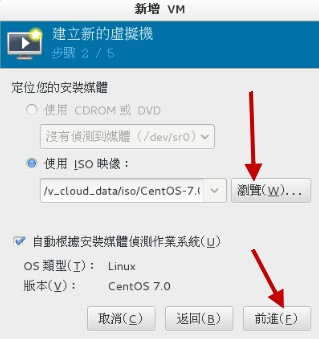
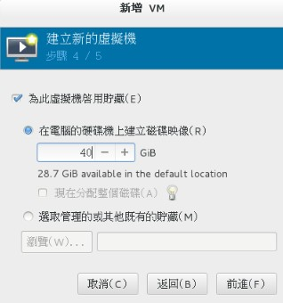

# 3. 安装CentOS 7.x

> Linux distributions越作越成熟，所以在安裝方面也越來越簡單！雖然安裝非常的簡單， 但是剛剛前一章所談到的基礎認知還是需要瞭解的，包括MBR/GPT, partition, boot loader, mount, software的選擇等等的資料。 這一章鳥哥的安裝定義為『一部練習機』，所以安裝的方式都是以最簡單的方式來處理的。 另外，鳥哥選擇的是CentOS 7.x的版本來安裝的啦！在內文中，只要標題內含有(Option) 的，代表是鳥哥額外的說明，你應該看看就好，不需要實作喔！^_^

## 目录

- [3.1 本練習機的規劃--尤其是分割參數](http://linux.vbird.org/linux_basic/0157installcentos7.php#design)
- 3.2 開始安裝CentOS 7
  - [3.2.1 調整開機媒體(BIOS)與虛擬機建置流程](http://linux.vbird.org/linux_basic/0157installcentos7.php#centos_1)
  - [3.2.2 選擇安裝模式與開機](http://linux.vbird.org/linux_basic/0157installcentos7.php#centos_2)： [inst.gpt 參數](http://linux.vbird.org/linux_basic/0157installcentos7.php#inst.gpt)
  - [3.2.3 在地設定之時區、語系與鍵盤配置](http://linux.vbird.org/linux_basic/0157installcentos7.php#centos_3)
  - [3.2.4 安裝來源設定與軟體選擇](http://linux.vbird.org/linux_basic/0157installcentos7.php#centos_4)
  - [3.2.5 磁碟分割與檔案系統設定](http://linux.vbird.org/linux_basic/0157installcentos7.php#centos_5)
  - [3.2.6 核心管理與網路設定](http://linux.vbird.org/linux_basic/0157installcentos7.php#centos_6)
  - [3.2.7 開始安裝、設定 root 密碼與新增可切換身份之一般用戶](http://linux.vbird.org/linux_basic/0157installcentos7.php#centos_7)
  - [3.2.8 準備使用系統前的授權同意](http://linux.vbird.org/linux_basic/0157installcentos7.php#centos_8)
  - [3.2.9 其他功能：RAM testing, 安裝筆記型電腦的核心參數(Option)](http://linux.vbird.org/linux_basic/0157installcentos7.php#centos_9)
- 3.3 多重開機安裝流程與管理(Option)
  - [3.3.1 安裝 CentOS 7.x + windows 7 的規劃](http://linux.vbird.org/linux_basic/0157installcentos7.php#multiboot_design)
  - [3.3.2 進階安裝 CentOS 7.x 與 Windows 7](http://linux.vbird.org/linux_basic/0157installcentos7.php#multiboot_linux)
  - [3.3.3 救援 MBR 內的開機管理程式與設定多重開機選單](http://linux.vbird.org/linux_basic/0157installcentos7.php#multiboot_rescue)
- [3.4 重點回顧](http://linux.vbird.org/linux_basic/0157installcentos7.php#hint)
- [3.5 本章習題](http://linux.vbird.org/linux_basic/0157installcentos7.php#ex)
- [3.6 參考資料與延伸閱讀](http://linux.vbird.org/linux_basic/0157installcentos7.php#reference)
- [針對本文的建議：http://phorum.vbird.org/viewtopic.php?p=135157](http://phorum.vbird.org/viewtopic.php?p=135157)


[Top](http://linux.vbird.org/linux_basic/0157installcentos7.php#top)

## 3.1 本練習機的規劃--尤其是分割參數

讀完[主機規劃與磁碟分割章節](http://linux.vbird.org/linux_basic/0130designlinux.php)之後，相信你對於安裝 Linux 之前要作的事情已經有基本的概念了。唔！並沒有讀第二章...千萬不要這樣跳著讀，趕緊回去念一念第二章， 瞭解一下安裝前的各種考量對你Linux的學習會比較好啦！

如果你已經讀完第二章了，那麼底下就實際針對第二章的介紹來一一規劃我們所要安裝的練習機了吧！ 請大家注意唷，我們後續的章節與本章的安裝都有相關性，所以，請務必要瞭解到我們這一章的作法喔！

- **Linux主機的角色定位：**
  本主機架設的主要目的在於練習Linux的相關技術，所以幾乎所有的資料都想要安裝進來。 因此連較耗系統資源的X Window System也必須要包含進來才行。

- **選擇的distribution：**
  由於我們對於Linux的定位為『伺服器』的角色，因此選擇號稱完全相容於商業版RHEL的社群版本， 就是CentOS 7.x版囉。請回到[2.3.1 章](http://linux.vbird.org/linux_basic/0130designlinux.php#beforeinstall_distro)去獲得下載的資訊吧！ ^_^。

- 電腦系統硬體配備：

  由於虛擬機器越來越流行，因此鳥哥這裡使用的是 Linux 原生的 KVM 所搭建出來的虛擬硬體環境。對於 Linux 還不熟的朋友來說， 建議你使用

  2.4 章

  提到的 virtualbox 來進行練習吧！ 至於鳥哥使用的方式可以參考文末的延伸閱讀，裡面有許多的文件可參考(

  註1

  )！ 鳥哥的虛擬機器硬體配備如下：

  - CPU等級類別：
    透過 Linux 原生的虛擬機器管理員的處理，使用本機的 CPU 類型。本機 CPU 為 Intel i7 2600 這顆三、四年前很流行的 CPU 喔！ 至於晶片組則是 KVM 自行設定的喔！
  - 記憶體：
    透過虛擬化技術提供大約 1.2G 左右的記憶體
  - 硬碟：
    使用一顆 40GB 的 VirtI/O 晶片組的磁碟，因此磁碟檔名應該會是 /dev/vda 才對。同時提供一顆 2GB 左右的 IDE 界面的磁碟， 這顆磁碟僅是作為測試之用，並不安裝系統！因此還有一顆 /dev/sda 才對喔！
  - 網路卡：
    使用 bridge (橋接) 的方式設定了對外網卡，網卡同樣使用 VirtI/O 的晶片，還好 CentOS 本身就有提供驅動程式， 所以可以直接抓到網路卡喔！
  - 顯示卡(VGA)：
    使用的是在 Linux 環境下運作還算順暢的 QXL 顯示卡，給予 60M 左右的顯示記憶體。
  - 其他輸入/輸出裝置：
    還有模擬光碟機、USB滑鼠、USB鍵盤以及 17 吋螢幕輸出等設備喔！

- 磁碟分割的配置

  在

  第二章

  裡面有談到 MBR 與 GPT 磁碟分割表配置的問題，在目前的 Linux 環境下， 如果你的磁碟沒有超過 2TB 的話，那麼 Linux 預設是會以 MBR 模式來處理你的分割表的。由於我們僅切出 40GB 的磁碟來玩， 所以預設上會以 MBR 來配置！這鳥哥不喜歡！因為就無法練習新的環境了～因此，我們得在安裝的時候加上某些參數， 強迫系統使用 GPT 的分割表來配置我們的磁碟喔！而預計實際分割的情況如下：

  | 所需目錄/裝置 | 磁碟容量 | 檔案系統 | 分割格式 |
  | ------------- | -------- | -------- | -------- |
  | BIOS boot     | 2MB      | 系統自訂 | 主分割   |
  | /boot         | 1GB      | xfs      | 主分割   |
  | /             | 10GB     | xfs      | LVM 方式 |
  | /home         | 5GB      | xfs      | LVM 方式 |
  | swap          | 1GB      | swap     | LVM 方式 |

  由於使用 GPT 的關係，因此根本無須考量主/延伸/邏輯分割的差異。不過，由於 CentOS 預設還是會使用 LVM 的方式來管理你的檔案系統， 而且我們後續的章節也會介紹如何管理這東西，因此，我們這次就使用 LVM 管理機制來安裝系統看看！

- **開機管理程式(boot loader)：**
  練習機的開機管理程式使用CentOS 7.x預設的grub2軟體，並且安裝到MBR上面。 也必須要安裝到MBR上面才行！因為我們的硬碟是全部用在Linux上面的啊！ ^_^

- **選擇軟體：**
  我們預計這部練習機是要作為伺服器用的，同時可能會用到圖形介面來管理系統，因此使用的是『含有 X 介面的伺服器軟體』的軟體方式來安裝喔！ 要注意的是，從 7.x 開始，預設選擇的軟體模式會是最小安裝！所以千萬記得軟體安裝時，要特別挑選一下才行！

- 

  檢查表單：

  最後，你可以使用底下的表格來檢查一下，你要安裝的資料與實際的硬體是否吻合喔：

  | 是與否，或詳細資訊 | 細部項目                                                     |
  | ------------------ | ------------------------------------------------------------ |
  | 是, DVD版          | 01. 是否已下載且燒錄所需的Linux distribution？(DVD或CD)      |
  | CentOS 7.1, x64    | 02. Linux distribution的版本為何？(如CentOS 7.1 x86_64版本)  |
  | x64                | 03. 硬體等級為何(如i386, x86_64, SPARC等等，以及DVD/CD-ROM)  |
  | 是, 均為x86_64     | 04. 前三項安裝媒體/作業系統/硬體需求，是否吻合？             |
  | 是                 | 05. 硬碟資料是否可以全部被刪除？                             |
  | 已確認分割方式     | 06. Partition是否做好確認(包括/與swap等容量)                 |
  |                    | 硬碟數量: 1顆40GB硬碟，並使用 GPT 分割表 BIOS boot (2MB) /boot (1GB) / (10GB) /home (5GB) swap (1GB) |
  | 有，使用 VirtI/O   | 07. 是否具有特殊的硬體裝置(如SCSI磁碟陣列卡等)               |
  | CentOS 已內建      | 08. 若有上述特殊硬體，是否已下載驅動程式？                   |
  | grub2, MBR         | 09. 開機管理程式與安裝的位置為何？                           |
  | 未取得IP參數       | 10. 網路資訊(IP參數等等)是否已取得？                         |
  |                    | 未取得IP的情況下，可以套用如下的IP參數： 是否使用DHCP：無 IP:192.168.1.100 子遮罩網路：255.255.255.0 主機名稱：study.centos.vbird |
  | Server with X      | 11. 所需要的軟體有哪些？                                     |

  如果上面表單確認過都沒有問題的話，那麼我們就可以開始來安裝咱們的CentOS 7.x x86_64版本囉！ ^_^


## 3.2 開始安裝CentOS 7

由於本章的內容主要是針對安裝一部Linux練習機來設定的，所以安裝的分割等過程較為簡單。 如果你已經不是第一次接觸Linux，並且想要架設一部要上線的Linux主機，請務必前往[第二章](http://linux.vbird.org/linux_basic/0130designlinux.php)看一下整體規劃的想法喔！ 在本章中，你只要依照[前一小節的檢查表單](http://linux.vbird.org/linux_basic/0157installcentos7.php#checklist)檢查你所需要的安裝媒體/硬體/軟體資訊等等， 然後就能夠安裝啦！

安裝的步驟在各主要Linux distributions都差不多，主要的內容大概是：

1. [調整開機媒體(BIOS)](http://linux.vbird.org/linux_basic/0157installcentos7.php#centos_1)：務必要使用CD或DVD光碟開機，通常需要調整BIOS；
2. [選擇安裝模式與開機](http://linux.vbird.org/linux_basic/0157installcentos7.php#centos_2)：包括圖形介面/文字介面等，也可加入特殊參數來開機進入安裝畫面；
3. [選擇語系資料](http://linux.vbird.org/linux_basic/0157installcentos7.php#centos_3)：由於不同地區的鍵盤按鍵不同，此時需要調整語系/鍵盤/滑鼠等配備；
4. [軟體選擇](http://linux.vbird.org/linux_basic/0157installcentos7.php#centos_4)：需要什麼樣的軟體？全部安裝還是預設安裝即可？
5. [磁碟分割](http://linux.vbird.org/linux_basic/0157installcentos7.php#centos_5)：最重要的項目之一了！記得將剛剛的規劃單拿出來設定；
6. [開機管理程式、網路、時區設定與root密碼](http://linux.vbird.org/linux_basic/0157installcentos7.php#centos_6)：一些需要的系統基礎設定！
7. [安裝後的首次設定](http://linux.vbird.org/linux_basic/0157installcentos7.php#post_install)：安裝完畢後還有一些事項要處理，包括使用者、SELinux與防火牆等！

大概就是這樣子吧！好了，底下我們就真的要來安裝囉！


[Top](http://linux.vbird.org/linux_basic/0157installcentos7.php#top)

## 3.2.1 調整開機媒體(BIOS)與虛擬機建置流程

因為鳥哥是使用虛擬機器來做這次的練習，因此是在虛擬機器管理員的環境下選擇『 Boot Options 』來調整開機順序！ 基本上，就是類似 BIOS 調整讓 CD 作為優先開機裝置的意思。至於實體機器的處理方面， 請參考您主機板說明書，理論上都有介紹如何調整的問題。

另外，因為 DVD 實在太慢了，所以，比較聰明的朋友或許會將前一章下載的映像檔透過類似 dd 或者是其他燒錄軟體， 直接燒錄到 USB 隨身碟上面，然後在 BIOS 裡面調整成為可攜式裝置優先開機的模式，這樣就可以使用速度較快的 USB 開機來安裝 Linux 了！ windows 系統上面或許可以使用類似 UNetbootin 或者是 ISOtoUSB 等軟體來處理。如果你已經有 Linux 的經驗與系統，那麼可以使用底的方式來處理：

```
# 假設你的 USB 裝置為 /dev/sdc ，而 ISO 檔名為 centos7.iso 的話： [root@study ~]# dd if=centos7.iso of=/dev/sdc 
```

上面的過程會跑好長一段時間，時間的長短與你的 USB 速度有關！一般 USB2.0 的寫入速度大約不到 10MB 左右，而 USB3.0 可能可以到 50MB 左右～ 因此會等待好幾分鐘的時間啦！寫完之後，這顆 USB 就能夠拿來作為開機與安裝 Linux 之用了！

> Tips一般的主機板環境中，使用 USB 2.0 的隨身碟裝置並沒有什麼問題，他就是被判定為可攜式裝置。不過如果是 USB3.0 的裝置，那主機板可能會將該裝置判斷成為一顆磁碟！ 所以在 BIOS 的設定中，你可能得要使用磁碟開機，並將這顆 USB 『磁碟』指定為第一優先開機，這樣才能夠使用這顆 USB 隨身碟來安裝 Linux 喔！
>


如果你暫時找不到主機板說明書，那也沒關係！當你的電腦重新開機後，看到螢幕上面會有幾個文字告訴你如何進入設定 (Setting) 模式中！ 一般常用的進入按鈕大概都是『 Del 』按鍵，或者是『 F2 』功能鍵，按下之後就可以看到 BIOS 的畫面了！ 大概選擇關鍵字為『 Boot 』的項目，就能夠找到開機順序的項目囉！

在調整完BIOS內的開機裝置的順序後，理論上你的主機已經可使用可開機光碟來開機了！ 如果發生一些錯誤訊息導致無法以CentOS 7.x DVD來開機，很可能是由於：1)電腦硬體不支援； 2)光碟機會挑片； 3)光碟片有問題； 如果是這樣，那麼建議你再仔細的確認一下你的硬體是否有超頻？或者其他不正常的現象。 另外，你的光碟來源也需要再次的確認！

- 在 Linux KVM 上面建立虛擬機器的流程

如果你已經在實體機器上面建置好 CentOS 7 了，然後想要依照我們這個基礎篇的內容來實驗一下學習的進度，那麼可以使用底下的流程來建立與課程相仿的硬碟喔！ 建置流程不會很困難，瞧一瞧即可！

首先，妳得從『應用程式』裡面的『系統工具』找到『虛擬機器管理員』，點下他就會出現如下的圖示：


<center>圖3.2.1、啟動虛擬機器管理員示意圖</center>

因為我們是想要建立新的虛擬機器，因此你要像上圖那樣，點選『檔案』然後點選『 New Virtual Machine 』，接下來就能夠看到如下圖的模樣來建立新機器！


 

<center>圖3.2.2、選擇使用光碟來安裝，並實際選擇 CentOS 映像檔所在</center>

如上圖所示，左圖可以讓你選擇這個新的機器安裝的時候，要安裝的是哪個來源媒體，包括直接從網路來源安裝、從硬碟安裝等等。 我們當然是選擇光碟映像檔囉！按下一步就會進入選擇光碟映像檔的檔名～這時請按『瀏覽』並且選擇『檔案系統』，再慢慢一個一個選擇即可！ 之後就繼續下一步吧！


 

<center>圖3.2.3、設定記憶體容量、CPU數量、磁碟容量等重要機器設定</center>

接下來如上圖所示，你可以挑選記憶體容量、CPU 顆數以及磁碟的容量等等。比較有趣的地方是，你會看到上圖右側鳥哥寫了 40G 的容量， 但可用容量只有 28G 耶～這樣有沒有關係？當然沒關係！現在的虛擬機器的磁碟機制，大多使用 qcow2 這個虛擬磁碟格式，這種格式是『用多少紀錄多少』喔， 與你的實際使用量有關。既然我們才剛剛要使用，所以這個虛擬磁碟當然沒有資料，既然沒有資料需要寫入，那就不會佔用到實際的磁碟容量了！ 盡量用！沒關係！ ^_^


<center>圖3.2.4、使用橋接的功能設定網路</center>

在出現的畫面中，選擇『進階選項』之後，挑選主機裝置設定，然後點選橋接功能，如此一來才有辦法讓你的虛擬機器網卡具有直接對外的功能喔！ 同時如果你想要改設定的話，那麼可以勾選『在安裝前自動組態』的圈圈，之後按完成會出現如下圖所示：


<center>圖3.2.5、設定完成的示意圖</center>

從上圖 3.2.5 當中，我們可以看到這部機器的相關硬體配備喔！不過，竟然沒有發現光碟機耶！真怪！那請按下上圖中指標指的地方， 加入一個新硬體！新硬體增加的示意圖如下所示：


<center>圖3.2.6、新增硬體示意圖</center>

如上圖所示，我們來建立一個 IDE 介面的光碟，並且將光碟映像檔加入其中！加入完成之後按下『完成』即可出現如下的最終畫面了！


<center>圖3.2.7、虛擬機器最終建置完成示意圖</center>

這時你的虛擬機器已經跟鳥哥的差不多了！按下『開始安裝』就能夠取得與鳥哥在下列提供的各樣設定囉！

> Tips為了方便維護與管理，鳥哥的虛擬機實際上是使用 Gocloud (http://www.gocloud.com.tw/) 虛擬電腦教室系統所建立的！因此上述的流程與鳥哥實際建置的虛擬機器， 會有一些些的差異～不過差異不大就是了！這裡要先跟大家解釋一下！
>


[Top](http://linux.vbird.org/linux_basic/0157installcentos7.php#top)

## 3.2.2 選擇安裝模式與開機 - inst.gpt

如果一切都順利沒問題的話，那麼使用光碟映像檔開機後，就會出現如下畫面：


<center>圖3.2.8、光碟開機後安裝畫面之選擇</center>

你有 60 秒的時間可以選擇不同的操作模式，從上而下分別是：

1. 正常安裝 CentOS 7 的流程；
2. 測試此光碟後再進入 CentOS 7 的流程；
3. 進入除錯模式！選擇此模式會出現更多的選項，分別是：
   - 以基本圖形介面安裝 CentOS 7 (使用標準顯卡來設定安裝流程圖示)；
   - 救援 CentOS 系統
   - 執行記憶體測試 (Run a memory test)
   - 由本機磁碟正常開機，不由光碟開機

基本上，除非你的硬體系統有問題，包括擁有比較特別的圖形顯示卡等等，否則使用正常的 CentOS 7 流程即可！ 那如果你懷疑這片光碟有問題，就可以選擇測試光碟後再進入 CentOS 7 安裝的程序。如果你確信此光碟沒問題，就不要測試了！ 不過如果你不在乎花費一、兩分鐘的時間去測試看看光碟片有沒有問題，就使用測試後安裝的流程啊！不過要進入安裝程序前先等等， 先進行底下的流程再繼續。


- 加入強制使用 GPT 分割表的安裝參數

如前所述，如果磁碟容量小於 2TB 的話，系統預設會使用 MBR 模式來安裝！鳥哥的虛擬機僅有 40GB 的磁碟容量，所以預設肯定會用 MBR 模式來安裝的啊！那如果想要強制使用 GPT 分割表的話，你就得要這樣作：

1. 使用方向鍵，將圖 3.2.8 的游標移動到『 Install CentOS 7 』的項目中
2. 按下鍵盤的 [Tab] 按鈕，讓游標跑到畫面最下方等待輸入額外的核心參數
3. 在出現的畫面中，輸入如下畫面的資料 (注意，各個項目要有空格，最後一個是游標本身而非底線)


<center>圖3.2.9、加入額外的核心參數修改安裝程序</center>

其實重點就是輸入『 inst.gpt 』這個關鍵字！輸入之後系統會跑過一段偵測的畫面， 這段偵測的流程依據你的光碟機速度、硬體複雜度而有不同。反正，就是等待個幾秒鐘到一、兩分鐘就是了！畫面如下所示：


<center>圖3.2.10、安裝程式的偵測系統過程</center>

進入安裝流程的第一個畫面就是選擇你熟悉的語系囉！這個選擇還挺重要的！因為未來預設的語系、預設用戶選擇的環境等， 都跟這裡有關～當然未來是可以改變的～如下圖所示，你可以依據箭頭的指示選擇我們台灣慣用的繁體中文字！然後就可以按下『繼續』來處理喔！


<center>圖3.2.11、選擇安裝程式的語系顯示</center>

在 CentOS 7 的安裝流程中，已經將所有的挑選流程以按鈕形式通通集中在第一頁了！如下圖所示，所以你可以在同一個畫面中看完所有的設定， 也可以跳著修改各個設定，不用被制約一項一項處理喔！底下我們就來談談每一個項目的設定方式吧！


<center>圖3.2.12、統一按鈕展示的安裝畫面</center>


[Top](http://linux.vbird.org/linux_basic/0157installcentos7.php#top)

## 3.2.3 在地設定之時區、語系與鍵盤配置

按下 [圖 3.2.12](http://linux.vbird.org/linux_basic/0157installcentos7.php#fig3.2.12) 畫面當中的『在地設定』項目內的『日期時間』後，會出現如下的畫面：


<center>圖3.2.13、時區挑選的項目示意圖</center>

你可以直接在世界地圖上面選擇到妳想要的時區位置，也可以在畫面中『區域、城市』的下拉式選單選擇你的城市即可。 如果日期與時間不對，可以在畫面中箭頭指的 2, 3 處分別修改。雖然有網路的時間自訂修訂功能，不過因為我們的網路尚未設定好， 所以畫面中的箭頭 5 無法順利開啟就是了。處理完畢後，按下左上方箭頭 4 指的『完成』按鈕，即可回到 [圖 3.2.12](http://linux.vbird.org/linux_basic/0157installcentos7.php#fig3.2.12) 中。

> Tips說實在的，我們這些老人家以前接觸的畫面，確認鈕通常在右下方。第一次接觸 CentOS 7 的安裝畫面時，花了將近一分鐘去找確認按鈕耶！ 還以為程式出錯了！後來才發現在左上方～這...真是欺負老人的設計嗎？哈哈哈哈！
>


時區選擇之後，接下來請點選 [圖 3.2.12](http://linux.vbird.org/linux_basic/0157installcentos7.php#fig3.2.12) 內的『鍵盤配置』，出現的畫面如下：


<center>圖3.2.14、鍵盤配置項目</center>

這個很重要喔！因為我們需要輸入中文，所以常常打字會在中/英文之間切換。過去我們經常使用的鍵盤配置是『 Ctrl + 空白 』按鈕，或者是『 Ctrl + Shift 』按鈕， 不過這一版的視窗介面，預設並沒有提供任何的切換按鈕～所以這裡得要預先來設定一下比較妥當。如圖中的箭頭順序去調整， 不過鳥哥一直找不到習慣的『 ctrl + 空白 』的組合，只好用次習慣的『 Ctrl + Shift 』組合了！確認後可以按完成按鈕即可。 不過，如果你想要有其他的輸入語系的話，可以選擇畫面中左下方用圈圈勾起來的地方，按下去就會出現如下畫面：


<center>圖3.2.15、新增其他語系的鍵盤配置</center>

竟然還有三種特殊的台灣語系鍵盤配置規格耶！好有趣！有需要的朋友可以選擇看看！至於『語系支援』的畫面則與 [圖 3.2.11](http://linux.vbird.org/linux_basic/0157installcentos7.php#fig3.2.11) 相同， 所以這裡就不多說了！


[Top](http://linux.vbird.org/linux_basic/0157installcentos7.php#top)

## 3.2.4 安裝來源設定與軟體選擇

回到 [圖 3.2.12](http://linux.vbird.org/linux_basic/0157installcentos7.php#fig3.2.12) 後，按下『安裝來源』按鈕之後，你會得到如下的畫面：


<center>圖3.2.16、挑選準備要被安裝的軟體所在的媒體</center>

因為我們是使用光碟開機，同時還沒有設定網路，因此預設就會選擇光碟片 (sr0 所在的裝置)。如果你的主機系統當中還有其他安裝程式認識的磁碟檔案系統， 那麼由於該磁碟也可能會放置映像檔啊，所以該映像檔也能夠提供軟體的安裝，因此就有如同上圖的『ISO 檔案』的選擇項目。最後， 如果你的安裝程式已經預先設定好網路了，那麼就可以選擇『在網路上』的項目，並且填寫正確的網址 (URL) ， 那麼安裝程式就可以直接從網路上面下載安裝了！

> Tips其實如果區域網路裡面你可以自己設定一個安裝伺服器的話，那麼使用網路安裝的速度恐怕會比其他方式快速喔！畢竟 giga 網路速度可達到 100Mbytes/s 的讀寫， 這個速度 DVD 或 USB 2.0 都遠遠不及啊！^_^
>


按下完成並回到[圖 3.2.12](http://linux.vbird.org/linux_basic/0157installcentos7.php#fig3.2.12) 之後，就得要選擇『軟體選擇』的畫面了！如下所示：


<center>圖3.2.17、選擇安裝的軟體資料為哪些</center>

因為預設是『最小型安裝』的模式，這種模式只安裝最簡單的功能，很適合高手慢慢搭建自己的環境之用。 但是我們是初學者啊～沒有圖形介面來看看實在有點怪！所以建議可以選擇如下的項目：

- 含有 GUI 的伺服器 (GUI就是使用者圖形介面囉！預設搭載 GNOME)
- GNOME 桌面環境： Linux 常見的圖形介面
- KDE Plasma Workspaces：另一套常見的圖形介面

上面這幾個設定擁有圖形介面，鳥哥這裡主要是以『GUI 伺服器』作為介紹喔！選擇完畢之後按下完成， 安裝程式會開始檢查光碟裡面有沒有你所挑選的軟體存在，而且解決軟體相依性的檢查 (就是將妳所選擇的大項目底下的其他支援軟體通通載入)， 之後就會再次的回到 [圖 3.2.12](http://linux.vbird.org/linux_basic/0157installcentos7.php#fig3.2.12) 的畫面中。


[Top](http://linux.vbird.org/linux_basic/0157installcentos7.php#top)

## 3.2.5 磁碟分割與檔案系統設定

再來就是我們的重頭戲，當然就是磁碟分割啦！由 [圖 3.2.12](http://linux.vbird.org/linux_basic/0157installcentos7.php#fig3.2.12) 當中，點選『系統』項目下的『安裝目的地』區塊，點選之後會進入如下畫面中：


<center>圖3.2.18、選擇要安裝 Linux 的硬碟，並選擇手動分割模式</center>

由於鳥哥的虛擬機器系統共有兩顆硬碟，因此安裝的時候你得要特別選擇正確的硬碟才能夠順利的安裝喔！所以如上圖 1 號箭頭所指， 點選之後就會出現打勾的符號囉！因為我們要學習分割的方式，不要讓系統自動分割，因此請點選 2 號箭頭所指處：『我將配置分頁』的項目。 點選完畢後按下『完成』，即可出現如下的磁碟分割畫面喔！


<center>圖3.2.19、刪除已經存在系統當中的分割槽</center>

其實鳥哥故意將硬碟先亂安裝一套系統，然後再安裝 CentOS7 的，就是為了要在這裡展示給各位朋友們瞧一瞧，如何在安裝時觀察與刪除分割啊！ 如上圖所示，你會發現到 1 號箭頭處有個作業系統名稱，點選該名稱 (你的系統可能不會有這個項目，也有可能是其他項目！不過，如果是全新硬碟， 你就可以略過這個部份了)，他就會出現該系統擁有的分割槽。依序分別點選底下的 /boot, /, swap 三個項目，然後點選 3 號箭頭處的減號『 - 』， 就可以刪除掉該分割槽了！刪除的時候會出現如下的警告視窗喔！


<center>圖3.2.20、刪除分割槽時出現的警告視窗示意圖</center>

因為前一個系統鳥哥安裝的也是舊版的 CentOS 6.x 的版本，所以 CentOS7 可以自動抓到所有該系統的掛載點～於是就會出現如上所示的圖示， 會特別詢問你要不要同時刪出其他的分割。我們原本有 3 個分割需要刪除，點選上圖 1 號箭頭然後按下『刪除它』，嘿嘿！三個分割全部會被刪除乾淨！ 之後就會回 [圖 3.2.19](http://linux.vbird.org/linux_basic/0157installcentos7.php#fig3.2.19) 的畫面中了！之後你就可以開始建立檔案系統囉！同時請注意，分割的時候請參考本章 3.1 小節的介紹， 根據該小節的建議去設定好分割喔！底下我們先來製作第一個 GPT 分割表最好要擁有的 BIOS boot 分割槽，如下所示：


<center>圖3.2.21、建立 BIOS boot 分割槽的示意圖</center>

先點選 1 號箭頭處的選單，不要使用預設的 LVM 喔！請點選『標準分割區』的項目，並按下 2 號箭頭的『 + 』符號，就會出現中間的彈出式視窗， 在該視窗中 3 號箭頭處，點選下拉式選單然後選擇你在畫面中看到的 biosboot 項目 (不要手動輸入畫面中的文字，請使用既有的選單來挑選喔！)，同時輸入大約 2M 的容量，按下『新增掛載點』後， 就會整理出該分割槽的詳細資料，如下圖所示：


<center>圖3.2.22、單一分割槽分割完成詳細項目示意圖</center>

如上圖所示，畫面的右邊就是 biosboot 分割槽的詳細部份！由於是 bios 使用，因此沒有掛載點 (妳看畫面中該欄位是空空如也的！)。 同時檔案系統的欄位部份也是會變成『BIOS Boot』的關鍵字！並不會是 Linux 的檔案系統啦！接下來，我們要來設定其他的分割槽了！ 所以如上圖所示，請按下『 + 』符號吧！底下的示意圖鳥哥就不全圖擷取，只抓出彈出式視窗的內容來給大家瞧瞧喔！

另外，圖中的『裝置類型』其實共有 3 種，我們的練習機實際使用標準分割與 LVM 而已。那三種裝置類型的意義分別如下：

- 標準分割區：就是我們一直談的分割槽啊！類似 /dev/vda1 之類的分割就是了。
- LVM：這是一種可以彈性增加/削減檔案系統容量的裝置設定，我們會在後面的章節持續介紹 LVM 這個有趣的東西！
- LVM 緊張供應：這個名詞翻譯的超奇怪的！其實這個是 LVM 的進階版！與傳統 LVM 直接分配固定的容量不同， 這個『 LVM 緊張供應』的項目，可以讓你在使用多少容量才分配磁碟多少容量給你，所以如果 LVM 裝置內的資料量較少，那麼你的磁碟其實還可以作更多的資料儲存！ 而不會被平白無故的佔用！這部份我們也在後續談到 LVM 的時候再來強調！

另外，圖中的檔案系統就是實際『格式化』的時候，我們可以格式化成什麼檔案系統的意思。底下分別談談各個檔案系統項目 (詳細的項目會在後續章節說明)

- ext2/ext3/ext4：Linux早期適用的檔案系統類型。由於ext3/ext4檔案系統多了日誌的記錄， 對於系統的復原比較快速。不過由於磁碟容量越來越大，ext 家族似乎有點擋不住了～所以除非你有特殊的設定需求，否則近來比較少使用 ext4 項目了！
- swap：就是磁碟模擬成為記憶體，由於swap並不會使用到目錄樹的掛載，所以用swap就不需要指定掛載點喔。
- BIOS Boot：就是 GPT 分割表可能會使用到的項目，若你使用 MBR 分割，那就不需要這個項目了！
- xfs：這個是目前 CentOS 預設的檔案系統，最早是由大型伺服器所開發出來的！ 他對於大容量的磁碟管理非常好，而且格式化的時候速度相當快，很適合當今動不動就是好幾個 TB 的磁碟的環境喔！因此我們主要用這玩意兒！
- vfat：同時被Linux與Windows所支援的檔案系統類型。如果你的主機硬碟內同時存在Windows與Linux作業系統，為了資料的交換， 確實可以建置一個vfat的檔案系統喔！


<center>圖3.2.23、建立 /boot 分割槽的示意圖</center>

依據 3.1 小節的建議，接下來是建立 /boot 掛載點的檔案系統。容量的部份你可以輸入 1G 或者是 1024M 都可以！有簡單的單位較佳。 然後按下新增吧！就會回到類似 [圖 3.2.22](http://linux.vbird.org/linux_basic/0157installcentos7.php#fig3.2.22) 的畫面喔！接下來依序建立另外所需要的根目錄『 / 』的分割吧！


<center>圖3.2.24、建立根目錄 / 的分割槽</center>

如上圖所示，就輸入根目錄的容量吧！依據 3.1 小節的建議給予 10G 的容量。接下來要注意喔，我們的 /, /home, swap 都希望使用 CentOS 提供的 LVM 管理方式，因此當你按下上圖的『新增掛載點』之後，回到底下的詳細設定項目時，得要更改一下相關的項目才行！如下所示：


<center>圖3.2.25、將裝置類型改為 LVM 的管理機制</center>

如上圖所示，你得先確認 1 號箭頭指的地方為 / 才對，然後點選 2 號箭頭處，將他改為『LVM』才好。由於 LVM 預設會取一個名為 centos 的 LVM 裝置， 因此該項目不用修改！只要按下 3 號箭頭處的『 Modify(更改) 』即可。接下來會出現如下的畫面，要讓你處理 LVM 的相關設定！


<center>圖3.2.26、修改與設定 LVM 裝置的容量</center>

再次說明，我們這裡是要建立一個讓你在未來可以持續練習的練習機環境，因此不建議將分割用完！所以，如上圖所示， 1 號箭頭處請選擇『固定』容量，然後填入『 30G 』左右的容量，這樣我們就還有剩下將近 10G 的容量可以繼續未來的章節內容練習。 其他的就保留預設值，點選『儲存』來確定吧！然後回到類似 [圖 3.2.23](http://linux.vbird.org/linux_basic/0157installcentos7.php#fig3.2.23) 的畫面，繼續點選『 + 』來持續新增分割，如下所示：


<center>圖3.2.27、建立 /home 分割槽</center>

建立好 /home 分割槽之後，同樣需要調整 LVM 裝置才行，因此在你按下上圖的『新增掛載點』之後，回到底下的畫面來處理處理！


<center>圖3.2.28、調整 /home 也使用 LVM 裝置</center>

如上圖所示，確定 1 號箭頭是 /home ，然後選擇 2 號箭頭成為 LVM，之後確定 4 號箭頭還有剩餘容量 (也是為了未來要練習之用)， 之後就可以按下 3 號箭頭的變更設定來確認囉！其實要先按 3 號箭頭，4 號區塊才會順利顯示啦！ ^_^


<center>圖3.2.29、建立 swap 分割槽</center>

swap 是當實體記憶體容量不夠用時，可以拿這個部份來存放記憶體中較少被使用的程序項目。以前都建議 swap 需要記憶體的 2 倍較佳。 不過現在的記憶體都夠大了，swap 雖然最好還是保持存在比較好，不過也不需要太大啦！大約 1~2GB 就好了。老實說，如果你的系統竟然會使用到 swap， 那代表...錢花的不夠多！繼續擴充記憶體啦！

> Tipsswap記憶體置換空間的功能是：當有資料被存放在實體記憶體裡面，但是這些資料又不是常被CPU所取用時， 那麼這些不常被使用的程序將會被丟到硬碟的swap置換空間當中， 而將速度較快的實體記憶體空間釋放出來給真正需要的程序使用！ 所以，如果你的系統不很忙，而記憶體又很大，自然不需要swap囉。
>


<center>圖3.2.30、調整 swap 也使用 LVM 裝置</center>

如上圖所示，我們也需要 swap 使用 LVM，請按照箭頭依序處理各個項目吧！上述的動作做完之後，我們的分割就準備妥當了！ 接下來，看看你的分割是否與下圖類似！需要有 /home, /boot, /, swap 等項目。


<center>圖3.2.31、完成分割之後的示意圖</center>

如上圖所示，仔細看一下左下角的兩個方塊，可用空間的部份還有剩下大約 9GB 左右，這樣才對喔！ 如果一切順利正常，按下上圖左上方的『完成』，系統會出現一個警告視窗，提醒你是否要真的進行這樣的分割與格式化的動作，如下圖所示：


<center>圖3.2.32、是否確定分割正確的示意圖</center>

上圖中你可以特別觀察一下分割表的類型，可以發現方框圈起來的地方，刪除了 MSDOS 而建立了 GPT ！嘿嘿！沒錯！是我們要的！所以，按下『接受變更』吧！ 之後就會回到 [圖 3.2.12](http://linux.vbird.org/linux_basic/0157installcentos7.php#fig3.2.12) 的畫面囉！


[Top](http://linux.vbird.org/linux_basic/0157installcentos7.php#top)

## 3.2.6 核心管理與網路設定

回到 [圖 3.2.12](http://linux.vbird.org/linux_basic/0157installcentos7.php#fig3.2.12) 的畫面後，點選『系統』下的『KDUMP』項目，這個項目主要在處理，當 Linux 系統因為核心問題導致的當機事件時， 會將該當機事件的記憶體內資料儲存出來的一項特色！不過，這個特色似乎比較偏向核心開發者在除錯之用～如果你有需要的話，也可以啟動它！ 若不需要，也能夠關閉它，對系統的影響似乎並不太大。所以，如下圖所示，點選之後，鳥哥是使用『啟用』的預設值，並沒有特別取消掉這項目就是了。


<center>圖3.2.33、KDUMP 的挑選示意圖</center>

再次回到 [圖 3.2.12](http://linux.vbird.org/linux_basic/0157installcentos7.php#fig3.2.12) 的畫面點選『系統』下的『網路&主機名稱』的設定，會出現如下圖所示畫面：


<center>圖3.2.34、網路設定示意圖</center>

因為鳥哥這邊使用的是虛擬機器，因此看到的網卡就會是舊式的 eth0 之類的網卡代號。如果是實體網卡，那妳可能會看到類似 p1p1, em1 等等比較特殊的網卡代號！ 這是因為新的設計中，它是以網卡安插的插槽來作為網卡名稱的由來 ([註2](http://linux.vbird.org/linux_basic/0157installcentos7.php#ps2))，這部份未來我們在網路再來談！這裡先知道一下即可。

上圖中先選擇正確的網卡，然後在 2 號箭頭處選擇『開』之後，3 號箭頭處才能夠開始設定！現在請按下『設定』項目，然後參考 3.1 小節的介紹，來給予一組特別的 IP 吧！


<center>圖3.2.35、設定開機自動啟動網路</center>

現在 CentOS 7 開機後，預設是沒有啟動網路的，因此你得要在上圖中選擇 2 號箭頭的『當這個網路可用時自動連線』的項目才行！


<center>圖3.2.36、手動設定 IP 的示意圖</center>

如上圖所示，選擇 IPv4 的項目，然後調整 2 號箭頭成為手動，接下來按下 3 號箭頭加入項目後，才能夠在 4 號箭頭輸入所需要的 IP 位址與網路遮罩～ 寫完之後其他的項目不要更動，就按下 5 號箭頭的儲存吧！然後回到如同下圖的畫面：


<center>圖3.2.37、修改主機名稱</center>

如上圖所示，右邊的網路參數部份已經是正確的了，然後在箭頭處輸入 3.1 小節談到的主機名稱吧！寫完就給它『完成』囉！


[Top](http://linux.vbird.org/linux_basic/0157installcentos7.php#top)

## 3.2.7 開始安裝、設定 root 密碼與新增可切換身份之一般用戶

如果一切順利的話，那麼你應該就可以看到如下的圖示，所有的一切都是正常的狀態！因此你就可以按下底下圖示的箭頭部份， 開始安裝的流程囉！


<center>圖3.2.38、設定完畢並準備開始安裝的示意圖</center>

現在的安裝畫面作的還挺簡單的，省略了一堆步驟！上述畫面按下開始安裝後，這時你就可以一邊讓系統安裝， 同時去設定其他項目，可以節省時間啦！如下圖所示，還有兩件重要的事件要處理，一個是 root 密碼，一個是一般身份用戶的建立！


<center>圖3.2.39、進行安裝程序中，還可以持續其他任務的過程</center>

將上圖中，按下 ROOT 密碼，可以得到下面的圖示來修改系統管理員的密碼喔！


<center>圖3.2.40、設定系統管理員 root 的密碼</center>

基本上，你可以設定任何密碼內容！只是，系統會主動幫妳判斷你的密碼設定的好不好。如果不夠好，那麼畫面中就會告訴你，你的密碼很虛弱啦！ 你還是可以堅持你的簡易密碼！只是，就得要按下兩次『完成』，安裝程式才會真的幫妳設定該密碼。

什麼是好的密碼呢？基本上，密碼字元長度設定至少8個字元以上，而且含有特殊符號更好，且不要是個人的可見資訊 (如電話號碼、身份證、生日等等，就是比較差的密碼)。 例如：I&my_dog之類，有點怪，但是對你又挺好記的密碼！就是還 OK 的密碼設定喔！

> Tips好的習慣還是從頭就開始養成比較好。以前鳥哥上課為了簡易的操作，所以給學生操作的系統中，選了個 1234 作為密碼，要命了！後來鳥哥的專題生， 實際上線的電腦中，竟然密碼還是使用 1234 耶～一上線之後的後果，當然就是被綁架了！還有什麼說的？所以，還是一開始就養成好習慣較佳！
>


管理員密碼設定妥當後，接下來鳥哥建議你還是得要建立一個日常登入系統的慣用一般帳號較好！為什麼呢？ 因為通常遠端系統管理流程中，我們都會建議將管理員直接登入的權限拿掉，有需要才用特殊指令 (如 su, sudo 等等，指令後續會談到！) 切換成管理員身份。 所以啊，你一定得要建立一個一般帳號才好。鳥哥這裡使用自己的名子 dmtsai 來作為一個帳號喔！


<center>圖3.2.41、建立一個一般帳號</center>

這個帳號既然是你要使用的，那麼這個帳號應該就是你認可的管理員使用的一般帳號啊！所以你或許會希望這個帳號可以使用自己的密碼來切換身份成為 root， 而不用知道 root 的密碼！果真如此的話，那麼上頭的 2 號箭頭處，就得要勾選才好！未來你就可以直接使用 dmtsai 的密碼變成 root 哩！ 方便你自己管理～這樣即使 root 密碼忘記了，你依舊可以切換身份變 root 啊！


<center>圖3.2.42、安裝完畢的示意圖</center>

等到安裝妥當之後，你應該就會見到如上的圖示！上方的箭頭比較有趣！仔細看，你會發現有個『將建立管理員 dmtsai 』的項目！ 那就是因為你勾選了『讓這位使用者成為管理員』的緣故！當然啦！這個帳號的密碼也就很重要！不要隨便流出去啊！確定一切事情都順利搞定， 按下箭頭處的『重新開機』吧！準備來使用 CentOS Linux 囉！


[Top](http://linux.vbird.org/linux_basic/0157installcentos7.php#top)

## 3.2.8 準備使用系統前的授權同意

重新開機完畢後，系統會進入第一次使用的授權同意畫面！如下所示：


<center>圖3.2.43、第一次使用 CentOS 7 圖形介面的授權同意過程</center>

點選上圖中的 1 號箭頭後，就會出現如下圖所示的授權同意書！


<center>圖3.2.44、授權同意書的簽署</center>

再次確認後，你就會發現如同下圖所示的畫面，等待登入了！第一次登入系統的相關資料就請看下一個小節囉！


<center>圖3.2.45、等待使用者登入示意圖</center>

> Tips先提醒你自己記一下，你剛剛上面所選擇的項目，包括 root 的密碼等等，通通都會被紀錄到 /root/anaconda-ks.cfg 這個檔案內喔！ 這個檔案可以提醒與協助你未來想要重建一個一模一樣的系統時，就可以參考該檔案來製作囉！當然，你也可以 google 一下，找 kickstart 這個關鍵字，會得到很多協助喔！ ^_^
>


[Top](http://linux.vbird.org/linux_basic/0157installcentos7.php#top)

## 3.2.9 其他功能：RAM testing, 安裝筆記型電腦的核心參數(Option)

其實安裝光碟還可以進行救援、燒機等任務喔！趕緊來瞧瞧：

- 記憶體壓力測試：memtest86 ([註3](http://linux.vbird.org/linux_basic/0157installcentos7.php#ps3))

CentOS的DVD除了提供一般PC來安裝Linux之外，還提供了不少有趣的東西，其中一個就是進行『燒機』的任務！ 這個燒機不是台灣名產燒酒雞啊，而是當你組裝了一部新的個人電腦，想要測試這部主機是否穩定時， 就在這部主機上面運作一些比較耗系統資源的程式，讓系統在高負載的情況下去運作一陣子(可能是一天)， 去測試穩定度的一種情況，就稱為『燒機』啦！

那要如何進行呢？讓我們重新開機並回到[圖3.2.8](http://linux.vbird.org/linux_basic/0157installcentos7.php#fig3.2.8) 的畫面中，然後依序選擇『Troubleshooting』、 『Run a memory test』的項目，你的畫面就會變成如下的模樣了：


<center>圖3.2.46、memory test 的圖示</center>

畫面中的右上角資料會一直跑，直到你按下 [esc] 按鈕為止，他都會一直去操記憶體！由於記憶體是伺服器當中一個相當重要的元件， 他只要不出事，系統總是穩定的多！所以，透過這個方式來操記憶體，讓記憶體一直保持在忙碌的狀態～等待一天過去，你就可以說，恩！ 這部電腦硬體應該還算穩定吧！ ^_^

- 安裝筆記型電腦或其他類PC電腦的參數

由於筆記型電腦加入了非常多的省電機制或者是其他硬體的管理機制，包括顯示卡常常是整合型的， 因此在筆記型電腦上面的硬體常常與一般桌上型電腦不怎麼相同。所以當你使用適合於一般桌上型電腦的DVD來安裝Linux時， 可能常常會出現一些問題，導致無法順利的安裝Linux到你的筆記型電腦中啊！那怎辦？

其實很簡單，只要在安裝的時候，告訴安裝程式的linux核心不要載入一些特殊功能即可。 最常使用的方法就是，在使用DVD開機時，選擇『』然後按下 [tab] 按鍵後，加入底下這些選項：

```
nofb apm=off acpi=off pci=noacpi 
```

apm(Advanced Power Management)是早期的電源管理模組，acpi(Advanced Configuration and Power Interface)則是近期的電源管理模組。這兩者都是硬體本身就有支援的，但是筆記型電腦可能不是使用這些機制， 因此，當安裝時啟動這些機制將會造成一些錯誤，導致無法順利安裝。

nofb則是取消顯示卡上面的緩衝記憶體偵測。因為筆記型電腦的顯示卡常常是整合型的， Linux安裝程式本身可能就不是很能夠偵測到該顯示卡模組。此時加入nofb將可能使得你的安裝過程順利一些。

對於這些在開機的時候所加入的參數，我們稱為『核心參數』，這些核心參數是有意義的！ 如果你對這些核心參數有興趣的話，可以參考文後的參考資料來查詢更多資訊([註4](http://linux.vbird.org/linux_basic/0157installcentos7.php#ps4))。


## 3.3 多重開機安裝流程與管理(Option)

有鑑於自由軟體的蓬勃發展以及專利軟體越來越貴，所以政府單位也慢慢的希望各部門在選購電腦時， 能夠考量同時含有兩種以上作業系統的機器了。加上很多朋友其實也常常有需要兩種不同作業系統來處理日常生活與工作的事情。 那我是否需要兩部主機來操作不同的作業系統？不需要的，我們可以透過多重開機來選擇登入不同的作業系統喔！ 一部機器搞定不同作業系統哩。

> Tips你可能會問：『既然虛擬機器這麼熱門，應用面也廣，那為啥不能安裝 Linux 上面使用 windows 虛擬機？或反過來使用呢？』 原因無他，因為『虛擬機在圖形顯示的效能依舊不足』啊！所以，某些時刻妳還是得要使用實體機器去安裝不同的作業系統啊！
>


不過，就如同鳥哥之前提過的，多重開機系統是有很多風險存在的，而且你也不能隨時變動這個多重作業系統的開機磁區， 這對於初學者想要『很猛烈的』玩Linux是有點妨礙～所以，鳥哥不是很建議新手使用多重開機啦！ 所以，底下僅是提出一個大概，你可以看一看，未來我們談到後面的章節時，你自然就會有『豁然開朗』的笑容出現了！ ^_^


[Top](http://linux.vbird.org/linux_basic/0157installcentos7.php#top)

## 3.3.1 安裝 CentOS 7.x + windows 7 的規劃

由於鳥哥身邊沒有具有 UEFI BIOS 的機器，加上 Linux 對於 UEFI 的支援還有待持續進步，因此，底下鳥哥是使用虛擬機建置 200GB 的磁碟， 然後使用傳統 BIOS 搭配 MBR 分割表來實做多重開機的項目。預計建置 CentOS 7.x 以及一個 Windows 7 的多重作業系統，同時擁有一個共用的資料磁碟。

> Tips為什麼要用 MBR 而不用本章之前介紹的 GPT 呢？這是因為『Windows 8.1 以前的版本，不能夠在非 UEFI 的 BIOS 環境下使用 GPT 分割表的分割槽來開機』啊！ 我們既然沒有 UEFI 的環境，那自然就無法使用 GPT 分割來安裝 Windows 系統了。但其實 windows 還是可以使用 GPT，只是『開機的那顆硬碟，必須要在 MBR 的分割磁碟中』。 例如 C 槽單顆硬碟使用 MBR ，而資料磁碟 D 槽使用 GPT ，那就 OK 沒問題！
>


另外，與過去傳統安裝流程不同，這次鳥哥希望保留 Linux (因為開機管理是由 Linux 管的) 在前面，windows 在後面的分割槽內， 因此需要先安裝 Linux 後再安裝 windows，後來透過修改系統設定檔來讓系統達成多重開機！基本上鳥哥的分割是這樣規劃的 (因為不用 GPT，所以無須 BIOS Boot 項目)：

| Linux裝置檔名 | Linux載點 | Windows裝置 | 實際內容       | 檔案系統 | 容量     |
| ------------- | --------- | ----------- | -------------- | -------- | -------- |
| /dev/vda1     | /boot     | -           | Linux 開機資訊 | xfs      | 2GB      |
| /dev/vda2     | /         | -           | Linux 根目錄   | xfs      | 50GB     |
| /dev/vda3     | -         | C           | Windows 系統碟 | NTFS     | 100GB    |
| /dev/vda5     | /data     | D           | 共享資料磁碟   | VFAT     | 其他剩餘 |

再次強調，我們得要先安裝 Linux 在透過後續維護的方案來處理的喔！而且，為了強制 Windows 要安裝在我們要求的分割槽， 所以在 Linux 安裝時，得要將上述的所有分割槽先分割出來喔！大概就是這樣！來實作吧！


[Top](http://linux.vbird.org/linux_basic/0157installcentos7.php#top)

## 3.3.2 進階安裝 CentOS 7.x 與 Windows 7

請依據本章前面的方式一項一項來進行各項安裝行為，比較需要注意的地方就是安裝時，不可以加上 inst.gpt 喔！我們單純使用 MBR 分割啊！

進行到 [圖 3.2.12](http://linux.vbird.org/linux_basic/0157installcentos7.php#fig3.2.12) 的項目時，先不要選擇分割，請按下『 [ctrl]+[alt]+[f2] 』來進入安裝過程的 shell 環境。 然後進行如下的動作來預先處理好你的分割槽！因為鳥哥使用圖形化界面的分割模式，老是沒有辦法調出滿意的順序！ 只好透過如下的手動方式來建立囉！但是你得要了解 parted 這個指令才行！

```
[anaconda root@localhost /]# parted /dev/vda mklabel msdos            # 建立 MBR 分割 [anaconda root@localhost /]# parted /dev/vda mkpart primary 1M 2G     # 建立 /boot [anaconda root@localhost /]# parted /dev/vda mkpart primary 2G 52G    # 建立 / [anaconda root@localhost /]# parted /dev/vda mkpart primary 52G 152G  # 建立 C [anaconda root@localhost /]# parted /dev/vda mkpart extended 152G 100%# 建立延伸分割 [anaconda root@localhost /]# parted /dev/vda mkpart logical 152G 100% # 建立邏輯分割 [anaconda root@localhost /]# parted /dev/vda print                    # 顯示分割結果 
```

如果按照上面的處理流程，由於原本是 MBR 的分割，因此經過 mklabel 的工作，將 MBR 強制改為 GPT 後， 所有的分割就死光光了！因此不用刪除就不會有剩餘。接下來就是建立五個分割槽，最終的 print 行為就是列出分割結果， 結果應該有點像底下這樣：


<center>圖3.3.1、本範例的分割結果</center>

接下來再次按下『 [ctrl]+[alt]+[f6] 』來回到原本的安裝流程中，然後一步一步實做到分割區那邊， 然後依據相關的裝置檔名來進行『重新格式化』並填入正確的掛載點，最終結果有點像底下這樣：


<center>圖3.3.2、安裝流程的分割情況</center>

你會看到有個『重新格式化』的項目吧！那個一定要勾選喔！之後就給它持續的安裝下去，直到裝好為止喔！安裝完畢之後， 你也無須進入到設定的項目，在重新開機後，塞入 windows 7 的原版光碟，之後持續的安裝下去！要注意，得要選擇那個 100G 容量的分割槽安裝才行！ 最重要的那個安裝畫面有點像底下這樣：


<center>圖3.3.3、安裝 windows 的分割示意圖</center>

一樣，讓 windows 自己安裝到完畢吧！


[Top](http://linux.vbird.org/linux_basic/0157installcentos7.php#top)

## 3.3.3 救援 MBR 內的開機管理程式與設定多重開機選單

為了應付分割工作，所以我們是先安裝 Linux 再安裝 Windows 的。只是，如此一來，整顆硬碟的 MBR 部份就會被 windows 的開機管理程式佔用了！ 因此，安裝好了 Windows 的現在，我們得要開始來救援 MBR，同時編輯一下開機選單才行！

- 救援回 Linux 的開機管理程式：

救援 Linux 開機管理程式也不難，首先，放入原版光碟，重新開機並且進入類似 [圖 3.2.8](http://linux.vbird.org/linux_basic/0157installcentos7.php#fig3.2.8) 的畫面中，然後依據底下的方式來處理救援模式。 進入『 Troubleshooting 』，選擇『 Rescue a CentOS system 』，等待幾秒鐘的開機過程，之後系統會出現如下的畫面，請選擇『 Continue 』喔！


<center>圖3.3.4、如何使用找到的 Linux 磁碟系統，建議用 Continue (RW) 模式</center>

如果真的有找到 Linux 的作業系統，那麼就會出現如下的圖示，告訴你，你的原本的系統放置於 /mnt/sysimage 當中喔！


<center>圖3.3.5、找到了 CentOS 作業系統時，可以進行任務了</center>

接著下來準備要救援 MBR 的開機管理程式囉！處理的方法指令如下：

```
sh-4.2# chroot /mnt/sysimage sh-4.2# grub2-install /dev/vda Installing for i386-pc platform. Installation finished. No error reported. sh-4.2# exit sh-4.2# reboot 
```

- 修改開機選單任務：

接下來我們可以修訂開機選單了！不然開機還是僅有 Linux 而已～先以正常流程登入 Linux 系統，切換身份成為 root 之後，開始進行底下的任務：

```
[root@study ~]# vim /etc/grub.d/40_custom #!/bin/sh exec tail -n +3 $0 # This file provides an easy way to add custom menu entries.  Simply type the # menu entries you want to add after this comment.  Be careful not to change # the 'exec tail' line above. menuentry "Windows 7" {   set root='(hd0,3)'   chainloader +1 } [root@study ~]# vim /etc/default/grub GRUB_TIMEOUT=30  # 將 5 秒改成 30 秒長一些 ... [root@study ~]# grub2-mkconfig -o /boot/grub2/grub.cfg 
```

接下來就可以測試能否成功了！如果一切順利的話，理論上就能夠看到如下的圖示，並且可以順利的進入 Linux 或 Windows 囉！加油！


<center>圖3.3.6、多重開機的開機選單示意</center>

- 後續維護的注意事項

多重開機設定完畢後請特別注意， (1)Windows的環境中最好將Linux的根目錄與swap取消掛載，否則未來你打開檔案總管時， 該軟體會要求你『格式化！』如果一個不留神，你的Linux系統就毀了。 (2)你的Linux不可以隨便的刪除！ 因為grub會去讀取Linux根目錄下的/boot/目錄內容，如果你將Linux移除了，你的Windows也就無法開機了！ 因為整個開機選單都會不見喔！


## 3.4 重點回顧

- 不論你要安裝什麼樣的Linux作業系統角色，都應該要事先規劃例如分割、開機管理程式等；
- 建議練習機安裝時的磁碟分割能有/, /boot, /home, swap四個分割槽；
- 安裝CentOS 7.x的模式至少有兩種，分別是圖形介面與文字介面；
- CentOS 7 會主動依據你的磁碟容量判斷要用 MBR 或 GPT 分割方式，你也可以強迫使用 GPT；
- 若安裝筆記型電腦時失敗，可嘗試在開機時加入『linux nofb apm=off acpi=off』來關閉省電功能；
- 安裝過程進入分割後，請以『自訂的分割模式』來處理自己規劃的分割方式；
- 在安裝的過程中，可以建立邏輯捲軸管理員 (LVM)；
- 一般要求swap應該要是1.5~2倍的實體記憶體量，但即使沒有swap依舊能夠安裝與運作Linux作業系統；
- CentOS 7預設使用 xfs 作為檔案系統
- 沒有連上Internet時，可嘗試關閉防火牆，但SELinux最好選擇『強制』狀態；
- 設定時不要選擇啟動kdump，因為那是給核心開發者查閱當機資料的；
- 可加入時間伺服器來同步化時間，台灣可選擇tock.stdtime.gov.tw這一部；
- 盡量使用一般用戶來操作Linux，有必要再轉身份成為root即可。
- 即使是練習機，在建置 root 密碼時，建議依舊能夠保持良好的密碼規則，不要隨便設定！


## 3.5 本章習題

( 要看答案請將滑鼠移動到『答：』底下的空白處，按下左鍵圈選空白處即可察看 )
問答題部分：

- Linux的目錄配置以『樹狀目錄』來配置，至於磁碟分割槽(partition)則需要與樹狀目錄相配合！ 請問，在預設的情況下，在安裝的時候系統會要求你一定要分割出來的兩個Partition為何？

  就是根目錄『/』與記憶體置換空間『Swap』

- 預設使用 MBR 分割方式的情況下，在第二顆 SATA 磁碟中，分割『六個有用』的分割槽 (具有 filesystem 的) ，此外，已知有兩個 primary 的分割類型！請問六個分割槽的檔名？

  /dev/sdb1(primary)
  /dev/sdb2(primary)
  /dev/sdb3(extended)
  /dev/sdb5(logical 底下皆為 logical)
  /dev/sdb6
  /dev/sdb7
  /dev/sdb8
  請注意，5-8 這四個 logical 容量相加的總和為 /dev/sdb3！

- 什麼是GMT時間？台北時間差幾個鐘頭？

  GMT 時間指的是格林威治時間，稱為標準的時間，而台北時間較 GMT 快了 8 小時！

- 軟體磁碟陣列的裝置檔名為何？

  RAID : /dev/md[0-127];

- 如果我的磁碟分割時使用 MBR 方式，且設定了四個 Primary 分割槽，但是磁碟還有空間，請問我還能不能使用這些空間？

  不行！因為最多只有四個 Primary 的磁碟分割槽，沒有多的可以進行分割了！且由於沒有 Extended ，所以自然不能再使用 Logical 分割


## 3.6 參考資料與延伸閱讀

- 註1：虛擬機器管理員建置一部虛擬機器的流程：
  http://www.cyberciti.biz/faq/kvm-virt-manager-install-centos-linux-guest/
  http://www.itzgeek.com/how-tos/linux/centos-how-tos/install-kvm-qemu-on-centos-7-rhel-7.html#axzz3Yf6il9S2
  https://virt-manager.org/screenshots/
- 註2：CentOS 7 網卡的命名規則：
  https://access.redhat.com/documentation/en-US/Red_Hat_Enterprise_Linux/7/html/Networking_Guide/sec-Understanding_the_Predictable_Network_Interface_Device_Names.html
- 註3：進階記憶體測試網站：http://www.memtest.org/
- 註4：更多的核心參數可以參考如下連結：
  http://www.faqs.org/docs/Linux-HOWTO/BootPrompt-HOWTO.html
  對於安裝過程所加入的參數有興趣的，則可以參考底下這篇連結，裡面有詳細說明硬體原因：
  http://polishlinux.org/choose/laptop/
- 安裝過程的簡易示意圖：
  http://www.tecmint.com/centos-7-installation/
  https://access.redhat.com/documentation/en-US/Red_Hat_Enterprise_Linux/7/html/Installation_Guide/sect-disk-partitioning-setup-x86.html