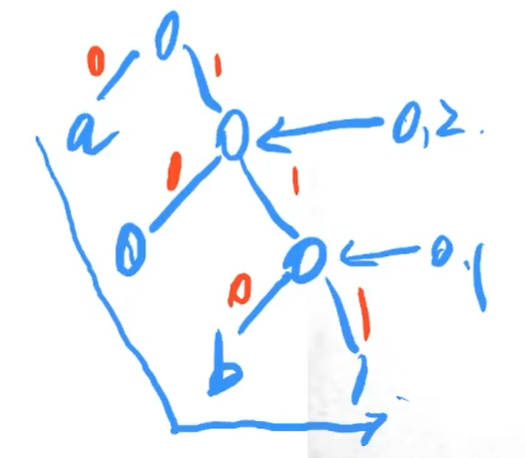
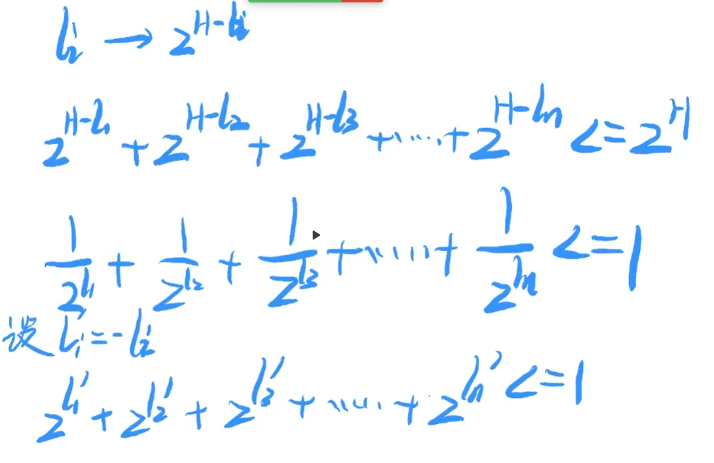
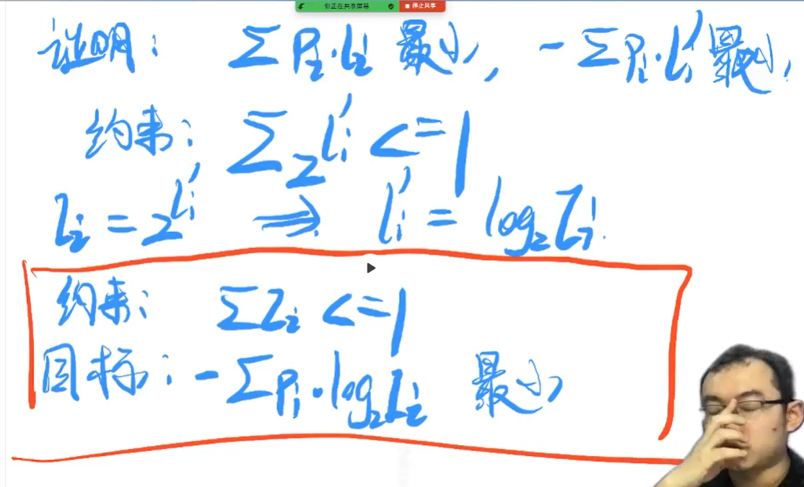
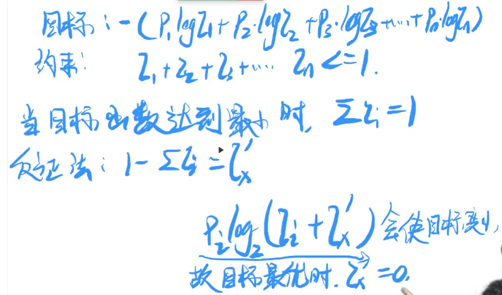
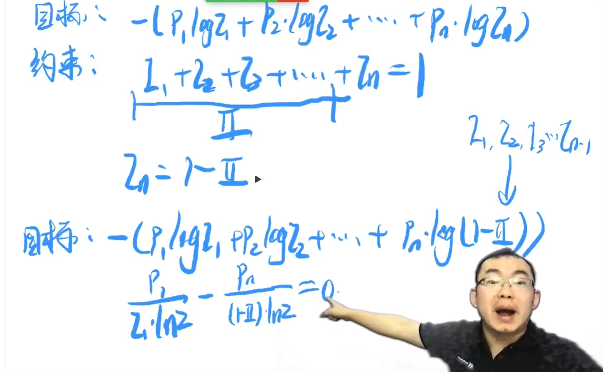
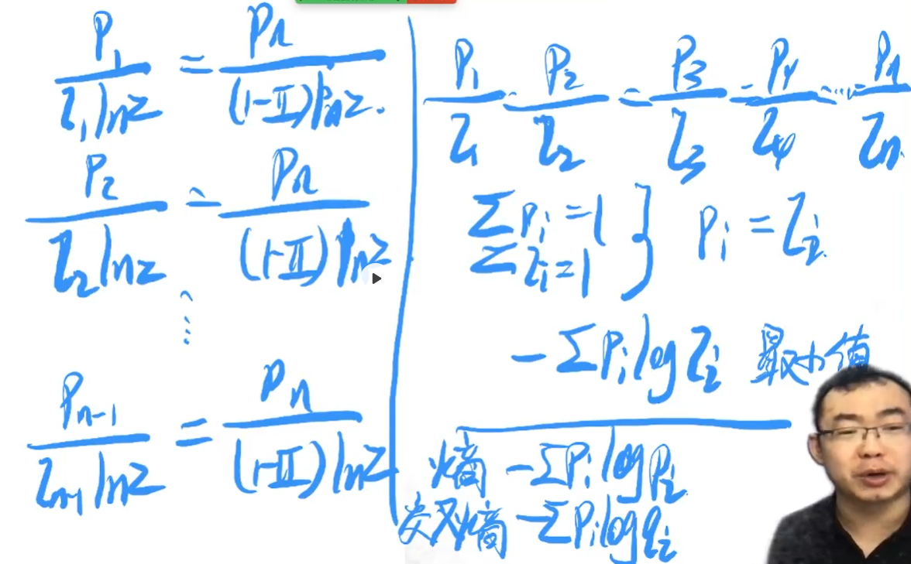

# 第三天（上）

## 哈夫曼树与哈夫曼编码（上）

## 一、课程节奏

1. 直观的了解哈弗曼树与哈弗曼编码
2. 证明：哈弗曼编码是最优的变长编码

## 二、前置知识

### 什么是编码

'a' = 97 = $(0110\ 0001)_2$

'0' = 48 = $(0011\ 0000)_2$

注意：任何信息，在计算机中，都是二进制存储的

编码作用 ： 把一段二进制映射为人类看得懂的字符！

信息："aa00" = $01100001、01100001、00110000、00110000$

一台计算机`传输到`另外一台计算机，传输 32 个比特位

假设：计算机的网络是 32bit/s。所以用时：1 s

特定场景：只有 a,b,0,1 四种字符需要传输

海贼班编码（自创）：a:00, b: 01, 0: 10, 1: 11

"aa00" = 00001010

在带宽不变的情况下，当前只需要传输 0.25s

### 定长与变长编码

1. `Ascii 编码` 和 `特定场景下的海贼班编码`，都属于`定长编码`（长度一定）
2. 对于每一个字符，编码`长度相同`，这就是`定长编码`
3. 【大家自行补充】UTF-8编码，是变长编码，UTF-16，是定长编码
4. 对于每一个字符，编码`长度不相同`，这就是`变长编码`
5. 将`定长编码`，看成是`变长编码`的`特例`
6. 变长编码，一定`不差于`定长编码

### 变长编码应用场景

特定场景：

1. 只有四种字符 : ab01
2. a: 0.8, b: 0.05, 0: 0.1, 1: 0.05

平均编码长度：

$l_i$：第 i 种字符，编码长度

$p_i$：第 i 种字符，出现概率

平均编码长度（期望值）：$avg(l) = \sum{l_i}\times{p_i}$

> 意义 ： 用于评估传输特定信息量所需要的比特位数量，数量越小越好。
>

假设，平均编码长度：1.16，估算传输100个字符，需要传输116个比特位

海贼班编码的平均编码长度：$avg(l) = 2\times\sum{p_i}=2$

> 定长编码的`平均编码`长度 = 定长编码的长度（定长）
>

新·海贼班编码：

a: 1

b: 01

0: 000

1: 001

> 设计`变长编码`的时候，前缀切记`不能重叠`！！！如： a : 1， b : 110，这个是不行的，因为b中读到第一个 1 的时候已经跟a 的编码符合，直接编码成 a 了读不到 b！！！

平均编码长度：$1*0.8+2*0.05+3*0.1+3*0.05=1.35$

100个字符，传输135个比特位

## 三、哈弗曼编码

1. 首先，`统计`得到`每一种`字符的`概率`
2. 将 `n 个`字符，建立成一棵`哈弗曼树`
3. 每一个字符，都落在`叶子结点`上
4. 按照`左0，右1`的形式，将编码读取出来

> 因为所有字符都落在`叶子节点`上，所以`没有`一个字符是另一个字符的`前缀`！

得到新编码：

a: 0 | b: 110 | 0: 10 | 1: 111

平均编码长度：$1*0.8+3*0.05+2*0.1+3*0.05=1.3$

结论：哈弗曼编码，是`最优的变长编码`

> 如果提到`变长编码`，就必须想到`哈夫曼编码`
>

## 四、公式证明（证明 $avg(l) = \sum{l_i}\times{p_i}$ 的值最小）

> 哈夫曼编码什么时候会`退化`成定长编码呢？
>
> 当所有字符的概率都一样的时候的就会退化成定长编码！所以定长编码能做的事情，哈夫曼编码一定能做到！

> 哈夫曼编码最优，优在平均编码长度

1. 首先表示平均编码长度，求解公式最优解
2. 最终，和熵与交叉熵之间的关系

 

