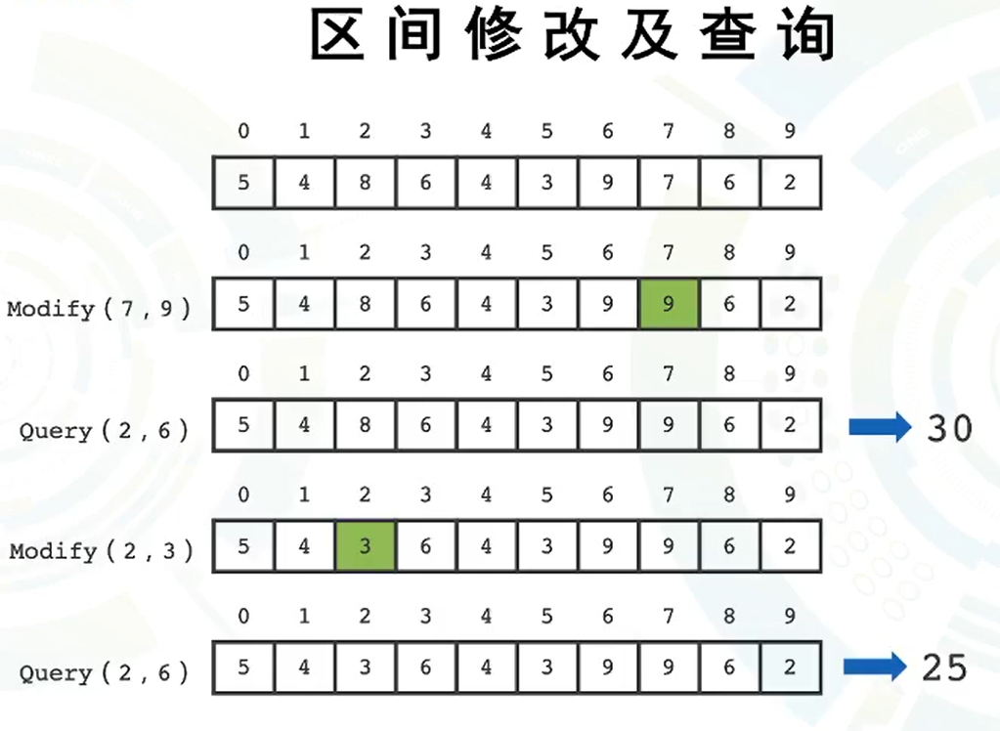
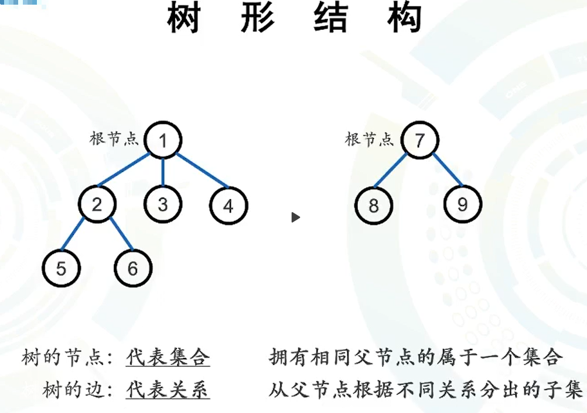
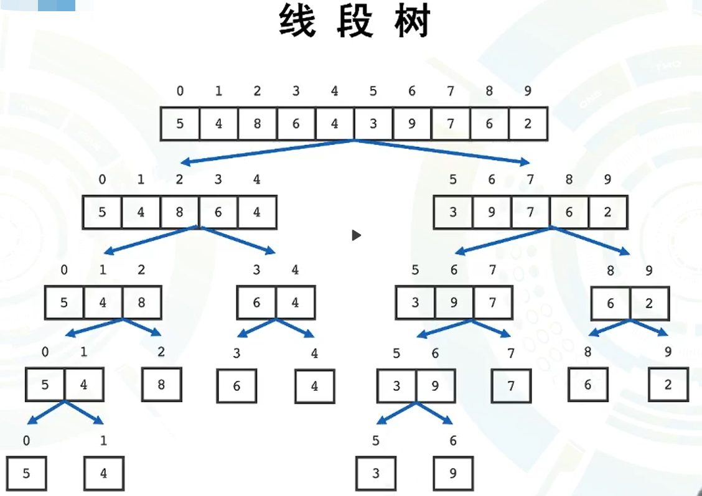
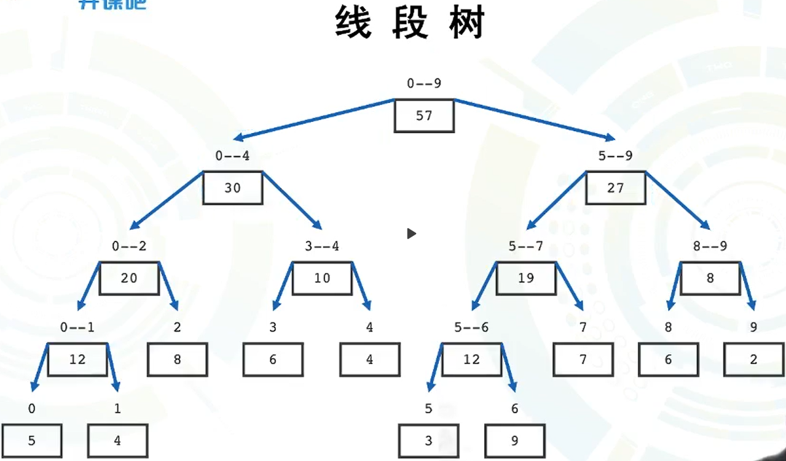
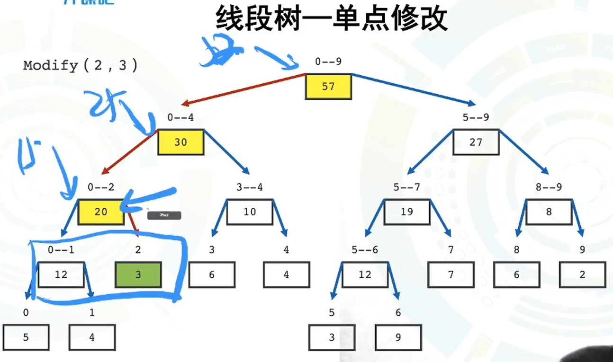
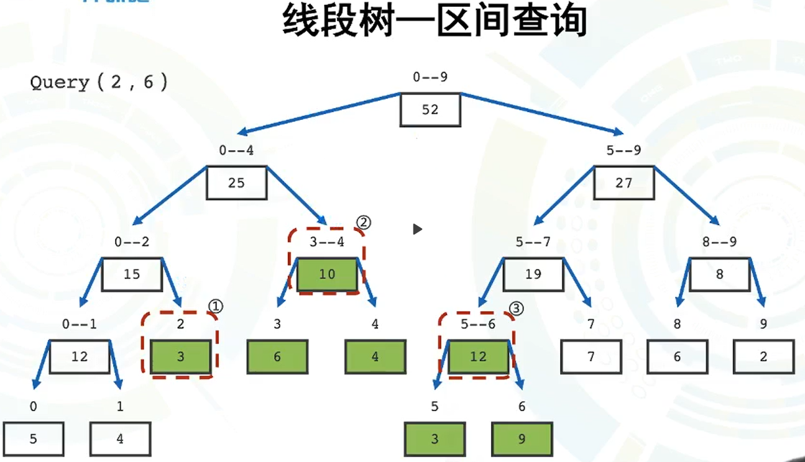
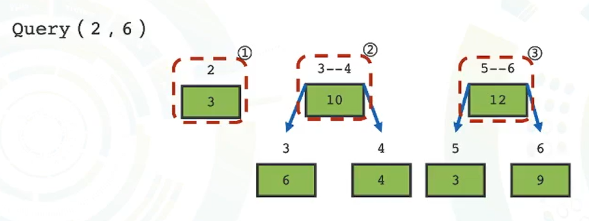
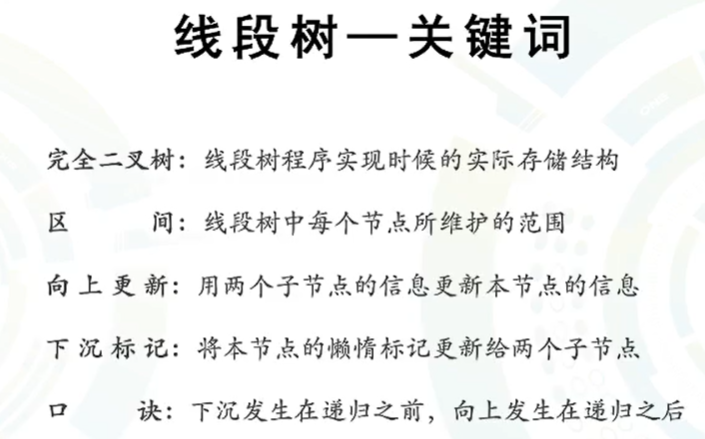

# 第三天（下）

# 线段树（面试笔记算法下）

## 一、问题背景（`奇性区间`的修改与查询）

1. `单点`修改，`区间`查询（基础版）
2. 区间修改，区间查询（进阶版）
3. 单点修改，单点查询（用不着线段树）
4. 区间修改，单点查询（是`第二种`情况的`特例`）



### 树形结构的复习



### 线段树 （求和值）： 



#### 拆分 （最简单的线段树）：



> 把一个大集合，通过`分治`的形式拆分成小集合，最后形成一棵树的形式，这棵树就叫`线段树`！

#### 单点修改操作 ：（时间复杂度（log(n) ））



- 先找到对应位置进行修改，然后在回溯过程中，把所有涉及到该位置的点都进行修改！

#### 区间查询（以和值为例）（时间复杂度（log(n) ））





- 某些节点代表了一个区间的所有点，比如红框里面的点，这样的话，查询效率会大大增加！

## 二、基础版线段树

1. 线段树是对于`一维序列`的一种`维护结构`
2. 采用的分治的思想，将总区间分成左右两部分，一直进行下去，直到区间中`只剩下一个节点`为止
3. 线段树的`叶子结点`，代表了原序列中的`单个位置`的值
4. 如果采用`完全二叉树`的存储结构的话，最起码需要 $4n$ 的存储空间
5. 当面对`区间修改`的时候，`基础版`的线段树效率上还`不如直接`在一维序列上`修改`，需要用“`下沉标记`”
6. 只适用于`单点修改，区间查询`

> 凡是父节点的值可以通过子节点得到的，都可以用线段树思想！
>



#### 代码演示：

​	

```c++
#include <iostream>
#include <cstdint>
#include <cstdio>
#include <algorithm>
#include <climits>
using namespace std;
#define Max_n 10000

struct {
    int max_num;
} tree[Max_n << 2];
int arr[Max_n + 5];

void update(int ind) {
    tree[ind].max_num = max(tree[ind << 1].max_num, tree[ind << 1 | 1].max_num);
    return;
}

void build_tree(int ind, int l, int r) {
    if (l == r) {
        tree[ind].max_num = arr[l];
        return;
    }
    int mid = (l + r) >> 1;
    build_tree(ind * 2, l, mid);
    build_tree(ind * 2 + 1, mid + 1, r);
    update(ind);
    return;
}

void modify(int ind, int l, int r, int k, int val) {
    if (l == r) {
        tree[ind].max_num = val;
        return;
    }
    int mid = (l + r) >> 1;
    if (k <= mid) {
        modify(ind << 1, l, mid, k, val);
    } else {
        modify(ind << 1 | 1, mid + 1, r, k, val);
    }
    update(ind);
    return;
}

int query(int ind, int l, int r, int x, int y) {
    if (l >= x && r <= y) {
        return tree[ind].max_num;
    }
    int ans = INT_MIN;
    int mid = (l + r) >> 1;
    if (mid >= x) {
        ans = max(ans, query(ind << 1, l, mid, x, y));
    }
    if (mid < y) {
        ans = max(ans, query(ind << 1 | 1, mid + 1, r, x, y));
    }
    return ans;
}

int main(){
    int n, m, a, b, c;
    scanf("%d%d", &n, &m);
    for (int i = 1; i <= n; i++) {
        scanf("%d", arr + i);
    }
    build_tree(1, 1, n);
    for (int i = 0; i < m; i++) {
        scanf("%d%d%d", &a, &b, &c);
        switch (a) {
            case 1 : modify(1, 1, n, b, c); break;
            case 2 : {
                if (b > c) {
                    cout << "-2147483648" << endl;
                    break;
                }
                printf("%d\n", query(1, 1, n, b, c));
            } break;
        }
    }
    return 0;
}
```

## 三、进阶版线段树

1. 优化掉了代码实现中的：l，r。区间变量
2. 可以用于区间更新，区间查询
3. 增加了懒标记，达到能够区间更新的目的
4. 懒标记是需要向下下沉的
5. 标记下沉发生在递归之前，向上更新发生在具有修改操作的递归之后

```c++
#include <iostream>
#include <cstdio>
#include <cstdlib>
#include <algorithm>
using namespace std;
#define Max_n 10000
#define define_mid long long mid = (l + r) >> 1

struct {
    long long sum;
    long long tag;
} tree[Max_n << 2];
long long arr[Max_n + 5];

void update(long long ind) {
    tree[ind].sum = tree[ind << 1].sum + tree[ind << 1 | 1].sum;
    return;
}

void down(long long ind, long long l, long long r) {
    if (tree[ind].tag) {
        long long val = tree[ind].tag;
        define_mid;
        tree[ind << 1].sum += val * (mid - l + 1);
        tree[ind << 1].tag += val;
        tree[ind << 1 | 1].sum += val * (r - mid);
        tree[ind << 1 | 1].tag += val;
        tree[ind].tag = 0;
    }
    return;
}

void build_tree(long long ind, long long l, long long r) {
    if (l == r) {
        tree[ind].sum = arr[l];
        return;
    }
    define_mid;
    build_tree(ind << 1, l, mid);
    build_tree(ind << 1 | 1, mid + 1, r);
    update(ind);
    return;
}

void modify(long long ind, long long l, long long r, long long x, long long y, long long val) {
    if (x <= l && r <= y) {
        tree[ind].sum += val * (r - l + 1);
        tree[ind].tag += val;
        return;
    }
    down(ind, l, r);
    define_mid;
    if (mid >= x) {
        modify(ind << 1, l, mid, x, y, val);
    }
    if (mid < y) {
        modify(ind << 1 | 1, mid + 1, r, x, y, val);
    }
    update(ind);
    return;
}

long long query(long long ind, long long l, long long r, long long x, long long y) {
    if (x <= l && r <= y) {
        return tree[ind].sum;
    }
    down(ind, l, r);
    define_mid;
    long long ans = 0;
    if (mid >= x) {
        ans += query(ind << 1, l, mid, x, y);
    }
    if (mid < y) {
        ans += query(ind << 1 | 1, mid + 1, r, x, y);
    }
    return ans;
}

int main(){
    long long n, m;
    scanf("%lld%lld", &n, &m);
    for (long long i = 1; i <= n; i++) {
        scanf("%lld", arr + i);
    }
    build_tree(1, 1, n);
    long long a, b, c, d;
    for (long long i = 0; i < m; i++) {
        scanf("%lld%lld%lld", &a, &b, &c);
        switch (a) {
            case 1 : {
                scanf("%lld", &d);
                modify(1, 1, n, b, c, d);
            } break;
            case 2 : {
                if (b > c) {
                    printf("0\n");
                    break;
                }
                printf("%lld\n", query(1, 1, n, b, c));
            } break;
        }
    }
    return 0;
}
```

