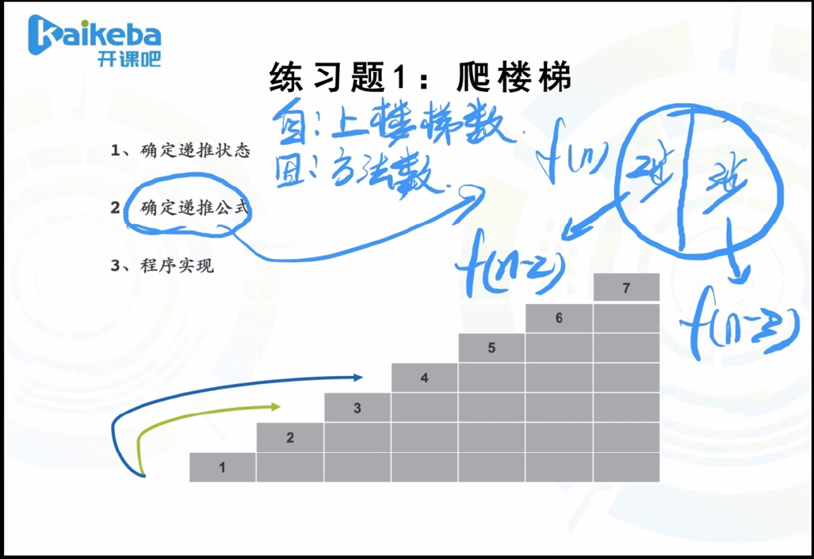
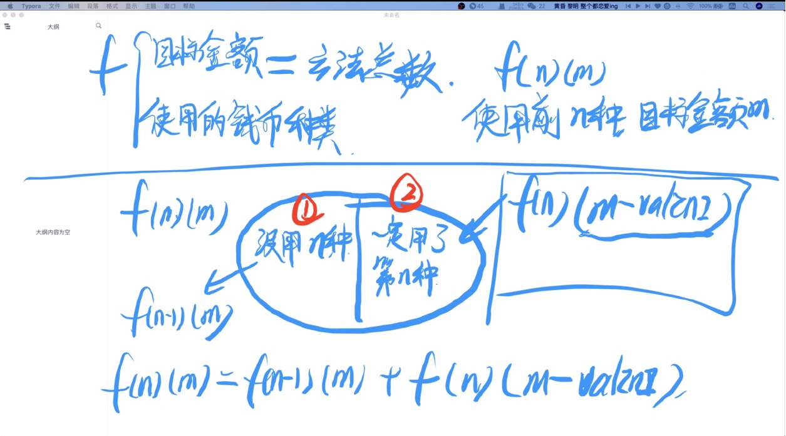
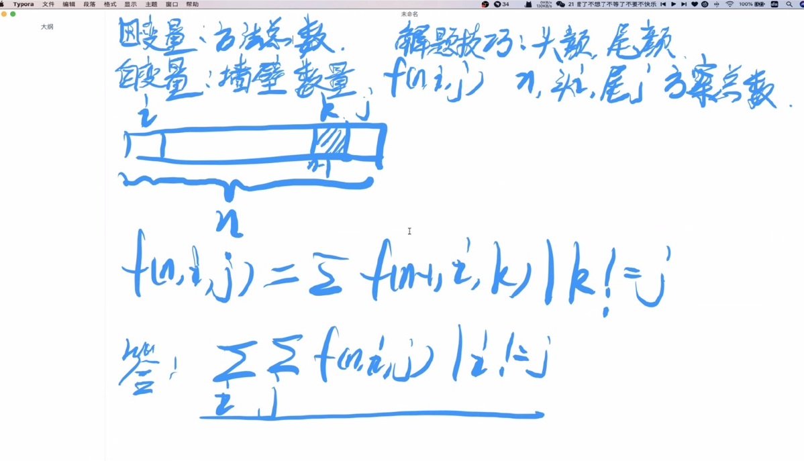
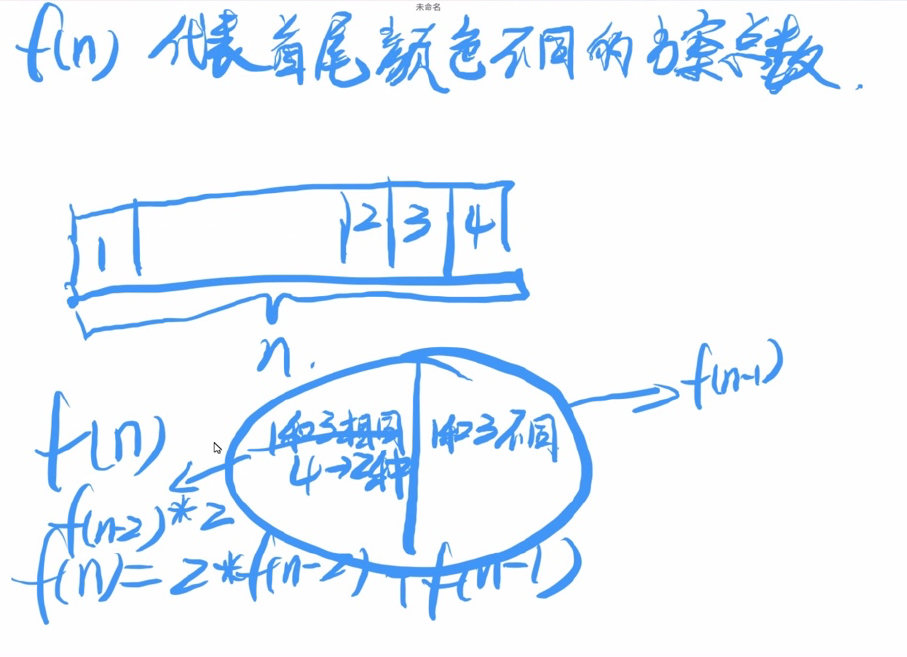

# 第四天（上）

## 从递推到动态规划（上）

[TOC]

## 一、递推问题的求解套路

1. 确定递推状态，一个数学符号 + 一个数学符号的语义解释
2. 确定递推状态，推导递推状态符号的自我表示方法
3. 程序实现，（递归+记忆化 / 循环实现）

### 确定递推状态

注意：这是学习递推问题的重中之重。学习确定递推状态的技巧。

$f(x) = y$

y：问题中的求解量，也是我们所谓的因变量

x：问题中直接影响求解量的部分，也是我们所谓的自变量

本质：就是寻找问题中的自变量与因变量

### 推导递推公式

本质：分析状态中的容斥关系

$f(n)=f(n-1)+f(n-2)$

$f(n-1)$，代表 n-1个月的兔子数量，恰巧等于第 n 个月的成年兔子数量

$f(n-2)$，代表 n-2个月的兔子数量，恰巧等于第 n 个月的幼年兔子数量

所谓的推导，就是推导上面的这两句话的内容

## 爬楼梯问题

### 状态定义

$f(n)$ 代表爬 n 节楼梯的方法总数

### 递推公式

$f(n)=f(n - 2) + f(n - 3)$

## 凑钱币问题

### 状态定义

$f(n, m)$ 代表用前 n 种钱币，拼凑 m 元钱的方案总数

### 递推公式

$f(n, m) = f(n - 1, m) + f(n, m - val[n])$

## 墙壁涂色

### 方法1

技巧：先按照非环情况做，保证所有方案之间，相邻墙壁颜色不同，最后再保证首尾颜色不同

#### 状态定义

$f(n, i, j)$ 代表 n 块墙壁，第一块涂颜色 i，最后一块涂颜色 j 的方案总数

#### 递推公式

$f(n, i, j) = \sum_{k}{f(n-1,i,k)}\ |\ k \ne j$

---

### 方法2

基于第一种做法，优化状态定义，忽略第一块的颜色

#### 状态定义

$f(n, j)$ 代表 n 块墙壁，第一块涂颜色 0，最后一块涂颜色 j 的方案总数

#### 递推公式

$f(n, j) = \sum_{k}{f(n-1,k)}\ |\ k \ne j$

---

### 方法3

单刀直入，直接定义状态，求什么定义什么

#### 状态定义

$f(n)$ 代表 n 块墙壁，首尾颜色不同的方法总数

#### 递推公式

$f(n) = f(n-1) + 2 \times f(n-2)$

