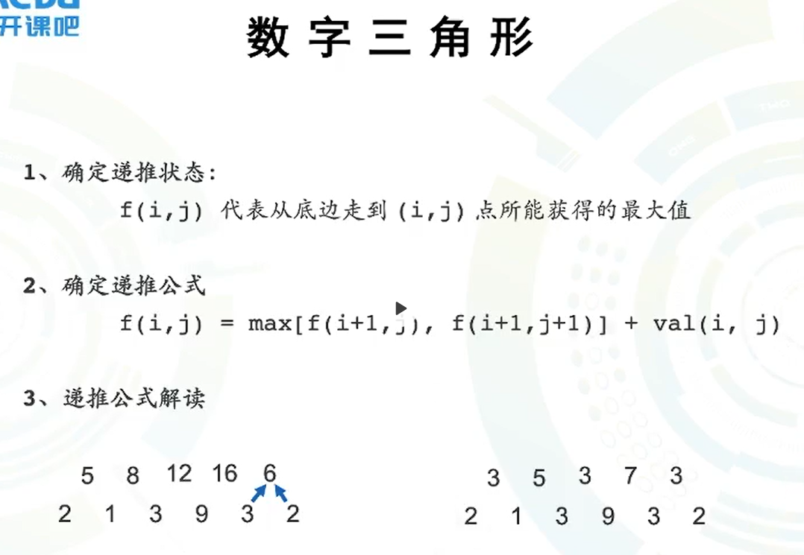
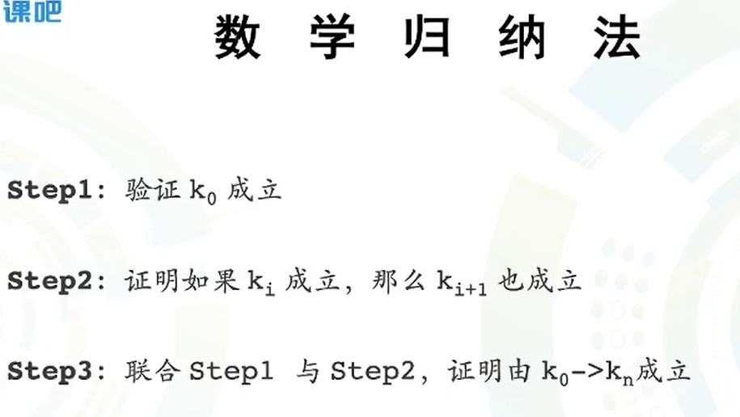
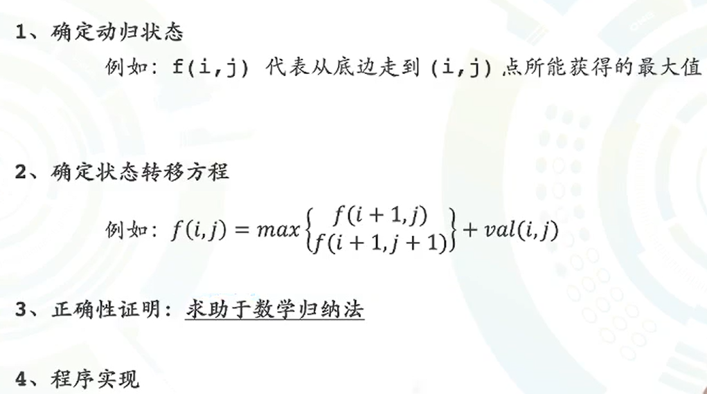
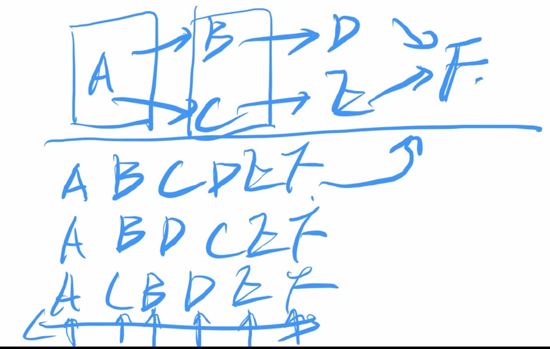
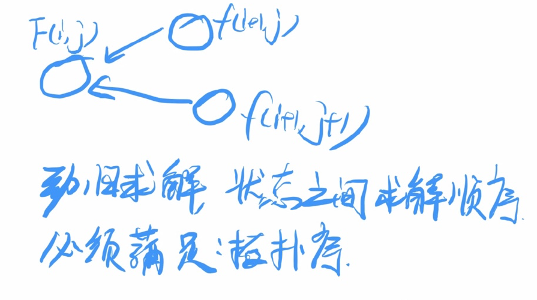
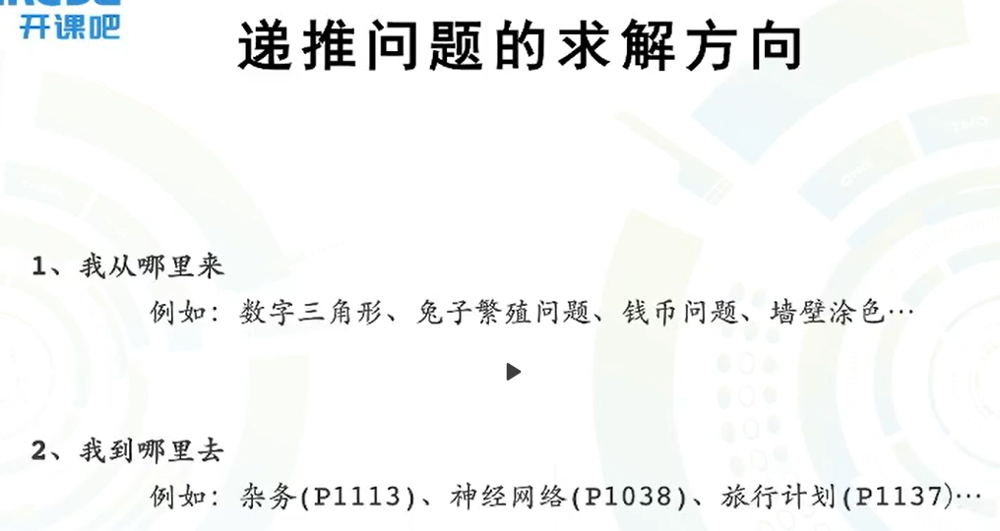
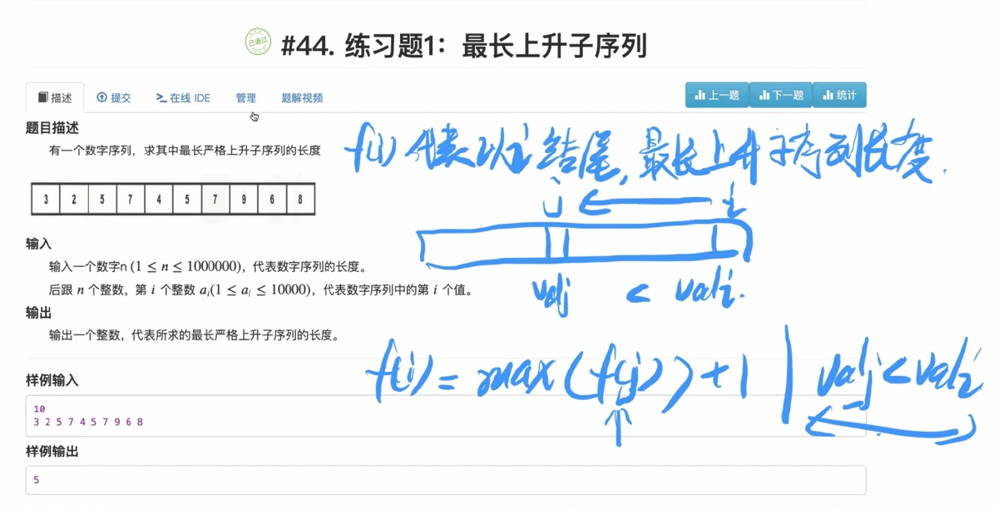
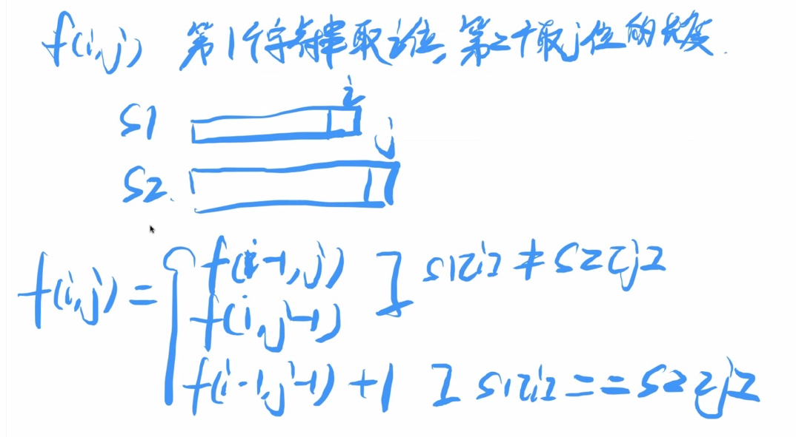

# 第四天（下）

## 从递推到动态规划（下）

[TOC]

## 一、数字三角形

### 惊人的发现

$f(i, j)$ 代表从底边走到 i, j 点的最大值

$f(i, j)$ 代表从顶点走到 i, j 点的最大值

1. 数学符号完全一致
2. 语义信息不同
3. 递归公式不同
4. 结论 ：`状态定义`非常`重要`！！
5. 结论：`数学符号`无法完全代表状态定义

> 递推问题`包含`动态规划问题！
>
> 动态规划问题，主要是求解`最优化问题`！也就是说，求`最值`的递推问题，可以称之为动态规划问题！

### 两种方法的对比（从下向上，从上向下）

本质：两种`状态定义`方式的对比

1. 第一种：`不用`做`边界判断`，最终结果，`直接存储`在 $f[0][0]$
2. 第二种：`需要做`边界判断，最终结果，`存储在一组数据`中
3. 结论：第一种要比第二种优秀

## 动态规划前期基础准备（数学归纳法）

## 二、动态规划问题的求解套路

1. 第一步：确定`动归状态`
2. 第二步：推导状态转移方程，理解：`转移、决策`
   1. 决策 ：max
   2. 转移 ：把所有能影响到 $ f(i,j) $ 的状态都列出来，方便决策！ 
3. 第三步：正确性证明，利用数学归纳法（`勤做`！）
4. 第四步：程序实现
5. 所谓的转移，把所有决定 $f(i, j)$ 最优值的状态，放入到决策过程中。

## 三、附加内容：拓扑序

`图形结构`是`最最抽象`的数据结构，必须理解成`思维逻辑结构`

1. 拓扑序是一种图形结构上的依赖顺序，一个图的`拓扑序不唯一`
2. 拓扑序的本质作用：是把`图形结构`上变成一个`一维序列`（即前提条件在前，当前条件在后）
3. 图形结构`不能`用`循环遍历`的，`一维序列可以`（类似于堆，优先队列）
4. 所有递推问题（动态规划）中的`状态更新过`程，本质上`满足拓扑序`

- 我从哪里来 ： 用别人更新自己（之前写的大部分递推都是用这个方法）
- 我到哪里去 ： 用自己去更新别人
- p ： 洛谷题目

## 四、最长上升子序列

### 状态定义

$f(i)$ 代表以为 i 为结尾的，最长上升子序列的长度

### 状态转移方程

$f(i) = max\left\{f(j)\right\} + 1 | j < i, val[j] < val[i]$

状态转移的时间复杂度：$O(n^2)$

后续重点：优化转移过程

## 五、最长公共子序列

### 状态定义

$f(i,j)$ 代表第一个字符串取前 i 位，第二个字符串取前 j 位的，最长公共子序列的长度

### 状态转移方程

$f(i,j) = \left\{\begin{aligned} & max[f(i - 1, j), f(i, j - 1)] &val(i) \neq val(j)\\ & f(i - 1, j - 1) &val(i) = val(j)\end{aligned} \right.$

状态转移的时间复杂度：$O(n \times m)$

学习的重点：注意到，参与决策的状态数量，是会根据条件不同而改变的

## 六、课后作业题

1. **[HZOJ46-切割回文](http://oj.haizeix.com/problem/46)**
2. **[HZOJ47-0/1背包](http://oj.haizeix.com/problem/47)**
3. **[HZOJ48-完全背包](http://oj.haizeix.com/problem/48)**
4. **[HZOJ49-多重背包](http://oj.haizeix.com/problem/49)**

