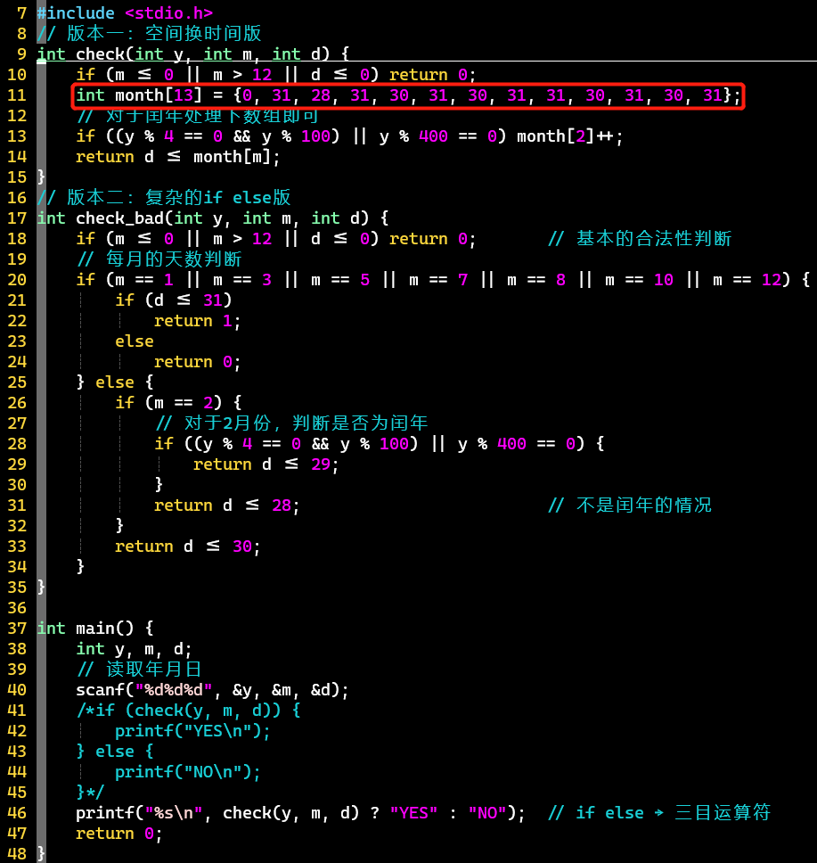

# 2. 开启vim下的编程之旅

## 使用vim编写程序

- 保存文件并退出：:wq、ZZ
- 在Linux中，一切皆文件
  - 可执行程序a.out本质也是文件，二进制文件
- .cpp文件里可以写C代码，但反过来不行（.c文件里写C++代码）
  - 注意：C11标准下的一些宏不被C++兼容

## C语言编程规范

- 国内主流编码规范：ali + google、baidu + google。参考[Google C++编程风格指南](https://zh-google-styleguide.readthedocs.io/en/latest/google-cpp-styleguide/contents/)
- PS：
  - 两个函数之间要留白：一个空行即可
  - 一般采用[大小驼峰命名规范](https://www.wikiwand.com/zh-cn/駝峰式大小寫#/格式)：MyName(大)、myName(小)


## 如何进行程序debug

- 常识：程序默认以main()函数作为入口
- 函数封装：函数定义完，函数调用了吗？
- 编译报错时：自上而下找错、debug
- 与预期不符：尝试使用printf输出变量值


## 海贼OJ的使用及编程提升

- 先刷[HZOJ-入门组](http://oj.haizeix.com/training-ground)
- 小练习👇


## [HZOJ-69](http://oj.haizeix.com/problem/69)：开学考试2：日期判断


**样例输入**

```c++
1991 1 30
1991 1 32
复制代码
```

**样例输出**

```c++
Yes
No
复制代码
```

- 思路
  - 判断非法的输入、月份天数是否合理（闰年）
  - 两个版本
    - 复杂的if else判断：疯狂嵌套
    - 空间换时间：创建月份天数数组
- 代码
  - 
  - 版本一
    - 关键就在数组的使用
    - 三目运算符不是判断语句，不会有分支预测问题
  - 版本二
    - 可读性低
    - 逻辑复杂、易出bug
    - 考虑分支预测问题-预加载过程，效率低
      - 参考[《C语言与提升》——3 程序流程控制方法——CPU的分支预测](https://doublelll3.ml/ct_3_程序流程控制方法/#cpu的分支预测)


## 素数问题的思考

- 密码学和素数相关
- 详见[《C语言与提升》——5.数组与预处理命令——素数筛、线性筛](https://doublelll3.ml/ct_5_数组与⭐预处理命令/#素数筛)以及[代码演示](https://doublelll3.ml/ct_5_数组与⭐预处理命令/#素数筛-2)部分