# 9.数据提取、链接、线性筛

## 数据提取操作

| 命令  | 功能             | 命令  | 功能                 |
| :---: | :--------------- | :---: | :------------------- |
|  cut  | 切分             | grep  | 检索                 |
| sort  | 排序             |  wc   | 统计字符、字数、行数 |
| uniq  | 去重             |  tee  | 双向重定向           |
| split | 文件切分         | xargs | 参数代换             |
|  tr   | 替换、压缩、删除 |       |                      |

### cut

——菜刀

- -d c 以字符c分割
  - 可用""或''包围c，很灵活
  - 默认为空格
- -f [n/n-/n-m/-m] 选择第n块 / 第n-end块 / 第n-m块 / 第1-m块
- -b [n-/n-m/-m] 字节
- -c [n-/n-m/-m] 字符

### grep

常见操作见：tldr grep

- -c 统计搜寻到的次数 [文件为单位]
- -n 顺序输出所在行号
- -v 输出不匹配的 [补集]
- -C 3 输出附近3行的内容
- -i 大小写敏感
- [PS] -n、-c冲突，优先显示-c结果
- 示例
  - 统计路径下包含doubleliu3的行数
    - 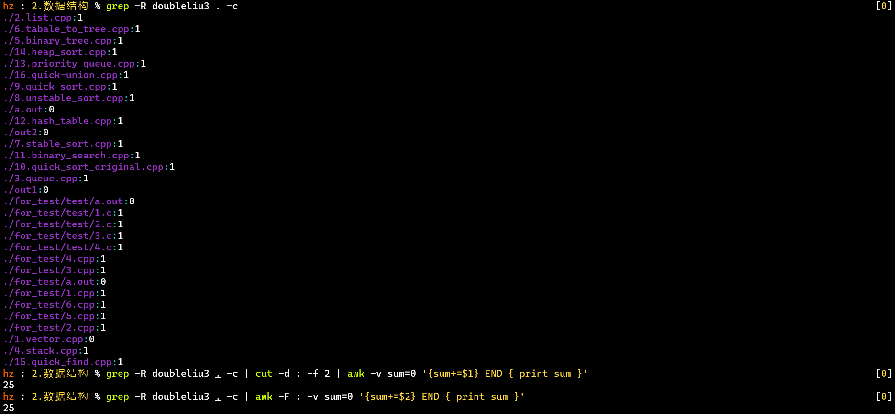
    - 使用cut+awk或直接使用awk
  - 查看hz相关正在运行的进程
    - 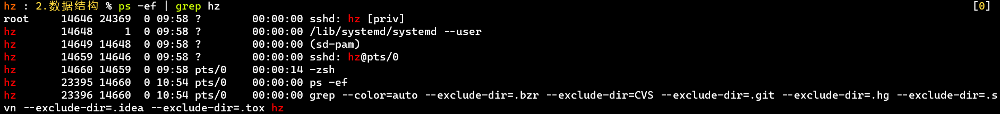
    - ps -ef：类似Linux下的任务管理器
    - 相比，ps -aux显示的信息更多，在早期偏向UNIX系统
    - [PS] ps -ef中，PPID是父进程的ID

### sort

类似Excel的排序功能，默认根据行首按ASCII码排序

- -t 分隔符，默认为TAB
- -k 以哪个区间排序
- -n 纯数字排序
- -r 反向排序
- -u uniq [但不方便计数]
- -f 忽略大小写 [默认]；-V [不忽略大小写]

【示例】将用户信息根据uid按纯数字排序

```shell
cat /etc/passwd | sort -t : -k 3 -n
```

【经测试】

- 排序时默认
- 省略了特殊符号，如下划线"_"、"*"、"/"等
- 还忽略大小写，排好序后把小写放在大写前面 [-V 可以不忽略大小写]

### wc

- -l 行数
- -w 字数
- -m 字符数；-c 字节数

【示例】

① 最近登录系统的总次数

```shell
last | grep -v "^$" | grep -v "begins" | wc -l
```

② PATH路径的相关统计：字符数、单词数、变量数、取最后一个变量
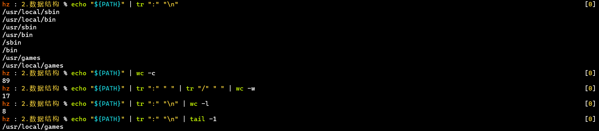

### uniq

连续的重复的才算重复，一般与sort配合

- -i 忽略大小写
- -c 计数

【示例】统计最近用户的登录次数，根据次数从大到小排序

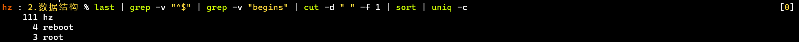

### tee

既显示在终端，又写进文件

- 默认覆盖原文件
- -a 追加不覆盖

【示例】

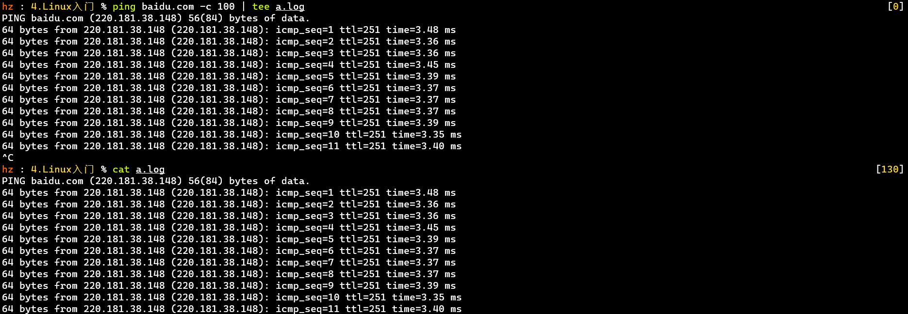

### split

切分一个文件，适合处理大文件

- -l num 按num行切分
- -b size 按size大小切分，512 [默认byte]、512k、512m
  - 可能存在首行、末行不完整，所以可用下面方式👇
  - ❗ -C size 按最多size大小切分，并保证不破坏行数据！
- -n num 按大小平分成num份

【示例】将/etc下的文件列表每20行切分出一个文件

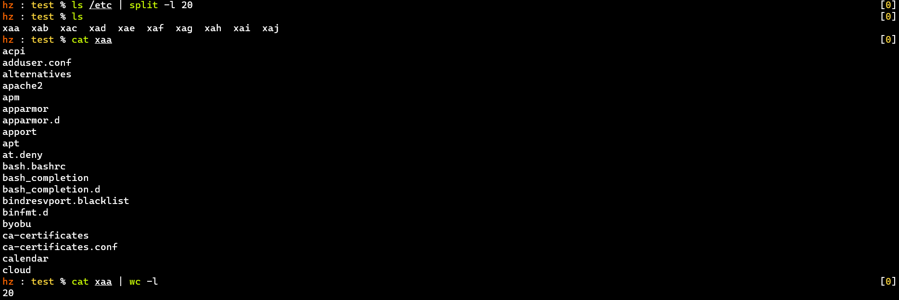

### xargs

参数代换，适合不接收标准输入的命令，等价于用命令替换符的方式

- -exxx 读到"xxx"结束

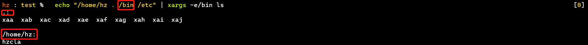

- -p 执行整个指令前询问
- -n num 指定每次接收的参数个数⭐，而不是一次性全部传入
  - 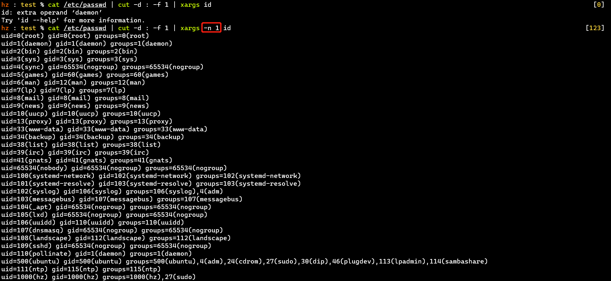
  - 适合只能读一个参数的命令 [如id] 或相关场景

### tr

对标准输入的字符替换、压缩、删除，可查看tldr tr

tr [选项] <字符/字符集1> <字符/字符集2>

- 默认替换字符集1👉字符集2，一一对应
  - 字符集1较字符集2多出的字符，以字符集2最后一个字符作为替换
- -c 替换所有不属于字符集1的字符👉字符2
- -s 压缩，将连续重复的字符1👉一个字符1 【❗与-c搭配时看字符2】
- -d 删除所有属于字符集1的字符
- -t 先删除字符集1中较字符集2多出的字符，再一一对应替换【❗ 注意与默认方式的区别】

【示例】

①简单使用

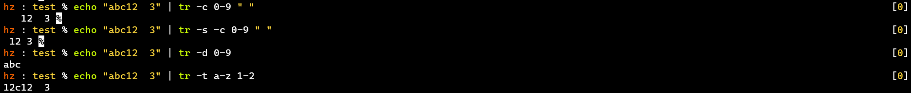

- -s也需要参数，与-c搭配时默认用字符2
- -t只管一一对应了的字符，字符集1比字符集2多出的字符不管

②词频统计

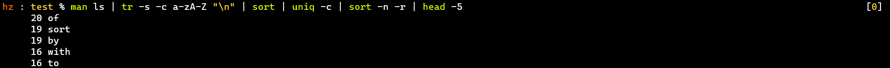

- tr替换👉排序👉去重计数👉排序👉显示前几名

## 软、硬连接

——硬连接可以减少存储使用，软连接多了一个inode和block

【背景介绍】

- ext4文件系统——三个组成部分——inode、block、superblock
- inode：文件结点
  - 一个inode对应一个文件
  - 存储文件信息 [文件权限、所属者、时间...]和文件真实位置 [blocks位置]
  - 如果存不下blocks位置，会用多级blocks
- block：文件真实存放位置，一个block一般是 4096 bytes
- superblock：至少两个，存储文件系统的整体信息 [如inode、block...]

【硬连接】相当于一个别名

- 与原文件拥有相同的inode
- 文件的连接数>1
- [PS]
  - 删除别名不影响原文件
  - 当前目录和父目录都是硬连接
  - 硬连接不支持目录，可能存在死循环等问题，参考：
    - [Why are hard links to directories not allowed in UNIX/Linux?](https://unix.stackexchange.com/questions/22394/why-are-hard-links-to-directories-not-allowed-in-unix-linux)——StackExchange
    - [Why are hard links not allowed for directories?](https://askubuntu.com/questions/210741/why-are-hard-links-not-allowed-for-directories)——StackExchange
    - [linux为什么不能硬链接目录？](https://www.zhihu.com/question/50223526)——知乎

【软连接】相当于一个快捷方式

- 创建了一个新的文件，拥有自己的inode，指向一个block [存储文件的真实位置]
- 文件类型为link
- [PS] 比硬连接更常用

## 线性筛

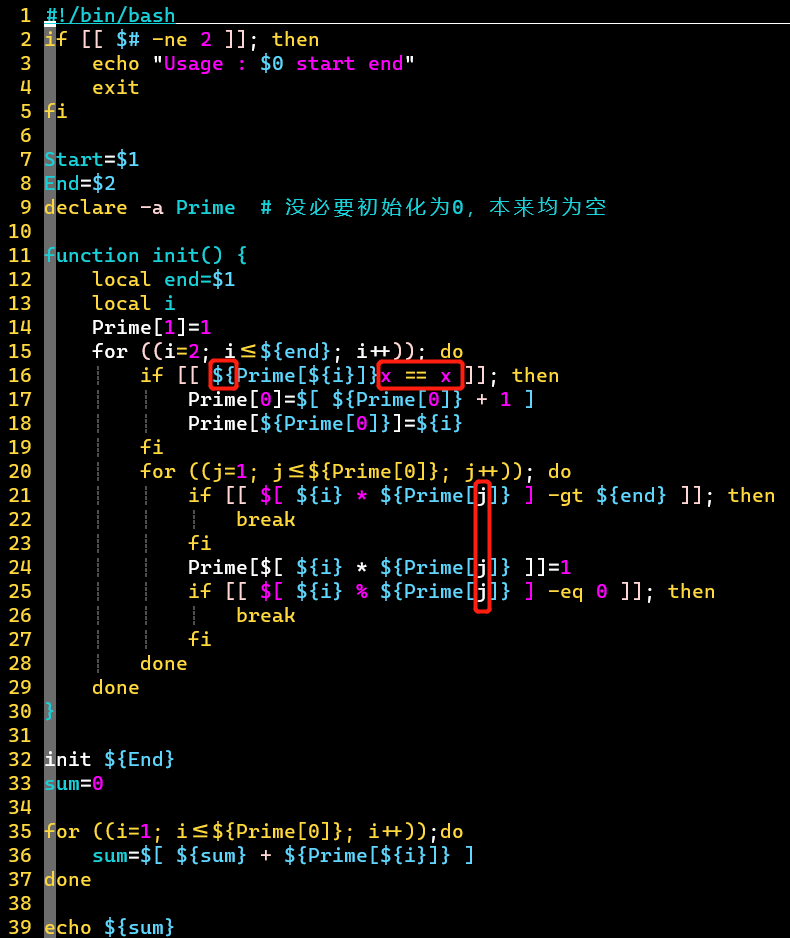

- shell中的数组没必要初始化，一开始就为空
  - 其实不管什么变量，一开始都是空，没有类型
- 学会【变量x == x】的判空操作
- 判空操作，其实可以用【【 -z  ${Prime{${i}}}】】来判断
- 数组的下标可以直接使用变量名，可以不用${}包裹

【与素数筛的效果比较】

求2~20000的素数和

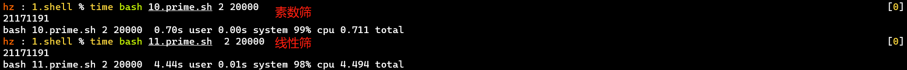

- 在shell中，效果还没有素数筛好，可能原因是：
  - shell涉及很多系统的调用，不能纯看数学层面了
  - 执行shell脚本会把CPU跑满，与C语言中的效果不具有可比性
  - 取余操作

## ➕SED 脚本编辑

主要用于编辑脚本，语法可借鉴vim

【常用操作】替换[批量、按行、匹配]、删除

```shell
# 替换每行匹配的第一个字符串模式 [支持正则表达式]
sed 's/{{regex}}/{{replace}}/' {{filename}}
# 替换匹配的行的第一个字符串、删除匹配的行
sed '/{{line_pattern}}/s/{{regex}}/{{replace}}/' {{filename}}
sed '/{{line_pattern}}/d' {{filename}}
# 可以使用其它分割符，比如'#'，应对需要用到'/'字符的场景
sed 's#{{regex}}#{{replace}}#' {{filename}}
# 删除两个匹配模式之间的所有行
sed '/{{regex}}/,/{{regex}}/d' {{filename}}
# [特殊]删除匹配行之后/之前的内容
sed '/{{regex}}/,$d' {{filename}}
sed '/{{regex}}/,$!d' {{filename}}
复制代码
```

- sed -i 将修改写入文件
- sed '.../g' 末尾添加 g 可全局操作
- sed '.../d' 末尾为 d 为删除操作
- sed '/.../,/...' 逗号可用来匹配两个模式 [匹配一个段落]
  - 参考[使用sed删除两个匹配模式之间的所有行？](https://cloud.tencent.com/developer/ask/182165)——腾讯云社区

【命令演示】

① 上述常用命令按顺序操作

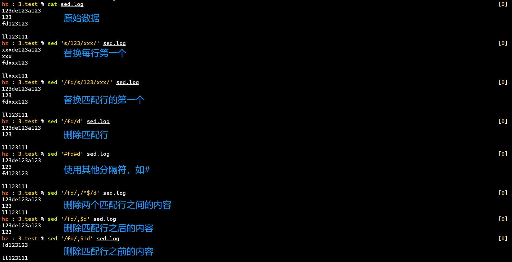

② 用于替换配置文件的某些配置

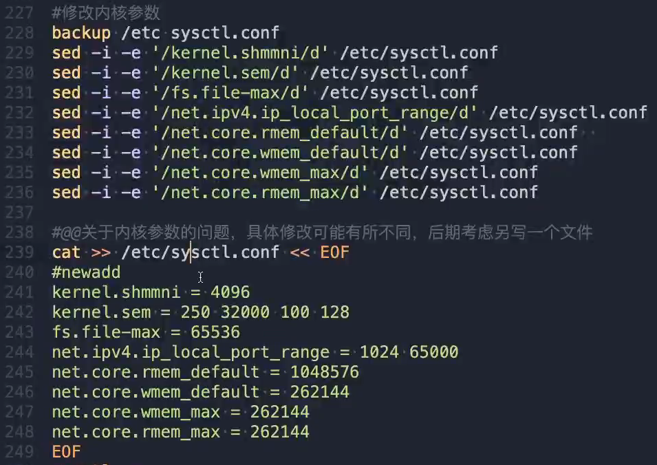

- 删除 👉 添加
- 删除前做备份
- 添加时加入标识符#newadd，方便之后用sed操作
- 直接删除再添加，而不是替换，避免繁琐的模式匹配 [参数值]

# 随堂练习

1. 求字符串中所有数字之和："1 2 3 4 5 6 7 9 a v 你好 . /8"
2. 将文件中所有大写字母转换为小写：echo "ABCefg" >> test.log
3. 找到`PATH`变量中的最后一个路径
4. 使用`last`命令，输出所有的重启信息
5. 将`/etc/passwd`中的内容按照用户名排序
6. 将`/etc/passwd`中的内容按`uid`排序
7. 在云主机上查找近2个月系统登录用户的总人次
8. 将云主机中近2个月登录的所有用户名，按照次数排序，并输出次数
9. 将本地的`/etc`目录下的文件及目录名，每十条保存到一个文件中
10. 将`/etc/passwd`中存放的第10到20个用户，输出`uid`、`gid`和`groups`
11. 按照用户名查看`/etc/passwd`中的用户，读到`'sync'`用户时结束，并输出用户的`uid`、`gid`和`groups`
12. 词频统计

① 使用下面的命令生成一个文本文件test.txt

```shell
cat >> test.txt << xxx
nihao hello hello 你好 
nihao
hello 
ls
cd
world
pwd
xxx
复制代码
```

② 统计a.txt中各词的词频，并按照从大到小的顺序输出。
**答案**

```shell
【1】
[巧妙解法，需在bash下]
echo "1 2 3 4 5 6 7 9 a v 你好 . /8" | tr -s -c 0-9 "\n" | echo $[`tr "\n" "+"`0]
[for循环]
sum=0
for i in `echo "1 2 3 4 5 6 7 9 a v 你好 . /8" | tr -s -c 0-9 "\n"`; do
for> sum=$[$sum+$i]
for> done
[awk解法1]
echo "1 2 3 4 5 6 7 9 a v 你好 . /8" | tr -s -c 0-9 "\n" | awk -v sum=0 '{sum += $1} END { print sum }'
[awk解法2]
echo "1 2 3 4 5 6 7 9 a v 你好 . /8" | tr -s -c 0-9 " " | awk -v sum=0 '{for (i = 1; i <= NF; i++) {sum += $i} } END{print sum}'
【2】 cat test.log | tr A-Z a-z > test.log
【3】 echo ${PATH} | tr ":" "\n" | tail -1
【4】 last | grep "reboot"
【5】 cat /etc/passwd | sort
【6】 cat /etc/passwd | sort -t : -k 3 -n
【7】 last -f /var/log/wtmp.1 -f /var/log/wtmp | grep -v "^$" | grep -v "begins" | grep -v "reboot" | grep -v "shutdown" | wc -l
【8】 last -f /var/log/wtmp.1 -f /var/log/wtmp | grep -v "^$" | grep -v "begins" | grep -v "reboot" | grep -v "shutdown" | cut -d " " -f 1 | sort | uniq -c | sort -n -r
【9】 ls /etc | split -l 10
【10】 cat /etc/passwd | head -20 | tail -10 | cut -d : -f 1 | xargs -n 1 id
【11】 cat /etc/passwd | cut -d : -f 1 | xargs -e"sync" -n 1 id
【12】
cat test.txt | tr -s " " "\n" | sort | uniq -c | sort -n -r
[如果想让词在前、次数在后，使用awk颠倒]
cat test.txt | tr -s " " "\n" | sort | uniq -c | sort -n -r | awk '{print $2, $1}'
复制代码
```

# Tips

- 面试常考：词频统计
  - 
  - tr替换👉排序👉去重计数👉排序👉显示前几名