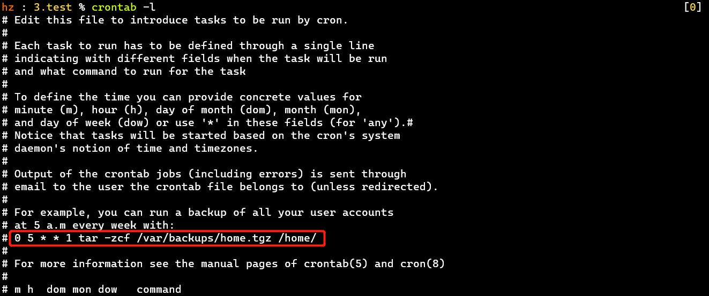
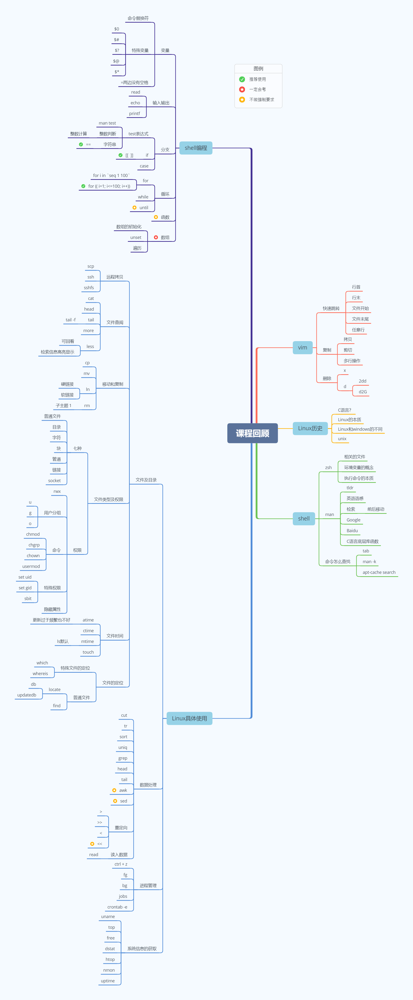

# 10.复习

- ## [vim基本使用](https://doublelll3.ml/Linux、vim常用命令/)

  - 快速跳转
    - 行首：0 [^ 有效行首]
    - 行末：$
    - 文件开始：gg
    - 文件末尾：G
    - 任意行：12G——跳转到12行
  - 复制
    - 拷贝
    - 剪切
    - 多行操作
  - 删除
    - x：删除一个字符
    - d
      - 2dd：从当前行删除2行
      - d2G：删除第2行到当前行

  ## [Linux历史](https://doublelll3.ml/lnxrm_1_揭开Linux操作的神秘面纱/#操作系统简介)

  - C语言：怎么来的？和系统结合的紧密性？
  - Linux本质 [Linux通常指的是Linux内核、Linux操作系统]
  - Linux和Windows的不同 [Linux早期对使用者的态度：会的都说好，不会的你随意]
  - Unix [MacOS；谷歌提出了云计算后，Unix系统的厂家基本只剩苹果了]

  ## Shell

  - zsh
    - [相关文件](https://doublelll3.ml/lnxrm_5_基本系统/#shell)
    - 环境变量的概念：存在shell进程中
    - 执行命令的本质：大部分是执行文件，开一个子进程 [保证命令间不干扰]，运行完子进程结束，返回结果
  - man
    - 简约版：tldr
    - 英语语感
    - 检索：前后移动——N/n
    - C语言底层库函数
    - 搜索引擎 [Google 英语搜索]：提升自己的信息处理能力
  - 命令怎么查找
    - tab [zsh提供]
    - man -k [-f：基于明确的单词搜索]
    - apt search [apt-cache search]

  ## Linux具体使用

  - 文件及目录

    - 远程拷贝
      - scp [基于ssh->基于tcp]
      - sshfs [基于ssh、远程文件系统]：可以将远程服务器的目录挂载到本地
        - 可应用于嵌入式开发过程
    - 文件查阅
      - cat
      - head
      - tail
        - -f：可查看动态更新的文件，一直读文件末尾，用来监控日志 [会阻塞]
      - more
      - less [比more更友好]
        - 可回看
        - 检索时高亮显示
    - 移动、复制
      - cp、mv
      - ln
        - 硬连接
        - 软连接：删除软连接时一定要小心，名字后别多加/ [会进入到目录]
          - [PS] Python结束对2的支持；Python的版本切换只需更改软连接即可
      - rm：可封装成mv + 定时清理
    - 文件类型及权限
      - 7种
        - 普通文件
        - 目录：大小一般为4K，够用
        - 字符：基于网络、串口-->键盘、鼠标
        - 块：block，存储设备
        - 管道 [更多的情况是父进程生两个孩子，中间建立管道]
        - 链接
        - socket
      - 权限
        - rwx
          - x对于目录表示可进入
        - 用户分组：u、g、o
        - 命令
          - chmod、chgrp、chown
          - usermod：针对用户
        - 特殊权限
          - set uid：拥有尚方宝剑的人就有权利
          - set gid：到了某个地方就有特定的身份
          - sbit：黏着位，只有文件所属者有删除权限
        - 隐藏属性
    - 文件时间
      - atime[访问]：更新过于频繁不好，可以通过设置隐藏属性不更新
      - ctime[修改权限]
      - mtime[修改内容]：ls默认显示的
      - touch
      - 站得越高，越需要考虑磁盘的寿命 [损耗、电费]
    - 文件定位
      - 特殊文件的定位
        - which
        - whereis
      - 普通文件
        - locate：基于数据库db，实时需要updatedb [使用场景少]
        - find

  - 数据处理

    [适于将来工作]

    - cut、tr、sort、uniq、grep、head、tail
    - 重定向：>、>>、<
    - read：读入数据 [注意输入数据的格式]

  - 进程管理

    - ctrl + z
    - fg
    - bg
    - jobs
    - crontab -e/-l [应该会，会看任务的格式]

  - 系统信息的获取

    [试试即可]

    - uname、top、free、dstat、htop、nmon、uptime

  ## [Shell编程](https://doublelll3.ml/lnxrm_7_Shell编程基础/)

  - 变量

    - 命令替换符：``
    - 特殊变量：0、0、#、?、?、@、$*
    - ❗ =两边没有空格

  - 输入输出

    - read
    - echo
    - printf

  - 分支

    - test表达式
      - man test
      - 整数判断：整数计算$[] （还有expr、let，能记住一个即可）
      - 字符串：== 🆒
    - if：[[ ]] 🆒
    - case

  - 循环

    - for
      - for i in `seq 1 100` --> seq需被系统不停地调用
      - for ((i=1; i<=100; i++)) 🆒效率更高
    - while [一般用 while 1]
    - until [一般不用]

  - 函数 [简单程序一般不需要]

  - 数组

    ⭐

    - 数组的初始化 [可有可无；没初始化就为空；初始化耗时]
    - unset
    - 遍历
    - $变量

  ⭐[PS][素数筛](https://doublelll3.ml/lnxrm_7_Shell编程基础/#素数筛)、[线性筛](https://doublelll3.ml/lnxrm_9_数据提取、软硬连接、线性筛、SED/#线性筛)必考！

  # Tips

  - 考试包含全英文题

  # 附：思维导图

  【宿船长出品】

  