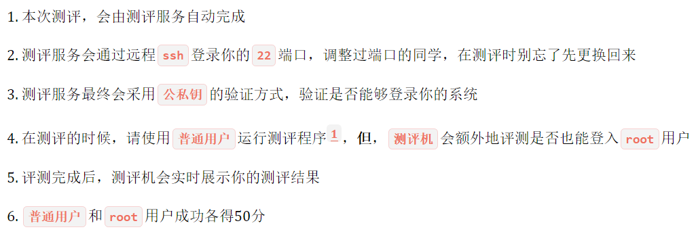
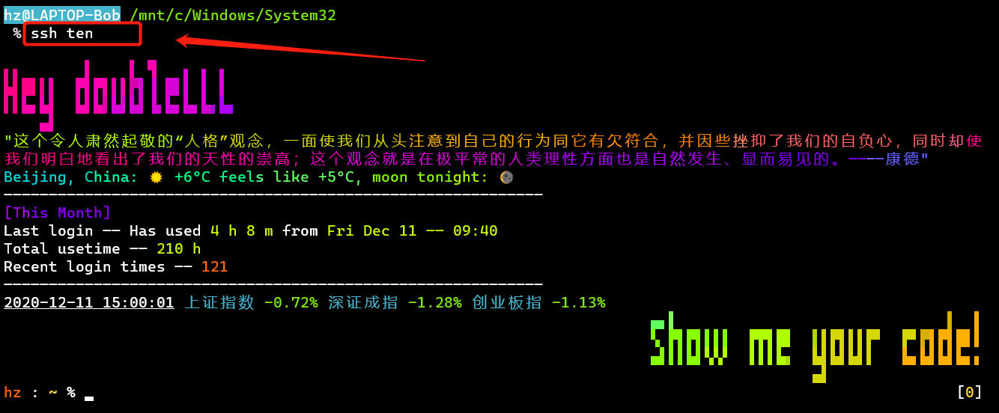
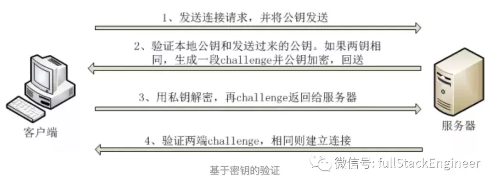
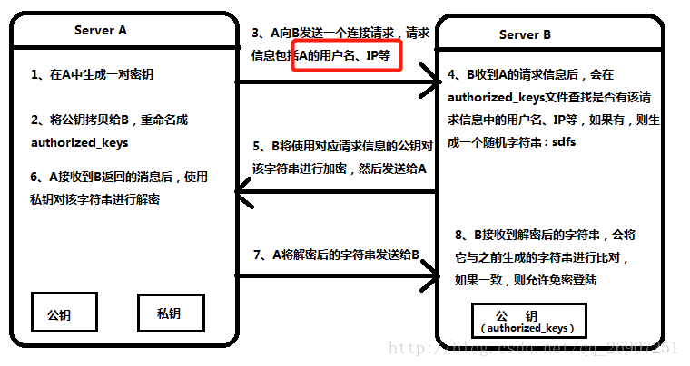
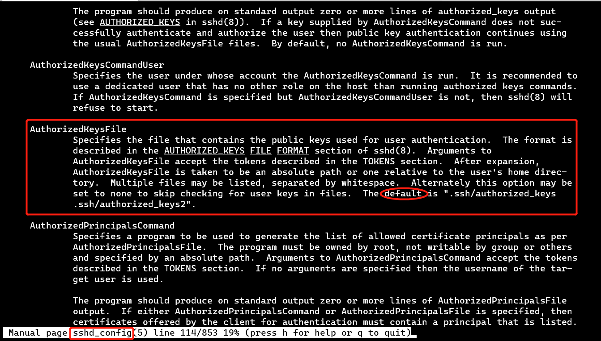

# 12. 免密问候女朋友

- - # 测评说明

    

    - 在测过程中，你需要用到的数据在这里：[测评服务的公钥](http://123.57.102.65/data/id_rsa.pub)
    - 附加：免密登录的本质到底是什么？
  
    # 最终效果
  
    【在本地测试】
  
    
  
    - ssh 主机名，已可免密登录
    - 又是绿 😃
  
    ------
  
    # 实现过程
  
    ## 两步走⭐
  
    【生成密钥对👉复制公钥】
  
    - ① 在本地WSL 2生成公私钥[.pub后缀的为公钥]，这里选择RSA加密算法
  
    ```shell
    ssh-keygen -t rsa
    ```
    
  - - 可使用 ssh-keygen --help查看密钥类型等各种信息
      - 一般不需要设置passphrase[用于加密私钥]，除非你希望每次免密登录时输密码
    - ② 将公钥配置到远程服务器上，一条命令即可
    
  ```shell
    ssh-copy-id ten
    ```
    
    - - 这里使用的ten是远程服务器的别，具体设置方法可参考[《Linux入门及使用》笔记汇总——5 基本系统——附加知识点](https://doublelll3.ml/lnxrm_5_基本系统/#附加知识点)：使用ssh 绰号登录云主机
    - 或者可以使用`ssh-copy-id 用户名@IP`的方式，下文中的ten和用户名@IP等价
    
    🔚至此，实现了免密登录，重连当前ssh进行测试
  
    ```shell
  logout
    ssh ten
    ```
    
    ## ssh-copy-id的细分步骤
    
  如果想自己手工实现ssh-copy-id的效果，可参考下列步骤：
    
  - 复制本地公钥到远程服务器的家目录
    
  ```shell
    scp ~/.ssh/id_rsa.pub ten:
  复制代码
    ```
    
    - ssh登录到远程服务器的家目录，将公钥的内容追加到密钥的配置文件后
    
  ```shell
    cat id_rsa.pub >> .ssh/authorized_keys
  rm id_rsa.pub  # 可删
    复制代码
    ```
    
    - - authorized_keys可以存储多个不同公钥，每一行对应一个
      - 如果没有.ssh目录和authorized_key文件，自行创建即可
    - 【关键】是两者的【权限】，要特定设置一下：让.ssh目录只有所属者有全部权限，让authorized_keys文件只有所属者有读写权限；否则免密登录难以成功
    
    ```shell
    chmod 700 ~/.ssh
  chmod 600 ~/.ssh/authorized_keys
    复制代码
    ```
    
    🔚至此，也实现了免密登录
    
  【权限要求】
    
  - 可参考man sshd
      - 
    - 安全起见，如果权限设置不符合要求，将无法使用公钥文件
    
    ## 附加说明
    
  - 确认本机和远程服务器的/etc/ssh/sshd_config里的PubkeyAuthentication设为yes，修改完需要重启sshd服务：systemctl restart sshd.service
    - 想免密登录远程服务器的哪个用户，就将公钥放在那个用户的【家目录】相应位置
  
    ------
    
  # 免密登录的本质
    
  ## 流程⭐
    
  - 本地发起SSH连接，发送本机公钥
    - 远程服务器拿到公钥后，与本地的公钥做比对
  - 如果一致，服务器会用公钥加密“随机字符串”，发回本地
    - 本地拿出私钥解密“随机字符串”，将结果再发给服务器
    - 如果一致，连接建立
    
    ❗ 参考[SSH免密登录原理与实现](https://juejin.cn/post/6844903885820133384)——掘金
    
  【这里提到了密码登录和免密登录两种方式的具体流程】
    
  - 密码登录
      - 
    - 利用远程服务器的公钥给密码加密
    - 免密登录
      - 
      - 传输过程都不会暴露私钥
    
    > 密码登录方式比免密登录方式简单，即密码登录在连接时更快一些
    > 但是免密登录则更加安全：
  
    - ① 密码更容易被识破
    - ② 参考文章中提到免密登录不存在“中间人攻击”的风险，我并不完全认同
    - 两者首先都是靠.ssh/known_hosts来识别机器
      - 而免密登录多一次公钥的匹配，免密登录更安全
      - 【注意】但这是在本地公钥没有被中间人盗取的情况下
    
    ## 附加说明
    
  - ssh -v ten：可以看到更详细的过程
    - 网上有一张广为流传的图，但存在细节错误，如下：
    - 
      - 请求信息不是用户名和IP❌，而是本地的公钥
      - 公钥里并没有存储IP[否则会带来隐患]，存储的是本机的用户名和主机名
      - 可尝试将本地或远程服务器公钥中的用户信息[用户名和主机名]删去，仍可免密SSH连接
      - 可见，远程服务器验证的是公钥字符串本身！
    
    ------
    
  # 思考点
    
  - 第一次登录云主机显示的身份验证是什么？
      - 
    - 什么是ECDSA key fingerprint？来自远程服务器的密钥指纹，每台安装了ssh的机器都有自己的指纹
      - 输入yes后，会将指纹相应信息存入本地的.ssh/known_hosts，当下次连接若存在伪装机，可产生警觉
      - 如果首次连接就有伪装机[中间人]攻击，那么恭喜你中奖了
      - 参考[验证远程主机SSH指纹](https://marskid.net/2018/02/05/how-to-verify-ssh-public-key-fingerprint/)——博客
    
    # 附加
    
  - ssh-copy-id的使用
    
    - 直接将本机本用户的公钥复制到远程机器家目录/.ssh下的authorized_keys文件中
      - 
    - 更简单、更直接，可指定具体公钥、特定端口等
    
    - 可使用man sshd_config查看sshd_config的具体配置说明
    
  - ⭐禁用密码登录，修改/etc/ssh/sshd_config里PasswordAuthentication为no
    
    - 
      - 重启sshd服务：systemctl restart sshd.service，生效
  
    - 公钥的位置可以通过/etc/ssh/sshd_config里AuthorizedKeysFile自行设置
    
    - 
      - 默认在用户家目录对应位置找公钥
  
    - ChanllengeResponseAuthentication是什么？
    
    
    
  > ChallengeResponseAuthentication no
    > \# 允许任何类型的密码认证！所以，任何 login.conf 规定的认证方式，均可适用！
  > \# 但目前我们比较喜欢使用 PAM 模块帮忙管理认证，因此这个选项可以设定为 no 喔！
    
    ------
    
  # 参考资料
    
  - [SSH Login Without a Password](https://howchoo.com/linux/ssh-login-without-password#ssh-to-the-remote-server-and-configure-your-key)——howchoo
    
  - ssh 免密登录踩坑及解决
    
    ——码农家园
    
    - 里面提到authorized_keys的权限设为644，因为文件所属者是root；也可以修改文件所属者[个人认为后者更安全]
    
  - [文字接口联机服务器：SSH 服务器](http://cn.linux.vbird.org/linux_server/0310telnetssh_2.php)——鸟哥的Linux私房菜
    
  - [ssh修改登录端口禁止密码登录并免密登录](https://www.jianshu.com/p/b294e9da09ad)——简书
    
  - SSH用公钥验证可以阻止中间人攻击么？
    
    ——知乎
    
    - 不能，是通过首次连接时的known_hosts验证避免的