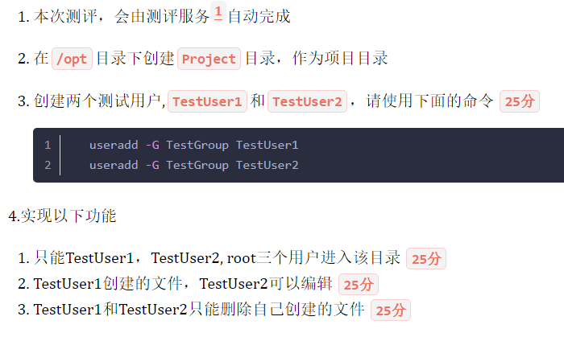
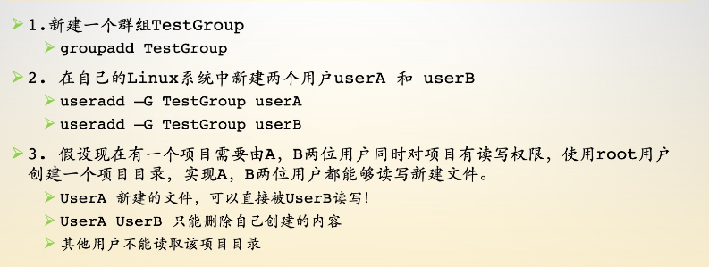
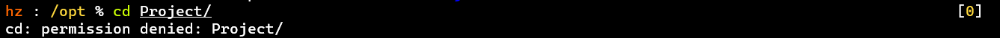
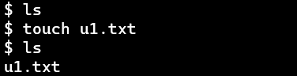
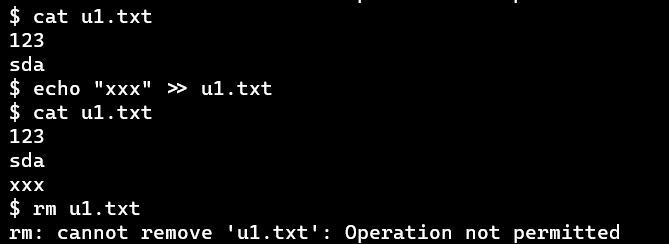
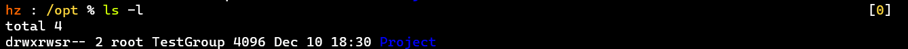
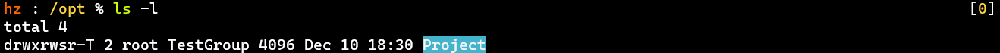
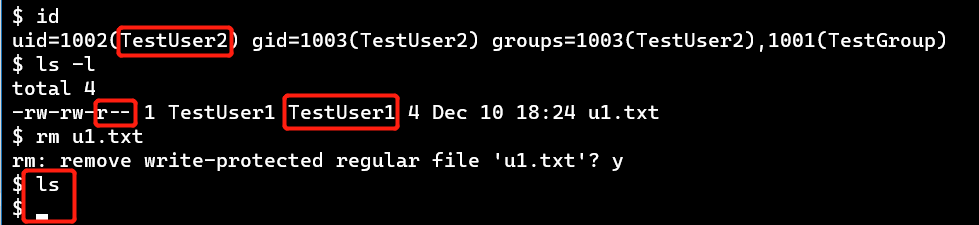
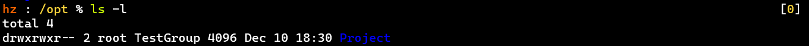
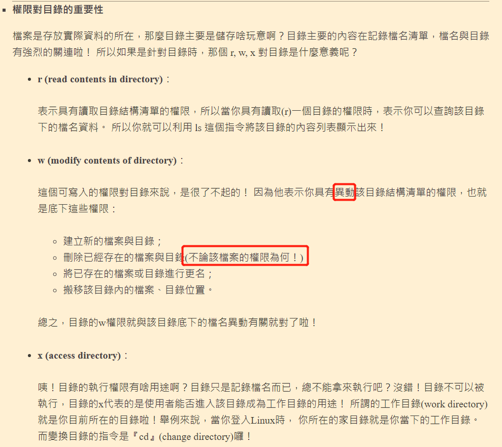

# 13.文件权限的使用场景

- # 测评说明

  [版本一]

  

  [版本二]

  

  - ⭐考察对文件权限【尤其是文件特殊权限】的理解
    - 文件权限：参考《Linux入门及使用》笔记汇总——3 Linux基础知识——[用户和组](https://doublelll3.ml/lnxrm_3_Linux基础知识/#用户和组)以及[文件权限的修改](https://doublelll3.ml/lnxrm_3_Linux基础知识/#文件权限的修改)
    - 文件特殊权限：参考《Linux入门及使用》笔记汇总——8 文件与目录、AWK——[文件的特殊权限](https://doublelll3.ml/lnxrm_8_文件与目录、AWK/#文件的特殊权限)
  - 理解了以上，实现上述功能就游刃有余了

  # 最终效果

  - 其他用户无法进入Project目录

  

  - TestUser1创建了文件u1.txt

  

  - TestUser2仍可以编辑u1.txt，但无法删除它

  

  - - 反之同理

  ------

  # 实现过程

  ## 准备工作

  - 新建一个用户组TestGroup，使用groupadd命令，有一些选项可查看man手册

  ```shell
  groupadd TestGroup
  复制代码
  ```

  - 新建两个属于TestGroup组的用户TestUser1、TestUser2

  ```shell
  useradd -G TestGroup TestUser1
  useradd -G TestGroup TestUser2
  复制代码
  ```

  - - 需要先有组
  - 设置密码，用来登录用户，否则登不了

  ```shell
  passwd TestUser1
  --->输入密码：xxx
  passwd TestUser2
  --->输入密码：yyy
  复制代码
  ```

  - 在/opt目录下新建Project目录，作为项目目录

  ```shell
  cd /opt
  mkdir Project
  复制代码
  ```

  ## 实现功能1 进入权限

  【只能TestUser1、TestUser2、 root三个用户进入该目录】

  - 把Project目录的所属组修改为TestGroup，所属用户不动

  ```shell
  sudo chown :TestGroup Project
  复制代码
  ```

  - 将其他用户的执行权限去除，其他用户将不能进入目录

  ```shell
  sudo chmod o-x Project
  复制代码
  ```

  - 效果如下：

  

  ## 实现功能2 编辑权限

  【TestUser1创建的文件，TestUser2可以编辑】

  - 首先，给所属组TestGroup添加写权限，这样用户才能在该目录下创建文件

  ```shell
  sudo chmod g+w Project
  复制代码
  ```

  - 设置set_gid，这样用户进入目录后的操作会以目录所属组的身份进行

  ```shell
  sudo chmod g+s Project
  复制代码
  ```

  [PS] 否则，用户创建的文件的所属组属于与自己同名的组，而不是TestGroup [从而无法将两个用户建立联系]

  - 权限如下：

  

  ## 实现功能3 删除权限

  【TestUser1和TestUser2只能删除自己创建的文件】

  - 设置sticky bit，这样在该目录下，用户只能删除自己创建的内容

  ```shell
  sudo chmod +t Project
  复制代码
  ```

  - 权限如下：

  

  [PS] 文件夹颜色都变了，zsh干的漂亮

  ------

  # 思考点

  - 某场景：进入某目录的用户对某文件没有写权限，却可以删除文件，为什么？

    - 

    - 删除文件的权限：优先取决于用户对进入的目录的权限

      - 

      - 该用户属于TestGroup，有可写权限

      - 参考

        鸟哥的私房菜——目录与文件之权限意义

        ——权限对目录的重要性：

        - 
        - 但是碰见sticky bit [黏着位]，事情又不一样了

  # 附加

  - 目录的可执行权限代表进入权限

  ------

  # 参考资料

  - 《Linux入门及使用》笔记汇总——3 Linux基础知识——[用户和组](https://doublelll3.ml/lnxrm_3_Linux基础知识/#用户和组)以及[文件权限的修改](https://doublelll3.ml/lnxrm_3_Linux基础知识/#文件权限的修改)
  - 《Linux入门及使用》笔记汇总——8 文件与目录、AWK——[文件的特殊权限](https://doublelll3.ml/lnxrm_8_文件与目录、AWK/#文件的特殊权限)
  - [鸟哥的私房菜——目录与文件之权限意义](http://linux.vbird.org/linux_basic/0210filepermission.php#filepermission_dir)

- http://linux.vbird.org/linux_basic/0210filepermission.php#filepermission_dir)