# 3. Linux 基础知识

## 由图形化[Windows]转为字符界面[Linux]

### Linux 与windows 不同

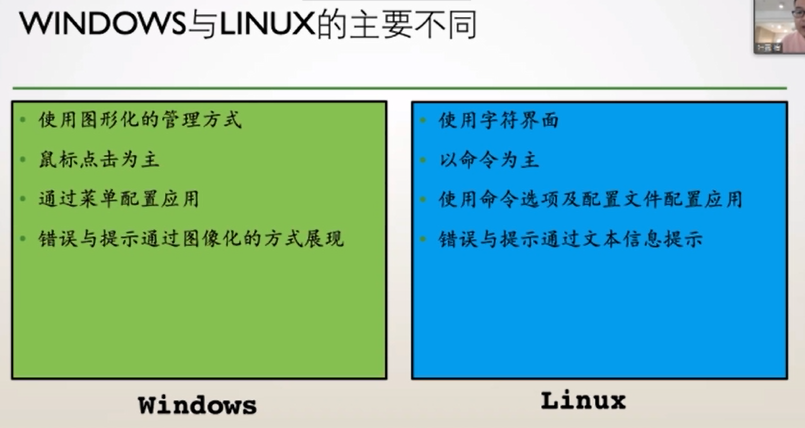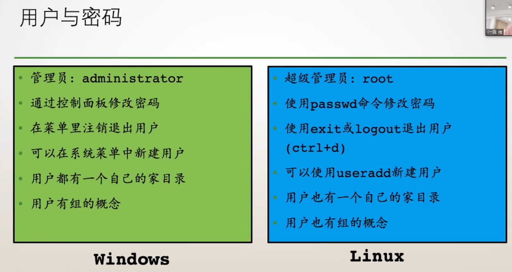

- linux ：每个用户都有自己的家目录，并且只能在自己家进行修改，基本没权利修改其他人家目录的内容 
- linux ：组内的用户具有一定权限，可以相互查看一些文件

### 错误与提示

图形化→文本信息

- 一定不要忽略屏幕输出，仔细看系统的每一个回复！
- 程序return值反应在下一行右侧
  - 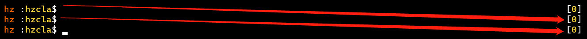
  - 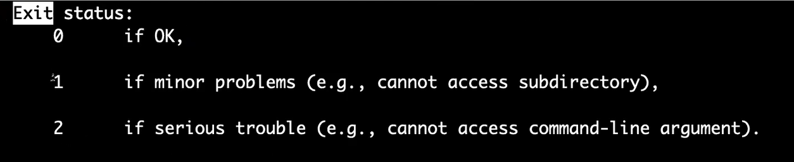
  - return 0 表示成功
  - 后面的0，是程序最终的返回值0（return 0），可以通过观察这个值，来判断程序是否运行成功；如果改成return 1，就会变成1，但一般来说，默认的，除了 0 以后的返回值，都说明程序有问题（具体情况，看退出状态）[148] 是挂起的含义
  - % 是zsh 自带的，如果输出程序没有加换行符，就会自动添加，不然会使得下一行的名字跟输出数据并在一起
  - man + 指令 ： 就是看相关指令的说明书

### 命令格式

命令 [选项] [选项参数]... [参数]...

- 选项：--选项全称 -选项简称
- 空格：不管多少个都是一个空格，作为分隔符
- 命令中，--后面加命令选项全称，-则只需要命令简称
- 注意空格
- -a  == --all：所有
- ls -a ： 会出现 . 以及 .. 两个， 其中 . 是当前目录， .. 是父目录，这是方便使用相对路径绝对路径 ： 始于根目录
- 相对路径 ： 相对于当前路径

### Linux在安全方面考虑更多

用户、用户组、权限

- 修改密码：passwd
- 退出用户：exit、logout、ctrl + d
- 新建用户：useradd
- 家目录：/home，其他用户在其他目录可能没有修改权限
- 组
- [PS] 一切皆文件，一切设备、抽象的进程、运行数据、CPU...
  - 与用户相关的文件 /etc/passwd、/etc/group，相关命令 usermod、userdel、id
  - id：可查看自己或指定用户的uid、gid(主要组)、groups(所在组)
-  w操作，可以看到当前系统中有多少人在线
- 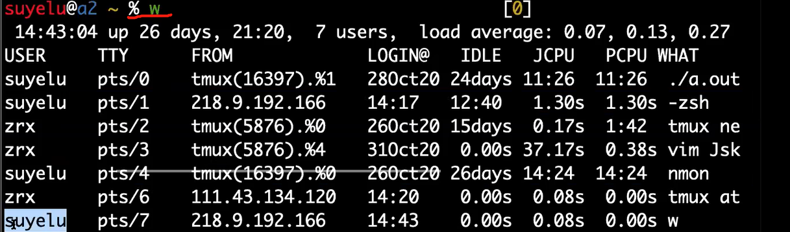
- TTY是虚拟终端的意思，也是一个文件，可以看成是当前这个虚拟终端的操作用户是谁
- 向系统内其他用户打招呼，用 echo + “内容” + >> + /dev/pts/对应编号  
- 如果要向所有在线用户传递信息，可以用 wall 公布栏（ wall + "内容" ），向全体人员发送消息 

### 用户和组

- 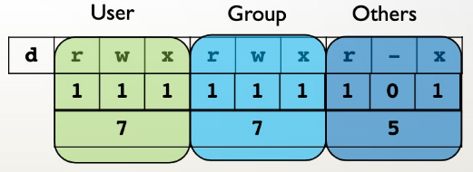
- **权限**：字符表示(r可读、w可写、x可执行)→8/10进制描述
- 每个文件都有一个拥有者、一个拥有组、其余用户
- 输入ls -l可查看
  - 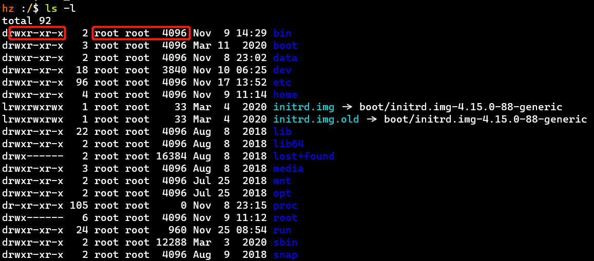
  - 见红框，文件类型l、d等，详见附加知识点-7种文件类型
- ls -ald : 可以看当前目录的权限，第一个root 是用户名字，第二个是组，一般，除非特殊指定，不然在创建用户的时候，会创建一个同名的组；
- 一个用户可以存在于多个组中，也可以把用户加到其他组中
- 要查看某个文件夹的文件，可以用 ls + 路径

### 浏览文件

Linux只有一棵树，起于根目录 /

### 我是谁、我在哪、我要去哪

- 我是谁 whoami、who am i（看到本质）
  - 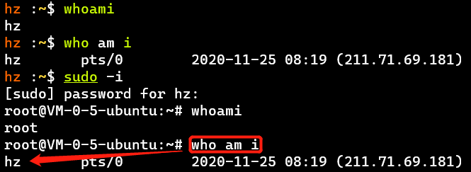
  - whoami：系统感觉你是谁，who am i：你实际上是谁
- 我在哪 pwd：print working directory
- 我要去哪 cd：change directory
  - cd - ： 回到上一次得目录
- [PS] 书写命令或路径时，善用Tab键

### 软件的安装（Ubuntu）

- .deb：使用dpkg -i xxx.deb

- .tar：使用tar解压

- apt安装

  ：可自动解决依赖关系、可选择合适的软件源地址

  - 安装到哪去了？分散放置的：bin、lib；/usr/→bin、include、lib、local、share(帮助手册)、src
  - 相关命令
    - 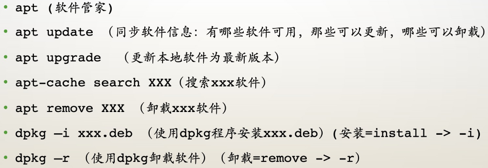
    - search可以找一个软件，查看是否存在、可能忘记名字了
    - apt remove xxx--purge (不保留配置文件)
    - apt autoremove慎用，毕竟是apt管理的，可能误删还要用但没在运行、其他方式下载的软件
    - 安装软件之前，最好先update更新一下，然后用sudo apt install 来安装软件

## Linux常用命令

### 文件及目录操作

- 
- ln：软连接、硬连接
- mv : 移动，可以把文件移动到其他文件夹中，也可以将一个文件改名为另一个文件
- rm ：删除 rm -rf/*

### 文件内容的修改与查看

- 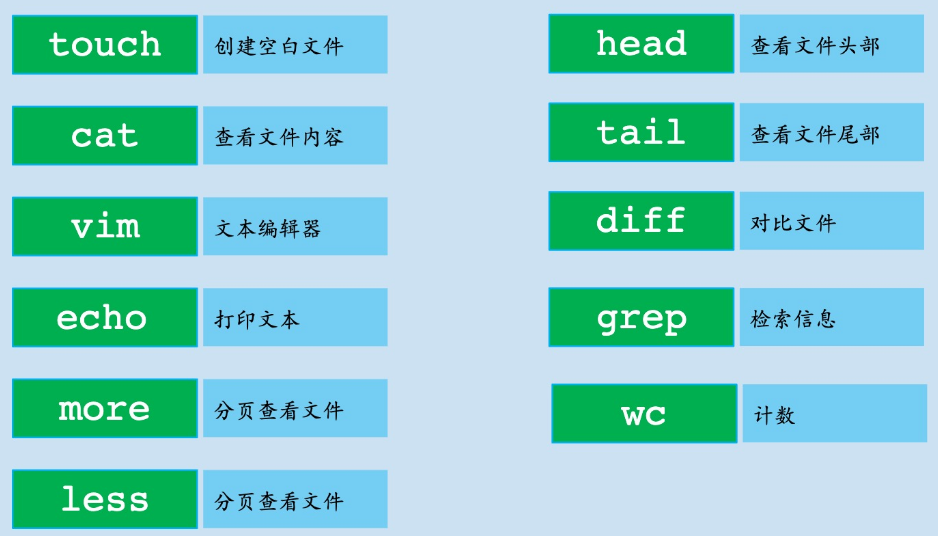
- ⭐Linux三剑客：grep [Global Regular Expression Print]、awk [数据处理]、sed [批量操作]
- ❗ 管道：| 把前一个命令的输出传给下个命令
- less比more更友好，功能更多（可以来回翻页，查找也有高亮显示）
- wc：word count，可接参数-l [行数]等等

### 文件的查找与定位

- 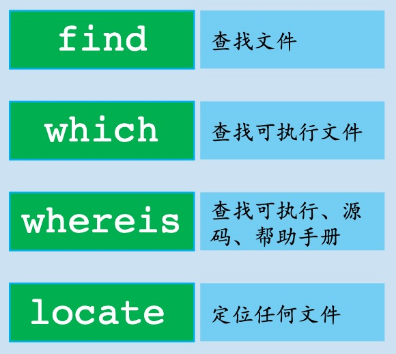
- find ： 可以通过多个条件实现查找
- 还有个 where ，与whereis 不同
- which：查找可执行文件的具体位置，具体用的是哪个
- locate
  - 基于索引，查找非常快
  - 【不是实时更新】，因为更新需遍历全部文件，慢
  - 可定期更新，或使用sudo updatedb更新数据库
  - 用touch 创建一个文件，再用locate 发现没有，是因为没有更新数据库，所以先更新一下数据库即可

### 用户相关

- 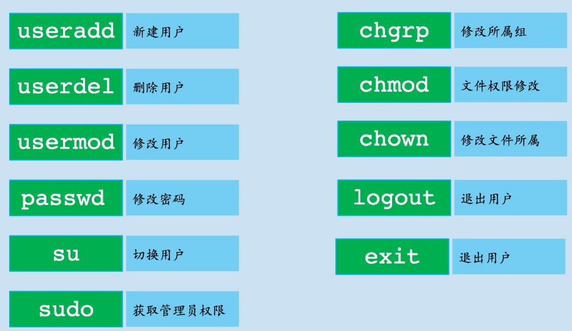
- sudo -i：使用超管权限登录默认shell
- chmod：change mode
- chown：change owner

### 进程相关（用来查看系统中跑了多少任务，什么任务，占了多少资源等，以及结束相关进程，或者定时任务）

- 
- 常用ps -ef，输出所有进程的详细信息
- kill指定PID [process ID] 即可杀死进程
- crontab -e：编辑【定时任务】，参考里面格式即可
- 挂起 ： 类似window 的缩小化 
- ps ： 只看当前会话窗口的进程
- tldr + 指令 ： 查看操作说明
-  pkill + 进程： 杀死所有当前用户所能杀死的相关进程，如果 用 sudo pkill sudo 会导致从此都连不上系统，因为root 里面有个sbin，杀掉的话，会把这个也弄没了，sudo pkill慎用
- ctrl + c ： 结束前台进程
- ctrl + z、fg、bg、jobs
  - jobs 查看进程序号
  - ctrl + z 会让进程暂停
  - bg 可以在后台跑，输出会显示在终端，同时可以干其他事
  - 当当前会话窗口挂起多个进程的时候，fg 通常返回的是最后一个进程，要调用其他进程，得用 %+编号
  - %2（或fg %2）[zsh下]、fg 2 [bash下] 将2号进程调至前台
  - fg  将挂起的进程恢复，恢复后，仍不能干其他事
  - [PS] fg可用在修改源文件、gcc的时候，提高效率

### 获取系统信息

- 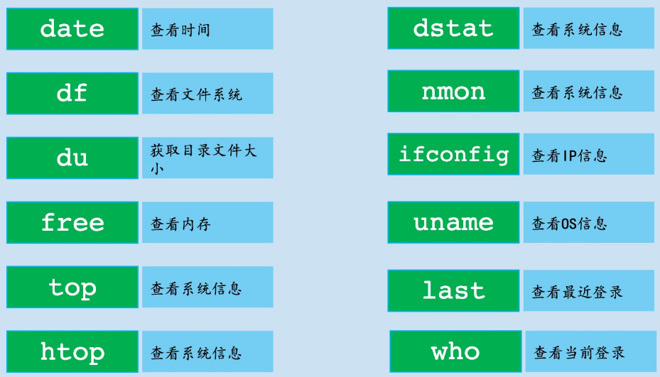

- data 可以在后面 + “%H-%M”的格式字符串，来使得时间按照要求输出

- 可用于调优

- 查看有没有被别人占用资源，检查系统是否被攻破：top、htop、nmon

- 僵尸进程 ：进程死了，但是没被释放，放在那里不管，占着内存（父进程开启了子进程，子进程死了，但是没被收尸）

- /etc/os-release : 也可以用来查看相关系统信息

- 【如何降低云主机被攻破的几率】

  - 取消密码，配置sshd，通过公私钥方式登录
  - 改复杂密码
  - 改默认的用户名或新建一个用户
  - 改ssh的连接端口

- -h 说人话，友好显示

  - du -h，友好显示目录文件大小，K、M
  - free -h，友好显示内存数据

- nmon：适合检查系统什么时候出了问题

- ifconfig [interfaces config] 显示的

  网络设备信息含义

  -博客

  - 能看到私网ip，不能看到公网ip

- uname -a：打印所有可用的系统信息，还可以用cat /etc/os-release

  

### 其他命令

- 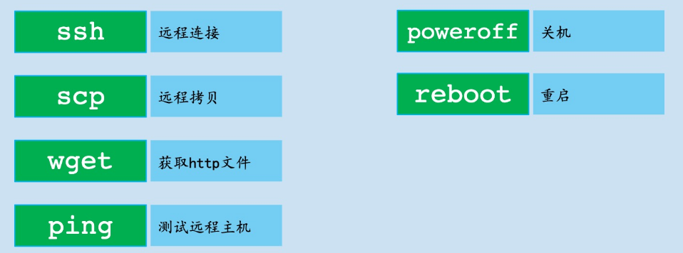
- 在ssh [已开源] 以前常用telnet
- 【scp使用ssh拷贝】
  - 远程👉本地：scp username@ip_address: 远程文件 本地路径
  - 本地👉远程：scp 本地文件 username@ip_address: 远程路径
- 云主机用了poweroff后，需连到控制台去开机
- dev ： 设备的意思

## 基础知识总结

### Terminal & Shell

- Terminal类似设备
- Terminal里面运行着Shell软件，比如bash、zsh，用来解释在Terminal中输入的命令
- Shell接受命令：是否内置→在系统环境变量PATH中的路径里查找、调用

### 分隔符

- 一些特殊符号也属于分隔符：管道 | ，重定向 >、>>、<、<< ，后台运行 &，序列执行 &&
  - 重定向到/dev/zero、/dev/null：输入到数据黑洞，输入到此处的东西直接被忽略，具体通过man zero查看【/dev：设备】

### 程序与进程

- 程序就是一个可执行的二进制文件；进程是程序在内存中的镜像、实例化

### 路径

- 绝对路径：起始点为根目录/
- 相对路径：善用当前路径"."和上一级路径".."
- 远程路径：协议://用户名:密码@位置/路径:端口
- 特殊路径：~用户名 = 用户名的家目录，- = 上次工作目录

### 软件

- Linux中没有注册表概念
- 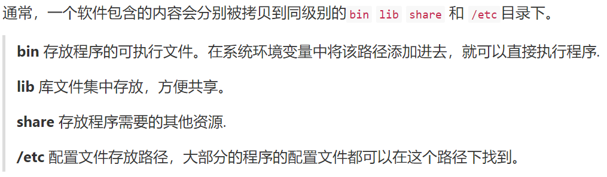

### 隐藏文件

- 名字以 . 开头即可
- 特殊目录：当前目录 "." 和 父目录 ".."

### 文件类型

【7种文件类型】

- 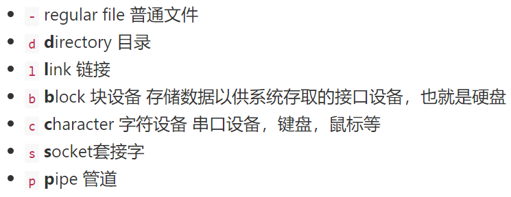

- link：可暂时理解为windows的快捷方式

- block：系统大多数的block是4096Byte = 4KB，起到缓冲的作用，类比快递配送

- character：设备也是文件，如虚拟终端 /dev/pts/0

- socket：基于网络的都离不开它

- pipe：不占用内存，只负责传输，举例一次传输：echo > 管道文件，cat 管道文件

- 3种普通文件

- ll == ls -lh : 查看文件权限等详细信息

- l : ls -lah

- file ： 也可以查看详细信息

  

### 文件权限的修改

- chmod
  - 善用+、-、=
    - 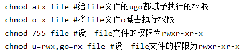
    - a = all、+ 增加权限、- 去除权限、= 直接覆写权限
  - 尽量减少chmod 777的使用，权限开放过多
- chown
  - 可同时修改文件所属的用户和组
    - chown 所属用户:所属组 文件
  - 可修改目录及目录下所有文件的所属用户
    - chown -R 所属用户 目录
- chgrp：修改文件所属的组，一般可用chown替代
- 查看文件权限
  - ll = ls -lh
    - 可通过which ll或alias ll查看ll具体使用的命令
  - l = ls -lah
  - 系统中的三个时间：修改时间、读取时间atime、权限修改时间ctime

### 用户

- 慎用root
- su 用户名：切换到另一用户，需输入其密码
- su - 用户名
  - 使用"-"会更新环境变量，适合复杂操作
  - 不加"-"，则适合临时切换用户
- 不加用户名，则默认切换到root
- id : 看个账户信息，也可以用 id + 其他账户名，查看其他账户的信息
- 因为用户在sudo 组，所以用户才能通过 sudo 提升账户权限，如果不在这个组，sudo 也没用

# 附加知识点

- . 当前目录 .. 父目录 / 根目录
- 僵尸进程[有害]：子进程死了，父进程没管，子进程还占着资源；孤儿进程[无害]：会被1号进程领养
- 与其它终端聊天
  - 输入w查看在线终端
    - 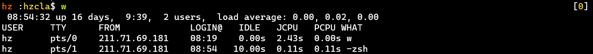
    - TTY[Teletype]：终端；pts[pseudo terminal slave]：虚拟终端
  - 输入echo "hello" >> /dev/pts/1给终端pts/1发"hello"
    - 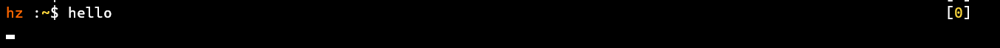
    - pts/1可以收到消息，并以同样方式echo回信
  - 还可以使用wall "System is rebooting in 15s"告诉所有在线用户自己要重启了
- sudo !! 可以以超级用户准备执行上次命令
  - 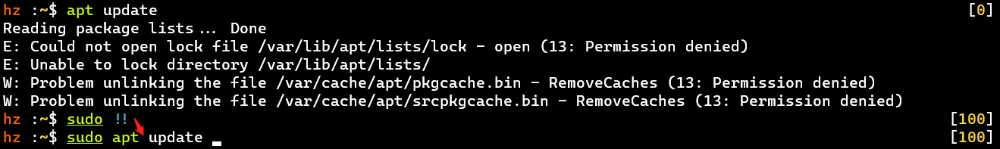
  - 可以以超级用户准备执行上次命令，不需要再输一遍命令了
- whereis
  - 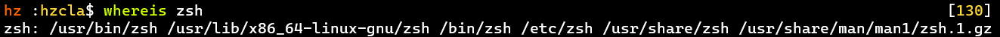
  - 查看软件的安装目录
- file 文件
  - 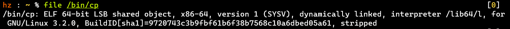
  - 查看文件的具体信息
- 通常使用[man 命令]或[命令 -h]可以查看命令帮助
  - 使用说明的格式规则：[] 可选选项，| 不能同时使用的参数
- 目录也是文件
- alias 别名=命令，可设置别名对应的命令

# Tips

- 用户相关
  - 创建用户时没有特殊指定组，会以自己用户名创建一个组
  - 一个用户可以在多个不同的组
- 优秀的资源监控软件
  - Htop：一款运行于Linux的监控与进程管理软件，比top更友好
  - nmon：用于Linux的计算机性能系统监视工具 [IBM开发]
  - dstat：灵活的资源统计工具
- 命令相关
  - apt和apt-get没区别
  - history：打印输出的命令历史
  - tldr + 命令：查看命令格式
  - echo $PATH：打印PATH环境变量，存放系统默认的可执行文件的路径
- [CPU状态信息us,sy,ni,id,wa,hi,si,st含义](https://blog.csdn.net/Sasoritattoo/article/details/9318893)-CSDN
- [如何在 Ubuntu 上修改主机名](https://www.itcoder.tech/posts/how-to-change-hostname-on-ubuntu-20-04/)-博客，关于hostnamectl

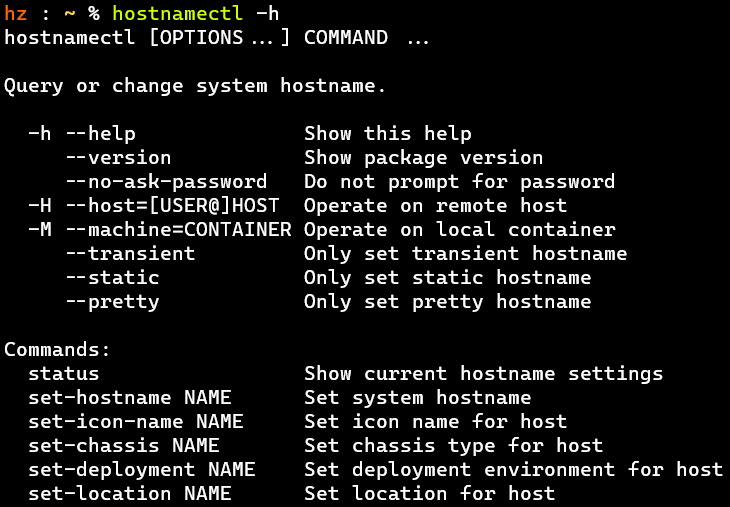

- 计算机网络学习推荐：[《计算机网络：自顶向下方法》](https://github.com/Epsirong/book/raw/master/os/计算机网络教程：自顶向下方法.pdf)，重点前5章

