# 6.系统信息的获取

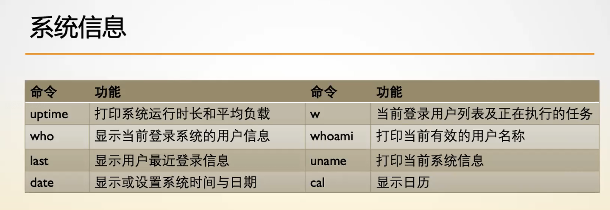

## uptime 系统运行时长和平均负载

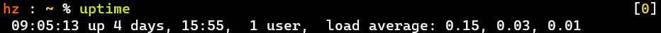

- 用来监测系统开机多久了、有几个用户登陆着、运行状态(负载)
- 学会用--help查看命令帮助

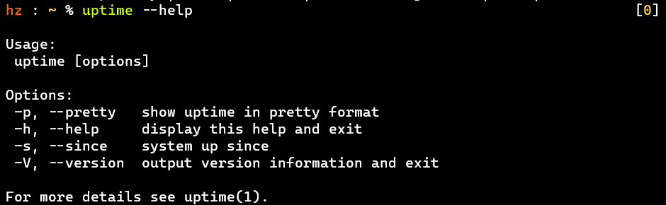

## w 用户列表及运行的任务

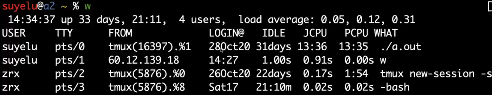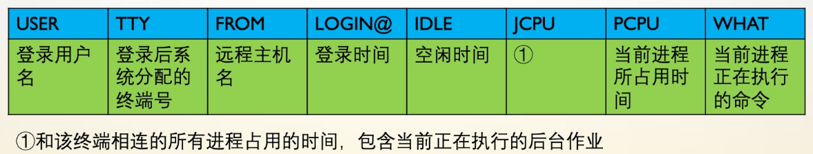

- 当系统很卡时，可以看看当前进程正在执行的命令
- w 里面也有 uptime 的信息，因为可能需要查看信息，所以就添加了进去
- JCPU : 与该终端相连的所有进程占用cpu的时间（不是真实时间，不会实时变化）；

## who 显示当前登录用户信息

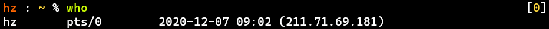

- 有点像精简的w
- 当--help信息过多时，学会使用tldr
- -q 查看所有登陆用户及数量
- -H 显示头

## whoami、who am i 当前有效/真实的用户名

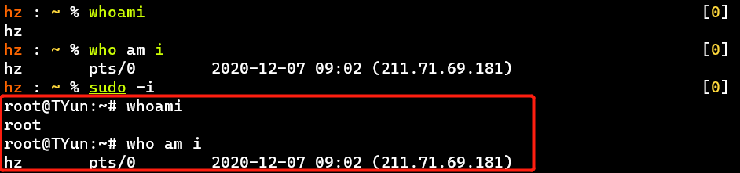

- sudo -i 用超级用户权限启动默认Shell
- who i am = who am i
- who am i 其实属于who命令，am i 是参数

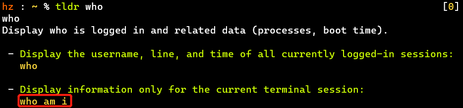

## last 用户最近登录信息

应用：查出最近登录最频繁的三个用户

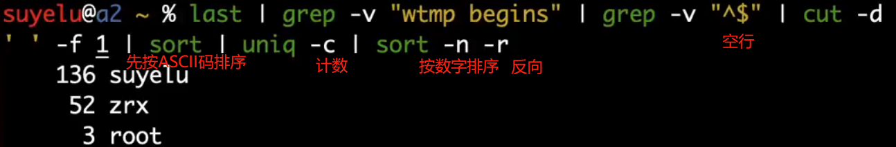

- 清洗空行【"^$"】、按空格切割再取第1列、按字典序[即ASCII码序]排序、计数、按数字排倒序
- cut -c 10-15：按字符切，取某一列对应第10-15个字符

【延伸】词频统计（man手册的ls、man、stdio、scanf内容）

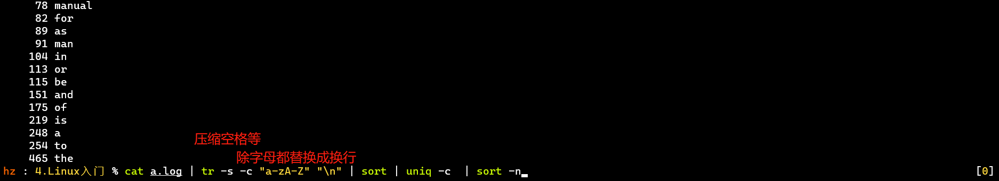

- tr 字符替换命令
  - -c 反向替换
  - -s 压缩连续的重复字符
- 计数，先把所有的数据压缩成一行，用 uniq 去重，再加上参数 -c 进行计数

例子 ：搜索一篇文章中词频最高的词汇

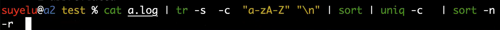

## uname 系统信息

- uname -a 很完整的系统信息 [机器一上手先用这条命令]
- 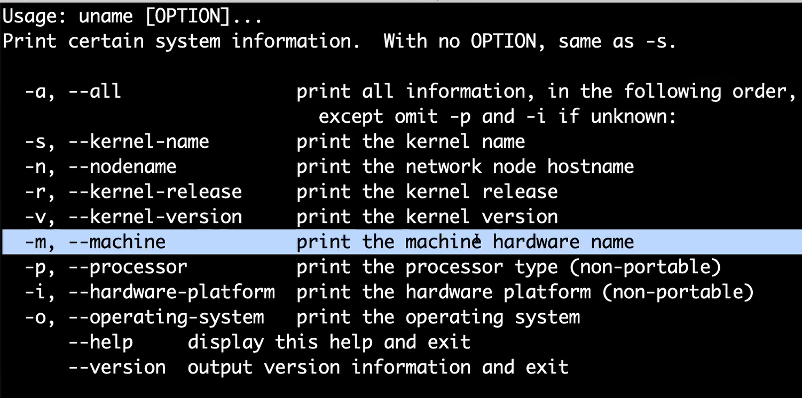

## date 显示或设置系统时间与日期

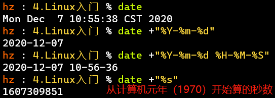

- 可以自定义字符串格式，注意大小写自行尝试即可
- [PS] NTP——网络时间协议，通过时区同步时间
  - 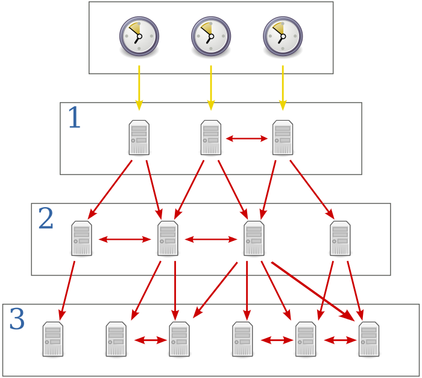
  - 来自[维基百科](https://www.wikiwand.com/zh-hans/網路時間協定)，分布式结构类似DNS，但它是单向联系，
  - 应用：银行系统、网购
  - 时间服务器配置见/etc/ntp.conf
  - 时区可查看/usr/share/zoneinfo
    - 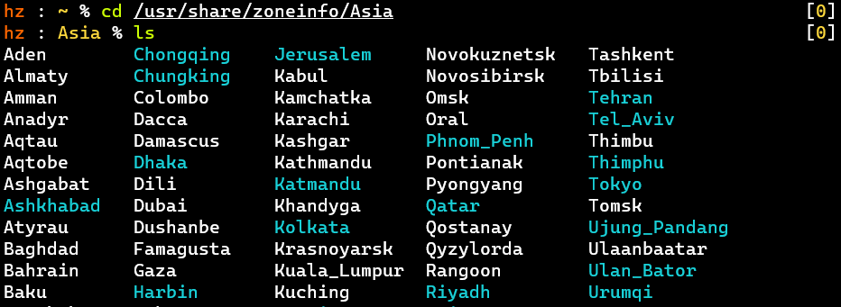
    - 修改时区可通过ln -sf [软连接强制覆盖]命令，将时区连接到/etc/localtime
    - 举例：sudo ln -sf /usr/share/zoneinfo/Asia/城市 /etc/localtime

# 附加知识点

- cal 显示日历
- echo -e 可以让反斜杠\生效
  - 如echo -e "\033[32m123\033[0m456" 输出颜色，这类似printf
- $[]只做整数计算

# 思考点

# Tips

- 缩写可能代表
  - -h：help、human、header(w -h)
  - -p：pretty
- shell脚本里空格是敏感的
- 在Shell里定义的变量是在进程里的，退出Shell [或断开SSH连接] 变量就消失了
- wget可以下载文档数据