# 7.shell编程基础

- ## 第一个Shell脚本

  ```shell
  #!/bin/bash
  #注释
  echo "Hello"
  复制代码
  ```

  - 第一行#!指定解释器，只在第一行才有效
  - 注释："#"

  ## 变量

  ```shell
  a=123
  a=hello
  a=`pwd`
  PATH=${PATH}:path  # 变量后接字符串，可以直接拼接字符串
  # 【注意】":a"有特殊含义，会指到当前路径
  复制代码
  ```

  - 不需要定义变量类型【弱类型语言】
    - 如a=123可以是字符串，也可以是整数
  - ":a"有特殊含义
    - 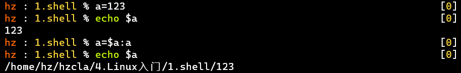
    - 可用双引号包住a，如a=a:"a"或a=*a*:"*a*"或*a*=a":a"，得到a=123:a

  ### 特殊变量

  **位置变量**

  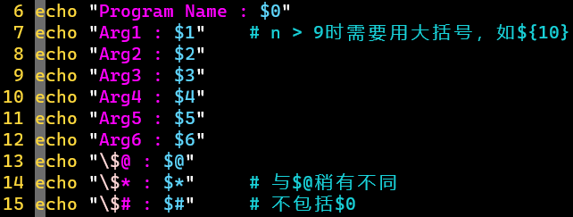

  结果：

  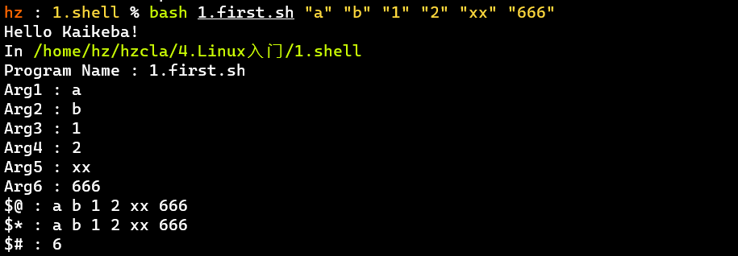

  - $n：如果n＞9，需要用大括号括起来
  - $@ 和 $* 的区别在于：传入参数分别被双引号包围、且$变量也被双引号包围时，"$@" 会将所有的参数分开【一般情况】，而"$*" 会将所有的参数作为一个整体
    - 在用for...in 时可以看出，详见Shell特殊变量：[Shell $0, $#, $*, $@, $?, $$和命令行参数](http://c.biancheng.net/cpp/view/2739.html)——C语言中文网
  - $#：不计数$0

  **状态变量**

  - $?：【上一条】指令执行结果，0——成功，非0——不成功
    - 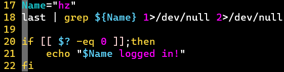
    - 便于脚本自动判断指令成功与否
  - 、$!：当前进程/上一指令的PID，一般用于自动化测试、多脚本交互场景
  - 输入：read
    - 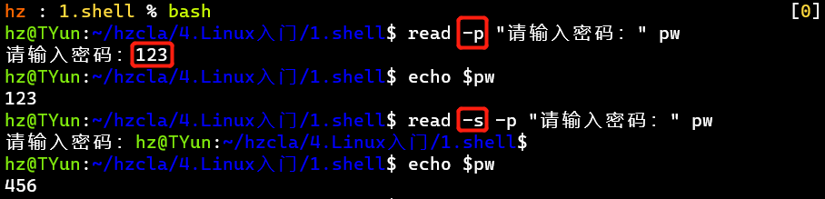
    - -p：显示友好提示，需在bash下使用
    - -s：静默模式
    - -t：输入等待时长，超时结束(单位：s)
  - 输出：echo
    - -e：开启转义
  - 输出：printf
    - 和C语言的printf非常像！
    - 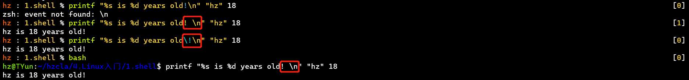
    - [PS] !和\n放一起有特殊含义，需要分开
      - bash下需要分开
      - zsh下可以分开，或用\转义
      - 一般对于特殊符号，需要警觉！

  ## 函数

  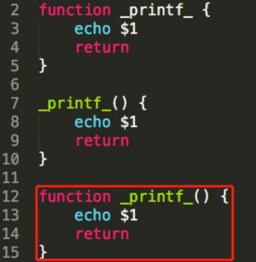

  - 没有形参
  - 定义：写法很多，function、()、{}组合搭配，第3种更类似C语言写法
  - 调用：函数名 参数...
    - 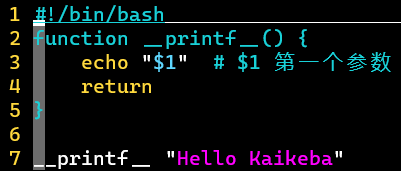
    - 加function方便阅读
  - ❗【注意】shell中函数return的返回值有限制，范围是0-255，溢出会循环换算

  ## 流程控制

  do——done、if——then——fi、case——esac

  ### 【重点】TEST表达式⭐

  - 可判断类型：字符串、整型、文件
  - ❗ 【注意】条件为真时，返回0，否则返回非0
    - Linux中命令的返回值也是如此，0才代表成功
  - [PS]
    - STRING1 = STRING2 也可以用== 【推荐后者，两个中括号[[ ]]支持】
    - -G FILE：文件存在并且被有效组ID拥有
      - 如果组被解散了，则组控制的文件的组ID就是无效的
    - 具体可查阅man手册：man test

  ### 分支结构

  **if**

  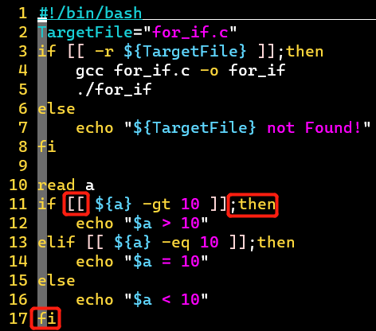

  - if用两个中括号[[ ]]的写法，更高级，与TEST表达式兼容性更好
    - 而一个中括号[ ]是很多年前的写法，不推荐，两个中括号
    - 参考[Linux Shell 中 ()、(())、[\]、[[]]、{} 的作用](https://jishuin.proginn.com/p/763bfbd322c2)——博客

  **case**

  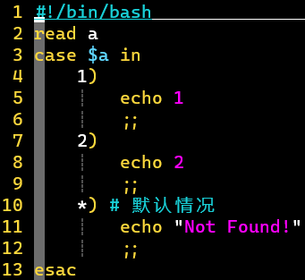

  - 分号;;不能没有！相当于break，加了break也要有
  - 默认情况可用*)
  - case用的较少，一般用来做菜单，比if更美观

  ### 循环结构

  **for**

  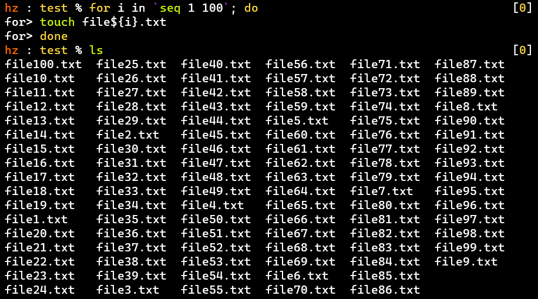

  - 利用seq生成序列

  

  - 利用ls的匹配规则

  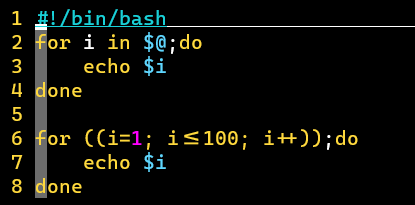

  - for的两种形式
  - 双小括号(())中的内容只要符合C语言运算规则即可，变量可以不使用变量前缀$，可以写i++，平常不可以用++

  **while**

  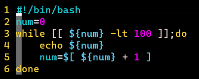

  - 同样适用test表达式

  - 可以初始化变量，否则第一次echo

     

    num时，*n**u**m*时，

    num是空值，表现为空行

    - 当遇到后面的+1时，系统判定它为整数类型，就当做整数用

  **until**

  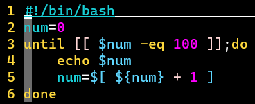

  - 与while唯一的区别在于：until写的是停止条件，while写的是循环条件

  ## 数组

  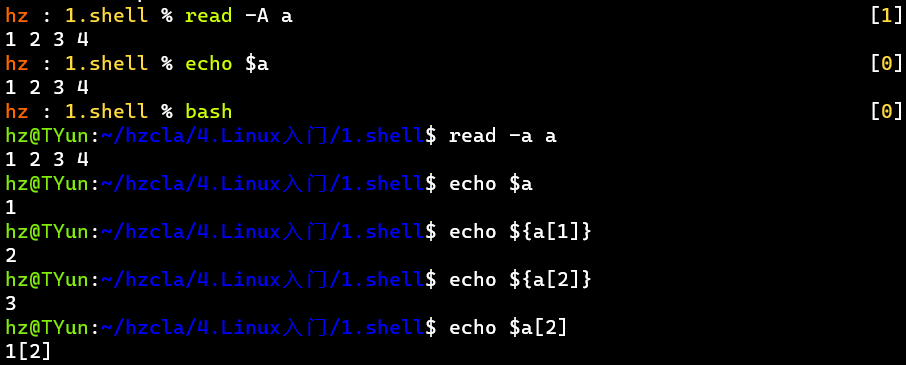

  - 数组赋值【方式①】和调用

  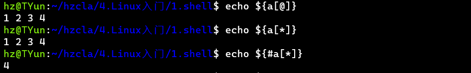

  - 【常用的数组操作】还可以输出数组元素的下标，见后

  

  - 声明数组：declare -a num，方便阅读，不声明也可以 [弱类型语言]
  - 赋值【方式②、③】
    - num[2]=10 num[5]=7 num[100]=3.2.4
    - num=(1 a b 10)
  - 数组元素不一定要连续赋值，且可以为任意类型
    - 【常用的数组操作】加!：输出所有数组元素对应的下标，可以看出不是连续的

  【其它数组操作】

  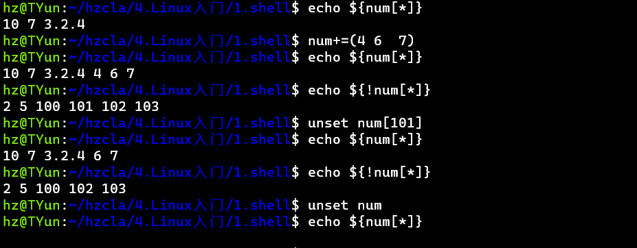

  - +=：追加
  - unset：删除数组，或元素 [通过下标删除]
  - [PS] 赋值方式③对多个空格也只作一个分隔符

  **应用**

  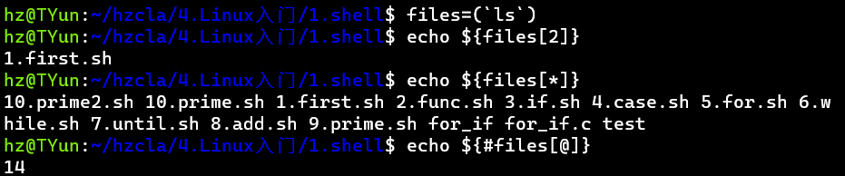

  - 可以用来存储文件名列表
  - 【注意】赋值方式③给数组赋值是以空格作为分隔符，所以如果文件名里有空格，需要特殊处理
  - 【PS】素数筛、线性筛

  # 随堂练习

  ## 1~100的偶数和

  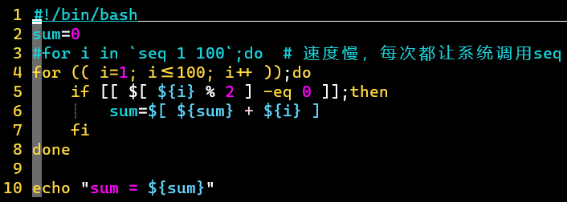

  - $[ ]可用来做整数运算
  - seq效率稍低

  ## 暴力求素数

  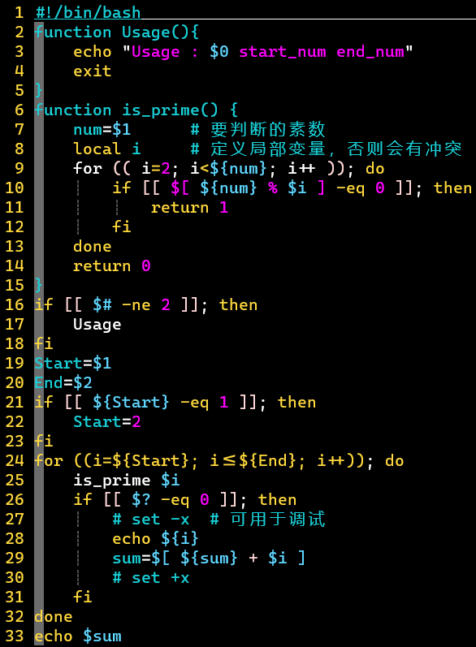

  - 函数的return值
    - 通过$?获得，在调用函数后echo $?即可，但是return值有范围限制0~255！
    - 通过命令替换符``取到
  - 注意对于循环变量i的冲突问题：定义局部变量
  - 🆒调试程序
    - 习惯：适当的echo输出
    - 全局调试：bash -x *.sh
    - 局部调试：set -x [调试代码区域] set +x

  ## 素数筛

  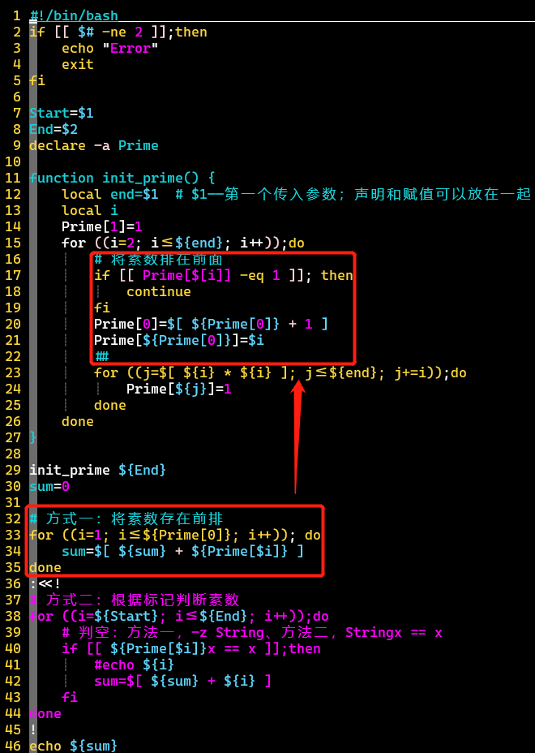

  - 方式一方便操作素数，且输出时可减少判断
  - 方式二还可以操作合数

  【两种方法效果比较】求2~10000的素数和

  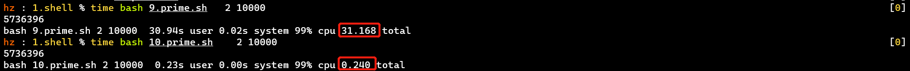

  - 9.prime.sh 暴力法 —— 10.prime.sh 素数筛

  # 附加知识点

  - .sh脚本可以直接bash或source执行，如果要使用./需要有可执行权限

    - [source、sh、bash、./有什么区别](https://www.cnblogs.com/pcat/p/5467188.html)——cnblogs

  - set -x可以开启shell调试

  - Shell命令替换：将命令的输出结果赋值给变量

    ——C语言中文网

    - $() 支持嵌套，反引号``不行
    - $() 仅在 Bash 中有效，而反引号``可在多种 Shell 中使用

  - 双小括号(())中的内容

    - 只要符合C语言运算规则即可
    - 变量可以不使用变量前缀$
    - 可以写i++，平常不可以用++

  - ⭐在Shell中，变量还未定义时，其值为空，echo输出表现为空行

  - ⭐空格问题【严格】

    - 赋值语句：=左右不能有空格
    - TEST表达式：[[ ]]两端必须有空格

  - 对于变量名i_i，如果用i_i，会将*i**i*，会将i与_i拼接，所以要用${i_i}

  # Tips

  - 写Shell脚本

    - 不要太考虑性能，单纯做数学计算效率低
    - 为的是快速解决一个问题，用来规划所有任务的流程
    - 做操作前记得加【备份】操作
    - 一般是让系统做事情，难于操作特定的程序做事情
      - 程序一般有自己的参数设置，但不具有普适性

  - API一般指服务

  - ⭐[Shell 风格指南](https://zh-google-styleguide.readthedocs.io/en/latest/google-shell-styleguide/contents/)——Google 开源项目风格指南——Shell编程规范

  - Shell脚本多行注释和单行注释的方法

    ——博客

    - :<<! ... !

  - 可以了解[let](https://www.runoob.com/linux/linux-comm-let.html)——菜鸟教程，方便的语法

  ------

  # 课程速记

  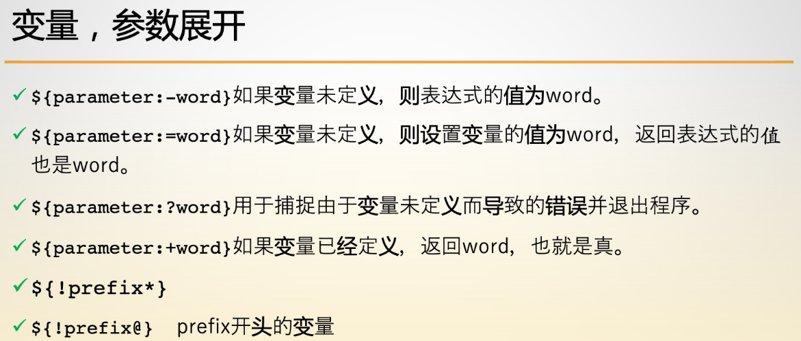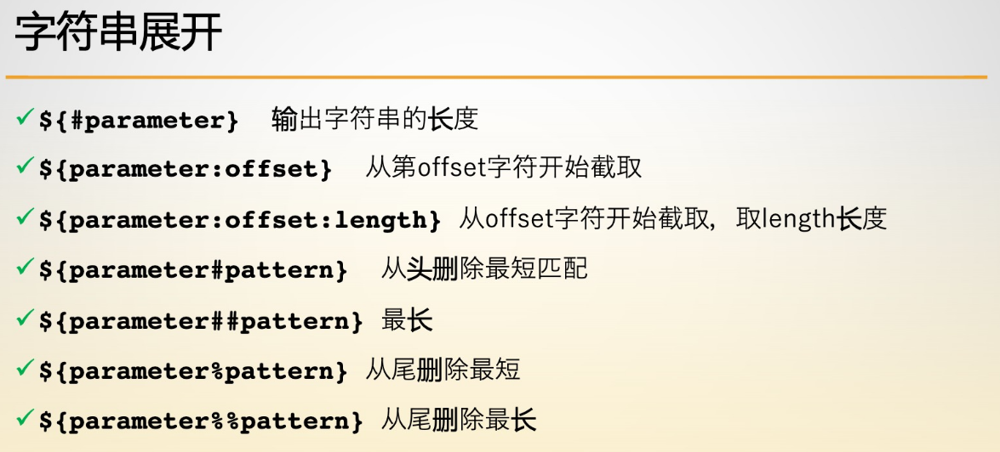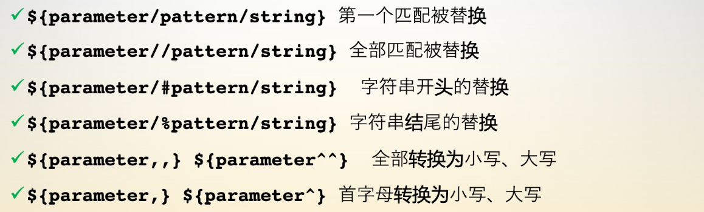