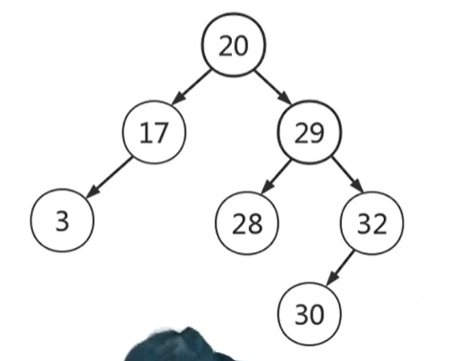
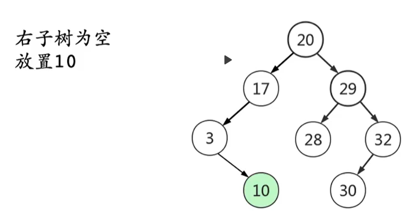
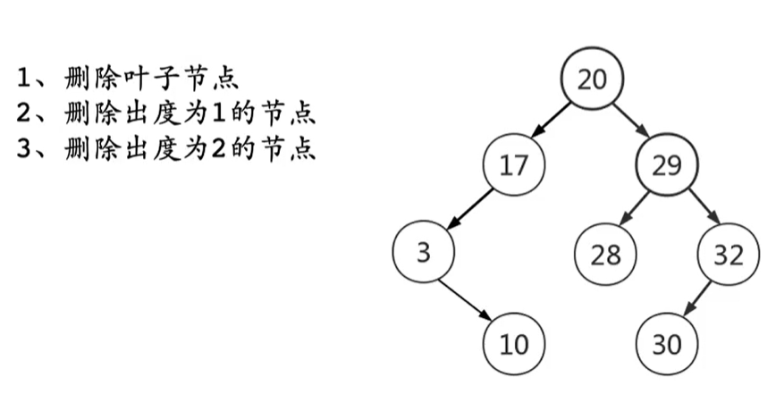
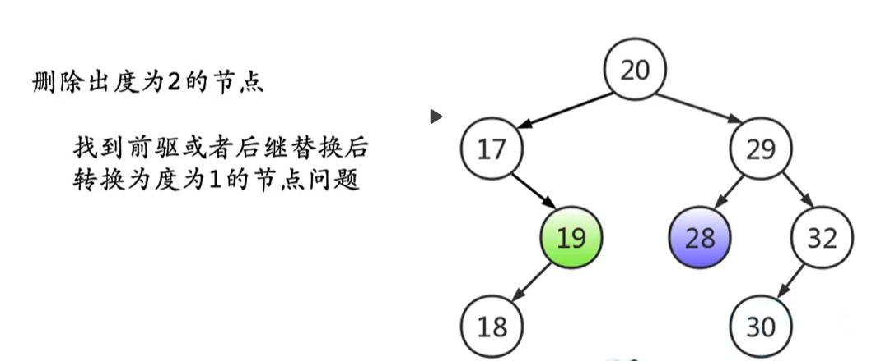
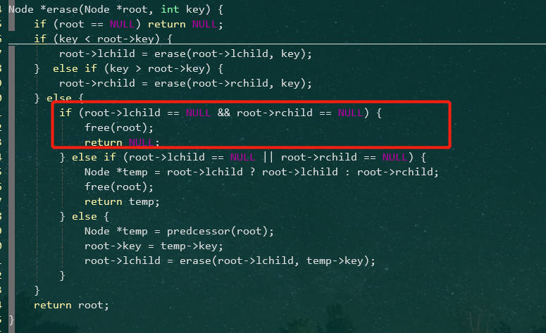
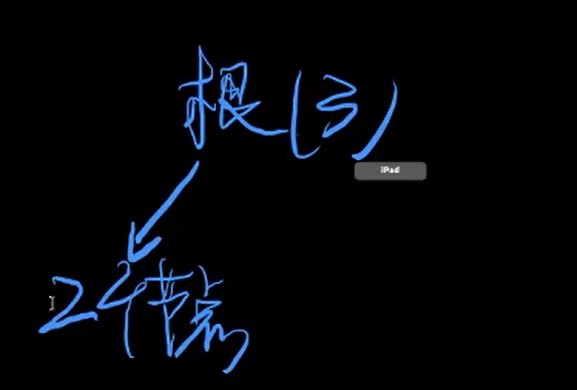
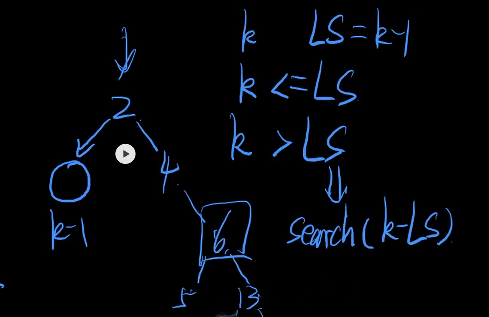

# 第一天（上）

## 平衡二叉查找树——BS树

又名： 二叉排序树，二叉查找树

### 结构定义 ：



性质： 

1. 左子树 < 根节点
2. 右子树 > 根节点
3. 中序遍历的结果，是一个有序序列

`数据结构，就是定义一种性质，并且维护这种性质。`

用途 ： 解决与`排名`相关的检索需求（中序遍历）

> 思考 ： `树形结构的查找入口为什么一定是根节点？`
>
> 树形结构 ： 点（集合）， 边 （关系）
>
> 根节点：代表全集，所以一定得从根节点开始查找

### 结构操作 ： 

1. 支持动态扩容

2. 维护 ： 二叉排序树的每一步操作，都要维护二叉排序树的性质

3. 插入 ： 

   1. 插入的新节点，一定会做为叶子结点
   2. 通过对比每个节点的值，大就右子树，小就左子树，直到遇到空白节点，则补上！

   

4. 删除 ： 

   

   1. 删除度为0的节点，直接删除

   2. 删除度为1的节点，把『孤儿子树』挂到其父节点上面去

   3. 删除度为2的节点，可以转化成删除度为1的节点：

      

      对于度为2的节点：

      1. 前驱 ：左子树的最大值

      2. 后继 ：右子树的最小值

      3. 前驱后继的性质 ： `只有左子树（右子树）`，没有右子树（左子树），则一定不是度为2 的节点。
      4. 删除度为2 的节点的方法 ： 让前驱或者后继`替换掉根节点`，然后`删除相应的度为1` 的前驱或者后继节点。
      5. 平均查找效率 ： 期望值（每个节点的查找次数相加，再除以总节点数）
      6. 如果不维护，那插入顺序不同，会导致查找效率不一样

5. 查找 ： 

## 代码演示(bug版本)

bug : 

1. 这一版的bug 体现在前驱后继是针对`度为2`的节点。

2. 度为1 或者为0的节点，前驱后继，`不一定在自己的子树里面`！

```c++
#include <stdio.h>
#include <stdlib.h>
#define KEY(n) (n ? n->key : 0)

typedef struct Node {
    int key;
    struct Node *lchild, *rchild;
} Node;

Node *getNewNode(int key) {
    Node *p = (Node *)malloc(sizeof(Node));
    p->key = key;
    p->lchild = p->rchild = NULL;
    return p;
}

int search(Node *root, int val) {
    if (root == NULL) return 0;
    if (root->key == val) return 1;
    if (root->key > val) return search(root->lchild, val);
    return search(root->rchild, val);
}

Node *insert(Node *root, int key) {
    if (root == NULL) return getNewNode(key);
    if (root->key == key) return root;
    if (key < root->key) root->lchild = insert(root->lchild,key);
    else root->rchild = insert(root->rchild, key);
    return root;
}

Node *predcessor(Node *root) {
    Node *temp = root->lchild;
    while (temp->rchild) temp = temp->rchild;
    return temp;
}

Node *erase(Node *root, int key) {
    if (root == NULL) return NULL;
    if (key < root->key) {
        root->lchild = erase(root->lchild, key);
    }  else if (key > root->key) {
        root->rchild = erase(root->rchild, key);
    } else {
        // 处理度为 1 的情况，这一部分可以去除，不影响
        if (root->lchild == NULL && root->rchild == NULL) { 
            free(root);
            return NULL;
        // 处理度为 0 的情况
        } else if (root->lchild == NULL || root->rchild == NULL) {
            Node *temp = root->lchild ? root->lchild : root->rchild;
            free(root);
            return temp;
        } else {
            Node *temp = predcessor(root);
            root->key = temp->key;
            root->lchild = erase(root->lchild, temp->key);
        }
    }
    return root;
}

void clear(Node *root) {
    if (root == NULL) return;
    clear(root->lchild);
    clear(root->rchild);
    free(root);
    return;
}

void output(Node *root) {
    if (root == NULL) return ;
    output(root->lchild);
    printf("(%d, %d, %d)\n", KEY(root), KEY(root->lchild), KEY(root->rchild));
    output(root->rchild);
    return;
}

int main() {
    int op, val;
    Node *root = NULL;
    while (~scanf("%d%d", &op, &val)) {
        switch (op) {
            case 0 : printf("search %d, result : %d\n", val, search(root, val)); break;
            case 1 : root = insert(root, val); break;
            case 2 : root = erase(root, val); break;
        }
        if (op) {
            output(root);
            printf("---------------\n");
        }
    }
    return 0;
}
```

## 随堂练习

1. 插入顺序会影响最终的树形结构
2. 不同的树形结构，查找效率不同


平均查找效率：节点查找次数的期望值，$\frac{总次数}{节点数量}$，假设每个节点等概率的被查找

## 扩张内容

#### 1. 二叉排序树的删除代码优化



这段代码可以去除，因为度为1跟度为0的判别，都是通过判别子节点是否为空，只不过一个是判别一个，一个是判别两个，不过，无论是一个还是两个，都可以删除，所以直接去掉就行了。

#### 2.如何解决==排名== 相关的检索需求



想知道排名，只要直到节点的左右节点数量即可，不过目前的版本没有跟节点数量有关的数据，所以，扩展一下。

 ##### 代码修改演示

```c++
#include <stdio.h>
#include <stdlib.h>
#define KEY(n) (n ? n->key : 0)
#define SIZE(n) (n ? n->size : 0)

typedef struct Node {
    int key, size;  //加入表示节点数量的size
    struct Node *lchild, *rchild;
} Node;

Node *getNewNode(int key) {
    Node *p = (Node *)malloc(sizeof(Node));
    p->key = key;
    p->lchild = p->rchild = NULL;
    p->size = 1;
    return p;
}

// 增加与删除操作的节点数量维护一样，直接写成一个函数
void update_size(Node *root) {
    root->size = SIZE(root->lchild) + SIZE(root->rchild) + 1;
    return;
}

int search(Node *root, int val) {
    if (root == NULL) return 0;
    if (root->key == val) return 1;
    if (root->key > val) return search(root->lchild, val);
    return search(root->rchild, val);
}

Node *insert(Node *root, int key) {
    if (root == NULL) return getNewNode(key);
    if (root->key == key) return root;
    if (key < root->key) root->lchild = insert(root->lchild,key);
    else root->rchild = insert(root->rchild, key);
    update_size(root); //节点数量维护
    return root;
}

Node *predcessor(Node *root) {
    Node *temp = root->lchild;
    while (temp->rchild) temp = temp->rchild;
    return temp;
}

Node *erase(Node *root, int key) {
    if (root == NULL) return NULL;
    if (key < root->key) {
        root->lchild = erase(root->lchild, key);
    }  else if (key > root->key) {
        root->rchild = erase(root->rchild, key);
    } else {
        if (root->lchild == NULL || root->rchild == NULL) {
            Node *temp = root->lchild ? root->lchild : root->rchild;
            free(root);
            return temp;
        } else {
            Node *temp = predcessor(root);
            root->key = temp->key;
            root->lchild = erase(root->lchild, temp->key);
        }
    }
    update_size(root); //节点数量维护
    return root;
}

void clear(Node *root) {
    if (root == NULL) return;
    clear(root->lchild);
    clear(root->rchild);
    free(root);
    return;
}

void output(Node *root) {
    if (root == NULL) return ;
    output(root->lchild);
    //节点数量展示
    printf("(%d[%d], %d, %d)\n", KEY(root), SIZE(root),
           KEY(root->lchild), KEY(root->rchild)
    );
    output(root->rchild);
    return;
}

int main() {
    int op, val;
    Node *root = NULL;
    while (~scanf("%d%d", &op, &val)) {
        switch (op) {
            case 0 : printf("search %d, result : %d\n", val, search(root, val)); break;
            case 1 : root = insert(root, val); break;
            case 2 : root = erase(root, val); break;
        }
        if (op) {
            output(root);
            printf("---------------\n");
        }
    }
    return 0;
}
```



排名第 k 位的元素 ： 

1. 修改二叉排序树的结构定义，增加 size 字段，记录每棵树的节点数量， LS为左子树的节点数量
2. $k = LS - 1$，根节点就是排名第 k 位的元素
3. $k \le LS$，排名第 k 位的元素在左子树中
4. $k \gt LS，search_k(root->rchild, k - LS - 1)$
5. 代码演示：

```c++
#include <stdio.h>
#include <stdlib.h>
#define KEY(n) (n ? n->key : 0)
#define SIZE(n) (n ? n->size : 0)
#define L(n) (n ? n->lchild : NULL)

int search_k(Node *root, int k) {
    if (root == NULL) return -1;
    if (SIZE(L(root)) == k - 1) return root->key;
    if (k <= SIZE(L(root))) {
        return search_k(root->lchild, k);
    }
    return search_k(root->rchild, k - SIZE(L(root)) - 1);
}
```


#### 3. 解决Tok - k 问题  ：输出排名前 k 位的值

1. 根节点就是第 k 位元素的话，就把左子树中的值全部输出出来
2. 第 k 位在左子树中，前 k 位元素全都在左子树中
3. 第 k 位在右子树中，说明根节点和左子树中的元素，都是前 k 位元素里面的值
4. 代码演示 

```
void printf(Node *root) {
    printf("(%d[%d], %d, %d)\n", KEY(root), SIZE(root),
           KEY(root->lchild), KEY(root->rchild)
    );
    return ;
}

void output(Node *root) {
    if (root == NULL) return ;
    output(root->lchild);
    printf(root);
    output(root->rchild);
    return;
}

void output_k(Node *root, int k) {
    if (k == 0 || root == NULL) return;
    if (k <= SIZE(L(root))) {
        output_k(root->lchild, k);
    } else {
        output(root->lchild);
        printf(root);
        output_k(root->rchild, k - SIZE(L(root)) - 1);
    }
    return;
}
```


#### 4. 二叉排序树与快速排序的关系

1. 二叉排序树是快速排序在思维逻辑结构层面用的数据结构
2. 思考1：快速排序的时间复杂度和二叉排序树建树时间复杂度之间的关系
3. 思考2：快速选择算法和二叉排序树之间的关系
4. 程序=算法+数据结构

> 所谓算法设计及分析能力：分类讨论及归纳总结的能力

## 最终代码演示

```c++
#include <stdio.h>
#include <stdlib.h>
#define KEY(n) (n ? n->key : 0)
#define SIZE(n) (n ? n->size : 0)
#define L(n) (n ? n->lchild : NULL)

typedef struct Node {
    int key, size;
    struct Node *lchild, *rchild;
} Node;

Node *getNewNode(int key) {
    Node *p = (Node *)malloc(sizeof(Node));
    p->key = key;
    p->lchild = p->rchild = NULL;
    p->size = 1;
    return p;
}

void update_size(Node *root) {
    root->size = SIZE(root->lchild) + SIZE(root->rchild) + 1;
    return;
}

int search(Node *root, int val) {
    if (root == NULL) return 0;
    if (root->key == val) return 1;
    if (root->key > val) return search(root->lchild, val);
    return search(root->rchild, val);
}

int search_k(Node *root, int k) {
    if (root == NULL) return -1;
    if (SIZE(L(root)) == k - 1) return root->key;
    if (k <= SIZE(L(root))) {
        return search_k(root->lchild, k);
    }
    return search_k(root->rchild, k - SIZE(L(root)) - 1);
}

Node *insert(Node *root, int key) {
    if (root == NULL) return getNewNode(key);
    if (root->key == key) return root;
    if (key < root->key) root->lchild = insert(root->lchild,key);
    else root->rchild = insert(root->rchild, key);
    update_size(root);
    return root;
}

Node *predcessor(Node *root) {
    Node *temp = root->lchild;
    while (temp->rchild) temp = temp->rchild;
    return temp;
}

Node *erase(Node *root, int key) {
    if (root == NULL) return NULL;
    if (key < root->key) {
        root->lchild = erase(root->lchild, key);
    }  else if (key > root->key) {
        root->rchild = erase(root->rchild, key);
    } else {
        if (root->lchild == NULL || root->rchild == NULL) {
            Node *temp = root->lchild ? root->lchild : root->rchild;
            free(root);
            return temp;
        } else {
            Node *temp = predcessor(root);
            root->key = temp->key;
            root->lchild = erase(root->lchild, temp->key);
        }
    }
    update_size(root);
    return root;
}

void clear(Node *root) {
    if (root == NULL) return;
    clear(root->lchild);
    clear(root->rchild);
    free(root);
    return;
}

void printf(Node *root) {
    printf("(%d[%d], %d, %d)\n", KEY(root), SIZE(root),
           KEY(root->lchild), KEY(root->rchild)
    );
    return ;
}

void output(Node *root) {
    if (root == NULL) return ;
    output(root->lchild);
    printf(root);
    output(root->rchild);
    return;
}

void output_k(Node *root, int k) {
    if (k == 0 || root == NULL) return;
    if (k <= SIZE(L(root))) {
        output_k(root->lchild, k);
    } else {
        output(root->lchild);
        printf(root);
        output_k(root->rchild, k - SIZE(L(root)) - 1);
    }
    return;
}

int main() {
    int op, val;
    Node *root = NULL;
    while (~scanf("%d%d", &op, &val)) {
        switch (op) {
            case 0 : printf("search %d, result : %d\n", val, search(root, val)); break;
            case 1 : root = insert(root, val); break;
            case 2 : root = erase(root, val); break;
            case 3 : printf("search_k %d, result : %d\n", val, search_k(root, val)); break;
            case 4 : {
                printf("output top-%d elements\n", val);
                output_k(root, val);
                printf("---------------\n");
            }break;
        }
        if (op == 1 || op == 2) {
            output(root);
            printf("---------------\n");
        }
    }
    return 0;
}
```

