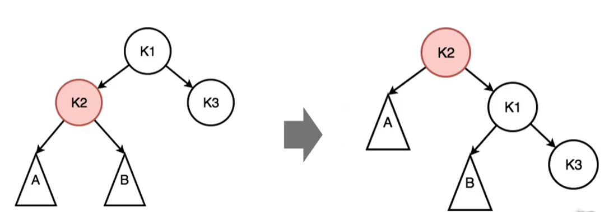

# 第一天（下）

## 平衡二叉查找树（2）——AVL树（小学生必知必会系列）


右边的退化成了一个链表，查找效率变成了最糟糕的 O(n)，插入顺序不同，会影响查找效率，搞笑了！！所以提出了AVL树。


### 学习重点

1. 平衡二叉树排序树，本质上也是二叉排序树，所以拥有二叉排序树的所有性质
2. 平衡二叉树排序树的学习重点，在于平衡条件以及平衡调整的相关学习

### 性质：

1. 拥有所有二叉排序树的所有特点
2. 左子树跟右子树的高度差 <= 1 （AVL树的真正性质， 防止退化成链表）

### 思考 ： 


1. $H <= SIZE(H) <= 2^H - 1$

2. $1.618^H <= SIZE(H) <= 2^H - 1$
3. AVL树，查找效率在$log_2N$ -  $log_3N$之间，效率最差也是$log_2N$
4. AVL 树改进的是节点数量的下限
5. 树高 = 生命长度，节点数量 = 生命财富，不同的算法，达到的结果是不同的
6. 教育提升的是底限，而不是上限，上限取决于能力和运气

## AVL树平衡调整

1. 插入与删除操作：与BS树一样，需要排序 ，一旦破坏了AVL树的性质，就会触发平衡调整操作
2. 发生在回溯阶段的，`第一个失衡节点处`
3. 理解平衡调整策略的关键在于：分析清楚四种情况下，ABCD 四棵子树树高的关系
4. LL，大右旋
5. LR，先小左旋，再大右旋
6. RL，先小右旋，再大左旋
7. RR，大左旋

### 基础操作（左旋，右旋）

##### 左旋：


##### 右旋：



##### 失衡：


###### LL型 ：


树高判断 ： 

- A、B、C、D的树高分别为$h_1$、$h_2$、$h_3$、$h_4$

- 增加节点之前，该树是平衡的，满足AVL树性质的，即每个节点的左右子树的高度差不超过1
- 而增加一个叶子节点后，该树是LL失衡，说明说明只能叶子节点`必须是增加在A树上`，否则要么不是LL失衡，要么增加之前就失衡，不满足条件（$h_1$为已经增加叶子节点的高度）
- 因为是LL失衡，即在K1位置（`回溯`的`第一失衡`节点）发现失衡，所以，K2与K3是平衡的，所以 $h_1 = h_2 + 1$ 、$|h_3 - h_4| \leq 1$
- K1失衡，K2树高比K3树高多2，则只能是 $h_1 = h_2 + 1 = max(h_3,h_4) + 2$
- 调整方法 ： K2节点`右旋一次即可`

###### LR型：（变成LL）


树高判断 ： 

- A、B、C、D的树高分别为$h_1$、$h_2$、$h_3$、$h_4$

- 增加节点之前，该树是平衡的，满足AVL树性质的，即每个节点的左右子树的高度差不超过1
- 而增加一个叶子节点后，该树是LR失衡，说明说明只能叶子节点`必须是增加在B树或者C树其中之一上`，否则要么不是LR失衡，要么增加之前就失衡，不满足条件（$h_2$、$h_3$为已经增加叶子节点的高度）
- 因为是LR失衡，即在K1位置（`回溯`的`第一失衡`节点）发现失衡，所以，K2与K3是平衡的，所以 `K2的树高比D树高2`，也就是`高在K3树`上，`A树`的树高与`D树`一样，$max(h_2, h_3) = h_4 = h_1$
- 调整方法 ： K2节点`左旋一次`变成`LL型`，再在K3节点`大右旋一次`即可。

### RR型与RL型只是上面两种的对称模式

### SB树（课后学习，根据节点数量调整）


- 用上面类似的方法判断节点数量，从而学习调整方法

## 代码演示：

1. 插入和删除以后，注意`重新计算树高`字段
2. 引入了 `NIL 节点`，代替 NULL，NULL `不可访问`，NIL 是一个是`实际节点，可访问`

```c++
#include <stdio.h>
#include <stdlib.h>
#include <math.h>
#define L(n) (n->lchild)
#define R(n) (n->rchild)
#define H(n) (n->h)

typedef struct Node {
    int key, h;
    struct Node *lchild, *rchild;
} Node;

Node __NIL;
#define NIL (&__NIL)
__attribute__((constructor))
void init_NIL() {
    NIL->key = 0, NIL->h = 0;
    NIL->lchild = NIL->rchild = NIL;
    return;
}

Node *getNewNode(int key) {
    Node *p = (Node *)malloc(sizeof(Node));
    p->key = key;
    p->h = 1;
    p->lchild = p->rchild = NIL;
    return p;
}

// 哪边子树比较高就取哪边，同时 + 1
void update_height(Node *root) {
    root->h = H(L(root)) > H(R(root)) ? H(L(root)) : H(R(root)) + 1;
    return;
}

Node *left_rotate(Node *root) {
    Node *temp = root->rchild;
    root->rchild = temp->lchild;
    temp->lchild = root;
    update_height(root);
    update_height(temp);
    return temp;
}

Node *right_rotate(Node *root) {
    Node *temp = root->lchild;
    root->lchild = temp->rchild;
    temp->rchild = root;
    update_height(root);
    update_height(temp);
    return temp;
}

Node *maintain(Node *root) {
    if (abs(H(L(root)) - H(R(root))) <= 1) return root;
    if (root->lchild->h > root->rchild->h) {
        if (root->lchild->lchild->h < root->lchild->rchild->h) {
            root->lchild = left_rotate(root->lchild);
        }
        root = right_rotate(root);
    } else {
        if (root->rchild->rchild->h < root->rchild->lchild->h) {
            root->rchild = right_rotate(root->rchild);
        }
        root = left_rotate(root);
    }
    return root;
}

Node *insert(Node *root, int key) {
    if (root == NIL) return getNewNode(key);
    if (root->key == key) return root;
    if (key < root->key) {
        root->lchild = insert(root->lchild, key);
    } else {
        root->rchild = insert(root->rchild, key);
    }
    update_height(root);
    return maintain(root);
}

// 前驱的循环条件修改为NIL，同时这个版本仍是bug版本，因为仅仅判别了度为2的节点
Node *predcessor(Node *root) {
    Node *temp = root->lchild;
    while (temp->rchild != NIL) temp = temp->rchild;
    return temp;
}

Node *erase(Node *root, int key) {
    if (root == NIL) return NIL;
    if (key < root->key) {
        root->lchild = erase(root->lchild, key);
    } else if (key > root->key) {
        root->rchild = erase(root->rchild, key);
    } else {
        if (root->lchild == NIL || root->rchild == NIL) {
            Node *temp = root->lchild != NIL ? root->lchild : root->rchild;
            free(root);
            return temp;
        } else {
            Node *temp = predcessor(root);
            root->key = temp->key;
            root->lchild = erase(root->lchild, temp->key);
        }
    }
    update_height(root);
    return maintain(root);
}

void clear(Node *root) {
    if (root == NIL) return;
    clear(root->lchild);
    clear(root->rchild);
    free(root);
    return;
}

void print(Node *root) {
    printf("(%d[%d], %d, %d)\n",
          root->key, root->h,
          root->lchild->key,
          root->rchild->key
    );
    return ;
}

void output(Node *root) {
    if (root == NIL) return;
    print(root);
    output(root->lchild);
    output(root->rchild);
}


int main(){
    int op, val;
    Node *root = NIL;
    while (~scanf("%d%d", &op, &val)) {
        switch(op) {
            case 0 : root = erase(root, val); break;
            case 1 : root = insert(root, val); break;
        }
        output(root);
        printf("-----------------------\n");
    }
    return 0;
}
```


