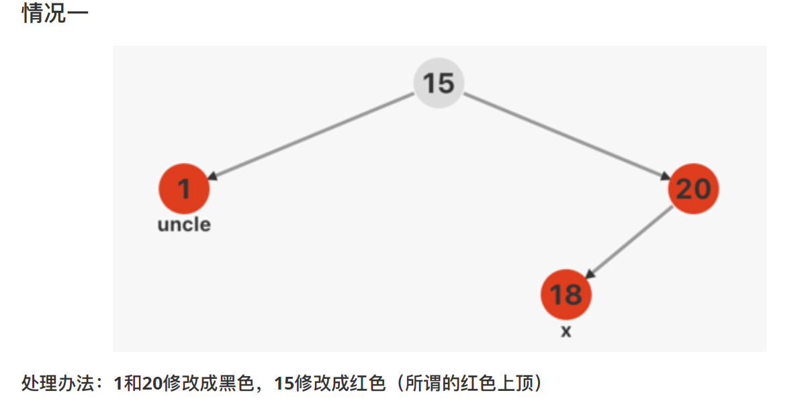
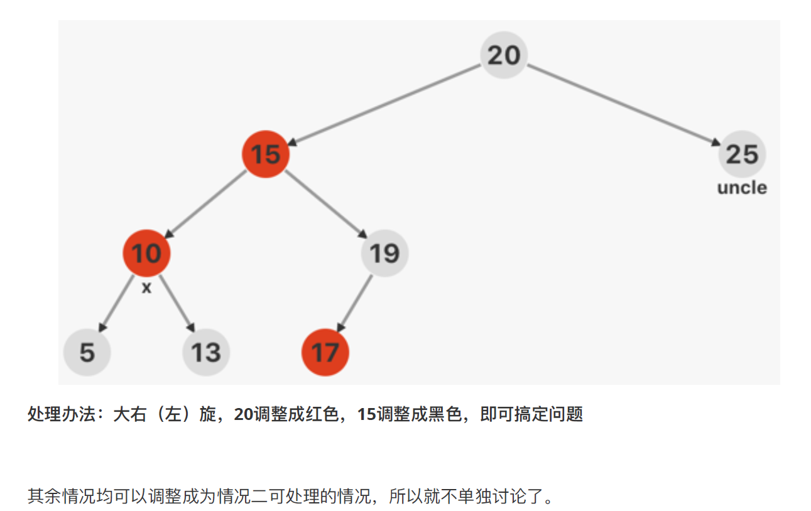

# 第二天（上）

## 红黑树——初中生必知必会系列

- 工程实践中，使用的大多数红黑树
- 红黑树可以动态的插入数据，其实就是二叉树的作用，只不过红黑树是平衡二叉树，照顾到了它的检索效率
- 当红黑树变大了之后，红色很难上浮
- 查找效率 ： AVL树 > 红黑树
- 动态删除添加： 调整代价 ： 红黑树 << AVL树

## 一、平衡条件（4跟5是关键，1-3基本是废话）

1. 节点非黑既红
2. 根节点是黑色
3. 叶子（NIL）结点是黑色（`虚拟叶子节点`，基本就是废话，相当于`NULL`）
4. `红色节点`下面接`两个黑色节点`
5. 从根节点到叶子结点路径上，`黑色`节点`数量相同`（不考虑NIL节点，只考虑实际节点）

### 平衡条件的认识

`第4条和第5条条件`，注定了，红黑树中`最长路径`是`最短路径`的`长度的 2 倍`。

本质上，红黑树也是通过`树高`来控制平衡的，因为`最长路径最多是最短路劲的2倍`。

红黑树比 AVL 树`树高控制`条件要更`松散`，红黑树在发生`节点插入和删除`以后，发生`调整的概率`，比 AVL 树要更`小`。

## 二、学习诀窍（插入调整与删除调整分开）

1. 理解红黑树的插入调整，要站在==祖父节点==向下进行调整
   1. 向下查看`两层`，看`爸爸跟儿子`是否发生冲突
   2. 如果`站在父节点的位置`，发现`父节点与儿子发生冲突`，这个时候`不调整`
2. 理解红黑树的删除调整，要站在==父节点==向下进行调整
   1. 删除时，只需`向下看一层`，看两个孩子是否需要调整
3. 插入`调整`，主要就是为了解决`双红情况`
4. 新插入的节点`一定是红色`，插入`黑色节点`一定会产生冲突，`违反条件5`，插入`红色节点`，`不一定`产生冲突（即黑色节点`一定会`调整，红色节点`不一定会`调整）
5. 把`每一种情况`，想象成一棵大的红黑树中的`局部子树`
6. 局部调整的时候，为了`不影响全局`，调整`前后`的`路径上黑色节点数量相同`


## 三、插入策略（总共五种情况，插入2 + 删除 3）

1. `叔叔节点为红色`的时候，修改三元组小帽子，改成`红黑黑`
   1. 
2. 叔叔节点为`黑色`的时候，参考 `AVL 树的失衡`情况，分成 $LL,LR,RL,RR$, 先参考 AVL 树的`旋转调整策略`，然后再修改三元组的颜色，有两种调整策略：`红色上浮，红色下沉`。 
   1. 
3. 两大类情况，包含 8 种小情况（4+4）


## 四、代码演示

1. 插入调整，发正在递归的回溯阶段
2. 插入调整代码中，使用 goto 语句，8行代码，变成了4行
3. 处理根节点一定是黑色，通过代码封装，$insert->\_\_insert$

```c++
#include <stdio.h>
#include <stdlib.h>

typedef struct Node {
    int key;
    int color; // 0 red, 1 black, 2 double black
    struct Node *lchild, *rchild;
} Node;

Node __NIL;
#define NIL (&__NIL)
__attribute__((constructor))
void init_NIL() {
    NIL->key = 0;
    NIL->color = 1;
    NIL->lchild = NIL->rchild = NIL;
    return;
}

Node *getNewNode(int key) {
    Node *p = (Node *)malloc(sizeof(Node));
    p->key = key;
    p->color = 0;
    p->lchild = p->rchild = NIL;
    return p;
}

int has_red_child(Node *root) {
    return root->lchild->color == 0 || root->rchild->color == 0;
}

Node *left_rotate(Node *root) {
    Node *temp = root->rchild;
    root->rchild = temp->lchild;
    temp->lchild = root;
    return temp;
}
Node *right_rotate(Node *root) {
    Node *temp = root->lchild;
    root->lchild = temp->rchild;
    temp->rchild = root;
    return temp;
}

Node *insert_maintain(Node *root) {
    if (!has_red_child(root)) return root;
    // 偷懒的调整策略，没有去判断有没有真实发生双红冲突
    int flag = 0;
    if (root->lchild->color == 0 && root->rchild->color == 0) goto insert_end;
    if (root->lchild->color == 0 && has_red_child(root->lchild)) flag = 1;
    if (root->rchild->color == 0 && has_red_child(root->rchild)) flag = 2;
    if (flag == 0) return root;
    if (flag == 1) {
        if (root->lchild->rchild->color == 0) {
            root->lchild = left_rotate(root->lchild);
        }
        root = right_rotate(root);
    } else {
         if (root->rchild->lchild->color == 0) {
            root->rchild = right_rotate(root->rchild);
        }
        root = left_rotate(root);
    }
insert_end:
    root->color = 0;
    root->lchild->color = root->rchild->color = 1;
    return root;
}

Node *__insert(Node *root, int key) {
    if (root == NIL) return getNewNode(key);
    if (root->key == key) return root;
    if (key < root->key) {
        root->lchild = __insert(root->lchild, key);
    } else {
        root->rchild = __insert(root->rchild, key);
    }
    return insert_maintain(root);
}

Node *insert(Node *root, int key) {
    root = __insert(root, key);
    root->color = 1;
    return root;
}


void clear(Node *root) {
    if (root == NIL) return;
    clear(root->lchild);
    clear(root->rchild);
    free(root);
    return ;
}

void print(Node *root) {
    printf("(%d| %d, %d, %d)\n",
          root->color, root->key,
          root->lchild->key,
          root->rchild->key
    );
    return;
}

void output(Node *root) {
    if (root == NIL) return;
    print(root);
    output(root->lchild);
    output(root->rchild);
    return;
}

int main() {
    int op, val;
    Node *root = NIL;
    while (~scanf("%d%d", &op, &val)) {
        switch (op) {
            case 1 : root = insert(root, val); break;
        }
        output(root);
        printf("--------------------\n");
    }
    return 0;
}
```

