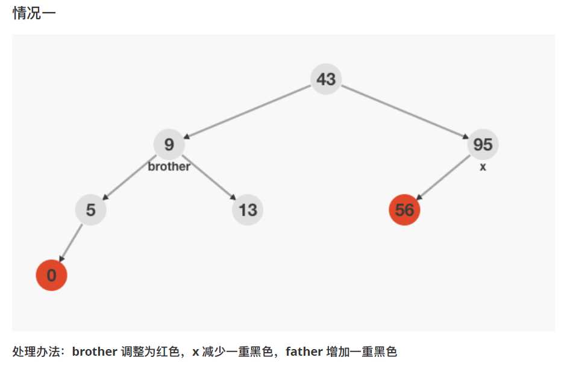
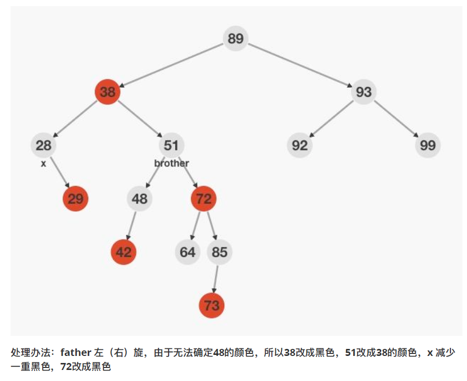

# 第二天（上）

## 红黑树（下）

## 一、删除调整发生的前提

1. 删除`红色节点`，`不会`对红黑树的平衡`产生影响`
2. 度为1的黑色节点，`唯一子孩子`，一定是`红色`（如果不是红色，则该节点一定有另一个黑色孩子）
3. 删除度为1的黑色节点，不会产生删除调整（局部）（把子节点改为黑色即可）
4. 删除度为0的黑色节点，会产生一个`双重黑的 NIL 节点`（可能会向上传递，从而使得一些`真实节点`也变成`双重黑`）
5. 删除调整，就是`为了干掉双重黑`（插入调整，为了`干掉双红`）

## 二、删除调整

1. `双重黑`节点的`兄弟节点是黑色`，兄弟节点`下面的两个子节点也是黑色`，父节点`增加一重黑色`，双重黑与兄弟节点，分别`减少一重黑色`。
1. 
2. 兄弟节点是黑色，并且，兄弟节点中有红色子节点
   1. R（兄弟）R（右子节点），左旋，新根改成原根的颜色，将新根的两个子节点，改成黑色
      1. 
   2. R（兄弟）L（左子节点），先小右旋，对调新根与原根的颜色，转成上一种情况
      1. 
   3. LL 同理 RR
   4. LR 同理 RL
3. 兄弟节点是红色，通过旋转，转变成兄弟节点是黑色的情况
   1. 


## 三、代码演示

1. 进行 LR/RL 类型判断的时候，不能判断 LL 子树是否为黑色，LL 子树有可能是 NIL 节点，在某些特殊情况下，读到的颜色可能是双重黑，取而代之的判断方法就是【LL 子树不是红色】。

   ```c++
   #include <stdio.h>
   #include <stdlib.h>
   
   typedef struct Node {
       int key;
       int color; // 0 red, 1 black, 2 double black
       struct Node *lchild, *rchild;
   } Node;
   
   Node __NIL;
   #define NIL (&__NIL)
   __attribute__((constructor))
   void init_NIL() {
       NIL->key = 0;
       NIL->color = 1;
       NIL->lchild = NIL->rchild = NIL;
       return;
   }
   
   Node *getNewNode(int key) {
       Node *p = (Node *)malloc(sizeof(Node));
       p->key = key;
       p->color = 0;
       p->lchild = p->rchild = NIL;
       return p;
   }
   
   int has_red_child(Node *root) {
       return root->lchild->color == 0 || root->rchild->color == 0;
   }
   
   Node *left_rotate(Node *root) {
       Node *temp = root->rchild;
       root->rchild = temp->lchild;
       temp->lchild = root;
       return temp;
   }
   Node *right_rotate(Node *root) {
       Node *temp = root->lchild;
       root->lchild = temp->rchild;
       temp->rchild = root;
       return temp;
   }
   
   Node *insert_maintain(Node *root) {
       if (!has_red_child(root)) return root;
       // 偷懒的调整策略，没有去判断有没有真实发生双红冲突
       int flag = 0;
       if (root->lchild->color == 0 && root->rchild->color == 0) goto insert_end;
       if (root->lchild->color == 0 && has_red_child(root->lchild)) flag = 1;
       if (root->rchild->color == 0 && has_red_child(root->rchild)) flag = 2;
       if (flag == 0) return root;
       if (flag == 1) {
           if (root->lchild->rchild->color == 0) {
               root->lchild = left_rotate(root->lchild);
           }
           root = right_rotate(root);
       } else {
            if (root->rchild->lchild->color == 0) {
               root->rchild = right_rotate(root->rchild);
           }
           root = left_rotate(root);
       }
   insert_end:
       root->color = 0;
       root->lchild->color = root->rchild->color = 1;
       return root;
   }
   
   Node *__insert(Node *root, int key) {
       if (root == NIL) return getNewNode(key);
       if (root->key == key) return root;
       if (key < root->key) {
           root->lchild = __insert(root->lchild, key);
       } else {
           root->rchild = __insert(root->rchild, key);
       }
       return insert_maintain(root);
   }
   
   Node *insert(Node *root, int key) {
       root = __insert(root, key);
       root->color = 1;
       return root;
   }
   
   Node *predcessor(Node *root) {
       Node *temp = root->lchild;
       while (temp->rchild != NIL) temp = temp->rchild;
       return temp;
   }
   
   Node *erase_maintain(Node *root) {
       if (root->lchild->color != 2 && root->rchild->color != 2) return root;
       if (has_red_child(root)) {
           int flag = 0;
           root->color = 0;
           if (root->lchild->color == 2) {
               root = right_rotate(root);
               flag = 1;
           } else {
               root = left_rotate(root);
               flag = 2;
           }
           root->color = 1;
           if (flag == 1) root->rchild = erase_maintain(root->rchild);
           else root->lchild = erase_maintain(root->lchild);
           return root;
       }
       if ((root->lchild->color == 2 && !has_red_child(root->rchild)) ||
           (root->rchild->color == 2 && !has_red_child(root->lchild))) {
               root->lchild->color -= 1;
               root->rchild->color -= 1;
               root->color += 1;
               return root;
           }
       if (root->lchild->color == 2) {
           if (root->rchild->rchild->color != 0) {
               root->rchild->color = 0;
               root->rchild = right_rotate(root->rchild);
               root->rchild->color = 1;
           }
           root = left_rotate(root);
           root->color = root->lchild->color;
           root->lchild->lchild->color = 1; //去掉一重黑色
       } else {
           if (root->lchild->lchild->color != 0) {
               root->lchild->color = 0;
               root->lchild = left_rotate(root->lchild);
               root->lchild->color = 1;
           }
           root = right_rotate(root);
           root->color = root->rchild->color;
           root->rchild->rchild->color = 1; //去掉一重黑色
       }
       root->lchild->color = root->rchild->color = 1;
       return root;
   }
   
   Node *__erase(Node *root, int key) {
       if (root == NIL) return NIL;
       if (key < root->key) {
           root->lchild = __erase(root->lchild, key);
       } else if (key > root->key) {
           root->rchild = __erase(root->rchild, key);
       } else {
           if (root->lchild == NIL || root->rchild == NIL) {
               Node *temp = root->lchild != NIL ? root->lchild : root->rchild;
               temp->color += root->color;
               free(root);
               return temp;
           } else {
               Node *temp = predcessor(root);
               root->key = temp->key;
               root->lchild = __erase(root->lchild, temp->key);
           }
       }
       return erase_maintain(root);
   }
   
   Node *erase(Node *root, int key) {
       root = __erase(root, key);
       root->color = 1;
       return root;
   }
   
   void clear(Node *root) {
       if (root == NIL) return;
       clear(root->lchild);
       clear(root->rchild);
       free(root);
       return ;
   }
   
   void print(Node *root) {
       printf("(%d| %d, %d, %d)\n",
             root->color, root->key,
             root->lchild->key,
             root->rchild->key
       );
       return;
   }
   
   void output(Node *root) {
       if (root == NIL) return;
       print(root);
       output(root->lchild);
       output(root->rchild);
       return;
   }
   
   int main() {
       int op, val;
       Node *root = NIL;
       while (~scanf("%d%d", &op, &val)) {
           switch (op) {
               case 1 : root = insert(root, val); break;
               case 2 : root = erase(root, val); break;
           }
           output(root);
           printf("--------------------\n");
       }
       return 0;
}
   ```
   
   

