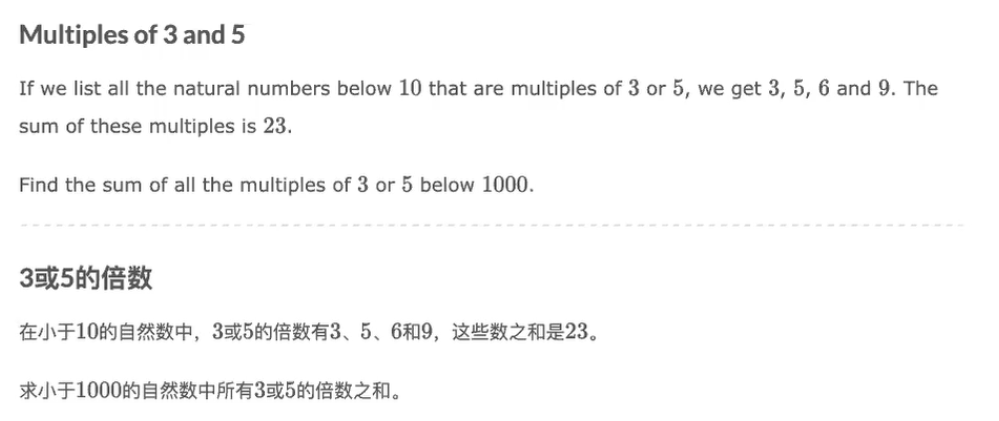

# 欧拉计划

## problem 1



```c++
#include<iostream>
using namespace std;

int main() {
    /*
    int ans = 0;
    for (int i = 1; i < 1000; i++) {
        if (i % 3 == 0 || i % 5 == 0) {
            ans += i;
        }
    }
    */
    int t3 = (3 + 999) * 333 / 2;
    int t5 = (5 + 995) * 199 / 2;
    int t15 = (15 + 990) * 66 / 2;
    cout << t3 + t5 - t15 << endl;
    return 0;
}
```

## problem 2

