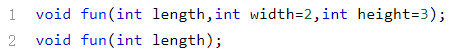

# 函数与递归

> 目录 ：
>
> 1. 前言
> 2. 你好，C++
> 3. 简单数学运算
> 4. 从伴随输入导变量地址
> 5. 面积与周长
> 6. 程序中的是与非
> 7. C++ 程序中的 “苦力”
> 8. 有趣的输出
>
> 这些内容较为简单，跳过

> 在这一章中，我们会开始理解“函数”这个词在 C++ 语言中的意义，从使用别人写好的函数的阶段进入到设计和实现自己函数的阶段。我们将学习 C++ 的函数重载特性——这是除了输入输出流之外，我们接触的第一个 C++ 特有（相对于 C 语言）的语言特性。
>
> 此外。我们还将学习在函数定义中嵌套的调用已经写好的函数、递归的调用自身，以及 C++ 程序的函数调用栈机制。学习这一章后，你将可以更好的对自己的程序进行组织，更合理的设计程序的结构。

## 从数学函数导一般函数

## 函数如何定义

## 函数的返回值

## 函数的使用（伴随编程）

## 函数的递归调用

 在之前的章节中，大家已经学会了如何从主函数中调用自己定义的函数——实际上，在函数的定义中，我们也可以调用另一个函数。此前在实现 func 函数的时候我们已经调用了cmath 库中的pow函数——调用其他函数的方法也是一样的：

除了嵌套调用其他函数之外，函数还可以直接或者间接地调用自身——这种调用称为递归调用，简称递归。所谓直接调用自身，就是指在一个函数的函数体中出现了对自身的调用表达式，例如：

这就是一个函数直接调用自身的例子。而下面的例子则是函数间接调用自身： 

这里两个函数互相调用，同样也构成了递归。

在程序设计中，递归是一种极其重要的编程思想，它对应的是算法设计中的一种方法——分治法。它的实质，是将原有的问题分解成一个或者若干个新的，规模比原来更小的问题，而解决新问题时又用到了原有问题的解法，按照这个原则继续分解下去，最后可以得到一个平凡的、可以直接解出的子问题，于是递归就此结束——这就是有限的递归调用。 而无限的递归调用，跟死循环一样，永远都得不到解，是没有实际意义的——而且由于递归调用运行机制的原因，递归次数太多还会导致程序出错（这个我们将在后面的章节详细介绍）。

递归的过程有如下两个阶段：第一阶段称为递推，也就是将原问题不断地分解为新的子问题（这一操作称为递推步），逐渐从未知向已知迈进，最后达到已知的，可以直接求解的终点，称为递归基。比如说，现在我们要求一个数n的阶乘n!，根据阶乘的定义，我们可以得到这样一个关系式： 

同时，当n=0时，我们可以直接得到已知解，即： 

这样一来，我们就可以用递归来求解这个问题——上面的两个关系式，前者即为递推步，后者即为递归基。对于一个递归函数来说，这两者都是必不可少的。第二阶段称为回归，为递推的逆过程——从已知条件出发，逐一求值回归，最后达到递推的开始点，结束回归阶段，完成递归调用。

## 关于递归

## 用递归函数计算阶乘（伴随编程）

## 头递归与尾递归

在这里，我们可以对比一下头递归和尾递归实现的函数从被调用到返回的过程。 

在头递归的实现中，我们在进行下一层的调用前，没有进行计算。在下一层返回后，我们才完成了这一层的计算。 

在尾递归的实现中，我们在进行下一层的调用前，会先进行计算，而在最终一般条件满足时，会将计算的结果逐层直接返回。

## 声明与实现分类

## 在程序中命名

## C++ 语言的系统函数

C/C++ 语言不仅允许用户根据需要自定义函数，而且 C++ 的系统库中已经提供了几百个已经定义好的函数可以让程序员使用。在此之前我们已经使用了cmath库中的pow函数，它就是一个定义在系统库中的数学函数。 

我们知道，调用函数之前必须先声明，而系统函数的声明都已经由系统提供，分类保存在不同的头文件下——我们只需要使用include指令将对应的头文件引入就可以使用这些系统函数了。除了我们使用过的pow函数之外，cmath库中还有其他的一些常用的数学函数，比如求平方根函数sqrt，求绝对值的函数abs，以及三角函数sin，cos,tan等等。

充分利用现成的系统函数，可以有效减少编程的工作量，提高程序的运行效率和可靠性。在使用系统函数的时候，应该注意以下两点： 

首先，尽可能地使用标准的 C++ 系统函数。C++ 系统函数分为标准函数和非标准函数两类——其中，标准函数是 C++ 标准中规定的编译环境所应该有的系统函数，受到各种编译环境普遍支持，因此，只使用标准 C++ 系统函数的 C++ 代码将会具有良好的可移植性。 

需要注意的是，标准 C++ 函数有很多都是从标准 C 函数继承而来的——例如我们已经介绍过的cmath库，便是继承自标准 C 函数库math.h。虽然 C++ 中也允许直接使用这些以*.h的方式命名的系统库头文件，但是这只是为了保证对 C 代码的兼容性。对于编写新的 C++ 程序，我们应该尽量使用 C++ 写法的头文件——例如cmath。 

这里我们向大家推荐一个网站:http://www.cppreference.com，在这个网站中，我们可以查阅各种常用的标准 C++ 函数的原型、头文件和用法。

另一方面，有的时候我们也需要使用一些非标准的 C++ 系统函数，例如在处理和操作系统相关的事务时，通常需要调用操作系统特有的一些函数。不同的编译系统提供的函数会有所不同——即使是对于同一个系列的编译系统，如果版本不同，提供的系统函数也会有所差别。因此，我们在使用这些函数的时候，必须要学会查阅编译系统的库函数参考手册或者在线帮助，弄清楚函数的功能，参数，返回值和使用方法。 

具体怎么查找，需要大家自己根据实际情况，搜索对应的资料——比如说，如果你在 Windows 下想要调用 Win32 API （一般位于头文件windows.h中，比如我们之前见过的MessageBoxA）的话，那你应该学会访问 MSDN Library，而如果你要从事 Linux 系统编程工作的话，你可以在终端中输入man命令来查询你想要查询的 Linux 系统函数用法。

## 实现一个交换函数

注意，参数是通过`引用`！！！不是简单的值传递！！

## 函数的参数传递

在函数没有被调用的时候，函数的形参并不占据实际的内存空间，也没有实质的值——正如字面意思那样，“形式”参数，只是一个“形式”。而当函数被调用的时候，系统会为形式参数分配内存空间，然后用“实际”参数（实参）为形参赋值。

 我们之前在使用函数的过程中，在主函数中调用我们自己定义的函数的时候，会把实参传给一个形参类型和该实参相对应的函数——这个参数传递的过程，实际上是一个形参与实参结合的过程，简称形实结合。

在刚才的例子中，我们已经看到，使用swap函数交换两个变量的值的时候，如果直接写成==swap(int a,int b)==的话，那么交换是不会产生效果的——尽管同样的算法直接放在主程序里就能正确地完成交换操作。这就是因为，我们使用的是`值传递`的传参方式。 

具体而言，值传递就是当函数发生调用的时候，给形参分配内存空间，然后用实参的值来初始化形参——这是一个单向传递的过程。简而言之，当我们写下==swap(x,y);==的时候，系统会`新建`两个变量a,b，然后把x,y的值分别赋给它们。你可以想象成，当我们在==main==函数中调用了==swap==函数的时候，首先执行了这样的两个语句：

换句话说，接下来我们进行的操作，改变的只是这两个新建的变量a,b的值——它们已经与原来的实参x,y脱离了关系，不管我们怎么改动它们的值，`最后都不会影响到x,y`。 当函数调用结束的时候，临时新建的变量a,b都被系统销毁了——它们的内存空间被回收。于是，我们的算法虽然是正确的，但是却做了无用功，没有对实参x,y产生任何实际的影响。 详细过程如下图所示：

我们已经看到，值传递时参数是单向传递，而现在我们想要做的是对主函数中定义的实参进行修改——这个时候，就需要使用==`引用传递`==了。 

引用是一种特殊类型的变量，可以被认为是另一个变量的别名——通过引用名与通过被引用的变量名直接访问变量的效果是完全一样的。例如： 

这里需要注意，&符号既可以表示引用，也可以表示我们前面所介绍的取地址运算符——不要把两者搞混了。简而言之，&符号出现在变量声明中表示声明一个引用，而出现在某个具体的表达式中则表示取地址运算符——如下所示：

在上一章中，我们最后将==swap(int a,int b)==改成了==swap(int &a,int &b)==，然后==swap==函数就可以正常发挥作用了——这实际上是在函数的定义中，将引用作为函数的形参。跟上面一样，当==swap==被调用的时候，就会有这样的语句被“执行”（注意这只是打个比方）： 

换句话说，接下来我们在==swap==函数的函数体内操作的就是int的引用类型a,b——这样一来，我们对a,b的所有操作都会最终落实到主函数中实际存在的实参x,y头上，然后==swap==函数就可以正常工作了。具体过程如下图所示：

最后，在我们实际的开发过程中，swap函数是不需要自己定义的——直接使用C++ 已经定义好的==std::swap==函数就可以了（需要引入头文件==<algorithm>==）。

## 函数的默认形参值与重载

函数定义的时候，我们已经知道如果需要输入参数的话，在函数定义的时候就必须定义形参——而有的时候，我们会遇到这样的情况：我们“不一定”要输入参数。这个时候，我们可以预先声明默认形参值。 具体地说，我们可以这样做：

需要注意的是，有默认值的形参必须放在形参列表的最后，也就是说，在有默认值的形参右边，不能出现没有默认值的形参——在函数调用中，实参和形参是按照从左到右的顺序一一对应的。如下所示：

什么样的函数可以重载呢？简而言之，两个名字相同的函数必须具有不同的形参——这里的“不同”，指的是形参的个数或者形参的类型，这两者只要有一方面不同，就可以认为是不同的形参。 需要

注意的是，函数是否可以重载，与函数的返回值，以及形参的名称无关——如果函数名称和形参类型都相同的话，那么不管返回值是否相同，都会被编译器判定为语法错误（函数重复定义）。例如，对于功能相同的函数add，我们可以这么定义：

对于有默认形参的函数重载形式时，需要注意避免二义性： 

这样的两个函数原型，在编译的时候编译器就没法区别成不同的函数重载形式了。我们可以这样理解：对于这两个函数，现在我们要进行如下调用：

那么我们该调用哪一个呢？因为第一个函数的`另外两个参数都有默认值`，所以fun(1);既可以被当成第一个函数，也可以被当成第二个函数——这就产生了`二义性`。所以，在定义重载函数的时候，我们应当避免这种情况的发生。

## 关于默认参数值与重载

## 函数地址做函数参数

## 牛顿法求方程近似解（伴随编程）

## 二分法求方程近似解（程序设计）

## `深度探索--函数调用栈`

对于全局变量来说，在编译器编译产生的目标代码中可以使用一个唯一确定的地址进行定位，然而局部变量却不能这么做，原因如下： 

一方面，局部变量只在调用它的函数之内生效，一旦函数返回之后就失效了。很多局部变量的生存期远远小于整个程序的运行周期，如果为每一个局部变量都分配不同的空间，那么势必会产生严重的空间浪费。 

举个简单的例子：学校的图书馆对于本校学生来说，直接刷校园一卡通就可以进门了——而对于临时来借书的外校人员来说，学校显然不可能为他们分别办一张校园一卡通……

另一方面，在发生递归调用的时候，会存在这样的情况：某个函数自己还没有返回呢，然后它就再一次地被调用了。对于这种多次调用的情况，同一个名字的局部变量肯定会有不同的值——这些值都得保存到内存里，并且彼此之间必须相互隔离，不能有影响——像全局变量那样分配一个唯一确定的地址显然是行不通的。 

`函数形参`的情形，与`局部变量`是很相似的——它们都不能像全局变量那样，直接使用一个固定的地址加以定位，而需要`存储在一种特殊的结构`中——这种结构，我们称之为`栈（stack）` 。 

一般意义上的栈，可以被认为是一种桶状的容器——类似于一个装薯片的桶：

大家都知道，对于这样的桶，我们只能从上端（称为栈顶）取薯片或者放薯片，下端（称为栈底）的薯片我们是够不到的。简而言之，栈中数据的添加和删除操作具有“后进先出（LIFO）”的特点，它能够执行的只有两种（或者三种）操作：把数据压进栈 push ，访问栈顶的数据 top 和把栈顶数据弹出（删除）pop 。 

这也就意味着，栈中所有的元素或者数据，越早被压入的，越接近栈底，越晚被弹出——这是栈的一个重要的性质。

现在让我们来看这样一段代码： 

我们可以发现，这个程序的函数调用顺序是这样的：main函数调用fun1函数，fun1函数调用fun2函数——返回的过程则正好相反：fun2返回到fun1，fun1返回到main，最后main函数结束。很明显，一组嵌套函数连续调用的特点是调用越早，返回越晚 。函数调用中的形参和局部变量，当调用开始时生效，函数返回后随即失效——它们的有效期跟自己所在的函数被调用的周期完全重合。这样一来，对一组嵌套的函数调用中，它的形参与局部变量也符合同样的规律：生效越早，失效越晚 。

看到这里，聪明的你是不是马上就想到我们刚刚介绍的栈结构呢？没错，函数的形参和局部变量，确实可以使用栈结构来存储——称为`调用栈（Call Stack）` 。 

调用栈的实质，是==系统分配的一段连续区域的内存空间==——调用栈中的数据，在存储的时候按照函数的调用，分成一个一个的“小方格”，称为`栈帧`，每一个栈帧都跟一次函数调用一一对应。栈帧中存储了一系列跟函数本身有关的信息，包括这次函数调用中的形参值、局部变量值、一些控制信息和一些临时数据（例如复杂表达式计算的中间值、某些函数的返回值等）。 

==每次在发生函数调用的时候，都会有一个栈帧被压入调用栈==——而调用完成之后，相应的栈帧就会被`弹出`。一个函数在执行过程中，能`访问`的除了`栈外的全局变量`之外，只有`它自己的栈帧`——所以在之前的swap函数中，如果我们不使用引用的话，那我们是没办法访问main函数中的变量的。

现在让我们来回顾一下我们之前写过的，使用递归来实现阶乘运算的代码（有部分删节）：

现在让我们来从运行栈的角度来分析一下这个程序的运行情况——为了简单起见，这里我们直接调用fac(1)。初始状态的调用栈如图所示（此时尚未调用fac(1)）：

调用fac(1)之后，一个新的栈帧被塞入调用栈：

继续递归调用到fac(0)，如图：

fac(0)调用到递归基，有返回值：

最后返回到主函数——此时调用栈中只有main函数的栈帧，fac(1)的返回值被设定成y的值：

## 汉诺塔问题（程序设计）

