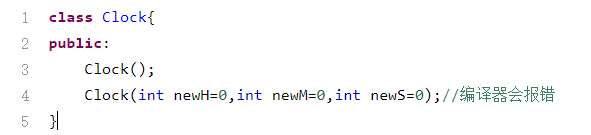
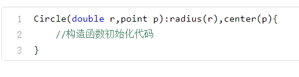

## C++类与对象

> 这一章我们将介绍 C++ 语言最为重要的特性之一——类与对象。在这一章中，你将学会如何在 C++ 语言中创建自定义的类，并将其实例化为一个对象。此外，我们还将介绍类的几种构造函数与析构函数，以及如何用现有的类设计组合类，让大家对于面向对象编程的思想和方法，有一个初步的认识。

## 面向编程的基本特点

“面向对象编程”，就是把现实世界中的一切都当做是“对象”。 

面向对象程序设计的四个主要特点：`抽象、封装、继承和多态`。

### 抽象 

==面向对象方法中的抽象，是指对于一系列具体问题进行概括，抽出一类对象的公共性质并且加以描述的过程。==

对一个问题的抽象应该分为两个方面：`数据抽象` 和 `行为抽象`。前者描述某类`对象的特性和状态`，而后者则描述某类对象的`功能或者行为特性`。

比如说，我们可以对人进行抽象：它具有成员变量name，sex和age，分别表示一个人的姓名、性别和年龄；同时它还可以具有一系列成员函数eat();,walk()等，表示人吃饭，走路等动作。

### 封装 

==封装就是将抽象得到的数据和行为（或者功能）相结合，形成一个有机的整体，也就是 C++ 中的类（class），其中的数据和函数都是类的成员。== 

### 继承与多态 

==继承，新建一个继承了原有类的新类，具有原有类的所有特征的同时，又具有自身的新特性。==

通过类的这种层次结构，可以很好地反映出特殊概念与一般概念的对应关系。通常我们把被其他类继承的类叫做`父类或者基类`，而继承自一个父类的类则称为`子类或者派生类`。 

==多态 则是面向对象程序设计，对于人类思维方式的一种直接模拟——从广义上说，多态性指的是同一段程序，可以直接处理多种类型对象的能力。== 比如说，汉语中的“打球”，可以分解成动词“打”和名词“球”——“打”这个动作可以对应多种球类运动，比如打篮球、打排球、打乒乓球等等，而每一种球类运动都有着截然不同的动作和规则——这就是对多种运动行为的抽象，对应到面向对象程序设计中就是多态性。

## 类与对象

我们已经知道，C++ 语言提供了一系列基本的数据类型，比如==int，double，bool等==——我们已经知道，当我们声明了一个变量的时候，系统就根据这个变量的类型为它分配了一定的==内存空间==。然而要知道，变量类型的作用并不只是告诉系统要分配多大的内存空间，还同样决定了这个变量可以==被执行什么样的操作==——比如对于int我们可以对其进行加减乘除四则运算，对于bool我们可以判断它是不是true。 

毫无疑问，C++ 自身提供的类型远远不足以满足实际开发的需求——所以 C++ 为我们提供了对自定义类型的支持，也就是类。类实际上相当于一种`用户自定义的类型`——原则上我们可以定义无限多种的自定义类型，因此不仅可以用int类型表示整数，也可以`用自定义类的变量表示`“时钟”、“汽车”或者“人”，也就是说所谓的`对象`。 

当我们定义了一个类之后，就可以定义这个`类的变量`，这个变量`就是类的对象`，或者叫做实例——而这个定义的过程，则称为`实例化`。

## 类的构造函数

为了方便编程人员通过程序来规定，如何==对自己定义的对象进行初始化==，C++ 语言的语法中，为我们提供了一种特殊的机制——那就是==构造函数==。构造函数是一种定义在类体中的特殊函数，它可以被用于描述对类进行初始化的算法。 现在让我们来具体介绍一下，构造函数的作用和用法——比如说，现在我们想要规定，Clock类在新建一个对象的时候，把初始的时间设置为0:0:0，这个时候我们就可以通过构造函数来设置。

在语法上，构造函数具有这样的性质： 

- 函数名与类名完全相同 

- 不能定义返回值类型，也不能有return语句 

- 可以有形参，也可以没有形参，可以带有默认参数 

- 可以重载 

从定义上看，构造函数跟我们自己定义的成员函数看起来很相似——不过在使用上，我们不需要手动调用构造函数。当我们`创建对象的时候`，构造函数会`自动被调用`。

我们在定义构造函数的时候，可以有参数表，也可以让参数表空着——同样，即使是一个构造函数有参数，我们也可以给它的所有参数`都设置一个默认值`。这样的构造函数，称为`默认构造函数`。 

注意，同一个类中，`不能出现两个默认构造函数`——例如，对于下面这段代码，编译器将会报错：

如果我们定义一个类的时候，不声明任何构造函数，那么编译器在编译的时候，就会为我们自动生成一个==默认构造函数==，它具有这样的特点： 

- 参数列表为空，不为数据成员赋初值 

- 如果类内定义了成员的初始值，则使用内类定义的初始值 

- 如果没有定义类内的初始值，则以默认方式初始化 

- 基本类型的数据默认初始化的值是不确定的（类似于我们在主函数中声明一个类却不赋初始值的情况）

简而言之，这样一个构造函数，它的特点就是“什么都不做”，单纯只是创建一个类而已。

需要注意的是，如果我们在类中已经定义了一个构造函数（可以是任意形式）的话，那么编译器就不会再为我们定义默认构造函数了——这个时候，如果我们需要使用到默认构造函数的话，不要忘记自己再定义它。

## 复制构造函数

我们定义了一个变量，然后用另一个变量来对它进行赋值，这实际上也是一个变量复制的过程。对于面向对象的程序设计来说，对于`对象的复制`，自然就是 C++ 程序必不可少的功能。

生成一个对象的副本有两种途径——第一种途径是建立一个新的对象，然后将一个已有对象的数据成员值取出来，赋值给新的对象。这样做虽然可行 但是实在是太麻烦了。而接下来，我们要向大家介绍复制构造函数 ——它的作用==就是用一个已有的对象，来执行一个新的对象的构造==。 

复制构造函数具有`一般构造函数的所有特性`——它的形参是本类的一个`对象的引用`，作用是用一个`已经存在`的对象（即为`函数的参数`）来初始化一个新的对象。前面我们已经向大家介绍了函数具有引用传递的传参方式——我们可以看到，复制构造函数使用的就是`引用传参`。 

在实际的开发过程中，我们可以根据现实中所遇到问题的需要来定义一个复制构造函数，以实现同类对象之间数据成员的传递。如果我们自己没有定义类的构造函数的话，那么系统就会在必要的时候，自动生成一个`隐含的复制构造函数`。这个隐含的复制构造函数的作用是，把初始值对象的`每一个数据成员的值`都复制到新建的对象中——因此，也可以说是完成了同类对象的复制（Clone） 。复制构造函数具体的声明方式如下所示：

大家可以看一下一个实际的例子：现在我们有一个Point类，表示屏幕上的一个点——它包括两个int类型的私有成员x,y，表示这个点的坐标。现在我们来定义这个类的复制构造函数： 

这里我们按照以下代码，实现复制构造函数： 

这里我们可以注意到，复制构造函数通过一种看似“不合法”的方式，访问了Point类的实例对象p的两个私有成员变量。我们需要注意的是——private与public的区别`是对类来说`的，而`不是对对象来说`的。`拷贝构造函数是Point类的成员函数`——所以它可以访问类的私有成员变量，这`跟具体的对象无关`。

我们已经知道，普通的构造函数（包括默认构造函数）是在对象创建的时候被调用的——而复制构造函数会在什么时候被调用呢？主要是以下的三种情况： 当用类的一个对象去初始化该类的另一个对象的时候： 

当函数的形参是类的对象，调用函数时进行形实结合的时候： 

当函数的返回值是类的对象，函数执行完成返回调用者的时候：

对于复制构造函数来说，我们也可以自己实现一些有选择、有变化的复制——例如下面的代码，可以把每一个由复制构造得到的Point对象，横坐标增加10： 

除此之外，有的时候类的数据成员中会有`指针类型`，这个时候默认的复制构造函数能够实现的就只有`浅复制`——这会带来`数据安全上的隐患`。要实现正确的复制，也就是所谓的`深复制`，就必须重新编写复制构造函数才行。

## 初始化列表与析构函数（可以是虚函数）

跟声明一个变量类似，当我们声明一个对象的时候，发生的实际上也是“`先初始 化再执行具体操作`”的过程——换句话说，用我们之前的写法，就相当于是“`先建 立一个对象，初始化成员变量，然后再为成员变量一一赋值`”。这个过程本身倒 是没有什么错误——但很明显，大家不觉得它太`麻烦`了吗？我们不能一步到位， 直接用要赋的值初始化成员变量吗？ 

答案当然是可以的——事实上，这就是`初始化列表存在的意义`。在实际的程序执 行中，一个类被实例化成一个对象，整个过程实际上可以分为两个阶段：第一个 阶段是`对象的构造和成员变量的初始化`——初始化列表就是在此期间发挥作用 的；而第二个阶段，则是执行构造函数中的操作。

如果函数的成员变量是基本数据类型的话，那么这优势不会十分明显——但如果 函数的`成员变量是较为复杂的自定义数据类型`（比如某个比较庞大的对象）的对 象的话，那么初始化列表在调用开销的节约方面，`优势将会非常显著`。 此外，在某些情况下，比如需要初始化的数据成员是对象(继承时调用基类构造 函数)，需要初始化 `const 修饰的类成员`，或者需要`初始化引用成员数据`，都`必须` 要使用初始化列表来进行初始化

如果我们在对象的构造中，使用 C++ 的`动态内存分配申请`了一段内存空间，然后当对象的生命周期结束的时候，我们`必须 要自己来回收这部分内存`——不然的话，就会造成“`内存泄露`”：一段内存空间， 明明没有被任何程序使用，却被标记成了“已使用”，结果`造成了任何需要内存的 程序都没办法调用它`。 

对于 C++ 程序来说，想要回收泄露的内存，只有两种办法：给内存重新通电 （也就是重启计算机），清除内存里的所有数据；或者结束整个进程，由操作系 统负责回收它使用过的所有内存空间。

## 命名空间

 	 	

## 类的组合

在面向对象的程序设计中，我们可以把一个巨大而复杂的 类，`划分成一系列简单类的组合`——这样可以大幅简化问题，让很多复杂问题变 得容易解决。

当创建类的对象时，如果这个类具有`内嵌对象成员`，那么各个`内嵌对象将会首先被自动创建`，因为部件对象是复杂对象的一部分——就像是现实中，我们必须先把各个部件生产出来，然后才能把它们组装成手机一样。 

在创建对象的时候，我们既要对类中的基本数据类型进行初始化，也要对内嵌对象成员进行初始化 ——因此，我们首先需要理解这些对象的构造函数调用顺序。

组合类构造函数一般的定义形式如下： 

大家会注意到，内嵌对象的初始化使用了初始化列表来完成——内嵌对象必须使用初始化列表来实现初始化。举个简单的例子——现在我们有一个圆的类Circle，以及一个点坐标的类 Point，定义如下： 

 然后，对于circle类，它的构造函数就可以写成这个样子：

当我们创建一个组合类的实例对象的时候，不光是它自己的构造函数的函数体被调用执行，而且还将调用其内嵌对象的构造函数。这个时候，构造函数的调用顺序如下所示： 

1. 调用内嵌对象的构造函数，调用顺序按照内嵌对象在组合类中的定义中出现的顺序。需要注意的是，我们写在初始化列表中的内嵌对象顺序，跟内嵌对象构造函数的调用顺序是没有关系的。 

2. 执行本类构造函数的函数体。 

析构函数的调用执行顺序与构造函数正好相反 ，析构函数的函数体被执行完毕之后，内嵌对象的析构函数开始被一一执行——它们的调用顺序，跟它们在组合类的定义中的顺序正好相反。需要注意的是，因为需要调用内嵌对象的析构函数——所以，虽然有的时候我们并没有显式定义析构函数，但是编译器自己生成的析构函数，也并不是跟以前一样“什么都不做”。

组合类的复制构造函数，默认状态下同样由编译器自行生成——它会自动调用各个内嵌对象的复制构造函数，为它们初始化。如果我们想要为组合类编写复制构造函数的话，那么我们需要为内嵌对象成员的复制构造函数传递参数。比如说，对于circle类，它的复制构造函数应该这样定义：

## 前向引用声明与结构体

前向引用声明，指的是在引用未定义的类之前，首先把这个类的名字告诉编译器——这样编译器遇到标识符的时候，就知道那是一个类名，不会引发编译错误——而类的完整定义可以放在程序的其他地方。在上述程序加上前向引用声明，问题就解决了：

需要注意的是，尽管使用了前向引用声明，但是在提供了一个完整的类定义之前，不能定义该类的对象，也不能在成员函数中使用该对象。

注意，即使是你声明了引用，你仍然不能在类内的方法定义中直接调用定义不完善的类的方法：

为此，你可以等到要调用的方法所在类定义完善之后，再在类外定义类的方法。

### 结构体 

是一种特殊形态的类——它和类的使用方法几乎完全一样。唯一的区别在于——在类中，如果你直接定义成员类型，不写访问控制属性，那么，成员变量a,b将会默认设置为私有成员。而结构体则相反，成员变量a,b默认会被设置为公有成员。