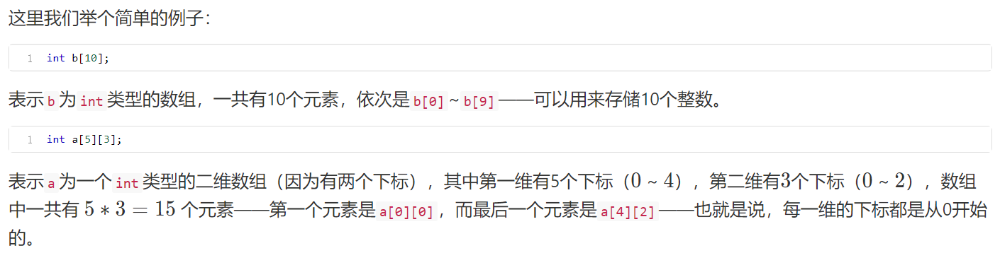
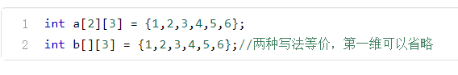
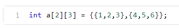
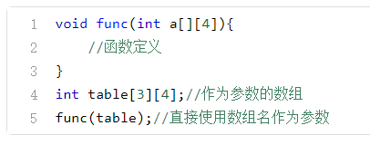
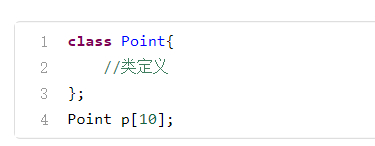
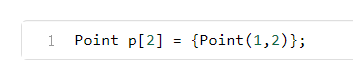
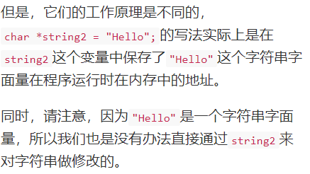
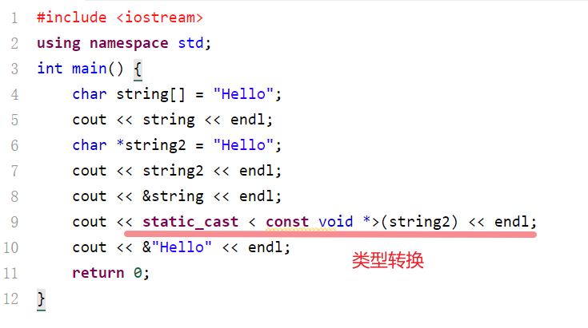

#  数组、多维数组与字符串

## 数组的声明与使用

跟变量和对象一样，如果要使用数组的话，也要事先声明——一般情况下， 数组声明的形式如下所示： 

数据中元素的类型由声明的数据类型决定——比如说，如果你想要声明一个 储存整数的数组的话，那就要写 int 。简而言之，==声明数组类型跟声明单个变量或者对象是完全一样的==，我们既可以把数组声明成`基本数据类型`，也可以 声明成`结构体或者对象之类`的我们自己定义的类型。类型后面的标识符是数 组的名称。 

“常量表达式1”，“常量表达式2”等，称为数组的界，必须是在编译的时候就可以求出数值的常量表达式，而且必须是正整数。数组的下标个数称为 数组的维度，有 n个下标的数组称为n维数组

## 数组的初始化

所谓“数组的初始化”，指的就是在`声明数组`的时候`给部分或者全部元素赋初值`。我们之前在使用其他变量的时候，已经知道可以在变量声明的时候直 接就给变量初始化一个值。 

事实上，对于数组也是一样的——对于`基本类型`的数组，初始化过程就是给 数组元素赋值；而对于`对象数组`（没错，对象也可以建立数组），`每个元素 都是一个类的对象`，所以`初始化过程`就是`调用对象的构造函数`。关于对象数组，我们接下来将会介绍。

对于多维数组，它的初始化也遵循类似的规则——比如： 

另外，如果你想看得更清楚的话，你也可以在花括号里面，用`花括号把多维数组 每一组的数组元素括起来`。对于二维数组，你可以使用这样的写法： 

这种写法在编码上并没有什么特殊的含义——你要是嫌麻烦的话也可以不这么 写。它的好处主要是更加容易识别，代码可读性更好。

我们在使用数组的时候，不光是可以`直接把数组元素`写在表达式里，还可以`在函 数中使用数组`——不管是`单个的数组元素`，还是`整个数组的数组名`，都可以作为 函数的参数。 

如果使用数组名作为函数的参数的话，那么在函数定义和调用的时候，`实参与 形参都应该是数组名`，并且类型相同，比如： 

需要

注意的是，使用数组名`传递参数`的时候，`传递的是地址`。

简单地说，类似于传引用，如果我们在被调函数中对形参数组做了什么事情的 话，那么这些变化都将会`被忠实地反馈到实参数组中`。

数组的元素，不仅可以是`基本的数据类型`，也同样可以是`自定义的类型`——比如说，如果我们有一个`表示坐标点的类 Point` ，那么我们就可以定义一个全部 由 `Point 类的实例对象组成的数组`，其定义方式与基本类型相同： 

跟基本类型一样，在使用对象数组的时候，我们也`只能引用单个数组元素`——每 个数组元素都是一个对象。通过这个对象，我们便可以像原来一样，访问它的公有成员变量和成员函数：

`对象数组的初始化过程`，实际上就是`调用相应的构造函数`，对每一个元素对象进行初始化。 跟初始化基本类型数组一样，我们也可以对对象数组的每一个元素`分别给出初始值`——这个时候，数组初始化过程就会`调用与形参类型相匹配的构造函数`： 

同样，我们也可以只初始化前面的一部分对象元素： 

这样一来，

对象数组在初始化的过程中，就会使用`带参构造函数`初始化 p[0] ， 然后`用默认构造函数初始化` p[1] 。 如果我们需要建立一个类的对象数组的话，那么我们在设计这个类的过程中，就 要充分地考虑到数组元素初始化时的需要：如果各个元素对象的初始值要求为`相同的值`的时候，那么我们应该`定义好默认构造函数`；而如果要求`初始值不同`的话，那么我们需要`定义带形参的构造函数`。

## 数组与内存

## 字符串与字面量

## 二维数组

