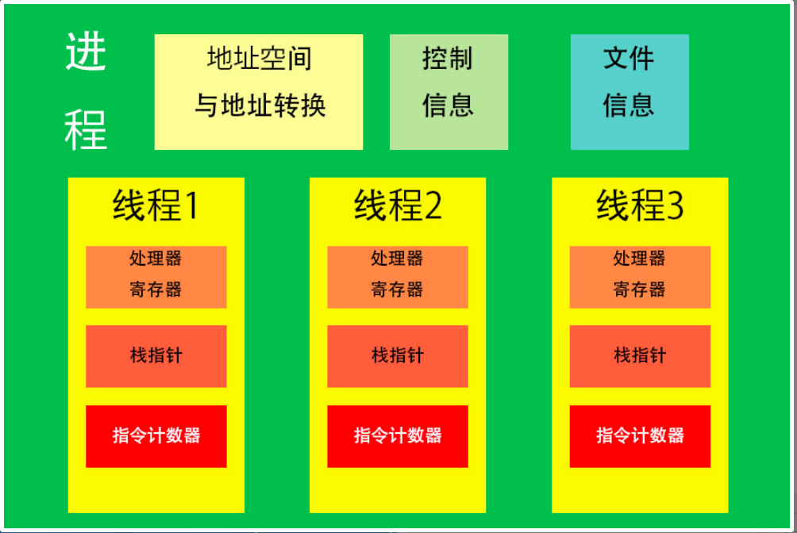

# 进程

## 进程、地址空间与线程

由于计算机所拥有的`物理资源有限`，当`多个程序`在计算 机上同时运行时，它们`不可能连续`地在处理器上运行或占用全部内存，因此需要`进程的抽象`在`用户的一侧`隐藏上下文切换等细节。`进程作为运行的程序的抽象`，包含了一个程序的`运行状态`和这个程序`所用的抽象内存及其中存储的数据`。 我们将后一部分，即`一个进程可以使用的全部内存的地址和它们存储的数据`，称为这个进程的`地址空间（address space）`。我们可以将进程==笼统地看做是`一个或多个线程`与`一个地址空间`的结合==。 

上面提到的都是进程在`用户一侧`的抽象，在`系统一侧`需要什么数据结构来实现这一抽象。

在讲解进程在系统中的实现方式以前，让我们先明确这一实现方式需要达到的目的：==一方面，进程的结构必须能够`囊括一个进程的运行状态`，在由于`中断`、`异常`或`系统调度进入内核态`时我们应该能够将进程的`运行状态`放入`内存中的某一位置`，使我们可以在`某一个时间点`根据`进程的优先级`接着这次的进度`再次运行`该进 程；另一方面，由于进程在`用户一侧`对`内存`进行了抽象，我们需要在`系统一侧`包含`从抽象内存向实际内存和外存`（磁盘等存储设备）`的映射`，以便通过`抽象内存的地址`获得`物理地址`和其中`存储的数据`==。

为了实现上述的第一个目的，即`在进程中存储其运行状态`，我们将在进程中存储`处理器状态寄存器`、`指令计数器`、`栈指针`、`通用寄存器`等代表了进程`目前的运行状态的值`。由于现代计算机中往往有多个核或多个处理器，我们的程序可以达到并行（parallelism，即在`物理时间上同时运行`，区别于多个进程在处理器上的并发（concurrency）），因此`同一个进程`可能同时包含有`多个不同的运行状态`。为了==更好地区分进程在一个处理器上的运行状态和进程本身的运行状态==，我 们在此引入`线程`（thread） 的概念。每个线程拥有一个`线程控制块`（thread control block, TCB），用来存储我们上述提到的`处理器状态寄存器、指令计数 器、栈指针、通用寄存器`等数值，但同一个进程中的`所有线程`都`共享同一个地址空间`。



在前文我们已经提到，一个`用户进程`所看到的`内存空间是抽象`的，区别于实际的物理内存，因此为了支持进程`从抽象内存获取物理内存中存储的信息`，我们需要在进程中包含`从抽象内存向物理内存的映射`，即该系统所用的`地址转换方法所需要的信息`。`地址转换`有很多种不同方法，包括分页存储、分段存储等，它们都需要不同的信息来实现地址转换，这里我们 将以最为简单的 `Base and Bound` 作为例子来解释这一概念。 

在 Base and Bound 方法中，系统将一段`连续的物理内存`分配给一个进程，Base 代表`基地址`，即系统分配给一个进程的`可用内存的起始地址`，Bound 代表这个 进程`可用的内存的最高地址`。为了读写物理内存，我们将`基地址与抽象内存地址相加`，获得实际地址；只要实际地址`不大于` Bound，内核就会允许进程进行该操作。因此在这个方法中，为了实现进程地址空间的抽象，进程在`系统一侧`的数据结构中必须包括这段可用的`内存的基地址、可用长度`。

为了能在一个进程开始运行的时候`方便地载`入上面提到的`两方面的数据`，我们需要一个`数据结构`来包含这些数据。这个数据结构就是 `进程控制块`（Process Control Block, PCB）。对于内核来说，它是`进程存在的唯一标识`。进程控制块中存储的信息除了上面提到的`实现地址转换的信息`和`表示运行状态的线程信息`以外，还包括了很多`系统在调度进程`时需要的信息，比如`进程号`、`进程所处状态` 、`进程的优先级`等等。需要注意的是，我们==`不会`将整个地址空间中包含的地址及其数据`都`存储在进程控制块里==；我们只需要可以帮助我们`从抽象内存地址获得实际物理地址的方法`，而`实际数据`仍然存储在内存的对应位置中。 

由于进程控制块中的信息包含了优先级、基地址、可用地址范围等用户进程`不应该有权限修改`的信息，用户进程不应该有权限修改进程控制块。因此我们将进程控制块`存储在内核空间中`。

## 进程状态与用户态和内核态之间的切换

进程的状态？

一个进程可能在`运行一段时间`后被`切换出去`，一段时间后`继续运行`。显然，进程至少需要两个状态——`运行态（running）`与`就绪态 （ready）`。进程在`运行态`中运行一段时间后`被切换出去`，排入`就绪队列`，等待 继续运行。在`三态模型`中，进程还有一个状态，即`等待态（wait）`。在这个状 态中，==进程在等待某一事件完成，不会被排入就绪队列，直到该事件发生后，进程才会被排入就绪队列，可能被选为下一个运行的进程==。这一等待事件可能包括`等待系统调用完成`，`等待获得某一个锁`或`收到某一信号量的信号`等等。处于`就绪态`的进程不会 因为遇到任何事件`而无法进入等待态`；处于`等待状态`的进程在事件`发生后`考虑到`优先级`等问题，必须`先回到就绪状态`而不能直接运行。

> 进入等待态是因为运行所需要的`某个条件没有满足`，而对于就绪队列中的的进程，我们无法预知未 来当其进入运行态的时候这些条件是否满足，因此不需要使其进入等待态。

除三态模型外，`五态模型`也是一种常见的`进程状态转换模型`。相比三态模型，五态模型多引入了 `新建态（new）` 和 `终止态（exit）`。新建态对应着==进程被创建时`尚未加入就绪队列`的状态==。为了建立一个新的进程，内核需要给进程`分配资源` （如：建立进程控制块）、`建立必要的管理信息`；在这个过程中，进程就处于新 建态。相对的，终止态对应的是==进程`已经结束`但尚`未被系统撤销`的状态==。处于终 止态的进程虽然已经结束，但其获得的资源`还未被系统回收`，因此系统仍然`可以获得`该进程结束时的`信息`。

定义这两种状态可以帮助我们避免一些我们不想看到的情况。比如，如果我们`允 许一个进程`在获得`全部资源以前`就进入就绪队列，那么一个`新进程`可能在`未获得全部资源前`就`开始运行`，而`产生错误`。（这是因为我们是在另一个进程里通过系统调用创造了这个新的进程）同样的，如果一个进程 A 创建了另一个进程 B 而想要等待进程 B 运行完毕，从中获得一些信息，那么`终止态的缺失`可能导致进程 B `率先运行完毕后被系统撤销`，使得进程 A `无法`从进程 B 处`获得任何信息`。UNIX 系统中，如果发生一个进 程创建另一个进程的情况，那么在老进程从新进程`获取信息前`，新进程会一直`停留在终止态`；如果新进程终止后，仍在运行的老进程`没有从新进程获取信息`，那 么新进程就会成为我们所说的“`僵尸进程`”，停留在系统内存中，导致系统变慢。


除去图片中虚线的两个状态，剩下的三个状态就是我们之前提到的三态模型。注 意各个状态之间转换的条件。

## 子进程与父进程

一个进程可以创建另一个进程，并等待其运行完 毕。这个过程具体如何实现呢！ 为了产生新的进程，我们必须使用一个新的系统调用 `fork()` 。 

```c++
pid_t fork(void);
```

`fork()` 被包含在 `unistd.h` 中。这个函数`不需要任何参数`；它会`直接创建`一个新的进程，将`现在`运行的进程的`处理器状态`、`地址空间`直接拷贝到新进程中，因此新进程也会从 `fork()` 对应的指令`开始运行`。我们称这个新进程为`调用 fork() 的进程的子进程`，称`创建子进程的进程为父进程`。 `fork()` 执行`完毕后`会返回一个进程`标识 ID`（pid = process ID），可以被用来`区分父进程与子进程`。在`父进程`中返回的进程标识 ID 是新创建的`子进程的进程标识 ID`，而在`子进程`中返回的进程标识 ID 为 `0`。我们可以利用 `if 语句`判断进程标识 ID 是否为 `0`，从而使子进程与父进程执行不同的 命令。 我们将以鸣人的螺旋手里剑为例子来带你使用这些新学习的函数。现在请先用 fork() 给鸣人制造 一个影分身吧！不要忘了，鸣人和影分身负责的是制造螺旋丸的不同部分，所以你要把 `fork()` 返 回的影分身的标识 ID 存在变量中。

一个进程在`运行结束`或`产生重大错误`（如：企图越权使用内核的特权指令）后会`被系统终止`。但我 们在由 `fork()` 产生的子程序中也可以用 `exit()` 系统调用`主动结束`这个程序。 

```c++
void exit(int status);
```

`exit()` 函数在 `stdlib.h` 头文件中；它的参数 `status` 表示这个进程`退出时的结束状态`。当 我们用这个函数结束一个子进程时， `status` 会作为`子进程的结束状态`被提供给 `wait()` 的`第一 个参数`。 

```c++
pid_t wait(int* stat_loc);
```

`wait()` 被包含在 `sys/wait.h` 中。它的参数 `stat_loc` ，是一个可以被用来`储存等待的进 程的结束状态值`（`exit code`，一个代表子进程是否成功退出的整数；如`成功则为 0`，否则为对应的`错误数字`） 的`指针`。但我们也可以把这个设为 `NULL` ，函数仍`可以正常运行`。 `wait()` 函数会使`父进程的状态`变为`等待态`，直到父进程的`所有子进程`中的 一个`成功退出`并`返回结束状态值`，父进程才可以`进入就绪状态`，准备继续运行；如果在 `wait()` 被调用时已经有`可用的结束状态值`，那 么 `wait()` 会`立即返回`。 `wait()` 返回的值是返回结束状态值的`子进程的进程标识 ID`；如果在 等待过程中`出现了错误`（如已经没有可等待的子进程），那么 `wait()` 将返回 `-1`。注意，==父进程 直接不能等待子进程的子进程==！ 

现在让我们开始制造螺旋手里剑吧！鸣人的本体将负责性质变化，鸣人的影分身将再一次使 用 fork() 分出一个影分身，之后新的影分身将负责提供查克拉，老的影分身负责查克拉的形态变 化。请你用让三个鸣人分别说：“我负责产生查克拉！\n”，“我负责形态变化！\n”，“我负责性质变 化！\n”。两个影分身说完就会正常exit()。

 `wait()` 的`第一个参数`可以得到 `exit()` 的`参数`，也就是`退出的子进程的结束状态值`，我们可以通过 `wait()` 的`返回值`获得那个退出的`子进程的进程识别 ID`。 

```c++
pid_t wait(int* stat_loc);
```

但 `wait()` 并`不能`帮我们`直接从子进程中获得任何数值`，那么我们为什么要使用这个函数呢？一种情况是，我们可能希望在`子进程中执行的某些指令`在我们继续`执行父进程以前完成`，此时我们可以用 `wait` 等待这个子进程执行完毕==（注意，如果我们不使用 wait ，子进程也 可能 比父进程先完 成，这取决于内核对不同进程的调度，但我们希望子进程 一定 先完成，所以使用 `wait` ）==；另一 种情况是，`父进程即将退出`，为了`避免僵尸进程`的出现，父进程必须等待直至所有子进程结束。 

回到螺旋手里剑的问题，我们知道如果鸣人的第二个影分身没有产生查克拉，那么鸣人和第一个影 分身也不能对查克拉使用形态变化和性质变化，因此我们希望第二个影分身先完成；请利 用 wait() 让三个鸣人按顺序说出这三句话：“我负责产生查克拉！\n”，“我负责形态变化！\n”， “我负责性质变化！\n”。另外，如果任何一个影分身失败了，请让鸣人本体说：“可恶，又失败了， 再来一次！\n”，并在主函数中返回 −1。

最后讲一讲 `wait` 的一个变体，`waitpid()` ： 

```c++
pid_t waitpid(pid_t pid, int* stat_loc, int options);
```

`waitpid()` 与 `wait()` 不同的一点在于你==可以通过在 pid 参数里`指定一个进程标识 ID` 来等 待一个`有特定的进程标识 ID 的进程`==—— 当 `pid` 为一个`大于零`的数的时候 `waitpid` 等待的就是 `进程标识 ID 等于 pid` 的子进程； 当 pid 为 `-1`时，我们等待所有子进程中的`任何一个`；当 pid 为 `0`时，我们等待`所有进程组标识 ID 与父进程相同`的子进程；当 pid `小于-1` 时，我们`任何进程组标识 ID 为 pid 的绝对值`的进程。 

`stat_loc` 与 `wait() 中的 stat_loc` 有同样的作用； `options` 将一些针对这个函数的特殊的控制选项（如：我们可以选择在没有子进程退出时立即返回，而不做等待）用或运算连接在一 起，我们在这里不对所有选项一一进行介绍，如果你有兴趣了解可以在 Linux man page 或 百度百 科 上查看。当 `options` 被设为`0` 时， `waitpid` 没有任何特殊选项。因此，我们可以知道， 当 `pid 为 -1、 options 为 0`时， `waitpid()` 与 `wait()` 效果`相同`。

```c++
#include <stdio.h>
#include <unistd.h>
#include <stdlib.h>
#include <sys/wait.h>

int main() {
    printf("%s\n", "我是鸣人！");
    /*YOUR CODE HERE*/
    int pid = fork();
    if (pid != 0) {
        int status;
        int result = wait(&status);
        if (result == -1 || status != 0) {
            printf("%s\n", "可恶，又失败了，再来一次！");
            return -1;
        } else {
            printf("%s\n", "我负责性质变化！");
        }
    } else {
        int second_pid = fork();
        if (second_pid != 0) {
            int new_status;
            int new_result = wait(&new_status);
            if (new_result == -1 || new_status != 0) {
                exit(-1);
            } else {
                printf("%s\n", "我负责形态变化！");
                exit(0);            
            }
        } else {
            printf("%s\n", "我负责产生查克拉！");
            exit(0);
        }
    }
    return 0;
}
```

## exec() （没完全搞懂！！！）

利用 `fork()` 返回的`进程标识 ID`，我们可以在`子进程`中执行和`父进程中不同的指令`；但如果我们想要运行`完全不同`的程序，这种办法可能就不是最好的。因此我们在此向你介绍一个新的系统调用， `execve()` 。在 `Linux 系统`中，我们实际比起`系统调用`本身更经常使用 `exec()` 组包含的六个函数，但此处我们为了让你了解系统调用的实际过程将先给你介绍系统调用，然后 再介绍这六个建立在系统调用基础上的函数。 

```c++
int execve(const char* filename, char* const argv[], char* const envp[]);
```

这个函数将在 现在运行的 进程中以 `argv` 中存储的`字符串为参数`运行由 `filename` 指向的`可执行程序`，并将 `envp` 中存储的“`变量=数值`”对作为`环境变量`代入这个程 序。根据传统， `argv` 中的`第一个参数`必须与 `filename` 一致，真正的参数从`第二个`开始。 `execve` 会以 `filename` 的程序`覆盖现在进程中正在运行的程序`，因此`所有`在 `execve` 函数`之后`的行都只会在 `execve` 失败之后被执行，我们可以通过在后面 加入打印语句等方法标识 execve 运行失败。

基于 `execve()` 的还有六个函数；他们都具有==在现有的进程中打开某一可执行文件、覆盖现有程序执行==的功能。 

```c++
int execl(const char* path, const char* arg, ...);
int execlp(const char* file, const char* arg, ...);
int execle(const char* path, const char* arg,
 ..., char* const envp[]);
int execv(const char* path, char* const argv[]);
int execvp(const char* file, char* const argv[]);
int execvpe(const char* file, char* const argv[], char* const envp[]);
```

我们可以将这些函数表示为：`“exec + l/v + p/e/pe”`，所以这六个函数主要有两 处不同。第一处不同`（l/v）`在参数中表现为`“execl”类`函数将`所有参数作为一整个字符串`代入，而`“execv”类`函数`将参数分别放入一个字符串的数组`中，将`数组`作为参数代入函数运行。第二处不同`（p/e/pe）`表现为包含 `p`（代表 `path`）的函数可以`模仿计算机中壳`的功能，在`“file”`中不含`“/”`时应用环境变量 `PATH` 中的目录来`寻找可执行文件`，而包含 `e`（代表 environment）的函数可以像 `execve` 一 样将`“变量=数值”`对作为`环境变量`代入程序。

所有上述函数的常见用法是 ： 

1. 先由`当前运行`的进程调用 `fork()` 产生新进程，

2. 然后在`新进程`中用 `exec()` 类函数运行新程序。

你可能会认为这样应用 fork() 复制了全部父进程的地址空间后又马上弃置不用、浪费了很多处理器时间，但实际上 `Linux 系统`采用了 `copy_on_write` 技术，也就是说`只有在某一个数据被修改时那 个数据才会被实际复制到子进程的地址空间`，所以当 `fork()` 之后`直接运行 exec()` 时，父进程的地址空间`不会被复制过来`。 

## 章节复习

```c++
#include <unistd.h>
#include <sys/wait.h>
#include <stdio.h>
#include <stdlib.h>

int count = 0;

int main(){

    int pid = fork();
    if (pid==0){
        count++;
        int pid2 = fork();
        if (pid2 == 0){
            char** argv = (char**)malloc(3*sizeof(char*));
            argv[0] = "echo";
            argv[1] = "Hello!";
            argv[2] = NULL;
            int pid3 = fork();
            count++;
            if (pid3 == 0){
                count++;
                execvp("echo", argv);
                printf("Count %d,",count);
                free(argv);
                exit(0);
            } else {
                free(argv);
                wait(NULL);
                printf("%d,", count);
                exit(0);
            }
        } else {
            wait(NULL);
            printf("%d,", count);
            exit(0);
        }
    } else {
        wait(NULL);
        printf("%d.", count);
        return 0;
    }
}
```

### 答案输出

Hello ！

2，1，0.