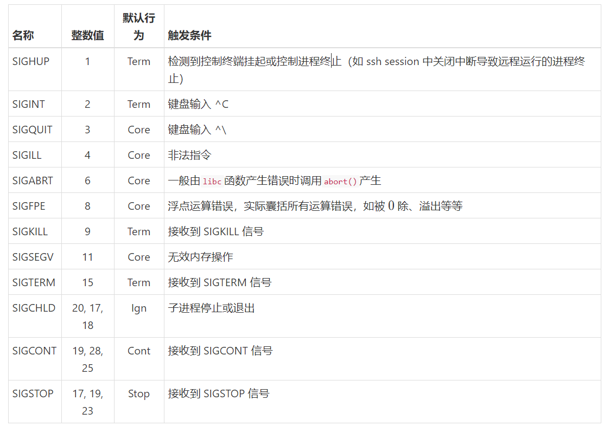

# 进程间的通信

## 进程间通信

在现代的计算机中，进程的`地址空间`和`物理内存`是区别开的，除非一个进程与其它进程`共享一段内存`，否则`不同的进程`是`不能够使用彼此的地址空间`的。

那不同的进程之间不能共享内存，那么它们互相之间该如何通信呢？

在前面的课程中我们已经学习了 `fork()` ，我们可以通过这个`系统调用`产生一个`子进程`，然后用 `exec()` 在子进程中执行另一个程序，在父进程中调用 `wait()` 等待进程运行完毕，但这样我们在`父进程`中`只能获得`进程的`退出码`，这之外的数据我们就无法获得了；而随着`子进程的终止`，`子进程的地址空间`也会被系统`回收`，我们就更无法获得它的数据了。为了能够`读取这个数据`，我们只有把它`存储`在一个`两个进程都能读取`、且`不会`随着进程的`终止而被回收`的存储位置，这个位置就是`外存`。

还记得我们在第一章中提到的`文件的抽象`吗？==文件是对`外存`中存储的数据的抽象==，我们可以`利用`一个`文件`进行`进程间的通信`（Inter-process Communication，IPC。进程 A `终止前`将输出值`写入`这个`文件`，然后进程 B 再将这个`文件的内容`作为`输入值`读取进来，开始运行。这是进程间通信的一种常见 方法；实际上，一段`内存的共享`也是通过将一个`共享的文件`同时映射到`两个进程的地址空间`实现的。 

> 借助“文件”这个中介！

另一种进程间通信的方法就是 `信号`（Signal）。信号类似于`异常和中断`，是`异步`的；进程在`接到信号`后在`内核态`通过对应的`信号处理函数`来处理该信号。 

## 基本I/O操作

文件是对于`外存中存储的数据`的`抽象`，而==`外存`实际上就是`磁盘` （disk），`固态硬盘`（SSD，Solid State Drives），`磁带`（tape）等物理存储设 备==。这些==存储设备与鼠标、键盘、屏幕等无异，都属于 `I/O 设备`==，你可以向这些设备里`输入数据`，或从这些硬件中`获得`我们想要的`输出数据`。因此，从文件中`读取数据`或向文件中`写入数据`实际都属于 `I/O 的范畴`。

I/O 设备是`多种多样`的，如果我们需要针对每个 I/O 设备的特点写一段不同的代码，那工程量之浩大可想而知。好在操作系统给我们提供 了非常便捷的`抽象层`——无论我们想要使用什么 I/O 设备，我们都可以`调用同一组系统调用`，这就是我们接下来要讲到的`基本 I/O 操作`。

我们要讲到的第一个系统调用是 `open()` 。顾名思义，它是用来==`打开`一个文件的， 在`每次读写文件以前`都`必须调用`这个函数打开文件，`获得`一个代表该文件的`文件标识符`，然后再`对文件标识符`进行`操作`==。与你可能见过的 `fopen()` 相比，它处于系统中一个`更低的抽象层`，你可以对文件进行`更基础的操作`，但也失去了 如 `fgets()`, `fscanf()` 这些方便的库函数的帮助。

```c++
#include <sys/types.h>
#include <sys/stat.h>
#include <fcntl.h>
int open(const char* pathname, int flags, mode_t mode);
```

这个函数使用`三个参数`： `pathname` 是`被打开文件的路径`； `flags` 表示的是这次`打开文件所需要进行的操作`； `mode` 可以`被省略`，只有在`创建一个文件`的时候才会被需要，表示的是`新建文件的使用权限`。 

`flags` 和 `mode` 都有很多可能的值，这里我们只介绍几个常用的，如果你想了解所 有的可能值，你可以到我们引言中给你推荐的这个 [man page](https://linux.die.net/man/) 网站去看一看。 对于这两者你都可以`同时选择多个值`，用`或运算`连接起来。

几个常用的 `flags` 的值包括表示`创建文件的 O_CREAT` ，表示`访问模式 的 O_RDONLY, O_WRONLY, O_RDWR` 和表示`写入模式的 O_APPEND, O_TRUNC` 。 

`O_CREAT` 表示的是如果这个`文件不存在`，那么它就将`被创建`。文件的`所有者`是`正在运行`这个进程的`用户`，拥有这个文件的`用户组`是这个`用户所在的组`或这个`文件的父目录所属的用户组`。这两者对于 `mode` 中表示的模式很重要。 

`O_RDONLY` 是 `read-only` 的缩写，表示这个被打开的文件`只能被读取`，不能被写 入；与它相反的是 `O_WRONLY` ，表示这个被打开的文件`只能被写入`，不能被读取。 而 `O_RDWR` 表示的则是即`可以读也可以写`。 

`O_APPEND` 和 `O_TRUNC` 只有在`文件允许写入时`才有意义。 `O_APPEND` 表示从一个`文件的末尾`开始写入，而 `O_TRUNC` 则表示`将文件清空`。

`mode` 表示的是`被创建`的新文件的`使用权限`，它有固定的格式：前三位都是 `S_I`， 从`第四位`开始表示`权限`。如果它表示`只有一个权限`，则`第四位`为该`权限的缩写` （R 表示 read，读，W 表示 write，写，X 表示 execute，执行），`后三位`为`权限的对象`（USR 表示 user，用户，GRP 表示用户 group，组，OTH 表示 others，其他用户）。如果它表示`三种权限`都具备，那么`第四位到第六位`就是 RWX，`最后一位`表示`权限的对象`（U 表示用户，G 表示组，O 表示其他）。

> 两种权限呢？

## 文件描述符与dup

如何利用 `open()` 返回给我们的`文件描述符（file descriptor）`。一个`文件描述符`就是一个`整数`， 用来`代表一个被打开的文件`。每个`文件描述符`都`对应`一个`文件内指针`，表示这个`被打开文件的实例`中`指针的位置`，也就是说==如果一个文件被同一个进程`打开了多次`，那么这几个文件描述符中的`指针位置可能是不同`的==。 

每个系统都对一个进程可以`同时打开的文件数量`有限制；`每个进程`都有一个由`文件描述符指向文件`的`文件描述符表`（file descriptor table）。 `open()` 每次一般会把`新打开的文件`放到这个表格中的`某个空行`，然后`返回`这个`文件描述符`。需要注意的是，这个`文件描述符`只是`这个进程`中代表这个`这个文件`的描述符，`其它进程`即使打开`同一个文件`也可能有`不同的文件描述符`；只有`由 fork()` 产生的子进程才会有`和父进程一样的文件描述符`。

文件描述符从`0`开始，但我们不能使用`前三个文件描述符`，因为它们是`事先被规定好`的： `0`代表`标准输入`， `1`代表`标准输出`， `2`代表`标准错误`。这三个文件描述符在`进程初始时`就已经`被打开`，你可以通过这些文件描述符`从标准输入读取内容`，或`向标准输出和标准错误写入内容`。

`标准输出`正是 `printf()` 输出的对象，而`标准输入`就是你在`命令行中输入的内容`， 因此当我们想==把一个`进程的输出值`导入到一个文件里的时候，我们只需要修改`1、2` 这两个文件描述符，使他们输出到我们`指定的文件`中，我们再用其他进程来读取这个文件==。能够实现上述功能的就是下面这个系统调用： 

```c++
#include <unistd.h>
int dup2(int oldfd, int newfd);
```

`dup2()` 能够使 `newfd` 指向 `oldfd` 指向的文件；如果 `newfd` 本来对应着其他的文件， 那么就`关掉原来的文件`，再使它`指向 oldfd 指向的文件`。通过调用 `dup2()` ，我们可以把`标准输出和标准错误`都`关掉`，而将 `1、2 文件描述符`替换为我们`想要的文件`，这样 `printf()` 的内容就会`直接导入`到我们想要的文件里。

但是这样我们就面临着一个问题——如果我想在一段时间后`重新向标准输出输出内容`，那我该怎么`重新把设定成标准输出`呢？为了解决这个问题，我们需要另一个系统调用： 

```c++
#include <unistd.h>
int dup(int oldfd);
```

`dup()` 会选择`最小的空闲文件描述符`，使它指向 `oldfd` 指向的文件，它返回的是`新的指向这个文件的描述符`。这样在调用 `dup2()` 以前，我们可以`先用 dup()` 复制 一个`指向标准输出`的文件描述符，然后用 `dup2()` 关闭`原来的标准输出`的文件描述 符。

在应用 `dup()` ， `dup2()` 和 `open()` 时，我们都不能忘掉`检查函数调用确实成功`——这三个函数在运行产生`错误`时，会返回`-1` 。养成良好的习惯可以大大减少你花在 “抓虫”上的时间。

## 读写文件

介绍几个实际读写文件时非常实用的系统调用： `read()` ， `write()` ， `lseek()` ， `fsync()` 和 `close()` 。 

`读与写`这两个系统调用所需的`参数类似`，我们把它们放在一起介绍。 

```c++
#include <unistd.h>
ssize_t read(int fd, void* buf, size_t count);
ssize_t write(int fd, const void* buf, size_t count);
```

它们的第一个参数都是 `fd` ，是 `file descriptor` 的缩写，是`被读写的文件`的文件描述符；第二个参数 `buf` 在 `read()` 中是用来`存储读取的内容`的，而在 `write` 中代表`即将被写入的内容`；最后一个参数 `count` 代表`读写的最大长度`,`实际`读写的长度`可能少于` count （比如读取文件时到达了`文件的末尾`，或写入文件时超过了`系统允许`的`最大长度`或资源上限）。如果调用`成功`，两个函数分别会返回`实际读写的长度`，否则函数会返回 `−1`。

`read()` 和 `write()` 的参数里有一个比较讨厌，就是 `count` ，因为我们`不知道这个文件的长度`，也不知道`一行的长度`，读起来就很困难。一种做法是，一次把`整个文件`都读取到 `buffer` 中，然后再用`处理字符串`的函数来获得`一行或单个的单 词`，但这就要求我们获得`整个文件的长度`。能够帮助我们获得文件长度的就是我 们在这一节中要讲的第三个系统调用， `lseek()` ： 

```c++
#include <sys/types.h>
#include <unistd.h>
off_t lseek(int fd, off_t offset, int whence);
```

每个`文件描述符`都与一个`文件内的指针`联系在一起，这个`指针会被读写文件改变`，但我们也可以`直接移动`这个`指针`，这就是 `lseek()` 的作用。 `lseek()` 的返回值 是`移动后指针的位置`。它的三个参数中， `fd` 是被改变的`文件描述符`， `whence` 是 计算移动目标的`起点`，而 `offset` 就是从 `whence 开始移动的长度`。 

`whence` 有3个常用的值， `SEEK_END` ， `SEEK_SET` 和 `SEEK_CUR` 。 `SEEK_SET` 和 `SEEK_END` 分别代表文件的`开头和结尾`，而 `SEEK_CUR` 代表`指针目前的位置`。请你自己想一 想，下面三个对 `lseek()` 的调用分别把指针移到了哪些位置，返回给我们什么信息呢？

```c++
lseek(fd, 0, SEEK_SET);//开头
lseek(fd, 0, SEEK_END);//结尾
lseek(fd, 0, SEEK_CUR);//目前位置
```

当我们完成了`读取文件数据`和`向文件写入数据`的操作后，我们需要注意一点，那就是我们写入的数据`可能没有实际被写入磁盘`！向外存中写入数据是`很花时间`的，因此内核为了`提高效率会推迟实际写入数据`。为了确保我们的数据`确实进入了外存`，我们需要调用 `fsync()` ： 

```c++
int fsync(int fd);
```

这个函数在成功调用时返回 `0`，否则返回 `−1`。

最后，在`完成对文件的所有操作`后，一定要记得`关掉这个文件`。在系统中如果有`多个进程同时打开了一个文件`，而其中一个进程`删除了这个文件`时，`打开这个文件的进程不能突然产生错误`，因此内核需要统计`一个文件被多少个进程打开`，在使用这个文件的`进程数为零`后`再回收这段内存`。为了使内核知道我们要将`不再使用`这个文件，我们需要调用 `close()` ： 

```c++
int close(int fd);
```

## 管道

上一节中我们写了一个小程序，其中==父进程通过一个文件获得了子进程的输出，然后利用文件中的输出值清空了当前目录下的一些文件==。实际上，在这个过程中我们`不一定需要一个明确存在的文件`，因为我们之后`不会再需要子进程输出的文件`。我们想要一个像`文件`一样可以`被共享的信息中转站`，`只用`于这次通信，通信`之后`就`自动被移除`，这就是`匿名管道`（pipe）。

用于创建匿名管道的系统调用是：

```c++
#include <unistd.h>
int pipe(int pipefd[2]);
```

匿名管道是一个`单向的数据传输通道`，它的`两端`分别是`两个文件描述符`，一端的文件描述符只能被用于`读取数据`，而另一端只能被用于`写入数据`。 `pipe()` 系统调用`成功执行时会返回` ，并将传入的数组的`第一个元素`改为用于`读取数据的文件描述符`，第二个元素改为用于`写入数据的文件描述符`；如果系统调用`失败`，则返回`-1` 。 

事实上，在你在终端中输入“`<命令> | <命令>`”时，你就在`两个命令`之间建立了`一个管道`，第一个命令的`标准输出`通过管道被第二个命令作为`标准输入`读取。

看到这里你应该会意识到一个很大的问题：文件描述符`只在进程的范围内`有意 义，换到`另一个进程`中后就`不再指向同一个文件`了，这怎么办呢？ 

这个问题的答案就是，`匿名管道两端的进程必须具有共同祖先`；它们从`同一个祖先`继承了`同样的文件描述符表`，因此它们的`文件描述符指向同一个文件`。这是匿名管道的`局限性`，但对于我们上一节中写的程序来讲，匿名管道已经足够了。

为了解决这个局限性，我们就需要`命名管道（FIFO）`。你一定在想，`FIFO` 不是先进先出的意思吗，为什么这里变成了`命名管道`呢？这是因为`管道在写入数据`时 采取的也是`先入先出`的策略。下面这个系统调用允许我们建立一个命名管道： 

```c++
#include <sys/types.h>
#include <sys/stat.h>
int mkfifo(const char* pathname, mode_t mode);
```

我们可以看到，这个系统调用的`第一个参数`是一个`路径名称`，这个路径名称就是我们的`管道的名称`；`第二个参数 mode` 表示的是这个`命名管道的权限`可以被 `umask 命令修改`。

`命名管道`与`匿名管道`的不同在于==命名管道自`创建以后`就可以被`任何进程`像使用`一般文件`那样使用；即使创建`管道的进程已经退出`，`管道`仍然`存在`，只有在`被删除`后`才会消失`==。它不同于一般文件的一点在于`读取数据的进程`和`写入数据的进程`必须`同时出现`；假如一个进程要求读取数据，而没有进程正在向这个管道写入数 据，那么它就会被`阻塞`（block），直到有`写入数据的进程`出现时它`才会开始读取数据并最终返回`。

## epoll() 

在讲完了`基本的 I/O 操作`与 `pipe()` 之后，我们在这一节要讲一个新的函 数，`epoll()` 。它被==用于在一段时间内`同时等待多个文件产生`我们希望的 `I/O 事件`==；在这段时间结束后， `epoll()` 会返回这段时间里产生`等待`的 I/O 事件的`文件数量`，并允许我们`通过`一个指向包含 I/O 事件的`数据结构的指针遍历`所有产生的事件。比如，如果我们建立`多个子进程`，并与每个子进程之间`建立一个管道`，接着`等待所有`子进程`向管道中写入数据`，我们就可以将所有子进程管道的`读取端`加 入 `epoll() 等待`， `epoll()` 就在一段时间后返回`写入数据的子进程的数量`。 

虽然我们把 `epoll()` 叫做一个函数，但它实际是`一组函数`，由`三个函数`组成，它们分别被用来`初始化`一个 `epoll() 实例`、`增减`或`修改被等待的事件和等待事件发生`。

在初始化 `epoll()` 时我们需要调用下面这个函数： 

```c++
#include <sys/epoll.h>
int epoll_create(int size);
```

参数 `size` 表示的是 `epoll()` 需要监控的文件描述符的`总数量`，在 Linux 2.6.8 之前的系统中被系统用于`估计 epoll() 所需的内存大小并分配该内存`；在 Linux 2.6.8 之后，由于系统具备了`动态分配内存`的能力， `size` 这个参数会`被自动忽略`，但 我们仍需要输入一个`大于 0`的数，以保证新版本系统仍能兼容老版本系统。 这个函数`成功`时返回的值是一个`非零的文件描述符`，代表一个`新的 epoll() 实例`。注意，在`结束使用 epoll()` 后我们需要`关闭这个文件描述符`，以便于系统回 收资源

在初始化 `epoll()` 实例后，这个实例还`没有任何用处`，因为我们`没有实际开始等待任何 I/O 事件`。向 `epoll()` 中`加入`新的等待事件、从 `epoll()` 中`删除`等待事件和 `修改 epoll()` 中现有的等待事件这三种功能都可以通过一个函数实现，这个函数 就是： 

```c++
#include <sys/epoll.h>
int epoll_ctl(int epfd, int op, int fd, struct epoll_event* event);
```

它的第一个参数 `epfd` 是代表 `epoll()` 实例的`文件描述符`，也就是我们刚才调 用 `epoll_create()` 返回的值； `op` 有三个可能的值：

```c++
EPOLL_CTL_ADD // 代表添加新的文件描述符
EPOLL_CTL_MOD // 代表修改一个正在被监控的文件描述符
EPOLL_CTL_DEL // 代表删除一个正在被监控的文件描述符
```

 而 `fd` 自然就是被添加、修改或删除的 I/O 事件`所关联的文件`。

最后一个参数 `struct epoll_event* event` 比较特殊，它指向`我们需要在这个文件描述符上监控的事件`，下面是 struct epoll_event 的结构： 

```c++
typedef union epoll_data
{
 void* ptr;
 int fd;
 unsigned int u32;
 unsigned long long u64;
} epoll_data_t;
struct epoll_event {
 uint32_t events; /*Epoll events*/
 epoll_data_t data; /*User data variable*/
};
```

`struct epoll_event` 中 data 是可以被`自由使用`、方便进程在事件`产生后获取有关事件的信息的`；一般我们会将`与事件关联的文件描述符`存储在 `data.fd` 里，这样事件发生后我们才能知道`事件是由哪个文件产生`的。而 `events` 一般是`几个由或运算连接在一起的事件`，我们在这里只介绍几个常见的事件： 

```c++
EPOLLIN // 文件有数据可供读取
EPOLLOUT // 文件可以被写入数据
EPOLLERR // 文件出现了错误，epoll() 默认会监控这个事件
EPOLLHUP // 文件被挂起，epoll() 默认会监控这个事件
```

若想了解其它可以被等待的事件，请参阅 man page。这个函数的返回值在`成功时是 0，否则是 −1`。

最后，在我们`完成添加`想要等待的事件后，我们就可以调用下面这个函数来`等待 I/O 事件的发生`： 

```c++
 int epoll_wait(int epfd, struct epoll_event* events, int maxevents, int timeout);
```

它的第一个参数 `epfd` 与 `epoll_ctl()` 相同，都是表示 `epoll() 实例的文件描述符`， 第二个参数 `events` 是一个指向`一串 struct epoll_event 数据结构的指针`，它一般 指向由 `malloc()` 分配的一段内存，大小等于 `maxevents * sizeof(struct epoll_event)` ，用于`记录在 timeout 毫秒内实际产生 的事件`。 `epoll_wait()` 返回时，我们可以通过返回值获得`实际产生时间的数量`， 然后`根据这个数量遍历 events` 中的每一项；在每一个 `struct epoll_event` 的结构 中， `data` 都与我们之前`添加或修`改这个事件时代入的 `data` 一致，因此我们可以通过 `data` 获得我们`之前存储的信息`。 

当 `timeout` 为`0` 时， `epoll_wait()` 会`立即`返回，即使没有事件产生；反之，当它被设为一个`负值`时， `epoll_wait()` 就会`一直等`到有事件`发生时再返回`。

## 信号的应用

在结束了前面有关基于文件的进程间通信的讨论后，让我们来看一种全新的进程 间通信方式——信号。我们已经学过，中断产生时进程会通过中断向量表获得处 理中断的函数地址进入内核态处理中断；信号类似于中断，可能由一些运行过程 中的指令触发，也可能由键盘输入或其它进程触发，但它的处理函数可以由用户 定义。 

在讲与处理信号有关的系统调用以前，我们先来认识一下常见的信号。你很可能 有过这种经历：写了一个程序以后在终端中运行这个程序，但很长一段时间都没 有响应，于是等不及了的你就用 ^C（或记为 ctrl+c，"^" 号在这里表示按住 ctrl/control 键的同时按其它按键） 结束了这个程序。^C 发送的就是一个信 号， SIGINT 。在 Unix 系统中，信号由一个个整数表示，下面是一些常见的信 号：



注： 

1. Term：终止进程； 
2. Core：终止进程并形成主存信息转储文件（core dump file），可供 GDB 等 程序使用； 
3. Stop：停止进程，但仍可继续运行； 
4. Cont：继续运行被停止的进程； 
5. Ign：忽略该信号。

从上面的表格中你可以看到，每个信号都有自己的默认处理行为，即使我们不定 义信号的处理方式，进程仍然可以接收信号。SIGINT 的默认行为就是终止进 程，但假如我们不想终止整个进程呢？我们有没有办法修改进程接收到一个信号 时的行为呢？这就是下面我们要讲到的这个系统调用的作用。

```c++
int sigaction(int signum, const struct sigaction* act, struct sigaction* oldact);
```

sigaction() 的第一个参数就是一个信号对应的整数值，你可以直接把 SIGINT 代 入，而不需要代入 SIGINT 对应的值 。 act 和 oldact 分别代表新的信号处理方式 和旧的信号处理方式，在两者不为 NULL 的情况下， act 将成为处理该信号的行 为，而原来的行为会被存储在 oldact ；在函数成功运行时它会返回 ，否则返 回 。下面我们就来看看我们可以怎样利用 act 指向的数据结构来设置信号的 处理行为。

```c++
struct sigaction {
 void (* sa_handler)(int);
 void (* sa_sigaction)(int, siginfo_t*, void*);
 sigset_t sa_mask;
 int sa_flags;
 void (* sa_restorer)(void);
};
```

sa_handler 和 sa_sigaction 两者都代表处理信号的函数，我们在给 act 赋值时只 能给这两者中的一个赋值；如果 sa_flags 中标明了 SA_SIGINFO 则使 用 sa_sigaction ，否则使用 sa_handler 。我们如果并不想处理一个信号，而只想 忽略它，那么我们可以把 sa_handler 直接设为 SIG_IGN ；如果我们想恢复系统的 默认行为，那么我们就可以将 sa_handler 设为 SIG_DFL 。注意， SIGKILL 和 SIGSTOP 这两个信号是无法被忽略的。 

sa_handler 只接受一个参数，也就是信号对应的值，因此它不能给我们任何有关 信号发送者的信息；如果我们想获得更多信息，就需要使用 sa_sigaction 。 

sa_sigaction 代入三个参数，第一个与 sa_handler 相同，也是信号对应的整数 值，第二个参数是一个指向包含了有关信号的详细信息的数据结构的指针，第三 个参数是一个指向现在的运行上下文的指针。第三个参数一般不会被函数使用， 它的主要作用是在出现浮点运算错误等错误时通过直接对上下文中的栈指针进行 操作等方式人工处理错误，我们这里不作介绍。接下来我们将看一看第二个参数 的结构。

```c++
siginfo_t {
 int si_signo; /* Signal number */
 int si_errno; /* An errno value */
 int si_code; /* Signal code */
 int si_trapno; /* Trap number that caused
 hardware-generated signal
(unused on most architectures) */
 pid_t si_pid; /* Sending process ID */
 uid_t si_uid; /* Real user ID of sending process */
 int si_status; /* Exit value or signal */
 clock_t si_utime; /* User time consumed */
 clock_t si_stime; /* System time consumed */
 sigval_t si_value; /* Signal value */
 int si_int; /* POSIX.1b signal */
 void *si_ptr; /* POSIX.1b signal */
 int si_overrun; /* Timer overrun count; POSIX.1b timers */
 int si_timerid; /* Timer ID; POSIX.1b timers */
 void *si_addr; /* Memory location which caused fault */
 long si_band; /* Band event (was int in
 glibc 2.3.2 and earlier) */
 int si_fd; /* File descriptor */
 short si_addr_lsb; /*Least significant bit of address
 (since kernel 2.6.32)*/
}
```

这个结构中，只有前三项是每一个信号都一定会有的；其中 si_signo 是信号对应 的值， si_errno 一般不会被使用， si_code 表示信号的产生原因（如： SIGFPE 的 si_code 可能是 FPE_INTDIV ，表示整数被 除）。这个结构的其它成员只会被一些 特定的信号源赋值（如： kill() 和 sigqueue() 这两个函数产生的信号会给 si_pid 和 si_uid 赋值，表示产生信号的进程的标识符和用户的标识符）。这一部分的具 体内容比较复杂，我们就不一一列举讲解了，有兴趣的同学可以自行阅 读 sigaction() 的 man page。

```c++
struct sigaction {
 void (* sa_handler)(int);
 void (* sa_sigaction)(int, siginfo_t*, void*);
 sigset_t sa_mask;
 int sa_flags;
 void (* sa_restorer)(void);
};
```

最后我们来讲讲 sa_mask ， sa_flags 这两个成员。 sa_mask 表示的是在处理这个信 号时需要屏蔽的其它信号（我们不希望在处理信号时又去处理其它信号，导致原 来的进程被延迟很久）；和上面提到的一样， SIGKILL 和 SIGSTOP 在 sa_mask 中也 是不能被屏蔽的。 sa_flags 包括很多特殊选项，上面我们已经提到通过标 明 SA_SIGINFO 我们可以使用 sa_sigaction 作为处理信号的函数；另一个常用的标 志是 SA_NODEFER ，如果没有这个标志，那么在执行信号处理函数时相同的信号就 会被忽略，但一旦加入这个标志我们就不会屏蔽同种信号。 sa_flags 还包括很多 可能的值，感兴趣的同学可以自行查看 man page。 

sa_restorer 已经不再被使用，因此你不需要考虑这个成员。

在 Unix 系统中其实还存在另一个系统调用可以达到与 sigaction() 同样的目的： 

```c++
sighandler_t signal(int signum, sighandler_t handler);
```

但这个系统调用没有 sigaction() 提供的信息丰富，且在不同版本的 Unix 系统中 的实现不完全相同，使用这个系统调用可能会使你的代码在一些系统上不能运 行，因此我们不建议你使用这个系统调用。

最后，请注意信号处理方式是在进程范围内有效的；如果一个进程用 fork() 产生 一个子进程，那么在父进程中被忽略的信号在子进程中仍然会被忽略，但其它未 被忽略的信号的处理模式都会恢复到 SIG_DFL 。 下一节中我们将来看一看一个进程可以如何向其它进程发信号，以及信号处理在 进程中的处理方式。

## 信号的发出与接收

很多时候信号都`不是`我们`主动产生`的（比如除以产生的 `SIGFPE` 或`子进程`退出时产生的 `SIGCHILD`），但我们也`可以主动`给自己或给别的进程`发信号`， `kill()` 这个函数就是用来发送信号的。

```c++
#include <sys/types.h>
#include <signal.h>
int kill(pid_t pid, int sig);
```

`kill()` 代入两个参数， `pid` 和 `sig` ，根据两者的`不同的值`， `kill()` 会有不同的表现： 

- 当 `pid` 和 `sig` 都`大于 0` 时， `kill()` 会给`进程`标识符`等于 pid` 的进程`发送 sig` ； 

- 如果 `pid` 为 `0` 而 `sig 大于 0`，那么 `kill()` 会给`当前进程所在的进程组`中的`所有进程`发送 `sig()` 信号； 
- 如果 `pid 为 -1` 而 `sig 大于 0`，那么 `kill()` 会给除`第一个进程`（`init` 进程，`操作系统运行的第一个进程`，是所有用户进程的祖先，`如果`这个进程`退出`，那么`操作系统就会退出`）外的`目前运行`的`所有进程发送 sig` ；在 `Linux 中`这个选项`不会给自己`发送信号，为了`给自己`发送信号，我们需要使 `pid 等于 getpid()` ； 
- 如果 `pid 小于 -1` 而 `sig 大于 0`，那么 `kill()` 将会给`所有进程组`标识符`等于 -pid` 的进程组发送 `sig` ； 
- 最后，如果 `sig 为 0`，那么 `kill() 不会`实际发送任何信号，但它`仍然会检查`是否`存在以 pid 为进程（组）标识符的进程（组）`；这种用法经常被用来`检查以 pid` 为标识符的进程或进程组`是否存在`。

在成功时， `kill()` 返回 `0`，错误时返回 `-1`。它有下面三种可能的错误码： 

- `EINVAL` ： `sig` 是一个`无效`的信号； 
- `EPERM` ：进程`无权限`向`任何一个`目标进程发送信号：注意，`除非进程拥有特权， 否则进程只能够给用户标识符与自己一致的进程发送信号`； 
- `ESRCH` ： `pid` 所代表的进程或进程组`不存在`；这一错误码经常被用来`检查一个进程或进程组是否存在`。

信号被发出后，会被`内核`检测到，Linux 内核会调用 `do_signal()` 执行收到的信号； 如果`用户定义`了某一`信号的处理方式`，那么信号的处理`可能会在用户空间发生`。 类似于`中断`的处理，系统会先将`进程当前的运行状态`存放到`信号处理栈`上，然后再`调用信号处理函数`。在信号处理函数执行完毕后，只要`进程没有退出或停止`， 它都会调用 `sigreturn()` 回到`系统空间`，下一次运行该进程时就会从`信号栈`获取`原来的运行状态`后继续运行。

## 消息队列

除`管道`外，Linux 系统中还有一种可以在进程间传递数据的进程间通信方式，这就是`消息队列`。消息队列相对于管道有一个`好处`，就是`读取消息`和`写入消息`的两个进程`不需要同时出现`；它就像`公共邮箱`一样，==一个进程把消息发送到邮箱中后另一个进程可以过一段时间再来阅读==。也可以把`消息队列`和`信号`联用，这样我们就可以让`收信方第一时间`得到通知，处理消息。 Linux 系统支持 `POSIX` 和 `System V` 两种消息队列，这里我们介绍 POSIX 的消息 队列。

`消息队列`类似于`命名管道`，是通过`名字`来识别的；如果两个进程用`相同的名字`打开`消息队列`，那么它们就会`打开同一个队列`。消息队列的名字有`固定的格式：“/SomeNameThatDoesNotContainASlash\0”`，也就是一个由`“/”` 开头、由`空字符`结尾、中间包含最多 `NAME_MAX` （也就是`255`）个不是“/”的 字符的字符串。我们将这个名字作为第一个参数代入下面这个打开消息队列 的系统调用中：

```c++
#include <fcntl.h>
#include <sys/stat.h>
#include <mqueue.h>
mqd_t mq_open(const char* name, int oflag, mode_t mode, struct mq_attr* attr);
```

这个系统调用的`第二个`参数 `oflag` 代表了`访问`这个消息队列的`模式`，与我们`打开文件`时设计的`访问模式`一样，包含 `O_RDONLY` ， `O_WRONLY` ， `O_RDWR` 和 `O_CREAT` 。 `O_CREAT` 被`标明`时，我们就可以在 `oflag` 中`加入 O_EXCL` ，表示如果`消息队列已经存`在则返回并设定`错误码为 EEXIT` 。在 `O_CREAT` 的模式下， 我们还需要后两个参数。 `mode` 与 open() 中的 mode 相同，表示这个消息队列的`权限`（还记得 `S_IRWXU` 吗），而 `attr` 表示的是这个消息队列的`性质`，它的结构是这样的：

```c++
struct mq_attr {
 long mq_flags; /* Flags: 0 or O_NONBLOCK */
 long mq_maxmsg; /* Max. # of messages on queue */
 long mq_msgsize; /* Max. message size (bytes) */
 long mq_curmsgs; /* # of messages currently in queue*/
};
```

其中第一个成员 `mq_flags` 只能包括 `O_NONBLOCK` ，表示即使`没有消息可以读取`或`无法写入消息`也`马上返回、而不等待`；第二个成员 `mq_maxmsg` 表示这个消息队列`可以包含的最大数量的消息`；第三个参数 `mq_msgsize` 表示以`字节`为单位的、`一条消息的最大长度`；第四个参数 `mq_curmsgs` 表示`现在`队列中`消息的数量`，在`新建`队列时`没有意义`。通过给这个数据结构中的`前三个成员`赋值，我们可以`设置`这个新的消息队列的`性质`。如果我们把 `mq_open()` 的`第三个`参数设为 `NULL` ，则`新建的消息队列会有默认设置`。

`mq_open()` 在运行`成功时`会返回一个`消息队列描述符`，我们可以用这个描述符来对这个消息队列`发送或接受消息`。下面这两个系统调用可以用来发送、接收消息： 

```c++
#include <mqueue.h>
int mq_send(mqd_t mqdes, const char* msg_ptr, size_t msg_len, unsigned msg_prio);
ssize_t mq_receive(mqd_t mqdes, char* msg_ptr, size_t msg_len, unsigned* msg_prio);
```

它们的`第一个参数`都是代表一个消息队列的`消息队列描述符`，`第二个参数`分别表示`发送的消息`和`用来接收消息的缓冲区指针`，`第三个参数`分别表示`发送消息的长度`和`接受信息缓冲区的长度`，`最后一个参数`分别表示`消息的优先等级`和`用来存储消息优先等级的指针`。 

接下来我们要介绍的这个函数是`消息队列独有`的，专门用来`使进程在获得新消息时得到通知`，而`不用轮询`或`等待`。

```c++
#include <mqueue.h>
int mq_notify(mqd_t mqdes, const struct sigevent* sevp);
```

这个函数代入的`第一个参数`仍然是代表一个`消息队列的描述符`，它的`第二个参数`比较特别，它有下面的结构：

```c++
union sigval { /* Data passed with notification */
 int sival_int; /* Integer value */
 void *sival_ptr; /* Pointer value */
};
struct sigevent {
 int sigev_notify; /* Notification method */
 int sigev_signo; /* Notification signal */
 union sigval sigev_value; /* Data passed with notification */
 void (*sigev_notify_function) (union sigval);
 /* Function used for thread notification (SIGEV_THREAD) */
 void *sigev_notify_attributes;
 /* Attributes for notification thread (SIGEV_THREAD) */
 pid_t sigev_notify_thread_id;
 /*ID of thread to signal (SIGEV_THREAD_ID)*/
};
```

只要这个结构中的 `sigev_notify` 的值为 `SIGEV_SIGNAL` ，这个函数就可以被用来使得`调用这个函数的进程在标识符等于 mqdes 的消息队列由空变为有消息时获得信号 sigev_signo 的提醒`。与这个信号相关联的 `siginfo_t` 结构中的 `si_code` 会被设为 `SI_MESGQ`， `si_pid` 会被设为`发送消息的进程标识符`。因此我们可以像前几节中讲 到的那样用 `sigaction()` 函数将与这个信号相关联的处理函数设为`利用这些附加信息、读取并处理`消息队列中的消息的函数。

## mmap()

`基于文件`实现的 `mmap()` ；它能够`通过将外存中的文件映射到一段内存中使多个进程在其地址空间中共享一段内存`。 `mmap()` 也可以`不基于任何文件`，我们在下面的讲解中会讲到这一部分用法。

```c++
#include <sys/mman.h>
void *mmap(void* addr, size_t length, int prot, int flags, int fd, off_t offset);
int munmap(void* addr, size_t length);
```

`mmap()` 的`第一个参数 addr` 表示的是我们`希望用于映射文件的大概位置`；在不同的实现方法下， `mmap() 实际选择的地址`是`不同`的，很`可能`并`不等于 addr` 。 当我们将`0`作为 `addr` 代入时， `mmap()` 就会选择`任意的地址`进行映射（当然， 它`不会选择`或其它`已经映射`的内存区域）。 `length` ， `fd` 和 `offset` 这三个参数分别表示`映射的内存的长度`，`被映射的文件所对应的文件描述符`和`映射在文件中起始的位置`（相对于文件开头的偏移）。 

接下来我们将重点讲解 `prot` 和 `flags` 这两个参数；它们决定了 `mmap() 的模式`。

`prot` 是 `protection` 的缩写，表示的是`映射内存的使用权限`。它要么等于 `PROT_NONE` ，表示`不允许任何操作`，要么等于`用或运算链接`以下几个值中一 个或几个的结果：

```c++
/*defined in <sys/mman.h>*/
PROT_READ // 表示可以读取映射内存区的数据
PROT_WRITE //表示可以向映射内存区写入数据
PROT_EXEC //表示可以执行映射内存区的数据
```

注意，无论 `prot` 的值是什么，我们在`打开 fd` 对应的文件时都`必须允许用户读取这个文件`。

与 `prot` 搭配使用的是 `flags` ，它表示`映射内存的模式`。它常用的值包括下面几个值：

```c++
MAP_SHARED // 使进程对于文件的修改对其它映射该文件的进程可见并被写入原文件
MAP_PRIVATE // 与 MAP_SHARED 相反，使进程对于文件的修改对其它映射该文件的进程不可见且不被写入原文件
MAP_ANONYMOUS // 使映射不基于任何文件；大部分实现中，fd 与 offset 会被忽略，但一些实现要求 fd=-1
MAP_FIXED // 表示使用 addr 本身作为映射的起始地址，如果 addr 不能被使用，那么 mmap 会返回 MAP_FAILED
```

`MAP_SHARED` 和 `MAP_PRIVATE` 两个标志`必须使用一个且只使用一个`，它们可以被`或运算`与`其它的标志`连接在一起。 自 Linux kernel 2.4 起，Linux 开始支持将 `MAP_SHARED` 与 `MAP_ANONYMOUS` 联用，用于`在两个进程间共享一段不与文件关联的内存`，但这种用法`仅限于有共同祖先`的进程，因为`映射不基于文件而只取决于进程自己的地址空间`。 注意，如果我们使用 `MAP_SHARED` 和 `PROT_WRITE` ，那么用户必须拥有`向 fd 对应的文件写入数据的权限`。

`mmap()` 是以`页`为单位分配`映射内存区`的，因此 `mmap()` 返回的`地址`一定是`页面大小的整数倍`。如果 `length` `不到页面大小的整数倍`，那么 `mmap()` 分配的内存会`有未被使用的部分`；如果进程`尝试使用`这一部分内存，那么就会`触发 SIGBUS 信号`， `产生错误`。同样的，当我们试图用 `munmap() 关闭一个映射`时，其参数 `addr` 必须是`页面的整数倍`，否则会`产生错 误`。 `munmap()` 的`第二个参数 length` 可以与我们`一开始映射的内存大小不同`——我们可以映射长度相当于`5个页面`的大小的文件到内存中，然后只`关闭其中个1页面的映射`。注意，关闭 `fd` 并`不能关闭这段映射`，只有 `munmap()` 可以`关闭一段映射`。

`mmap()` 除了可以被用于`进程间通信`，还可以被用来`提高读写文件的效率`：如果`两个进程`都需要读`取同一个文件的同一段内容`，那么我们就可以用 `mmap()` 使这`两个文件公用一段内存`。这会`大大节省`将`文件复制到内存`中的`时间`。 `mmap()` 也方便我们`对一个文件进行随机的读写`；我们在后面的章节中会提到，==对于磁盘来讲随机读写是文件操作的速度瓶颈==。

我们可以看看下面的这个例子：

```c++
#include <sys/mman.h>
#include <stdio.h>
#include <stdlib.h>
#include <string.h>
int main(){
 char* window = (char*) mmap(0, 30, PROT_READ|PROT_WRITE, MAP_SHARED|MAP_ANONYMOUS, -1, 0);
 pid_t child = fork();
 if (!child) {
 sprintf(window, "Greeting from child.");
 exit(0);
 }
 wait(NULL);
 printf("%s\n", window);
 return 0;
}
```

如果没有 `mmap()` ，那么 `fork()` 之后`子进程和父进程`将拥有`不同的地址空间`，我们输出的就会是一个`空字符串`；但实际这个程序会`输出“Greeting from child.\n”`，因为 `mmap()` 使父进程与子进程`共享`了这段`内存`。在这个例子中我们`没有调用 munmap()` ，因为`进程退出后映射也会自动关闭`。